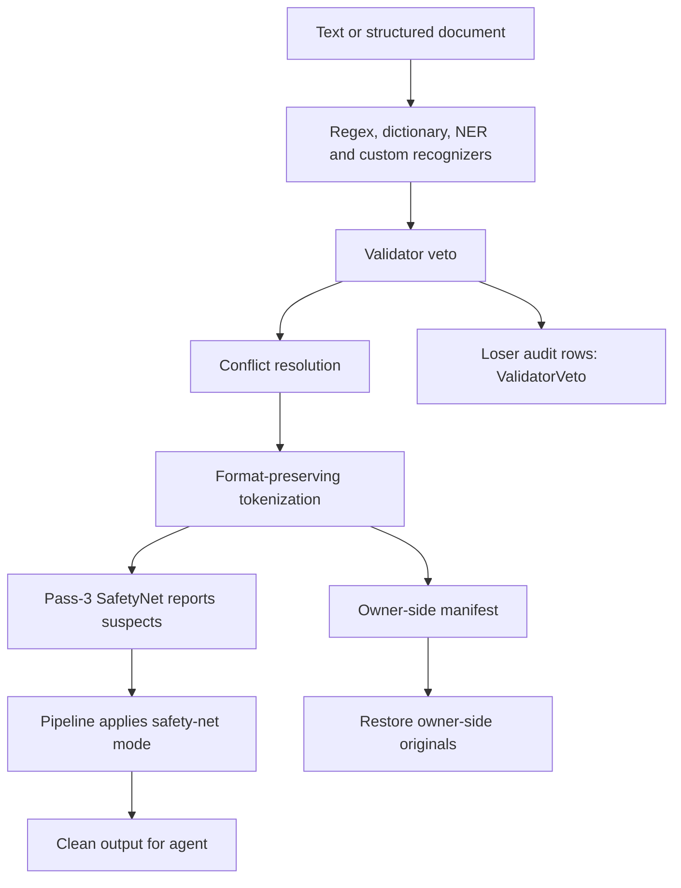

# Gaze architecture

Gaze replaces PII with restorable tokens before it reaches an agent.
[AGENTS.md](AGENTS.md) defines the north star: fail closed, preserve exact
restore, trace every token, and keep integration simple.

## Pipeline

SafetyNet reports suspects after tokenization. The pipeline applies the selected
mode; the net never edits output or manifests itself.

Sources: [pipeline](crates/gaze/src/pipeline.rs),
[resolver](crates/gaze/src/resolver.rs), [registry](crates/gaze/src/registry.rs),
[contracts](crates/gaze-types/src/lib.rs),
[safety nets](docs/explanation/safety-net/safety-nets.md).

## Crate map

The workspace has 15 published crates plus internal `xtask`.
[CONTRIBUTING.md](CONTRIBUTING.md#workspace-shape) lists their roles;
[crate boundaries](docs/reference/crates.md) maps dependencies.

## Three execution layers

All three keep originals and restore authority with the owner. PII crosses
the agent boundary only as manifest-backed tokens.

| Layer | Path | Scope |
|---|---|---|
| Library | App → `gaze::Pipeline` → owner manifest/restore | Apps that control their data path. |
| MCP source chokepoint | Agent call → `gaze-mcp-rmcp` → `gaze_mcp_core::PiiEnvelope::dispatch` → source → safe result | Tool calls, document tools, manifest handles and tiered restore. |
| LLM API proxy | API-key request → `gaze-proxy` driver → vendor → owner restore | OpenAI, Anthropic and Gemini SDK/agent traffic; native wire shapes and streaming. |

MCP does not cover SDK API-key traffic. Proxy drivers isolate vendor request
shapes; the proxy core owns pseudonymization and restore. Supported hosts are
`api.openai.com`, `api.anthropic.com` and `generativelanguage.googleapis.com`.
Consumer subscription/cookie traffic belongs to a separate browser-MITM project.

Sources: [MCP runtime](docs/explanation/mcp/mcp-runtime.md),
[MCP core](crates/gaze-mcp-core/src/lib.rs),
[rmcp sink](crates/gaze-mcp-rmcp/src/lib.rs),
[proxy runtime](docs/explanation/proxy/proxy-runtime.md).

## Key design decisions

### KDD-1: Reversibility first

Clean tokens and the owner-side manifest must restore original bytes.
Breaking that round trip is a regression.
[Session](crates/gaze/src/session.rs), [contracts](crates/gaze-types/src/lib.rs).

### KDD-2: Rule-based detectors are the trust floor

Use deterministic rules, validators, dictionaries and locale cues for precise
classes. Neural models add coverage. Every token must trace to a recognizer,
rule or typed safety contract.
[Regex recognizer](crates/gaze-recognizers/src/regex.rs).

### KDD-3: Audit sink isolation is enforced by Dylint

`rusqlite` belongs in `gaze-audit`; no core feature graph may depend on it.
The canonical `gaze_module_isolation` lint lives in detached `lint/dylint`;
the old syn walker is removed. This gate is required.
[Lint](lint/dylint/src/lib.rs), [SQLite sink](crates/gaze-audit/src/sqlite.rs),
[gates](docs/explanation/contributing/xtask-gates.md).

### KDD-4: Closed validator and normalizer surfaces fail closed

Names parse into typed enums. Unknown names fail at rulepack load with explicit
unsupported-kind errors. Public enums are `#[non_exhaustive]` for Rust callers;
accepted runtime names remain closed.
[Errors](crates/gaze-recognizers/src/error.rs), [rulepacks](crates/gaze/src/rulepack.rs).

### KDD-5: Locale resolution has four tiers

CLI override → policy → rulepack default → system/default fallback.
`LocaleTag::Other(_)` matches strictly.
[Locale chain](docs/explanation/policy/locale-chain.md),
[assembly defaults](crates/gaze-assembly/src/defaults.rs).

### KDD-6: Conflict resolution is deterministic

Priority is class → rule → score → span length → recognizer id.
Collision-family policy and mandatory anchors add fail-closed fallback.
Structured containment keeps a custom-class span whole when a builtin span is
strictly inside it. Loser audit rows record `ConflictTier`.
[Resolver](crates/gaze/src/resolver.rs),
[collision families](docs/explanation/detection/collision-family.md),
[anchors](docs/explanation/detection/anchor-resolution.md).

### KDD-7: Pass-3 SafetyNet is observer-only

The net reads tokenized output and the runtime manifest, then reports
`LeakSuspect` metadata. The pipeline acts:

| Mode | Pipeline action |
|---|---|
| `resolve` (default) | Add a restorable token to the manifest. |
| `redact` | Write a one-way marker. |
| `strict` | Refuse. |
| `tolerant` | Warn. |

[Contract](docs/explanation/safety-net/safety-nets.md),
[behavioral tests](crates/gaze/tests/safety_net.rs).

### KDD-8: Proxy providers use adapter drivers (shipped in v0.8)

OpenAI, Anthropic and Gemini drivers own vendor wire shapes. The proxy core
owns pseudonymization, manifests, restore boundaries and fail-closed behavior.
[Proxy](crates/gaze-proxy/src/lib.rs), [drivers](crates/gaze-proxy/src/adapters).

## Cross-cutting invariants

Unsupported validators, malformed locales, missing mandatory anchors,
unavailable strict-mode nets and invalid policies produce typed errors or
safe family-level fallback. Audit and manifest metadata carry vetoes and
ambiguity; clean text remains pseudonymized.
[Ambiguity contract](docs/explanation/detection/ambiguity-side-channel.md).

Bundle activation is explicit:

| Invocation | Activation and suppression |
|---|---|
| `core` | Format-basis identifiers, including US national phone, run in every locale. DE national phone and numeric postal rules remain document-gated. |
| `core-extended`, no policy | Compatibility defaults also activate document-gated DE national phone and postal rules. Prefer `core` or an explicit policy if too broad. |
| Policy locale gates | Gate only `locale_basis = "document"`. Format rules run once outside locale fallback; disable them with `enabled = false`. |
| Custom rulepack | Omitted `locale_basis` means document gating. Defaults rank below CLI and policy. Review collisions and negative corpora before selecting format basis. |

[CLI assembly](crates/gaze-cli/src/pipeline/run.rs),
[locale contract](docs/explanation/policy/locale-chain.md).

## Where to go next

- [Validator veto](docs/explanation/detection/validator-veto.md)
- [Collision families](docs/explanation/detection/collision-family.md)
- [Mandatory anchors](docs/explanation/detection/anchor-resolution.md)
- [Ambiguity metadata](docs/explanation/detection/ambiguity-side-channel.md)
- [MCP tiers and sealed context](docs/explanation/mcp/mcp-runtime.md)
- [Safety-net modes, hardening and audit](docs/explanation/safety-net/safety-nets.md)
- [Metrics and stability contracts](docs/reference/metrics.md): audit columns,
  conflict tiers, benchmark snapshots, registry, pipeline, `BundleReport`,
  MCP `ToolCtx` and CLI exit codes.
- [Proxy drivers](docs/explanation/proxy/proxy-runtime.md)
- [Document codecs](docs/explanation/document/document-extension.md)
- [Feedback loop](docs/explanation/detection/feedback-loop.md)

## What this document does not cover

[Policy](docs/reference/policy.md) documents recognizers;
[CHANGELOG.md](CHANGELOG.md) records releases; [README.md](README.md) gets adopters
started; [UPGRADE.md](UPGRADE.md) lists migrations. Review source before changing
any correctness-sensitive path.
