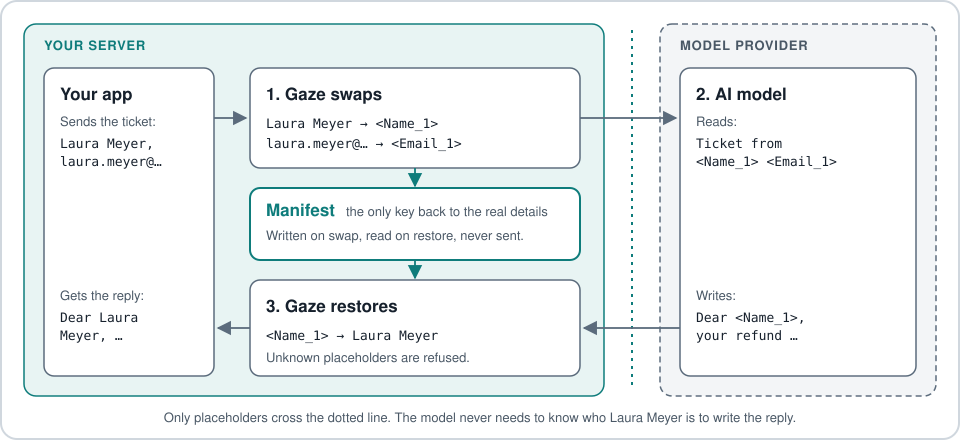
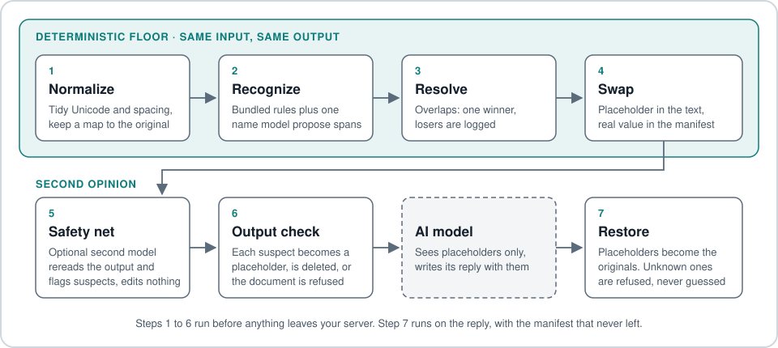

# Gaze

[](https://crates.io/crates/gaze-pii) [](https://github.com/CertaMesh/gaze#license) [](https://docs.rs/gaze-pii) [](https://github.com/CertaMesh/gaze/actions/workflows/test.yml) [](https://github.com/CertaMesh/gaze/stargazers)

**Gaze swaps the personal details in your text for placeholders before an AI model sees it, then swaps the real details back into the model's reply.** The model works with `<Name_1>`; only your server knows that means Laura Meyer.

*Pre-1.0, API stabilizing. Reversibility is guaranteed across minor versions — manifests written by an older minor restore on a newer minor (see [`UPGRADE.md`](UPGRADE.md)).*

## The promise in one picture



*Text version:* your app → Gaze swaps details for placeholders (the manifest stays on your server) → the AI model reads and writes placeholders only → Gaze restores the real details → your app.

This is pseudonymization, not deletion. The model never needs to know who the customer is, only the shape of the task; your app puts the person back before anything leaves.

## A real support ticket, start to finish

A support agent asks the model: *"Draft a short reply confirming the refund."* The app attaches the ticket. The customer and every value are synthetic:

```text
Ticket #48213 from Laura Meyer <laura.meyer@example.com>, phone +49 1555 0112233:
I sent back the headphones from order 2026-4471 two weeks ago and still have no refund.
Please pay it to my account DE89 3704 0044 0532 0130 00.
Address: Lindenstraße 8, 10115 Berlin.
```

**1. What the model receives** (captured with the explicit core + NER policy below, no Nym; the only edit is the per-session prefix, shortened from `<5042f9d8:Name_1>` to `<Name_1>`):

```text
Ticket #<Custom:postal_code_1> from <Name_1> <<Email_1>>, phone <Custom:phone_1>:
I sent back the headphones from order 2026-4471 two weeks ago and still have no refund.
Please pay it to my account <Custom:family:payment-card-or-iban_1>.
Address: <Location_1> 8, <Custom:postal_code_2> <Location_2>.
```

The manifest, the list that turns placeholders back into values, stays on your server.

**2. What the model replies**, written with the placeholders it was given:

```text
Dear <Name_1>,

thank you for your patience. We received the headphones from order 2026-4471
and issued your refund today to the account
<Custom:family:payment-card-or-iban_1>.
It should arrive within 3 to 5 business days.
A confirmation is on its way to <Email_1>.

Best regards,
Support team
```

**3. What your app sends** after `gaze restore` (real output):

```text
Dear Laura Meyer,

thank you for your patience. We received the headphones from order 2026-4471
and issued your refund today to the account
DE89 3704 0044 0532 0130 00.
It should arrive within 3 to 5 business days.
A confirmation is on its way to laura.meyer@example.com.

Best regards,
Support team
```

What this run gets wrong, stated plainly:

- **Still raw:** the house number `8`. No bundled recognizer detects house numbers yet, so it reaches the model. The order number `2026-4471` also stays raw; order IDs are tenant-specific and need a custom recognizer in your policy.
- **Over-caught:** the ticket number `48213` was taken for a postal code. That costs precision, not privacy, and it restores to the same value.

The same boundary applies to tool-call arguments in agent frameworks: the JSON the model fills in carries placeholders, and Gaze restores them before your tool runs ([how it fits your stack](docs/explanation/how-gaze-works.md#how-it-fits-your-stack)).

The [v0.14.0 release benchmark](docs/reference/benchmarks/README.md#current-release) measured rules plus NER, without a safety net, under scored-label contract v1: **27,000 of 130,282 PII bytes (20.7243%)** survived. The goal is zero. v0.15 turns Nym on by default in `gaze setup`; its release benchmark will replace this number using the exact generated setup policy ([release prep runner, PR #643](https://github.com/CertaMesh/gaze/pull/643)). The support-ticket policy and commands: [reproduce this example](docs/explanation/how-gaze-works.md#reproduce-this-example).

## Seven steps



1. **Normalize.** Tidy Unicode and spacing, and keep a map back to the original bytes.
2. **Recognize.** 40 bundled rules (formats, checksums, cue words) plus one NER model (a model that spots names and places) each propose candidates.
3. **Resolve.** Where candidates overlap, one wins; a whole entity takes precedence over pieces inside it. The losers are logged.
4. **Swap.** Each winner becomes a placeholder plus a manifest entry. The same value always gets the same placeholder.
5. **Safety net (on by default: Nym; OPF opt-in).** It rereads the output and turns PII it catches into a normal restorable placeholder.
6. **Output check.** Each suspect becomes a placeholder, is replaced with a one-way `[REDACTED:<class>]` marker as a last resort, or the whole document is refused, depending on the mode below.
7. **Restore.** Placeholders in the reply become the originals. A placeholder Gaze never issued is refused, never guessed.

Steps 1 to 4 are the deterministic floor: same input, same output, every placeholder traceable to a versioned rule.

## What happens when the safety net disagrees

The policy from `gaze setup` runs Nym by default.

| Mode | What happens to a suspect | Reversible? | Who refuses |
|---|---|---|---|
| `resolve` **(default)** | Becomes a normal placeholder. If that is impossible, the fallback decides. | Yes | Only a `strict` fallback |
| `redact` | The suspect bytes are replaced with a one-way `[REDACTED:<class>]` marker, and an audit row is written. | No, for that span | Nobody |
| `strict` | The whole document is refused (exit code 3, empty output). | Nothing was sent | Gaze |
| `tolerant` | A warning only. **The suspect reaches the model.** Development use only. | Yes | Nobody, the leak ships |

The fallback (`--safety-net-fallback`) can be `redact` (default), `strict`, or `tolerant`. Details: [safety-net modes](docs/explanation/safety-net/safety-net-modes.md).

**Scope:** outbound PII control with reversibility. Gaze is *not* a guardrail, prompt-injection defense, or content-safety filter — it keeps real PII out of the model and restores it in the reply.

**Go deeper:** [How Gaze works](docs/explanation/how-gaze-works.md) covers why this exists (and the GDPR / open-commons positioning), what ships, how it fits your stack, the pipeline shape, detection coverage, limits, and a glossary.

## Quickstart

Three commands from zero to protecting a synthetic contact:

```sh
cargo install gaze-cli --version 0.15.0
gaze setup
printf '%s' 'From: Ada Example <ada@example.invalid>' | gaze clean --policy gaze.toml | jq -r .clean_text
```

Real output from the built CLI (the session prefix changes each run):

```text
From: <87744c1c:Name_1> <<87744c1c:Email_1>>
```

`gaze setup` verifies the pinned NER and Nym bundles, writes `gaze.toml` with Nym on, and checks both detectors. It prints the Nym model card's MIT licence and the open [training-data licence review](docs/explanation/safety-net/safety-nets.md#licence-review-open). Use `gaze setup --safety-net none` for a NER-only policy. Keep the `session_blob` from the full JSON response on the owner side for `gaze restore`.

### Nym in action

The rules and NER miss this synthetic licence plate; Nym catches it:

```sh
printf '%s' 'Das Fahrzeug mit dem Kennzeichen M-AB 1234 wurde abgeschleppt.' \
  | gaze clean --policy gaze.toml | jq -r .clean_text
```

Real output (session prefix varies):

```text
Das Fahrzeug mit dem Kennzeichen <0c2e0bc4:Custom:license_plate_1> wurde abgeschleppt.
```

## In production: AI support drafts that never see the customer

[`CertaMesh/gaze-ghostwriter`](https://github.com/CertaMesh/gaze-ghostwriter) is a Laravel package that watches a support inbox over IMAP and drafts replies with an LLM. The application does the data lookup. Gaze pseudonymizes the resulting context. The LLM only composes prose.

```text
1. Customer email arrives via IMAP:
   "Hi Support, I'm Alice Schmidt, order #INV-2026-04-1872,
    my refund of €128.40 hasn't shown up..."
       ↓
2. App parses email → extracts identifiers:
   sender=customer@..., order_id=INV-2026-04-1872, amount=€128.40
       ↓
3. App looks up order in DB (real PII, no LLM involved):
   order #INV-2026-04-1872 → refund processed 2026-05-12,
   customer = Alice Schmidt
       ↓
4. App builds context bundle (still real PII):
   { name: "Alice Schmidt", order_id: "INV-2026-04-1872",
     amount: "€128.40", refund_processed: "2026-05-12",
     issue: "delayed refund" }
       ↓
5. gaze clean — pseudonymizes the bundle:
   { name: "<Name_1>", order_id: "<OrderId_1>",
     amount: "<Amount_1>", refund_processed: "<Date_1>",
     issue: "delayed refund" }
   + per-session manifest stored
       ↓
6. LLM drafts reply (sees only tokens + facts):
   "Hi <Name_1>, your refund of <Amount_1> for order <OrderId_1>
    was processed on <Date_1>. Please allow 3-5 business days to
    appear on your statement."
       ↓
7. gaze restore rehydrates draft:
   "Hi Alice Schmidt, your refund of €128.40 for order
    #INV-2026-04-1872 was processed on 2026-05-12. Please allow
    3-5 business days to appear on your statement."
       ↓
8. Support agent reviews → approves → reply sent.

LLM never saw "Alice Schmidt", "#INV-2026-04-1872", "€128.40", "2026-05-12".
App owns the lookup. gaze owns the manifest. LLM owns the prose.
Each layer's role is what it is built for.
```

`OrderId` and refund-amount shapes are tenant-specific custom recognizers in the host policy; email, names, IBAN, phone, postal, and credit-card shapes come from the bundled `core` rulepack.

### Try the loop

- Drop-in Laravel package: [`CertaMesh/gaze-ghostwriter`](https://github.com/CertaMesh/gaze-ghostwriter)

Agentic workflows (browser automation, tool execution) hook the same restore boundary at tool-call args, on the same manifest contract — the agent stays on tokens end-to-end.

CLI surface (`gaze clean`, `gaze restore`, audit, policy TOML): [Quickstart](#quickstart), [`gaze-cli` README](crates/gaze-cli/README.md).

## Install

Install the CLI from crates.io:

```sh
cargo install gaze-cli --version 0.15.0
```

Or build from source (latest `main`, or to enable extra features):

```sh
git clone https://github.com/CertaMesh/gaze.git
cd gaze
cargo install --path crates/gaze-cli
```

Pre-built binaries for Apple Silicon macOS and Linux x86_64 (glibc 2.39+) are attached to each [GitHub release](https://github.com/CertaMesh/gaze/releases). Other targets: `cargo build --release -p gaze-cli`.

For the LLM API proxy:

```sh
cargo install --path crates/gaze-cli
gaze proxy start
export OPENAI_BASE_URL=http://127.0.0.1:8787/v1
export ANTHROPIC_BASE_URL=http://127.0.0.1:8787
```

For MCP hosts (Claude Code, Claude Desktop, Cursor):

```sh
cargo install --path crates/gaze-cli --features mcp
gaze mcp install --client=claude-code
gaze mcp doctor
```

The MCP server exposes `gaze_read_file` and `gaze_read_text`, returning tokenized content plus a `manifest_id` for authorized restore flows. Client config paths: [`crates/gaze-cli/README.md`](crates/gaze-cli/README.md#mcp-installation).

For library use, see [Use from Rust](#use-from-rust) below.

## Audit and restore

Restore is manifest-first. Tokens are session-scoped, counted by class, and only resolvable through a signed `SensitiveSnapshot`. There is no string-map fallback.

Optional metadata audit log:

```sh
gaze clean --policy policy.toml --audit-db audit.sqlite < input.txt
gaze audit query --audit-db audit.sqlite --class email --action tokenize
gaze audit export --audit-db audit.sqlite --format jsonl --output redactions.jsonl
gaze audit purge --audit-db audit.sqlite --before 2026-01-01T00:00:00Z
```

The audit DB is opened read-only by `query` and `export`. The exported column set excludes raw PII payloads. Every row carries `recognizer_id` plus `recognizer_version_id` for lineage; pre-v0.8 rows carry a `legacy_unversioned` marker. There is no policy-level retention default and no background auto-purge — adopters drive retention explicitly.

## Use from Rust

Use the policy written by `gaze setup` from Rust with `gaze-assembly`'s Nym feature:

```toml
[dependencies]
gaze-pii = { git = "https://github.com/CertaMesh/gaze.git" }
gaze-assembly = { git = "https://github.com/CertaMesh/gaze.git", features = ["safety-net-nym"] }
gaze-recognizers = { git = "https://github.com/CertaMesh/gaze.git" }
serde_json = "1"
```

<!-- setup-nym-rust-example -->
```rust
use std::collections::HashMap;
use std::error::Error;
use std::path::Path;

use gaze::{
    CleanDocument, Context, DictionaryBundle, LocaleChain, Policy, RawDocument, Rulepack,
    RulepackSource, SafetyNetPolicy, Session,
};

fn main() -> Result<(), Box<dyn Error>> {
    let policy = Policy::load_for_cli(Path::new("gaze.toml"))?;
    let context = Context {
        dictionaries: HashMap::new(),
        class_map: HashMap::new(),
        fields: serde_json::Map::new(),
    };
    let mut rulepacks = Vec::new();
    for name in &policy.rulepacks.bundled {
        let contents = gaze_recognizers::embedded(name).ok_or("unknown bundled rulepack")?;
        rulepacks.push(Rulepack::load(RulepackSource::Embedded(contents))?);
    }
    for path in &policy.rulepacks.paths {
        rulepacks.push(Rulepack::load(RulepackSource::Path(path.clone()))?);
    }
    let locales = LocaleChain::merge_policy_and_cli(policy.locale.as_deref(), None);
    let pipeline = gaze_assembly::build_pipeline(&policy, &context, &rulepacks, &locales, None)?;
    let session = Session::from_policy(&policy)?;
    let (clean, _, _) = pipeline.clean_with_safety_net_policy_detect_context(
        &session,
        RawDocument::Text("Das Fahrzeug mit dem Kennzeichen M-AB 1234 wurde abgeschleppt.".into()), // fixture-cited(crates/gaze-cli/tests/nym_cli.rs:live_nym_net_tokenizes_a_plate_the_rules_miss)
        locales.as_slice(),
        &DictionaryBundle::default(),
        SafetyNetPolicy::default(),
    )?;
    let CleanDocument::Text(text) = clean else {
        return Err("expected text output".into());
    };
    println!("{text}");
    let snapshot = session.export()?;
    // Keep snapshot.into_bytes() on the owner side for authorized restore.
    let _owner_blob = snapshot.into_bytes();
    Ok(())
}
```
<!-- /setup-nym-rust-example -->

The snapshot contains restore material; store it privately and pass it only to an authorized restore flow. The published crate is named `gaze-pii` and imports as `gaze`. The [compiled source](crates/gaze-assembly/examples/setup_nym.rs) is checked against this README in CI. Release prep will switch the dependency snippet to published versions.

## Workspace and crates.io

Eleven published crates. Pick the smallest surface that does the job.

| Crate | Use when |
|---|---|
| [`gaze-pii`](https://crates.io/crates/gaze-pii) (lib name `gaze`) | You link the runtime: `Pipeline`, `Session`, `Policy`, `Recognizer`, restore. |
| [`gaze-types`](https://crates.io/crates/gaze-types) | You want the value contracts (`RedactionLogger`, `Manifest`, `LeakReport`) without ML deps. |
| [`gaze-recognizers`](https://crates.io/crates/gaze-recognizers) | You're writing a custom recognizer or rulepack, or you want the bundled detectors and SafetyNet backends. |
| [`gaze-audit`](https://crates.io/crates/gaze-audit) | You want SQLite-backed metadata audit logging. `gaze` core has no `rusqlite` dep in any feature graph. |
| [`gaze-assembly`](https://crates.io/crates/gaze-assembly) | You want bundled defaults without hand-wiring recognizers. |
| [`gaze-cli`](https://crates.io/crates/gaze-cli) | You want a process boundary for non-Rust adapters (Laravel, Python). |
| [`gaze-document`](https://crates.io/crates/gaze-document) | You want PNG / JPG / PDF ingestion into `SafeBundle`s or MCP document tools. |
| [`gaze-mcp-core`](https://crates.io/crates/gaze-mcp-core) | You're building an MCP tool host and want every call to pass through Gaze's chokepoint. |
| [`gaze-mcp-rmcp`](https://crates.io/crates/gaze-mcp-rmcp) | You want the rmcp transport sink for `gaze-mcp-core` (stdio default, opt-in streamable HTTP). |
| [`gaze-mcp-bridge`](https://crates.io/crates/gaze-mcp-bridge) | You want the policy-gated MCP bridge that restores approved token fields before calling downstream MCP servers. |
| [`gaze-proxy`](https://crates.io/crates/gaze-proxy) | You want an HTTP proxy in front of API-key traffic to OpenAI / Anthropic / Gemini; consumer subscription tiers are outside this surface. The proxy is daemon-managed via `gaze proxy`. |

```sh
cargo add gaze-pii
```

Crate boundaries and the audit-isolation Dylint gate: [`docs/reference/crates.md`](docs/reference/crates.md). Document codec extension: [`docs/explanation/document/document-extension.md`](docs/explanation/document/document-extension.md).

## Publishing

The workspace publishes via the `publish-crates.yml` GitHub Actions workflow using crates.io trusted-publisher OIDC auth; it does not need a long-lived `CARGO_REGISTRY_TOKEN` secret.

- **Tag push** (`git tag v<version> && git push --tags`) runs a real publish on every workspace crate in topological order.
- **Manual dispatch** with `dry_run=true` packages each crate without publishing, useful for catching metadata or dependency issues before a release tag.

## Contributing

See [CONTRIBUTING.md](CONTRIBUTING.md). **New here?** Browse the [good first issues](https://github.com/CertaMesh/gaze/labels/good%20first%20issue) — locale rulepack entries and new validator-backed recognizers are natural starting points.

Apache-2.0 OR MIT, **no CLA** (DCO sign-off only, `git commit -s`); the project is run as a commons — open detection forever, no bait-and-switch, commercial features in separate repos. See [`docs/explanation/governance.md`](docs/explanation/governance.md).

Repository gates (xtask + Dylint) enforce the contracts in [`docs/explanation/`](docs/explanation/). Run them locally before pushing:

```sh
cargo fmt --all -- --check
cargo clippy --workspace --all-features --all-targets -- -D warnings
cargo test --workspace --all-features
cargo run -p xtask -- ci-feature-matrix
```

## License

Dual-licensed under either of [Apache-2.0](LICENSE-APACHE) or [MIT](LICENSE-MIT), at your option.
