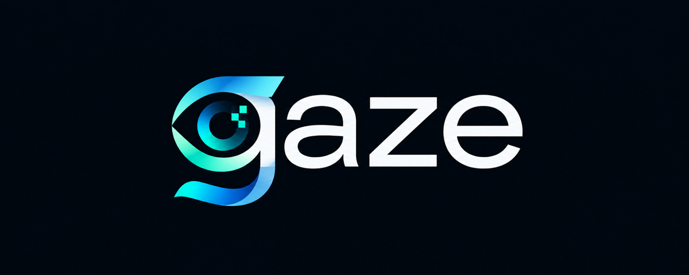
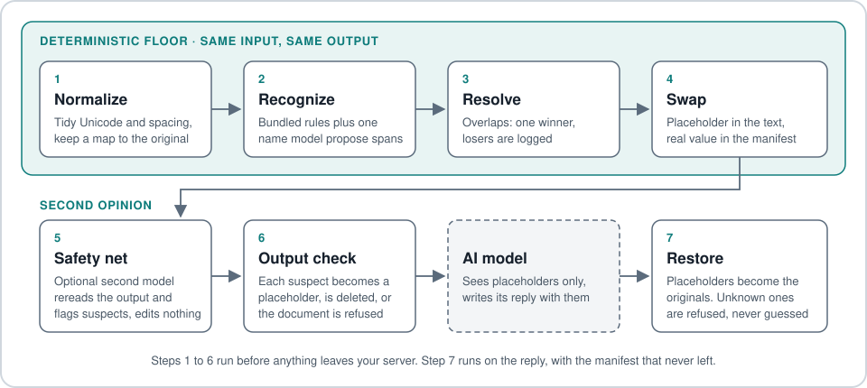

<p align="center">
  
</p>

[](https://crates.io/crates/gaze-pii) [](https://github.com/CertaMesh/gaze#license) [](https://docs.rs/gaze-pii) [](https://github.com/CertaMesh/gaze/actions/workflows/test.yml) [](https://github.com/CertaMesh/gaze/stargazers)

**Gaze swaps the personal details in your text for placeholders before an AI model sees it, then swaps the real details back into the model's reply.** The model works with a name token such as `<Name_N>`; only your server knows that it means Ada Example.

Gaze pseudonymizes: every placeholder can be restored, and the manifest that restores it never leaves your server. The goal is that no byte of personal data reaches the model outside that contract.

*Pre-1.0, API stabilizing. Reversibility is guaranteed across minor versions — manifests written by an older minor restore on a newer minor (see [`UPGRADE.md`](UPGRADE.md)).*


*Text version:* your app → Gaze swaps details for placeholders (the manifest stays on your server) → the AI model reads and writes placeholders only → Gaze restores the real details → your app.

**Scope:** outbound PII control with reversibility. Gaze is *not* a guardrail, prompt-injection defense, or content-safety filter — it keeps real PII out of the model and restores it in the reply.

The same boundary applies to tool-call arguments in agent frameworks: the JSON the model fills in carries placeholders, and Gaze restores them before your tool runs ([how it fits your stack](docs/explanation/how-gaze-works.md#how-it-fits-your-stack)).

## How good is it

How much PII does each tool keep from reaching the model? The [v0.16.0 benchmark](docs/reference/benchmarks/README.md#current-release) runs the exact policy `gaze setup` writes, next to Presidio, DataFog, scrubadub, GLiNER and OPF on their declared configurations. "Leaked" means PII bytes that would still reach the model; the goal is zero.

<!-- BEGIN GENERATED: readme-chart -->

<picture>
  <source media="(prefers-color-scheme: dark)" srcset="docs/assets/benchmarks/benchmark-panels-dark.svg">
  
</picture>

Gaze 0.16 leaks 7,348 PII bytes on our holdout (character-level F2 0.912). Methods, competitor setups and how to reproduce: [benchmarks](docs/reference/benchmarks/README.md#benchmark-panels).

<!-- END GENERATED: readme-chart -->

## How does it work



The seven steps in the diagram, grouped:

1. **Rules find the structured details.** 40 bundled rules match formats, checksums, and cue words: emails, IBANs, phone numbers, national IDs.
2. **NER finds names and places.** A named-entity model proposes the free-text details the rules cannot see.
3. **Overlaps are resolved, then swapped.** One candidate wins each span, and it becomes a placeholder plus a manifest entry. The same input always gives the same output, and every placeholder traces to a versioned rule.
4. **A local safety net rereads the result.** The policy from `gaze setup` runs Nym, which turns anything it catches into another restorable placeholder.
5. **Restore puts the originals back.** Placeholders in the model's reply become the real values. A placeholder Gaze never issued is refused, never guessed.

Gaze fails closed. A missing model or an unknown rule stops the run. A safety-net suspect that cannot become a placeholder is replaced with a one-way `[REDACTED:<class>]` marker or the document is refused. Only `tolerant` mode, meant for development, lets it through.

The full walkthrough, with a real support ticket and the safety-net modes: [How Gaze works](docs/explanation/how-gaze-works.md).

## Quickstart

Install the CLI, write the default policy, then clean and restore a synthetic contact:

```sh
cargo install gaze-cli --version 0.16.0
gaze setup
printf 'From: %s %s <%s@%s>' Ada Example ada example.invalid | gaze clean --policy gaze.toml > clean.json
jq -r .clean_text clean.json
jq '{session_blob, text: .clean_text}' clean.json | gaze restore | jq -r .text
```

Here is the real output. The two `sed` filters only normalize it for
publication: the first drops the per-session token prefix, the second writes
`@` as ` [at] `. The first line is what the model sees; the second is what
the owner restores:

```console
$ jq -r .clean_text clean.json | sed -E 's/<[0-9a-f]{8}:([A-Za-z]+)_[0-9]+>/<\1_N>/g'
From: <Name_N> <<Email_N>>
$ jq '{session_blob, text: .clean_text}' clean.json | gaze restore | jq -r .text | sed 's/@/ [at] /'
From: Ada Example <ada [at] example.invalid>
```

`gaze setup` verifies the pinned NER and Nym bundles, writes `gaze.toml` with Nym on, and checks both detectors. It prints the Nym model card's MIT licence and the open [training-data licence review](docs/explanation/safety-net/safety-nets.md#licence-review-open). Use `gaze setup --safety-net none` for a NER-only policy.

Use `gaze setup --dob-judge` to install the optional SHA-pinned local GLiNER
bundle and enable cue-less date-of-birth judgments in the generated policy.
This option is off by default until its 352 MB bundle is shrunk:
on the benchmark it cuts leaked date-of-birth bytes from 810 to 725 with no
added false-positive bytes, but adds 664 MiB peak memory
([per-mechanism arms](docs/reference/benchmarks/README.md#per-mechanism-arms)).
`--dob-model-dir <path>` selects its bundle
directory. The setup doctor checks a synthetic birth date before publishing
the policy.

`clean_text` is what you send to the model. `clean.json` also holds the `session_blob`: keep it on your server, because it is what `gaze restore` needs and it contains the originals.

## Where next

- [How Gaze works](docs/explanation/how-gaze-works.md): a support ticket from input to restore, the seven steps, the safety-net modes, and a glossary.
- [Feature comparison](docs/explanation/feature-comparison.md): sourced capabilities and limits alongside Presidio, DataFog, scrubadub, GLiNER, OPF, and LLM Guard.
- [Getting started](docs/tutorials/getting-started.md): the same round trip from Rust, in about ten minutes.
- [Use the `gaze setup` policy from Rust](docs/how-to/rust-library.md): the Nym-enabled pipeline as a library.
- [Audit and restore](docs/how-to/audit-and-restore.md): the metadata audit log and the restore contract.
- [AI support drafts in production](docs/explanation/support-drafts-in-production.md): how [`gaze-ghostwriter`](https://github.com/CertaMesh/gaze-ghostwriter) keeps the customer out of the model.
- [CLI reference](crates/gaze-cli/README.md) and [policy reference](docs/reference/policy.md).
- [All documentation](docs/README.md).

## Install

Install the CLI from crates.io:

```sh
cargo install gaze-cli --version 0.16.0
```

Or build from source (latest `main`, or to enable extra features):

```sh
git clone https://github.com/CertaMesh/gaze.git
cd gaze
cargo install --path crates/gaze-cli
```

Pre-built binaries for Apple Silicon macOS and Linux x86_64 (glibc 2.39+) are attached to each [GitHub release](https://github.com/CertaMesh/gaze/releases). Other targets: `cargo build --release -p gaze-cli`.

For the LLM API proxy:

```sh
cargo install --path crates/gaze-cli
gaze proxy start
export OPENAI_BASE_URL=http://127.0.0.1:8787/v1
export ANTHROPIC_BASE_URL=http://127.0.0.1:8787
```

For MCP hosts (Claude Code, Claude Desktop, Cursor):

```sh
cargo install --path crates/gaze-cli --features mcp
gaze mcp install --client=claude-code
gaze mcp doctor
```

The MCP server exposes `gaze_read_file` and `gaze_read_text`, returning tokenized content plus a `manifest_id` for authorized restore flows. Client config paths: [`crates/gaze-cli/README.md`](crates/gaze-cli/README.md#mcp-installation).

For library use, see [Use the `gaze setup` policy from Rust](docs/how-to/rust-library.md).

## Workspace and crates.io

Eleven published crates. Pick the smallest surface that does the job.

| Crate | Use when |
|---|---|
| [`gaze-pii`](https://crates.io/crates/gaze-pii) (lib name `gaze`) | You link the runtime: `Pipeline`, `Session`, `Policy`, `Recognizer`, restore. |
| [`gaze-types`](https://crates.io/crates/gaze-types) | You want the value contracts (`RedactionLogger`, `Manifest`, `LeakReport`) without ML deps. |
| [`gaze-recognizers`](https://crates.io/crates/gaze-recognizers) | You're writing a custom recognizer or rulepack, or you want the bundled detectors and SafetyNet backends. |
| [`gaze-audit`](https://crates.io/crates/gaze-audit) | You want SQLite-backed metadata audit logging. `gaze` core has no `rusqlite` dep in any feature graph. |
| [`gaze-assembly`](https://crates.io/crates/gaze-assembly) | You want bundled defaults without hand-wiring recognizers. |
| [`gaze-cli`](https://crates.io/crates/gaze-cli) | You want a process boundary for non-Rust adapters (Laravel, Python). |
| [`gaze-document`](https://crates.io/crates/gaze-document) | You want PNG / JPG / PDF ingestion into `SafeBundle`s or MCP document tools. |
| [`gaze-mcp-core`](https://crates.io/crates/gaze-mcp-core) | You're building an MCP tool host and want every call to pass through Gaze's chokepoint. |
| [`gaze-mcp-rmcp`](https://crates.io/crates/gaze-mcp-rmcp) | You want the rmcp transport sink for `gaze-mcp-core` (stdio default, opt-in streamable HTTP). |
| [`gaze-mcp-bridge`](https://crates.io/crates/gaze-mcp-bridge) | You want the policy-gated MCP bridge that restores approved token fields before calling downstream MCP servers. |
| [`gaze-proxy`](https://crates.io/crates/gaze-proxy) | You want an HTTP proxy in front of API-key traffic to OpenAI / Anthropic / Gemini; consumer subscription tiers are outside this surface. The proxy is daemon-managed via `gaze proxy`. |

```sh
cargo add gaze-pii
```

Crate boundaries and the audit-isolation Dylint gate: [`docs/reference/crates.md`](docs/reference/crates.md). Document codec extension: [`docs/explanation/document/document-extension.md`](docs/explanation/document/document-extension.md).

## Publishing

The workspace publishes via the `publish-crates.yml` GitHub Actions workflow using crates.io trusted-publisher OIDC auth; it does not need a long-lived `CARGO_REGISTRY_TOKEN` secret.

- **Tag push** (`git tag v<version> && git push --tags`) runs a real publish on every workspace crate in topological order.
- **Manual dispatch** with `dry_run=true` packages each crate without publishing, useful for catching metadata or dependency issues before a release tag.

## Contributing

See [CONTRIBUTING.md](CONTRIBUTING.md). **New here?** Browse the [good first issues](https://github.com/CertaMesh/gaze/labels/good%20first%20issue) — locale rulepack entries and new validator-backed recognizers are natural starting points.

Apache-2.0 OR MIT, **no CLA** (DCO sign-off only, `git commit -s`); the project is run as a commons — open detection forever, no bait-and-switch, commercial features in separate repos. See [`docs/explanation/governance.md`](docs/explanation/governance.md).

Repository gates (xtask + Dylint) enforce the contracts in [`docs/explanation/`](docs/explanation/). Run them locally before pushing:

```sh
cargo fmt --all -- --check
cargo clippy --workspace --all-features --all-targets -- -D warnings
cargo test --workspace --all-features
cargo run -p xtask -- ci-feature-matrix
```

## License

Dual-licensed under either of [Apache-2.0](LICENSE-APACHE) or [MIT](LICENSE-MIT), at your option.
