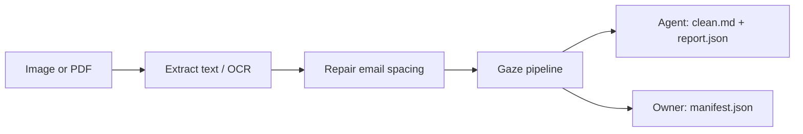

# gaze-document

[](https://crates.io/crates/gaze-document)
[](https://docs.rs/gaze-document)
[](https://github.com/CertaMesh/gaze#license)

Extracts PNG/JPG/PDF text, protects it with `gaze-pii`, and writes clean Markdown, an owner-only restore manifest, and an OCR/PII report. Powers `gaze document clean`. OCR calls the `tesseract` subprocess.

## Install

### Library

```toml
[dependencies]
gaze-document = "0.16.0"
```

### CLI

```bash
cargo install gaze-cli --version 0.16.0 --features document
```

The `document` feature is opt-in on `gaze-cli` so the default install stays
free of OCR / PDF dependencies.

## Runtime requirements

### Tesseract

`gaze-document` shells out to the `tesseract` CLI (Tesseract 4 or 5).

| Platform     | Install                                              |
|--------------|------------------------------------------------------|
| macOS        | `brew install tesseract`                             |
| Debian/Ubuntu| `sudo apt-get install tesseract-ocr`                 |
| Fedora       | `sudo dnf install tesseract`                         |
| Arch         | `sudo pacman -S tesseract`                           |
| Windows      | `winget install --id UB-Mannheim.TesseractOCR`       |

If the binary is missing, `clean()` returns
`DocumentError::TesseractNotFound` with a per-OS install hint in the
message, fail-loud by design (Axis 1 reliability).

### pdfium (only for PDF input)

PDF rasterization uses [`pdfium-render`](https://crates.io/crates/pdfium-render),
which loads the pdfium shared library at runtime. Prebuilt binaries
for every major OS / arch are published by
[`bblanchon/pdfium-binaries`](https://github.com/bblanchon/pdfium-binaries):

| Platform      | What to do                                                                |
|---------------|---------------------------------------------------------------------------|
| macOS (arm64) | Download `pdfium-mac-arm64.tgz`; place `lib/libpdfium.dylib` on `DYLD_LIBRARY_PATH` or in `/usr/local/lib`. |
| macOS (x64)   | Download `pdfium-mac-x64.tgz`; same placement.                            |
| Linux (x64)   | Download `pdfium-linux-x64.tgz`; place `lib/libpdfium.so` on `LD_LIBRARY_PATH` or in `/usr/local/lib`. |
| Windows       | Download `pdfium-win-x64.zip`; place `pdfium.dll` on `PATH` or next to the binary. |

Image-only workflows (PNG / JPG) do not need pdfium.

## Quickstart (library)

```rust,no_run
use std::path::Path;

let bundle = gaze_document::clean(
    Path::new("invoice.pdf"),
    gaze_document::AgentBundleDir::new("./agent-bundle")?,
    gaze_document::OwnerBundleDir::new("./owner-vault")?,
)?;

// Tokenized Markdown safe to hand to an LLM.
let _ = &bundle.clean_markdown;

// Restorable manifest — pair with a `gaze::Session` to round-trip.
let _ = &bundle.manifest;

// Provenance: per-page extraction confidence + PII counts.
println!(
    "tokens={} first_page_confidence={:?}",
    bundle.report.pii_token_count,
    bundle.report.pages.first().and_then(|page| page.confidence),
);
# Ok::<(), gaze_document::DocumentError>(())
```

## Quickstart (CLI)

```bash
# Convenience shorthand: --out creates agent/ + owner/ subdirs
gaze document clean ./invoice.pdf --out ./safe/

# Explicit: caller controls both paths
gaze document clean ./invoice.pdf --agent-out ./agent-bundle/ --owner-out ./owner-vault/
```

Writes:

```
agent/
  clean.md        # OCR text with PII replaced by reversible tokens
  report.json     # BundleReport — OCR + PII counts + provenance
owner/
  manifest.json   # gaze::Manifest — restorable, canonical
```

Stdout carries a one-line JSON summary so callers can pipe it.

`manifest.json` carries restorable PII mapping material. It belongs in an
owner-only path; uploading it alongside `clean.md` to an LLM workspace defeats
pseudonymization. The split layout makes that axis-1 boundary a runtime
contract instead of caller discipline.

## Bundle on-disk shapes

* `agent/clean.md`: Markdown with a short header (`# gaze-document safe
  bundle`) plus the OCR text after token substitution.
* `owner/manifest.json`: serialized `gaze::Manifest` (re-exported from
  `gaze-types`). Compatible with `gaze restore` and the rest of the
  `gaze` runtime.
* `agent/report.json`: `BundleReport`. Schema versioned via
  `bundle_version: u32 = 2`; field set is `#[non_exhaustive]` so additive
  fields are SemVer-safe. Includes per-page extraction source
  (`vector_pdf` or `ocr`), OCR backend, normalized confidence,
  low-confidence flag, column count, per-class PII counts, PDF metadata,
  and the source kind. Existing v1 reports still deserialize; new emission
  is always v2. Full field-by-field catalog with stability per field:
  [`docs/reference/metrics.md`](../../docs/reference/metrics.md#6-safebundle--bundlereport-gaze-document).

## OCR brittleness + normalization



### Normalization rules

`src/ocr/normalize.rs` collapses horizontal whitespace beside `@` when both sides are non-whitespace: `(\S)[ \t]*@[ \t]*(\S)` → `$1@$2`. Newline-adjacent `@` stays unchanged. Add new artifact repairs here with their trigger, scope, and example.

### Brittleness limit

OCR must be mostly clean, with recognized glyphs and preserved line breaks. Low DPI, noise, and non-Latin scripts without the right `--lang` can still leak PII. Tests in `tests/e2e.rs` check both token presence and absence of synthetic raw values.

`pages[].confidence` and `pages[].low_confidence` let callers route pages for review. The threshold defaults to `0.65`; change it with `Pipeline::with_low_confidence_threshold()`. Report new artifacts with synthetic OCR output and the expected repair.

## MCP feature

Enable `mcp` to register two agent-tier tools with `gaze-mcp-core`:
`gaze_read_text` for already-extracted text and `gaze_read_file` for PNG,
JPG, or PDF paths. Hosts still call them through `PiiEnvelope::dispatch`,
so args, responses, manifest rows, and auth stay on the MCP chokepoint.

```rust,no_run
use std::sync::Arc;

use gaze_document::mcp::{self, GazeReadOpts};
use gaze_mcp_core::ToolRegistry;
use gaze_mcp_rmcp::{FixedPrincipalResolver, RmcpFrontend};

let mut registry = ToolRegistry::new();
mcp::register_tools(&mut registry, GazeReadOpts::default())?;

let frontend = RmcpFrontend::stdio(Arc::new(
    FixedPrincipalResolver::agent("local-stdio"),
));
# Ok::<(), gaze_mcp_core::ToolRegistryError>(())
```

Both tools return a JSON object:

```json
{
  "clean_markdown": "# gaze-document safe text\n\n...",
  "manifest_id": "01ARZ3NDEKTSV4RRFFQ69G5FAV",
  "file_metadata": {
    "source_kind": "text",
    "ocr_mean_confidence": null,
    "bundle_version": 2,
    "page_count": null
  }
}
```

`gaze_read_file` defaults to a 25 MiB input cap. Override it with
`GazeReadFile::with_max_file_size(bytes)` or `GazeReadOpts`.
`gaze-cli` provides `gaze mcp install`, `gaze mcp doctor`, and `gaze mcp serve`;
this crate only provides the opt-in tool implementations.

## Feature flags

| Feature           | Default | What it enables                                      |
|-------------------|---------|------------------------------------------------------|
| `ocr-tesseract`   | yes     | Tesseract subprocess OCR backend + `clean()` entry.  |
| `pdf-input`       | yes     | `pdfium-render` PDF text extraction + raster OCR fallback. |
| `mcp`             | no      | `gaze_read_file` + `gaze_read_text` Tool impls.      |
| `extract-docling` | no      | Reserved: future Docling layout adapter.            |
| `render-image`    | no      | Reserved: future redacted-preview renderer.         |

`extract-docling` and `render-image` are reserved empty features.

## License

Licensed under either [Apache-2.0](https://github.com/CertaMesh/gaze/blob/main/LICENSE-APACHE) or [MIT](https://github.com/CertaMesh/gaze/blob/main/LICENSE-MIT).
