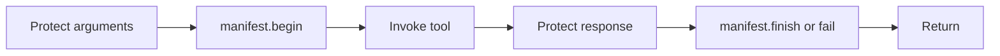

# gaze-mcp-core

[](https://crates.io/crates/gaze-mcp-core)
[](https://docs.rs/gaze-mcp-core)
[](https://github.com/CertaMesh/gaze#license)

Transport-free MCP runtime: `Tool`, sealed `ToolCtx`, `ToolRegistry`, `PiiEnvelope::dispatch`, `ManifestStore`, `AuthHook`, and `SessionIdPolicy`. Use `gaze-mcp-rmcp` for stdio/HTTP or implement `Frontend` / `DispatchHost`.

## Scope

Agent-tier source data passes through `PiiEnvelope::dispatch` before reaching the model. Authorized operator tools may bypass response protection for restore/export; raw results must stay on the operator surface.

Chat pastes, uploads, and screenshots bypass MCP. Use `gaze-proxy` for the user-to-model path (OpenAI, Anthropic, Gemini).

## Adopter quickstart

Add `gaze-assembly` as a direct dependency alongside `gaze-mcp-core` and
`gaze` (package `gaze-pii`). It builds the bundled primary recognizers and
matching locale chain used below.

```rust
use std::sync::Arc;

use async_trait::async_trait;
use serde_json::json;

use gaze_mcp_core::{
    AuthHook, AuthError, BeginCallContext, CallHandle, FailureReason,
    ManifestError, ManifestStore, PiiEnvelope, Principal,
    SessionIdPolicy, SnapshotRef, Tool, ToolCtx, ToolDescriptor,
    ToolError, ToolRegistry, ToolResponse,
};

// 1. Implement `ManifestStore` against your backing store.
struct MyManifest { /* … */ }

#[async_trait]
impl ManifestStore for MyManifest {
    async fn begin_call(&self, ctx: BeginCallContext<'_>) -> Result<CallHandle, ManifestError> {
        // Persist `ctx.call_id`, `ctx.principal_id`, `ctx.tool_name`,
        // `ctx.redacted_args`, `ctx.started_at`, optionally bind to
        // `ctx.external_session_id`.
        Ok(CallHandle::new(ctx.call_id))
    }

    async fn finish_call(
        &self,
        _handle: CallHandle,
        _snapshot: SnapshotRef,
    ) -> Result<(), ManifestError> {
        // Record the redacted-response snapshot reference.
        Ok(())
    }

    async fn fail_call(
        &self,
        _handle: CallHandle,
        _reason: FailureReason,
    ) -> Result<(), ManifestError> {
        // Record the failure reason. Must always succeed in chokepoint
        // ordering — return Err only when the backing store is genuinely
        // unavailable.
        Ok(())
    }
}

// 2. Implement `AuthHook` to gate dispatch.
struct MyAuth;

#[async_trait]
impl AuthHook for MyAuth {
    async fn authorize_agent(&self, _p: &Principal, _tool: &str) -> Result<(), AuthError> {
        Ok(())
    }
    async fn authorize_operator(&self, _p: &Principal, _tool: &str) -> Result<(), AuthError> {
        Err(AuthError::Denied("operators must use the admin path".into()))
    }
}

// 3. Build the gaze pipeline + session per conversation.
let core = gaze_assembly::CorePipelineConfig::new().build().expect("core pipeline");
let session = gaze::Session::new(gaze::Scope::Ephemeral).expect("session");

// 4. Register tools.
let mut registry = ToolRegistry::new();
# #[cfg(feature = "core-tools")]
registry.register(gaze_mcp_core::core_tools::CleanTool::new()).unwrap();

// 5. Build the envelope; pass to the transport via `Frontend::serve`.
let manifest = MyManifest {};
let auth = MyAuth;
let policy = SessionIdPolicy::default_strict();
let _envelope = PiiEnvelope::new(
    &registry, &auth, &manifest, core.pipeline(), &session,
    core.locale_chain().as_slice(), &policy,
);
```

The transport sink (e.g. `gaze-mcp-rmcp::RmcpFrontend`) wraps the envelope
behind the `DispatchHost` trait and calls `Frontend::serve` from the
adopter's tokio runtime.

## What gets enforced



Only the dispatcher constructs `ToolCtx`: its constructor and fields are `pub(crate)`, its shape is `#[non_exhaustive]`, and its lifetime binds it to the call. The registry accepts only `Tool` implementations. Compile-fail fixtures in `tests/ui/` and `tests/chokepoint_ordering.rs` check these boundaries.

Snapshot refs use `sha256(audit_session_id || 0x00 || call_id || 0x00 || payload_bytes)`. Audit readers can verify guessed payloads offline. Protect snapshot storage; if audit readers become less trusted, use keyed HMAC owned by `ManifestStore`.

## Session ownership boundary

Use one `gaze::Session` per authorization domain. `export_session_tokens` exposes the session’s entire token/raw map without per-call filtering. Sharing a session across users or agents lets one authorized operator read another’s PII. Hosts must create and pass separate sessions to `PiiEnvelope::new`.

## Operator-tier tools and audit storage

Operator-tier tools (`restore`, `restore_strict`, `export_session_tokens`)
are privileged by design. Their descriptors set
`ResponseRedaction::BypassByOperator`, so the dispatcher returns their raw
payloads to an operator principal after `AuthHook::authorize_operator`
passes. Agent-tier tools cannot opt into this posture; registry validation
rejects it and the dispatcher fails closed if that invariant is ever broken.

Successful operator-tier responses are still committed through
`ManifestStore::finish_call` before returning. For these tools, the response
snapshot can contain raw PII: restored values or the complete session token
inventory. `ManifestStore` implementations that persist snapshots must protect
those bytes with encryption at rest and operator-only read access. Audit rows
record snapshot locators plus the salted SHA-256 integrity marker described
above; audit readers are trusted to see manifest metadata and to verify guessed
payloads offline under the v0.7.x threat model.

## Strict protection boundary and migration

`PiiEnvelope` now protects both arguments and agent responses through
`Pipeline::protect_text_transaction`. Supply a configured primary pipeline,
for example `gaze_assembly::CorePipelineConfig::new().build()`, and pass its
locale chain to the envelope. An empty primary registry is rejected even for
calls containing no strings. The CLI MCP host uses this assembly path.

The compatible `PiiEnvelope::new` constructor uses an empty dictionary bundle.
Use `.with_dictionaries(&bundle)` to supply tenant terms. Primary recognizers,
mandatory safety nets, and `ToolResources::protection_context()` receive the
same locale and bundle. Observer tools use the new
`scan_safety_nets_with_dictionaries` and structured counterpart; the old
observer signatures retain an empty bundle. Model interfaces that do not
consume dictionaries are unchanged.

Every installed custom safety net must support the supplied locale chain.
A configured model registry must resolve coverage. All selected safety-net
backends run on every complete final string leaf, even when primary detection
emits nothing or the input consists entirely of existing tokens. Observer
skip optimizations cannot disable this boundary check. Invalid spans, backend
failures, and residual suspects outside verified token coverage reject the
operation. Zero installed safety nets is a primary-only floor, not a
claim that all PII was detected. Global residual policies are unchanged.

Custom producers must declare their JSON carriers at trusted registration:

```rust
use gaze_mcp_core::{CarrierDeclaration, ToolDescriptor};
use serde_json::json;

let descriptor = ToolDescriptor::agent("lookup", json!({"type":"object"}))
    .with_carriers(
        CarrierDeclaration::text_fields(&["query"]),
        CarrierDeclaration::text_fields(&["result"]),
    );
```

Use `CarrierDeclaration::new` for nested objects or explicitly non-sensitive
numbers. Each path is a vector of `CarrierSegment::Member(exact_name)` and
`CarrierSegment::AnyIndex` (one array edge only). Declare every encountered
object edge and every numeric leaf separately. Full paths must match exactly;
parent declarations do not authorize descendants. Numbers retain their
original `serde_json::Number` representation. Numeric declarations mean the
producer asserts those fields are non-sensitive; detectors do not certify
their contents. Booleans and null remain non-text values.

Schemas are catalog metadata and grant no authority. Declarations are omitted
from serialization; deserializing a descriptor cannot recreate trusted
permissions. Unconfigured descriptors accept root strings or arrays of strings
but reject object members and numbers. Built-in text, tokenize, and document
tools carry explicit declarations. For structured `SafetyNetCheckTool` input,
use `with_argument_carriers` with the complete supported document shape.
Arbitrary dynamic keys and cross-field concatenation are unsupported.

Known tokens are matched with the session's actual restoration semantics,
including non-angle format-preserving tokens. Only owned input ranges and
verified newly emitted ranges are protected coverage. Literal collisions,
including across JSON leaves, reject rather than silently reinterpret input.
Primary detection still runs independently on gaps between owned tokens;
this does not extend its cross-token detection domain. Full-leaf safety nets
see the entire final text. One-way replacements fail reversibility checks.

Arguments stage as one operation: preflight, protect, begin manifest, commit,
then invoke. A fresh response transaction starts after invocation. Response
preflight, protection, and snapshot construction precede its commit; successful
`finish_call` then permits egress. A later leaf failure discards that operation's
staging. Argument mappings and legitimate tool-side live-session mutations
are outside response rollback. Concurrent generation conflicts publish none
of the losing transaction's state.

A terminal manifest attempt consumes the handle even when persistence fails.
Never call `fail_call` after attempting `finish_call`. Response mappings are
already committed when finish is attempted; a failed finish retains those
mappings but returns no payload. This is not whole-call rollback.

Authorized operator response bypass remains a separate exception: its raw
keys, strings, and numbers are intentional, require operator authorization,
and return only after successful manifest finish. Operator arguments still
use the strict declared-carrier boundary. Agent bypass registration rejects.
All transport errors remain class-only; detailed backend errors and manifest
records belong exclusively to trusted-side diagnostics.

Direct users of the core leaf API must discard their transaction after any
error: staged mappings may remain, and previously returned strings are not
immutable operation proofs. The envelope performs this discard automatically.
Safety-net reconstructed `raw_span` offsets address expanded input, with owned
tokens replaced by their stored raw values; they cannot index the literal
input containing those tokens. Observer `nets_run` remains a configured count
(a nonempty registry counts as one), not an executed-model count.

## Explicit untrusted request mode

The default `dispatch` contract is unchanged. A tool must register
`RequestMode::UntrustedInvocation` to use `dispatch_request`; both entry points
reject a descriptor written for the other mode before authorization or audit.
The new mode also rejects operator response bypass.

`ToolCtx::invocation_args()` provides explicitly untrusted execution data. The
host validates bounds and authorization and may restore existing session tokens
locally. It must not log these arguments. The wrapper's Debug omits its payload;
`redacted_args()` is Null in this mode, never an audit marker or raw arguments.

`BeginCallContext::args_audit` contains only the versioned metadata-only omission
record. Legacy `redacted_args` is Null. Stores must record the explicit audit
format and report original arguments as omitted during replay, not restored.
No request detection or new request mappings occur in the envelope. Response
protection, transaction commit and durable finish use the same shared path as
legacy dispatch. A failed finish retains response mappings but returns no output.
Snapshots can restore separately captured tokenized output; they are not an
archive of the response body. Detection is not a guarantee that every PII value
will be recognized.

## Implementing your own `Frontend`

Adopters who do not want rmcp implement [`Frontend`] themselves. The
contract is one method (`serve(self, host, shutdown) -> Result<(), FrontendError>`)
that drives the transport's accept-and-dispatch loop until
[`ShutdownToken::cancel`] fires. The host (`Arc<dyn DispatchHost>`)
wraps the envelope behind a narrow surface (`dispatch` + `list_tools`)
so the transport never sees the gaze pipeline, the gaze session, or the
manifest store directly.

A reference adapter for rmcp's `tools/list` + `tools/call` shape lives in
`crates/gaze-mcp-rmcp`.

## Cargo features

| Feature | Default | Adds |
|---|---|---|
| `core-tools` | yes | `core_tools::{CleanTool, TokenizeFieldTool, SafetyNetCheckTool}` registrations. |
| `operator-tier` | no | `operator_tools::{RestoreTool, RestoreStrictTool, ExportSessionTokensTool}`. Tools route through `AuthHook::authorize_operator`. |

The `operator-tier` feature is opt-in. Default builds expose only the
agent surface, so an adopter who skips wiring auth hits
`AuthError::MissingHook` from `DenyAllAuthHook` instead of accidentally
exposing restore.

The exclusion is a `#[cfg(feature = "operator-tier")]` gate on each operator
module, so rustc keeps the surface out of an agent-tier build entirely. That it
stays that way is verified by the trybuild compile-fail fixtures in
`tests/ui/tier/`, one per gated surface, each compiled as an external crate
against an agent-tier feature graph and required to fail resolution, driven by
the `mcp-tier-isolation` xtask gate. `scripts/gate/mcp-tier-isolation-mutation-probe.sh`
re-proves that the gate goes red when a gate is removed.

## Related crates and documents

Transport: `gaze-mcp-rmcp`. User-input protection: `gaze-proxy`.

Full dispatch, audit, and threat contracts: [MCP runtime](../../docs/explanation/mcp/mcp-runtime.md). Correlation fields, manifest lifecycle, failure variants, and authorization audit: [Metrics](../../docs/reference/metrics.md#7-mcp-chokepoint-observability-gaze-mcp-core).
