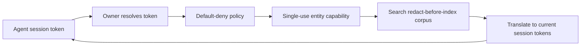

# gaze-token-bridge

Experimental, pre-1.0 owner-side search authorization and token translation.



Raw values, index aliases, and restore manifests stay owner-side. Contracts: [`src/lib.rs`](src/lib.rs) and [`src/model.rs`](src/model.rs).

## Install

```toml
[dependencies]
gaze-token-bridge = "0.16.0"
```

## Local demo (try it)

Run the synthetic-only [`examples/local_demo.rs`](examples/local_demo.rs):

```bash
cargo run -p gaze-token-bridge --example local_demo
```

### Run it

The command uses the public library API. It ingests five documents across customer/legal domains, denies support access to legal documents, and allows admin access from the admin session. Policy uses the owner-bound purpose; capabilities bind one entity. Snippets translate into each principal’s session tokens.

### Expected output

Allow/deny outcomes and translated snippets are checked in [`tests/local_demo_assertions.rs`](tests/local_demo_assertions.rs). The 8-hex session salt changes per run; class and ordinal suffixes stay stable. Another session rejects the token with `UnknownToken`.

### What each step demonstrates

Sessions bind principals, policy binds purpose, capabilities bind entities, and indexing protects text before storage.

### What's NOT shown

The demo uses exact in-memory lookup; vector search is deferred. Raw-filter projection is tested by `raw_filter_values_are_projected_before_adapter_receives_request` in [`tests/track_c_bridge.rs`](tests/track_c_bridge.rs). The MCP `search_documents` tool requires `chokepoint`.

## MCP host configuration

With `chokepoint`, register `SearchDocumentsTool` in a `ToolRegistry` and
supply a nonempty primary pipeline to `PiiEnvelope`, for example through
`gaze_assembly::CorePipelineConfig::new().build()` with `core.pipeline()` and
`core.locale_chain().as_slice()` (add `gaze-assembly` as a direct dependency).
The tool declares its supported argument and typed result carriers itself;
reserved `filters` supports an empty array, not arbitrary filter objects or
numbers. Owner-side bridge tokens remain in their separate namespace.

## Known limitation: residual fragments are protected but not searchable

Core [residual coverage](../../docs/reference/redaction-classes.md#residual-coverage) is on by default. A replacement can cover a fragment rather than a whole recognized value.

On ingest, `build_index_hit` in [`src/ingest.rs`](src/ingest.rs) replaces fragments with class-derived placeholders. It stores no raw bytes, fingerprint, ingest-session token, `CanonicalEntity`, `IndexEntity`, or posting. Fragments cannot be searched by value/fingerprint and do not appear in `hit.entities`; whole entities remain searchable.

Do not index fragments as entities. `translate` rejects output containing an entity’s raw value; a fragment can be one space or quote and would reject ordinary prose.

## Bring your own data

For bring-your-own-data redaction, use the core folder scan example:

```bash
cargo run -p gaze-pii --example scan_folder -- --path ./my-data
```
