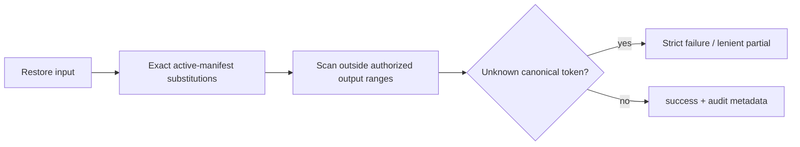

# Restore-boundary integrity

Restore may turn a token into raw sensitive data only through an exact mapping
in the active session manifest. This deterministic egress check enforces
manifest authority; it does not judge prompt intent.

## What restore authorizes

Known mappings restore once. Unmapped canonical placeholders and incomplete
prefixed wrappers fail closed. Session strict APIs also reject malformed syntax;
literal `<` or `>` beside a valid token remains text. Bare identifier-like text
is an audit signal and grants no restore authority.

Decisions must trace to the manifest, structural recognizers, or metadata-only
telemetry. Identity-sensitive policy requires separate, explicit opt-in approval.

## Phase status

| Phase | Scope | Status |
| --- | --- | --- |
| A | Strict manifest-bound restore | Default-on |
| B | Unauthorized raw structural PII detection | Opt-in, audit-only |
| C | Identity-sensitive restore-risk rulepack | Deferred, not implemented |
| D | Metadata-only restore telemetry | Core |

## Phase A: strict manifest-bound restore

Unknown tokens from another session or tenant also fail. Canonical shapes include
own/foreign prefixes, legacy wrapped formats, and legacy emitted formats such as
`location_7`, `custom:class_alpha_1`, and `email1@gaze-fake.invalid`. Broad bare
identifiers such as `Kunde_7`, `ORDER_12345`, and `run_1` remain unchanged and
contribute only to `manifest_bypass` audit counts.

`Session::assess_restore_text` uses one immutable session view. It scans after
exact substitutions, excluding matches fully inside `authorized_output_ranges`
(UTF-8 ranges written by authorized mappings). Adjacent or crossing matches
still count. It stores no original-text allowlist or new snapshot state.

Matching reads the original input once, longest known keys first. It never
recursively substitutes token-like text inside restored values. Known bare
format-preserving tokens with the session's eight-hex prefix allow leading
ASCII/Unicode word adjacency: `rec_a7f3b8e2:name_1` restores after `rec_` only if
the mapping exists.

A trailing Unicode word boundary is required: `name_1` cannot consume `name_10`,
`name_1x`, or `name_1é`. Known longer keys restore fully; unknown longer canonical
tokens remain subject to rejection. Noncanonical word-suffixed text stays
unchanged without a rejection guarantee. Family labels allow hyphens, so a
following hyphen prevents substitution of a shorter family token; separate
prose punctuation with whitespace. Other punctuation and legacy/email leading
boundaries are unchanged.

CLI, pipeline, and Session strict restore share this assessment. Staged
transaction provenance uses the same known-token ranges. Strict syntax parsing
and unknown-token classification remain separate from exact-known matching.

| API | Failure contract |
| --- | --- |
| `Pipeline::restore_with_policy_telemetry` | Returns text and telemetry: positive `unknown_token_count` gives Strict `failed` or Lenient `partial`; zero gives `success` |
| `Session::restore_strict_text`, provenance/events variants, MCP `restore_strict` | Typed error for unmapped canonical placeholders, incomplete wrappers, and Session malformed syntax |
| CLI strict restore | Exit 3 for unmapped canonical placeholders or incomplete wrappers |
| CLI tolerant restore | Preserve unknowns; warnings and requested `partial` telemetry; output, audit, and telemetry share assessment |
| Proxy transaction validation and committed-snapshot restore | Separate strict contract; residual DLP unchanged |

`success` describes restore classification. It does not prove byte-exact inverse
equality or detection quality; measure those separately.

## Phase B: unauthorized raw-PII detection

Opt-in structural checks cover email, phone, IBAN, payment cards, and API-key
shapes. They distinguish manifest bypass, fresh raw data, and wrong-context
restore. They remain audit-only until telemetry supports blocking precision.

Token-shape telemetry always runs. `manifest_bypass_count` counts broad bare
identifiers outside authorized substitutions; it is lexical suspicion, never a
Strict decision. `trap_shape_count` counts all unprefixed traps, including legacy
canonical shapes and authorized values. A bare literal can yield zero unknowns,
one bypass, and `success`. Neither count proves a fresh-PII scan ran; that phase
bit stays unset when it did not run.

## Phase D: restore audit telemetry

Audit stores counts and existing decision/policy spellings, never matched text,
offsets, original values, or their hashes. `restore_trap_shape_count` is nullable
for historical rows, which are not rewritten. Missing JSON `trap_shape_count`
defaults to zero. Snapshot versions and token grammar are unchanged. See
[restore telemetry fields](../../reference/metrics.md#restore-telemetry).

## Risks addressed by phases A and B

Strict mappings reject hallucinated tokens, wrong-session restores, and
unauthorized re-materialization. Opt-in audits observe raw model/provider data
and suspected manifest bypasses without granting mappings.

## Out of scope

Prompt injection, jailbreaks, semantic adversarial reasoning, LLM judges,
malicious-intent classification, agent alignment, and tool permissions.

## Design constraints

Keep restore deterministic, manifest-bound, fail-closed, and auditable without
raw telemetry. Keep Phase B audit-only and Phase C separately approved.
