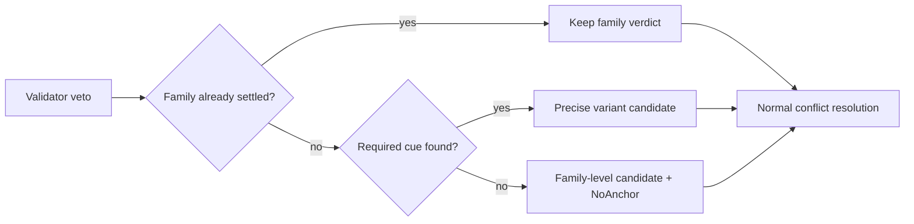

# Mandatory anchor resolution

A mandatory anchor prevents a structural recognizer from choosing a precise
variant from shape alone.

## Declaring a mandatory anchor

```toml
[recognizers.collision]
family = "payment-card-or-iban"
variant = "iban"
precedence = 10
mandatory_anchor = "iban"

[locale.cues.iban]
names = ["IBAN", "IBAN:", "Account No."]
window_chars = 64
```

The collision block belongs to the recognizer; the cue block belongs to a
locale rulepack.

## How resolution runs

`AnchorResolver` looks up the recognizer ID in `FamilyPolicyTable`, then searches
the active locale chain's cue bundle within its bounded span window. A missing
bundle counts as a missing anchor.



Missing anchors produce `PiiClass::Custom("family:<family>")`,
`ConflictTier::AnchoredContext`, and `AmbiguityReason::NoAnchor`.

## Settled spans skip the anchor check

A lower-precedence variant that beats a family rival on the same bytes settles
the family, even without a cue. Settlement is separate from `decided_by`;
unrelated overlaps can relabel the audit tier without reopening the anchor check.
A span with no family rival still needs its anchor.

## One token, one restore mapping

The output has one token and one manifest mapping. The audit entry carries the
ambiguity sidecar.

## Policy action for the family-level token

The shared first-match policy walk applies. Without a reachable family-class
rule, use the strictest action among resolved member actions and the family
class's default (`gaze_types::Action::strictness_rank`). An explicit family rule
before the default overrides this. Audit records `AmbiguityRecord::derived_action`.
See the [policy reference](../../reference/policy.md#how-a-family-level-token-picks-its-action).

## Coherence gate

```bash
cargo run -p xtask -- locale-cue-bundle-coherence
```

Fails when a bundled mandatory-anchor key has no bundled locale cue block.
