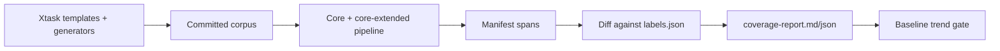

# Detection coverage feedback loop

This deterministic test compares the rule floor with committed synthetic
labels. It does not train models, call an LLM, or change production rulepacks.

## How the loop works



The oracle at `crates/gaze-recognizers/testdata/coverage-loop/corpus/labels.json`
records byte boundaries, audit-form class ID, generator ID, seed, and
`license_origin`.

| Result | Meaning |
| --- | --- |
| `Covered` | Same-class manifest coverage spans the full label |
| `Uncovered` | No manifest overlap |
| `PartialBleed` | Same-class overlap covers only part |
| `ClassMismatch` | Overlap has another class |

Only `Uncovered` is gated: it cannot exceed baseline per `(class_id, locale)`.
The other outcomes remain reported for resolver analysis.

## Data rules

All fixtures use `synthetic-rust-generator`. Vendored snippets require an
extended origin enum and documented provenance. Keep fixture bytes out of
production `src/`.

## Gate mode

```bash
cargo test -p gaze-recognizers --test coverage_loop -- --ignored --nocapture
```

Unset `GAZE_COVERAGE_LOOP_INFO_ONLY` or `1` writes an informational report.
For blocking mode:

```bash
GAZE_COVERAGE_LOOP_INFO_ONLY=0 cargo test -p gaze-recognizers --test coverage_loop -- --ignored --nocapture
```

This loads `crates/gaze-recognizers/testdata/coverage-loop/baseline.json` and
fails on any increased `Uncovered` class/locale count.

## Adding coverage

1. Add a generator in `crates/xtask/src/coverage_corpus/generators/` and register it in `GeneratorRegistry::default_phase_1()`.
2. Unit-test at least 100 seeds.
3. Add `templates/<context>/` templates and include them in `templates/mod.rs`.
4. Run `cargo run -p xtask -- coverage-corpus --regenerate --seed 0`.
5. Run the ignored test and inspect `target/coverage-report.md`.
6. Commit the corpus. Update `baseline.json` only after accepting the current leak set.

## Sibling gates

`fixture-citation-lint` checks production fixture citations;
`bundle-tokenization-drift` checks bundle activation drift; safety-net tests
check leak-report correlation and fail-closed behavior. This loop checks only
synthetic labels against manifest spans.
