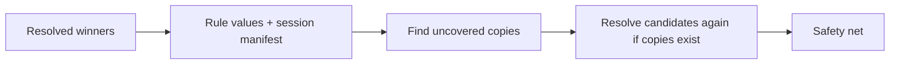

# Repeat-value sweep

After a rule finds a value, Gaze tokenizes matching copies in that document and
later texts of the same session. Changed spelling or name parts get sibling
tokens so every copy restores exactly.

## Where it runs

A full copy beats an enclosed weaker same-class fragment. Without uncovered
copies, Gaze keeps the first resolution and adds only one linear scan.

Within a text, sources protect copies before or after them. Across texts,
sources protect only later texts. Daemon turns run in order. Proxy JSON strings
(message content, tool results, arguments) are separate texts processed in order:
a copy in an earlier field than its source can leak. A second proxy pass is a
follow-up. Whole request bodies avoid chunk cuts; future streaming ingress must
hold back `(longest value − 1)` bytes.

## What propagates

Only deterministic rule evidence propagates. NER, safety-net values, and
`preserve` classes do not. On TAB court cases, NER-tagged ordinary words caused
91% of new false positives when propagated.

`Recognizer::evidence` / `Detector::evidence` declares `gaze::EvidenceKind::Rule`
or `Learned`; the registry stamps candidates. IDs imply nothing. Undeclared
emitters default to `Learned`.

| Emitter | Evidence |
| --- | --- |
| Bundled/custom regex, dictionary, anchored matches | `Rule` |
| `gaze index` field labels, TokenBridge synthetic detector | `Rule` |
| NER, GLiNER DOB judge | `Learned` |
| NER-corroborated house numbers, `address.block.*` growth | `Learned` |
| Undeclared adopter recognizer/detector | `Learned` |
| Swept rule copy | `Rule` |
| Collision-family tie | `Rule` only when both sides are `Rule` |

A `Learned` container cannot swallow another class's enclosed `Rule` span.
The resolver splits around the rule and recovers the remainder. Nym/OPF values
are not candidates and record no session evidence.

## Matching rules

| Shape | Matching floor |
| --- | --- |
| Multi-word or letters with digits/punctuation | Any case and whitespace run; at least 4 non-space characters |
| Digit run with spaces, `-`, `.`, `/` | Flexible whitespace; at least 6 digits |
| One alphabetic word | As written, title case, upper case; at least 4 characters |
| Single part of a multi-word `Name` | Starts uppercase; as written/title/upper case; at least 3 letters |
| Adjacent run of 2+ name parts | Any case/whitespace; at least one independently eligible part (3+ letters, not common); values up to 6 parts |
| `family:<name>` value | Byte-exact; at least 4 non-space characters |

Whitespace includes tabs, line breaks, and NBSP. Short postal digits do not
sweep without their source cue/city, which supplies their precision.
Copies must use `gaze_types::is_inside_word` edges. URL-shaped runs with a scheme
or web prefix are skipped.

Names extend over hyphen/apostrophe joins through `extend_over_name_joiners`,
covering a suffix such as `-ellery` when the source ended before it. Forward
continuations need two letters; possessive `'s` and digit continuations stay
outside. This can also cover ordinary glued words such as `Kowalski-follow-up`.

Single common words never sweep alone or supply a run's distinctive part:
months, weekdays, everyday English names/nouns/verbs, and common German surnames
such as `Richter` and `Schneider`. Full values still sweep. Honorific-bearing
values use adjacent runs to protect bare names, but a run made only of common
words cannot match without the honorific.

Two more closed lists exclude standalone/distinctive parts:

- Naming particles/articles across German, Dutch, French, Spanish/Catalan,
  Portuguese, Italian, Scandinavian, Arabic/Hebrew, Gaelic/Welsh conventions.
  See `PARTICLES` and sources in `crates/gaze/src/sweep.rs`; tests enumerate
  each particle/pair. `ben` and `nic` are excluded from that list because they
  are common given names. Particles never sweep alone.
- Organization/role words such as `support`, `team`, `service`, `info`, `paket`,
  `kundenservice`, `noreply`, `newsletter`, including hyphen pieces.

Organization-shaped values (a CamelCase part, or mixed all-caps/other parts)
sweep whole values and runs, never single parts. A CamelCase single word keeps
written/title spellings without uppercase expansion. Wholly all-caps values
keep parts: this protects shouted names but can sweep parts of an all-caps
organization. CamelCase surnames lose standalone-part recall.

Case folding maps folded bytes back to whole original characters. Turkish `İ`
expands to two scalars but keeps its source span; dotless `ı` does not match `I`,
which lowers to `i`.

Known gaps include lowercase/mixed-case lone parts, common-word surnames,
sub-six-digit runs, earlier proxy fields, model-only sources, honorific names
made solely of common words, and all-caps surnames in mixed-case names.
`VAN DER BERG` has no distinctive part and relies on NER for changed-case copies.

## Token identity and restore

Byte-identical copies reuse the source token. Changed spelling or a name part
gets a sibling in the same class/family. Each token maps to one exact byte string.

## Session state

Entries retain the strongest evidence tier seen. One cached multi-pattern
matcher rebuilds only when sweepability changes; it uses the existing manifest,
without another raw-value store.

`session_blob` envelope v6 carries evidence. Readers through v0.15 reject it with
`InvalidSnapshotVersion(6)`. Blobs v5 and older import/restore but cannot seed
sweeps because their evidence is unknown.

## Audit

Copies record `recognizer_id = manifest_sweep`, `provenance_stage = manifest_sweep`,
`decided_by = manifest_sweep` (`ConflictTier::ManifestSweep`), and
`provenance_merged_from = manifest_sweep:exact`, `:variant`, or `:part` (parts/runs).
Rows never contain source tokens/values. Daemon overwrites the stage with
`daemon`; `decided_by` still identifies the sweep.

## Failure

Above 200,000 patterns or 16 MiB of pattern bytes, or on matcher-build failure,
return `Error::ManifestSweep`. Never emit unswept text.

## See also

- [Session contract](../core/session-contract.md)
- [How Gaze works](../how-gaze-works.md)
- Tests: `crates/gaze/tests/manifest_sweep.rs`, `crates/gaze-cli/tests/manifest_sweep.rs`, `crates/gaze-proxy/tests/manifest_sweep.rs`
