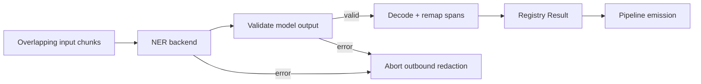

# NER fails closed

Recognizer errors abort outbound redaction. They cannot mean “no PII found.”

## Decision

```rust
Recognizer::detect(...) -> Result<Vec<Candidate>, DetectError>
```

`gaze-types` owns `DetectError`. NER failures map to `DetectError::Backend`;
registry aggregation propagates `Result` and the pipeline aborts on error.

## Fail-closed proof



Registry detection short-circuits before span translation, logging, or clean-text
emission. Chunk failures propagate too, preventing partially cleaned output.

## Model output boundary

`OrtBackend::detect` validates every tensor before label selection, softmax,
or filtering. Each failure is `NerRuntimeError::Output`:

| Invalid output | Error detail |
| --- | --- |
| Missing tensor | `missing logits tensor` |
| Shape other than `[1, seq_len, num_labels]` | `invalid logits tensor shape` |
| Buffer length != `seq_len * num_labels` | `invalid logits dimensions` |
| Any `NaN`, `+Inf`, or `-Inf` | `nonfinite logits` |

Scan all values, including `O`, low-confidence, and special-token rows. A corrupt
row must not disappear through decoding. Nym-small likewise errors on wrong
logit length or non-finite values.

Empty results remain valid for empty token sequences, zero-width offsets, or
well-formed tensors whose spans all lie outside the document.

## Long-input chunking invariant

ORT windows use real WordPiece offsets: 480 payload tokens plus `[CLS]`/`[SEP]`
under the 512-token ceiling, with 30 tokens of overlap.

```text
overlap_tokens >= longest detectable entity + margin
stride = budget - overlap
```

Names typically take 2–4 tokens; common location/organization spans fit the
assumed overlap. Remap spans to original bytes before deduplication, emitting
one span when both windows find it. Entities longer than the overlap, including
long organizations or fragmented input, remain a risk. Pass-3 SafetyNet should
rescan reassembled clean output for boundary misses.

## Whole-word span edges

After remapping, `Name`, `Location`, and `Organization` spans expand through
`gaze_types::expand_to_word_edges`; names also extend over hyphens/apostrophes
with `extend_over_name_joiners`. Expanded overlaps merge. Identifier spans stay
unchanged because they can sit inside longer strings.

This prevents partial names from leaving suffixes raw, but an `Ann` model
fragment inside `Announcement` tokenizes the whole word.

## Blast radius

`gaze-types` defines the fallible trait. Core `detect_all` and
`detect_all_resolved` propagate it as `Error::RecognizerDetect`.
Regex, dictionary, anchored, and NER recognizers implement it. CLI, assembly,
and MCP core receive these failures through the existing pipeline `Result`.
