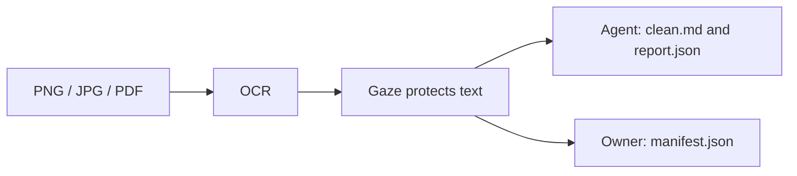

# Document extension architecture

`gaze-document` turns PNG/JPG/PDF into a `SafeBundle` using Tesseract and
optional PDF rasterization. The shipped JSON manifest is owner-only. The signed
`DocumentExtension` envelope below is a planned integrity upgrade, not the
current on-disk format.

## Shipped in v0.7.1

`write_bundle` separates outputs using `AgentBundleDir` / `OwnerBundleDir`
newtypes and path validation. `BundleReport.bundle_version` is `2`.

## Boundary



Only the owner output may contain reversible PII. Never upload it with the
agent directory. `manifest.bin` signed binding remains the v0.11+ Design B
follow-up; shipped Design A uses `manifest.json`.

## Bundle files

The shipped writer emits three of these files: `clean.md`, `manifest.json`,
and `report.json` (`CLEAN_MARKDOWN_FILE`, `MANIFEST_FILE`, and `REPORT_FILE` in
`crates/gaze-document/src/bundle/mod.rs`). `layout.json` and
`preview-redacted.png` belong to the `DocumentExtension` envelope below, which
hashes them; the shipped bundle does not write them.

### clean.md

`clean.md` is UTF-8 clean text containing Gaze tokens only. It has no
frontmatter, comments, or duplicated metadata. Byte spans are relative to this
normalized file.

### manifest.json

`manifest.json` is the shipped `gaze::Manifest` restore mapping. It is the only
v0.10 bundle file that can carry reversible PII, so it stays in `owner_out`.
Moving the owner restore material to the signed snapshot envelope
(`Session::export_with_extension` -> `manifest.bin`) is deferred to v0.11+.

### report.json

`report.json` is metadata-only: status, codec provenance, capability flags,
counts, warning codes, and safety-net stats. It must not contain raw PII or
token restore values.

## The DocumentExtension envelope

The envelope is the planned Design B integrity upgrade. It adds two files and
versions the bundle as one unit.

### layout.json

`layout.json` carries geometry, reading order, coordinate-space metadata, and
pointers into `clean.md`. It must not include raw OCR text, source filenames,
PDF metadata, EXIF fields, or codec stderr/stdout.

### preview-redacted.png

`preview-redacted.png` is an advisory redacted preview with boxes burned into
pixels. Its metadata is not authoritative; the signed snapshot extension is the
integrity root.

### Versioning

`DocumentExtension::schema_version` is a single bundle-level `u16`. It versions
the bundle contract as one unit. Sub-files do not carry independent schema
versions because spans and integrity data cross file boundaries.

### Rust hook

```rust
use gaze::{DocumentExtension, Scope, Session};

let session = Session::new(Scope::Conversation("doc-1".to_string()))?;
let extension = DocumentExtension::builder(1)
    .clean_md_sha256([1; 32])
    .layout_json_sha256([2; 32])
    .report_json_sha256([3; 32])
    .page_count(1)
    .audit_session_id(session.audit_session_id())
    .build()?;

let manifest_bin = session.export_with_extension(extension)?.into_bytes();
```

`Session::export()` remains unchanged for text-only adopters. `Session::import`
continues to restore both plain v3 and document-extended v4 snapshots.
