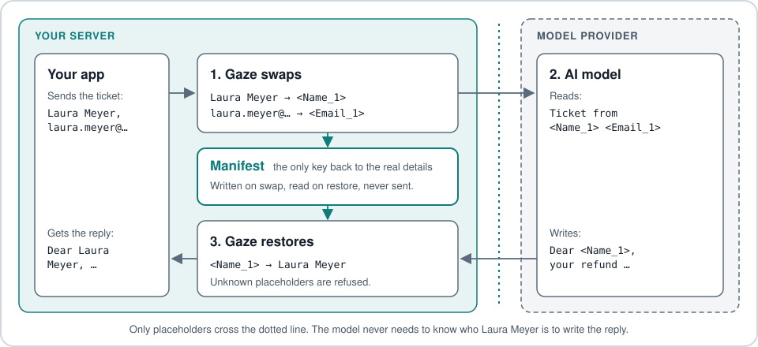
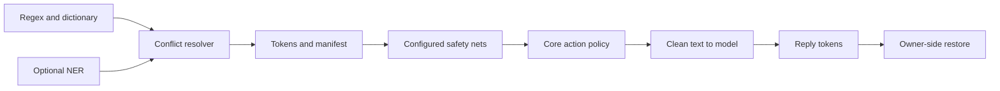

# How Gaze works

Gaze replaces detected PII with session tokens and keeps the restore mapping
with the owner. Detection has gaps; the goal is zero leaks. Start with the
[README](../../README.md) for installation and current benchmark results.

## The promise in one picture



The manifest stays on your server. Send only clean text to the model, then
restore its reply before returning it to the user.

## A synthetic support ticket, start to finish

With the explicit core + NER policy [below](#reproduce-the-support-ticket-example),
a synthetic refund ticket becomes:

```text
Ticket #<Custom:postal_code_N> from <Name_N> <<Email_N>>, phone <Custom:phone_N>:
I sent back the headphones from order 2026-4471 two weeks ago and still have no refund.
Please pay it to my account <Custom:family:payment-card-or-iban_N>.
Address: <Location_N> 8, <Custom:postal_code_N> <Location_N>.
```

Session prefixes are omitted and `_N` means the numeric ordinal. The model
can write `Dear <Name_N>, your refund was sent to
<Custom:family:payment-card-or-iban_N>.` Restore substitutes the original bytes.

This run has two limits: house number `8` remains raw because no bundled
recognizer detects it, and order ID `2026-4471` needs a tenant-specific rule.
Ticket number `48213` is over-detected as a postal code, but restores exactly.
Tool-call JSON uses the same token/restore boundary.

## Why this exists

Reversible tokens let an agent work on a task without needing detected personal
values. One-way deletion cannot reconstruct a reply. Gaze's owner-held signed
snapshot supports restore; emissions carry versioned recognizer metadata.
The public detection layer and rulepacks use Apache-2.0 OR MIT.

## Seven steps

| Step | Action |
|---|---|
| Normalize | Normalize Unicode/spacing while mapping back to original bytes |
| Recognize | Rules, dictionaries, and optional NER propose candidates |
| Resolve | Choose overlap winners; audit losers |
| Swap | Emit session tokens and manifest entries; sweep repeated rule-found values |
| Safety net | Configured nets scan clean output and report suspects |
| Output check | Core policy tokenizes, marks, refuses, or reports suspects |
| Restore | Restore only issued tokens through the signed snapshot; refuse unknown tokens |

[Repeat-value sweep](detection/manifest-sweep.md) and
[safety-net modes](safety-net/safety-net-modes.md) define the exceptions and limits.

## Pipeline shape



The backend observes; only the core mutates output. Rules form the deterministic
floor. A policy without `[safety_net]` runs no net; `gaze setup` enables Nym
and pinned Davlan mBERT NER. OPF remains opt-in.

## What happens when the safety net disagrees

| Mode | Action | Restore |
|---|---|---|
| `resolve` (default) | Tokenize suspects, scan again, then apply fallback | Resolved tokens restore |
| `redact` | Write `[REDACTED:<class>]`, with no fallback | Marker is one-way |
| `strict` | Refuse uncovered/partial-bleed suspects, exit `3`, empty stdout | Nothing sent |
| `tolerant` | Warn and keep flagged bytes | Development only; raw bytes may leave |

`--safety-net-fallback` applies only to `resolve`; choices are `redact`
(default), `strict`, and `tolerant`. Both tolerant flags require
`GAZE_ALLOW_TOLERANT=1`. Verified-token findings are dropped; sub-word and
terminal-admission exceptions are documented in
[safety nets](safety-net/safety-nets.md#sub-word-suspects-are-never-acted-on).
No mode can protect PII that no detector finds.

### Nym in action

Under the setup policy, Nym catches this synthetic licence plate:

```sh
printf '%s' 'Das Fahrzeug mit dem Kennzeichen M-AB 1234 wurde abgeschleppt.' \
  | gaze clean --policy gaze.toml | jq -r .clean_text
```

```text
Das Fahrzeug mit dem Kennzeichen <session:Custom:license_plate_N> wurde abgeschleppt.
```

## How it fits your stack

| Integration | Use when | Boundary |
|---|---|---|
| Library (`gaze-pii`) | App controls the model call | App owns manifest and restore |
| [MCP](mcp/mcp-runtime.md) | Agent host calls source tools | `PiiEnvelope::dispatch` protects tool calls; chat uploads are outside this boundary |
| [Proxy](proxy/proxy-runtime.md) | SDK/agent supports a base-URL swap | API-key traffic to OpenAI, Anthropic, Gemini; consumer subscription clients are outside the contract |

See [Architecture](../../ARCHITECTURE.md) for crate boundaries.

## What ships

| Feature | Contract and reference |
|---|---|
| Reversible tokens | Session-scoped `<session:Class_N>`, signed `SensitiveSnapshot`, no string-map fallback; [upgrade/restore compatibility](../../UPGRADE.md) |
| Audit | Optional SQLite metadata, recognizer id/version; no raw payload export. Older rows use `legacy_unversioned` |
| Detection failure | Backend `Result` errors abort outbound protection; long NER inputs use overlapping windows, [fail-closed NER](detection/ner-failclosed.md) |
| Policy validation | Unknown validator/normalizer fails load; ambiguity is tokenized rather than silently passed |
| Agent traffic | Tool-call JSON, provider SSE, evolving session mappings; [strict Anthropic contract](proxy/anthropic-messages-contract.md) |
| Proxy lifecycle | `serve`, `start`, `stop`, `status`, `logs`, `restart`; opt-in `install-launchd` / `install-systemd-user`, [proxy README](../../crates/gaze-proxy/README.md) |
| Dashboard | Default-off `gaze-cli/dashboard`; memory-only child, loopback pairing, explicit raw/restored capture acknowledgement. Expands the local trusted computing base; activation failure leaves proxy serving. [Trust boundary](dashboard/trust-boundary.md) |
| Documents | PNG/JPG/PDF through Tesseract to partitioned `clean.md`, `report.json`, and owner-only `manifest.json`; [bundle contract](document/document-extension.md), [ingest guide](../how-to/document/ingest-documents.md) |
| Daemon | JSONL stdio, one hot pipeline, per-session isolation, LRU/idle eviction, graceful SIGTERM; [guide](../how-to/daemon/run-daemon.md) |

Document report v2 includes OCR confidence, column segmentation, table-cell
preservation, and selectable-PDF fallback. `OcrBackend` supports other drivers.

## Detection coverage

Use the canonical [class reference](../reference/redaction-classes.md) and
[locale matrix](policy/locale-chain.md#coverage-matrix) for formats and validators.
The closed `safety_tier` selects activation:

| Tier | Activation |
|---|---|
| `safe_default` | Bundle loaded |
| `locale_gated` | Matching recognizer locale |
| `opt_in` | Named in `[[policy.custom_recognizers]]` |

Unknown validator names return typed `RulepackError`. Locale precedence is
CLI > policy > rulepack default > `global`; format-basis identifiers run
regardless of document locale. Tenant PII such as order IDs, songs, and artist
names needs a dictionary or custom regex in [policy](../reference/policy.md).

## Limits

Linux x86_64 binaries require glibc 2.39+ (Ubuntu 24.04, Debian 13, RHEL 10+).
Older Linux, Intel macOS, musl, and Windows need source builds.
Detection and safety-net evidence is in [benchmarks](../reference/benchmarks/README.md).
The proxy does not cover certificates, PAC, Electron integration, transparent
interception, browser sessions, or consumer subscription endpoints.

## Reproduce the support-ticket example

The example above is synthetic and uses a custom policy with `core` rules and Davlan NER, with no safety net. It is a reproducible illustration of that configuration; the policy from `gaze setup` now enables Nym and additional rulepacks. Install the NER model once with `gaze setup --safety-net none` (or `bash scripts/fetch/fetch-ner-model.sh`) and save this policy as `example-policy.toml`:

```toml
schema_version = "0.1.0"

[session]
scope = "conversation"

[locale]
active = ["de-DE"]

[ner]
model_dir = "~/.local/share/gaze/models/davlan-mbert-ner-hrl"
locale = "de-DE"
threshold = 0.3

[policy.rulepacks]
bundled = ["core"]

[[rule]]
kind = "class"
class = "name"
action = "tokenize"

[[rule]]
kind = "class"
class = "location"
action = "tokenize"

[[rule]]
kind = "class"
class = "custom:phone"
action = "tokenize"

[[rule]]
kind = "class"
class = "custom:postal_code"
action = "tokenize"

[[rule]]
kind = "class"
class = "custom:birth_date"
action = "tokenize"

[[rule]]
kind = "default"
action = "tokenize"
```

Assemble the exact synthetic ticket without putting a complete email, phone or IBAN
literal in this page. The phone uses the [documented BNetzA drama range](../../CONTRIBUTING.md#phone-number-fixtures). Save the model's draft as `reply.txt`, using the exact
tokens printed by `gaze clean`, including the session prefix and ordinals:

```sh
printf 'Ticket #48213 from Laura Meyer <laura.meyer%s%s>, phone %s %s %s:\nI sent back the headphones from order 2026-4471 two weeks ago and still have no refund.\nPlease pay it to my account DE89 %s %s %s %s %s.\nAddress: Lindenstraße 8, 10115 Berlin.\n' \
  '@' 'example.invalid' '+49' '171' '3920000' '3704' '0044' '0532' '0130' '00' > ticket.txt
gaze clean --policy example-policy.toml < ticket.txt > clean.json
jq -r .clean_text clean.json            # what the model receives

jq --rawfile text reply.txt '{session_blob, text: $text}' clean.json \
  | gaze restore | jq -r .text          # what your app sends
```

`clean.json` also carries the manifest (`entries`) and the `session_blob` that `gaze restore` needs; neither goes to the model. The last policy rule tokenizes every detected class, so the raw house number is not a policy choice: no recognizer detects it. The per-session prefix on each placeholder changes on every run.

## Glossary

| Term | Meaning |
|---|---|
| Token/placeholder | Session-scoped stand-in for a detected value |
| Recognizer | Rule or model that proposes a PII span |
| Manifest | Owner-only token-to-original mapping |
| NER | Model detecting names, places, organizations |
| Safety net | Backend scanning clean output for missed PII |
| Resolve | Core directly tokenizes a suspect into a restorable token |
| Redact fallback | One-way marker when reversible handling fails |
| Fail closed | Refuse rather than silently continue on failure |
| Format/document basis | Format recognizers run across locales; document recognizers use locale eligibility |
| Residual | Exposed suspect bytes left after resolution |
