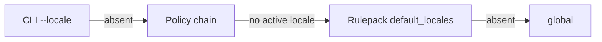

# Locale chain

The locale chain selects document-basis recognizers; format-basis recognizers
run independently of the document language.

## Resolution order

Use the first active source:

## Document and format basis

| `locale_basis` | Eligibility |
|---|---|
| `document` (external-pack default) | Matching locale; `global` or an empty locale list matches all documents |
| `format` | Runs once for every document; locales record format provenance |

`LocaleTag::Other(_)` matches only the same opaque tag. Assembly
(`gaze_assembly::build_pipeline`) and detection (`LocaleChain::intersects`)
share eligibility. `enabled` and `safety_tier` apply to both bases; candidates
join before normal conflict resolution.

## Several locales in one chain

Document-basis recognizers run class by class in chain order. Earlier locales
win exact/partial overlap per span, not per document. Strict same-class
containment admits both; the resolver chooses the containing span and audits
the loser when earlier coverage is preserved. `[de-AT, de-DE]` may therefore
use both locales on different values. Repeated global spans drop out.

Arbitration precedes validator veto: an earlier candidate still claims its span
if later vetoed. See `RecognizerRegistry::detect_candidate_pool` in
`crates/gaze/src/registry.rs`.

## Bundled format-basis identifiers

Bundled packs declare every basis. External packs retain `document` unless
opting into `locale_basis = "format"`. `--locale=global` and narrow chains no
longer suppress bundled format identifiers. To recover old output, disable the
recognizer itself, for example with an adopter pack using `enabled = false`.

## Known gap: a synthetic global chain

A synthetic `[LocaleTag::Global]` still suppresses document-basis `name.*`,
`phone.national.de`, both postal recognizers, and legacy/custom packs. Direct
and codec primary/residual passes must use shared `ProxyConfig::locale_chain`.

## Anchors and collision families (v0.7.x)

Packs define cue buckets at `[locale.cues.<key>]`; collision recognizers name
`mandatory_anchor = "<key>"`. The active chain supplies cues. No available
anchor produces a fail-closed family token with
`ConflictTier::AnchoredContext` and `AmbiguityReason::NoAnchor`.
`locale-cue-bundle-coherence` checks bundled core declarations against
embedded `locale-de` / `locale-en` cues.

## Coverage matrix

This matrix lists bundled recognizers shipped in `gaze-recognizers`. For
document-basis rows, supported locales are eligibility projections. For
format-basis rows, they record the identifier's format provenance.

| Bundle | Recognizer ID | Class | Locale basis | Supported locales / provenance | ValidatorKind |
|---|---|---|---|---|---|
| `core` | `email.global` | `Email` | document | `global` | `EmailRfc` |
| `core` | `email.header.name` | `Name` | document | `global` | None |
| `core` | `email.header.name.paren` | `Name` | document | `global` | None |
| `core` | `name.forward_marker` | `Name` | document | `de-DE`, `de-AT`, `de-CH`, `en-US`, `en-GB`, `en-IE`, `en-AU`, `en-CA` | None |
| `core` | `name.agent_recipient` | `Name` | document | `de-DE`, `de-AT`, `de-CH`, `en-US`, `en-GB`, `en-IE`, `en-AU`, `en-CA` | None |
| `core` | `name.auto_footer` | `Name` | document | `de-DE`, `de-AT`, `de-CH`, `en-US`, `en-GB`, `en-IE`, `en-AU`, `en-CA` | None |
| `core-extended` | `phone.structural` | `custom:phone` | document | `global` | `E164Phone` |
| `core-extended` | `phone.e164.spaced` | `custom:phone` | document | `global` | `E164Phone` |
| `core-extended` | `phone.national.de` | `custom:phone` | document | `de-DE`, `de-AT`, `de-CH` | `E164PhoneNational(De)` |
| `core-extended` | `phone.national.us` | `custom:phone` | format | `en-US` | `E164PhoneNational(Us)` |
| `core-extended` | `iban.structural` | `custom:iban` | document | `global` | `IbanMod97` |
| `core-extended` | `card.structural` | `custom:credit_card` | document | `global` | `Luhn` |
| `core-extended` | `ip.v4` | `custom:ip_address` | document | `global` | `Ipv4Parse` |
| `core-extended` | `ip.v6` | `custom:ip_address` | document | `global` | `Ipv6Parse` |
| `core-extended` | `eth.address` | `custom:eth_address` | document | `global` | `EthEip55` |
| `core` | `aadhaar.in` | `custom:aadhaar` | format | `en-IN`, `hi-IN` | `AadhaarVerhoeff` |
| `core` | `nir.fr` | `custom:nir` | format | `fr-FR` | `FrNirMod97` |
| `core` | `steuer_id.de` | `custom:steuer_id` | format | `de-DE`, `de-AT`, `de-CH` | `DeSteuerIdMod1110` |
| `core` | `vat.de` | `custom:vat_id` | format | `de-DE`, `de-AT`, `de-CH` | None |
| `core` | `vat.es` | `custom:vat_id` | format | `es-ES` | None |
| `core` | `bsn.nl` | `custom:bsn` | format | `nl-NL` | `BsnMod11` |
| `core` | `cpf.br` | `custom:cpf` | format | `pt-BR` | `CpfMod11` |
| `core` | `cnpj.br` | `custom:cnpj` | format | `pt-BR` | `CnpjMod11` |
| `core` | `nhs.uk` | `custom:nhs_number` | format | `en-GB` | `UkNhsMod11` |
| `core` | `ssn.us` | `custom:ssn` | format | `en-US` | None |
| `core` | `nino.uk` | `custom:nino` | format | `en-GB` | None |
| `core` | `pan.in` | `custom:pan` | format | `en-IN`, `hi-IN` | None |
| `core` | `ssn.de_cue` | `custom:ssn` | format | `de-DE`, `de-AT`, `de-CH` | None |
| `core` | `tax_number.cue_anchored` | `custom:tax_number` | document | `global` | None |
| `core` | `driver_license.cue_anchored` | `custom:driver_license` | document | `global` | None |
| `core` | `national_id.cue_anchored` | `custom:national_id` | document | `global` | None |
| `core-extended` | `postal.de` | `custom:postal_code` | document | `de-DE` | None |
| `core-extended` | `postal.us` | `custom:postal_code` | document | `en-US` | None |
| `core` | `url.anchored` | `custom:url` | document | `global` | None |
| `secrets` (setup default; explicit for library callers) | `security_token.anchored` | `custom:security_token` | document | `global` | None |
| `secrets` (setup default; explicit for library callers) | `password.field` | `custom:password` | document | `global` | None |
| NER artifact | `ner` | `Name` | document | Policy-selected NER locale, or any locale when unset | None |

The NER recognizer keeps semantic `recognizer_id = "ner"` for registry
compatibility. Audit rows additionally carry a versioned
`recognizer_version_id` in the form `ner.<model>.<vN>` when the loaded artifact
declares model metadata, or `ner.unknown.v0` when it does not.
