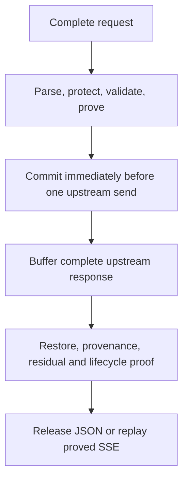

# Strict Anthropic Messages Contract

The strict `gaze-proxy` Anthropic profile admits only the Messages HTTP/SSE
surfaces below. Everything else fails closed.

## Route, base URL, and upstream

Configure an Anthropic SDK with the proxy root as its base URL:

```text
http://127.0.0.1:8787
```

Do not append `/v1`. The only provider route claimed by this profile is exactly:

```text
POST /v1/messages
```

Other methods, trailing slashes, suffixes, and query-based route variants are
rejected. The default upstream is `https://api.anthropic.com`. A configured
upstream must be an origin root without credentials, query, or fragment. HTTPS
is accepted; plain HTTP is accepted only for a loopback upstream.

## Session and principal identity

There are two deliberately separate session modes:

| Mode | How it is selected | `x-gaze-session-id` contract |
| --- | --- | --- |
| Ephemeral single request | `AnthropicAdapter::new`, including a base-URL-only integration | Must be absent. If present, the request fails with `UnexpectedSessionHeader` (`400`). |
| Explicit continuity | Adapter builder or equivalent host configuration with a session registry | Required on every request. Its value must be a canonical lowercase UUIDv4; missing or malformed identity fails with `SessionIdentityRequired` (`400`). |

Continuity reuses the committed manifest mapping for the same principal and
session. The header is never forwarded upstream. A mapping that has expired is
a tombstone and returns `SessionExpired` (`410`) rather than creating a fresh
session under the old identity. Concurrent generation changes return
`SessionGenerationConflict` (`409`), and a full bounded registry returns
`RegistryCapacity` (`503`).

The default continuity registry permits 4,096 active sessions with a 30-minute
TTL and 4,096 tombstones bounded to 1 MiB with a 30-minute TTL. Hosts may choose
smaller values or raise them only to the hard ceilings: 65,536 active sessions,
24-hour session TTL, 65,536 tombstones, 64 MiB of tombstone storage, and a
24-hour tombstone TTL.

On a loopback listener, the default resolver supplies process-local loopback
principal identity. A non-loopback bind is not ready without an explicit trusted
`PrincipalResolver`. Principal resolution happens before request-body
materialization. A resolver sees only its closed connection context and any
credential that the embedding host explicitly configured as local-auth input;
resolver failures are rendered as closed error variants without raw credential
or request data.

## Request headers and authentication

Ingress validates structural singleton headers before upstream I/O. The direct
profile then creates a new outbound header map instead of forwarding the inbound
map.

| Header | Ingress contract | Upstream result |
| --- | --- | --- |
| `content-type` | Required JSON content type; duplicate, folded, or malformed values fail closed. | Canonical `application/json`. |
| `x-api-key` | Required visible-ASCII singleton without commas. | Forwarded unchanged after validation. |
| `anthropic-version` | Required visible-ASCII singleton. The default allowlist contains exactly `2023-06-01`. | Forwarded only when allowlisted. |
| `anthropic-beta` | Optional visible-ASCII singleton. The default allowlist is empty. | Forwarded only when its complete value was explicitly allowlisted. |
| `x-gaze-session-id` | Mode-dependent as described above. | Never forwarded. |
| `Authorization` | With no local-auth configuration it is accepted then dropped. If configured as local auth, exactly one value is consumed inside the trusted principal-resolution boundary. | Never forwarded. |
| `content-length` / `transfer-encoding` | Each is a singleton; sending both is ambiguous framing and fails closed. | Never forwarded. The rebuilt client frames its own body. |
| `content-encoding` | Any supplied value is unsupported and fails closed. | Never forwarded. |
| `connection` | If present, it must be the singleton value `keep-alive` or `close`. | Never forwarded. |
| Cookies, bearer variants, `user-agent`, `x-stainless-*`, and other valid SDK headers | Accepted so ordinary SDK clients remain usable. They do not expand the forwarding contract. | Dropped. |

Headers are capped at 64 fields, a 128-byte name, an 8 KiB value, and 64 KiB
aggregate bytes. Builder configuration may lower those ceilings, never raise
them. Duplicate or comma-folded singleton values and over-limit headers fail
before any upstream request.

## Request JSON matrix

JSON is parsed with duplicate-key rejection, depth/node/string/number bounds,
and an exact schema. Unknown fields are rejected. Control fields are validated
as controls; mutable owner payload is pseudonymized through the session.

| Surface | Admitted shape and treatment |
| --- | --- |
| Root controls | Required nonempty `model`, positive-integer `max_tokens`, and `messages`. Optional controls are `service_tier` (`auto` or `standard_only`), nonnegative-integer `top_k`, unit-interval `temperature`/`top_p`, Boolean `stream`, string-array `stop_sequences`, `thinking` (`disabled`, or `enabled` with positive `budget_tokens`), `tool_choice` (`auto`, `any`, `none`, or `tool` with nonempty `name`, plus optional Boolean `disable_parallel_tool_use`), and `cache_control` (`type: ephemeral`, optional `ttl: 5m` or `1h`). |
| `metadata` | A mutable JSON domain: object keys and string leaves are pseudonymized recursively, Boolean/null leaves pass, and numeric leaves are rejected. |
| `system` | A string or a nonempty array of text blocks. Text is pseudonymized. |
| `messages` | An array of `user` or `assistant` objects. `content` is a string or nonempty block array. |
| `text` | `text` is pseudonymized. |
| `tool_use` | `id` and `name` are controls. Object keys and string values in `input` are pseudonymized recursively; mutable numeric leaves are rejected. |
| `tool_result` | `tool_use_id` is a control. String or block-array `content` follows the same protection rules; optional `is_error` is Boolean. |
| `document` | Text/content sources, title, and context are protected. Base64, file, URL, and other opaque sources return `OpaqueMediaUninspected` (`422`). |
| `search_result` and `custom_content` | Their admitted title, context, text, and content payload fields are protected; controls remain closed. |
| `thinking` and `redacted_thinking` | Signed or encrypted bytes are retained exactly. Already-issued manifest tokens may remain pseudonymized, but any owner PII that would require changing signed bytes returns `SignedMutationRequired` (`502`). Malformed signed surfaces fail closed. |
| `image` or another opaque/unknown block | Rejected with `OpaqueMediaUninspected` (`422`) or `InvalidRequestFormat` (`400`); it is never skipped or forwarded uninspected. |
| `tools` | Definitions use a closed schema. Descriptions plus admitted schema property names, descriptions, and enum strings are protected; tool names and structural schema controls are validated. |

Every JSON member name—including owner-defined metadata, tool-input, and admitted schema-property names—must be ASCII; a non-ASCII member name fails as `InvalidRequestFormat`.

## Non-stream response matrix

A successful non-stream response must be one exact Anthropic message object with
required `id`, `type`, `role`, `model`, `content`, `stop_reason`,
`stop_sequence`, and `usage`. Unknown fields, duplicate keys, wrong controls, or
unsupported blocks reject the whole response.

`id` and `model` are nonempty scanned controls; `type` is exactly `message` and
`role` exactly `assistant`. `stop_reason` is null or one of `end_turn`,
`max_tokens`, `stop_sequence`, `tool_use`, `pause_turn`, `refusal`, and
`model_context_window_exceeded`; `stop_sequence` is a scanned string or null.
`usage` requires numeric `input_tokens` and `output_tokens` and optionally admits
numeric `cache_creation_input_tokens` and `cache_read_input_tokens` only.

| Surface | Restore/proof rule |
| --- | --- |
| `text` | Text is restored through the committed manifest. Citation text and admitted document-title/title fields are restored; citation indices and source/URL controls are validated. |
| `tool_use` | `input` object keys and string values are restored recursively. A restored-key collision fails closed. `id` and `name` remain validated controls. |
| `tool_result` | String or block-array content is restored recursively; `tool_use_id` and `is_error` remain controls. |
| `search_result` and `document` | Admitted user-payload fields are restored; identifiers and source controls are validated. |
| `thinking` and `redacted_thinking` | Signed bytes remain exact and any manifest token inside them remains pseudonymized. Unknown tokens, malformed signatures, or provider-origin PII in the retained bytes reject the response. |
| Opaque, image, unknown, or malformed content | Rejected; there is no pass-through fallback. |

Every provider-origin control string and mutable payload participates in the
closed response proof. If the configured detector reports model-generated PII,
including a false positive, the codec classifies the response as
`ProviderOriginPii` and rejects the entire response; the public HTTP envelope is
`InvalidToken` (`502`). A stricter detector improves confidentiality coverage
but can therefore reduce response availability.

## SSE event matrix

Streaming uses the same root route and request schema with `stream: true`. The
upstream stream is not a byte pass-through.

| Event or delta | Contract |
| --- | --- |
| `message_start` | Opens one strict message lifecycle. Its response controls and usage are validated. |
| `content_block_start` | Opens one unused index for an admitted `text`, `tool_use`, `thinking`, or `redacted_thinking` block. |
| `content_block_delta` / `text_delta` | Text is accumulated by block index and restored only after the block is complete. |
| `content_block_delta` / `input_json_delta` | `partial_json` is accumulated by tool block, parsed strictly, restored recursively, and rebuilt only after completion. |
| `content_block_delta` / `citations_delta` | Citations are validated, restored exactly once, and retain provider order. |
| `content_block_delta` / `thinking_delta` or `signature_delta` | Signed reasoning/signature bytes remain exact and pseudonymized; signed-surface failures close the stream. |
| `content_block_stop` | Closes one active index. A stopped index cannot be reused. |
| `message_delta` then `message_stop` | Validates the terminal sequence and usage before replay. Missing, repeated, reordered, or truncated lifecycle events fail closed. |
| Provider `ping` | Suppressed. Gaze emits only its compiled synthetic ping while proof is pending. |
| Safe future event | Only closed Boolean/null payloads with safe event/key atoms can be classified as safe; even then the provider event is suppressed. Unsafe names, keys, values, or unknown PII fail closed. |
| Provider `error`, unknown block/delta pairing, index violation, or ambiguous framing | Rejects the whole proved replay. |

UTF-8 splits, manifest-token splits, adjacent text blocks, interleaved block
indices, and zero-delta tool blocks are handled as logical domains rather than
trusted transport chunks.

## Buffering and the proof-before-I/O boundary



Dropping a prepared request neither commits nor sends. Non-stream responses
release nothing before complete proof. SSE may open a `200` head after status
and header validation, but only constant pings may leave while proof is pending:

```text
event: ping
data: {"type":"ping"}

```

Ping interval defaults to 10 seconds, configurable from 1 to 30. A failed proof
after opening the head emits only this constant safe frame:

```text
event: error
data: {"type":"error","error":{"type":"api_error","message":"proxy_validation_failed"}}

```

No provider bytes, raw errors, or partially restored data leave before proof.

### Complete request logical-domain proof

After per-carrier transform and exact reparse, an independent complete-request
proof builds contiguous views without separators and suppression-probes each.
Every probe must reproduce input exactly, before commit, upstream I/O, or
inspection publication. Mutation is `ControlWouldMutate`: codec phase
`RequestProof`, proxy phase `RequestTransform`, HTTP `422`.

Prompt proof checks every present permutation of system/tools/messages in
provider-semantic and emitted JSON order. Metadata is a separate domain in both
orders. Provider-ordered members use that order; arbitrary objects use decoded-key
byte order semantically and source member order in the emitted view. Arrays keep
API order; keys precede value subtrees. Signed/encrypted carriers remain opaque,
but surrounding fields participate in occurrence coverage.

Proof does not join metadata/routing controls to prompts, reorder arrays, skip
visible intervening text, or cover every future application's concatenation.
Unclassified or multiply classified strings are rejected; new fields need
explicit contract decisions.

Suppression probes bypass prefix-cache lookup/storage. A newly joined match
cannot hide behind a cached fragment or publish speculative entries. Detector
false positives may reject benign requests; this availability cost is accepted
at the confidentiality boundary.

## Limits and timeouts

The builder may lower these defaults but cannot raise them:

| Limit | Default |
| --- | ---: |
| Request body | 2 MiB |
| Response body | 32 MiB |
| JSON depth | 128 |
| JSON nodes | 100,000 |
| One JSON string | 4 MiB |
| One JSON number lexeme | 128 bytes |
| Maximum transformed growth | 2 output bytes per input byte |
| One SSE line | 256 KiB |
| One SSE frame | 1 MiB |
| SSE events | 10,000 |
| SSE active/index space | 256 |
| One SSE logical accumulator | 8 MiB |
| Connect timeout | 5 seconds |
| Request timeout | 120 seconds |
| Total transaction timeout | 180 seconds |

All configured limits must be nonzero, sublimits must fit within the body
ceiling, and connect/request/total timeouts must remain ordered. Request body
overflow is `RequestBodyLimitExceeded` (`413`). Upstream response, JSON, or SSE
overflow is `ResponseBodyLimitExceeded` (`502`).

## Upstream transport and response heads

The direct client disables redirects, environment/system proxies, automatic
referer behavior, transparent gzip/Brotli/Zstandard/deflate decompression, and
automatic retries. A redirect is `UpstreamRedirect` (`502`) rather than a
followed request.

Before consuming a successful body, the proxy requires the expected JSON or SSE
content type and rejects unsupported content encodings, conflicting
`content-length`/`transfer-encoding`, duplicate or malformed framing, and
over-limit headers. It creates a minimal successful downstream head containing
only the canonical content type. It does not copy stale upstream representation
or credential metadata such as `content-length`, `etag`, `last-modified`,
`set-cookie`, and request IDs.

No automatic retry occurs. A validated, single, bounded numeric
`retry-after` seconds value may accompany a rate-limit error; it does not turn
the request into a retry. A streaming request that receives upstream `429` is
returned as an ordinary JSON `429`, not as an SSE stream.

## Closed errors and upstream statuses

Errors expose only a closed `code`, processing `phase`, and an optional bounded
retry delay. Display/debug rendering and the late-SSE error frame do not include
raw headers, credentials, bodies, provider errors, PII, or manifest contents.

| Condition | Public code | HTTP status |
| --- | --- | ---: |
| Wrong route | `RouteRejected` | 404 |
| Invalid/duplicate request header, missing/malformed session identity, unexpected session header, invalid request JSON, duplicate key | `HeaderRejected`, `SessionIdentityRequired`, `UnexpectedSessionHeader`, `InvalidRequestFormat`, `DuplicateObjectKey` | 400 |
| Missing/rejected principal or upstream auth denial | `PrincipalRequired`, `UpstreamUnauthorized`, `PrincipalRejected`, `UpstreamForbidden` | 401 or 403 |
| Expired/conflicting session | `SessionExpired`, `SessionGenerationConflict` | 410 or 409 |
| Registry/configuration/upstream unavailable | `RegistryCapacity`, `InvalidUpstreamUrl`, `ProxyConfiguration`, `UpstreamUnavailable` | 503 |
| Request too large or upstream `413` | `RequestBodyLimitExceeded`, `UpstreamPayloadTooLarge` | 413 |
| A protected control would mutate or request media is opaque | `ControlWouldMutate`, `OpaqueMediaUninspected` | 422 |
| Connect/request/total timeout | `ConnectTimeout`, `RequestTimeout`, `TotalTimeout` | 504 |
| Internal inspection/session/state invariant | `SessionCommitFailure`, `InspectionInternal`, `InvalidStateTransition` | 500 |
| Upstream/proof/framing/codec failure | `InvalidUpstreamHeader`, `UnsupportedContentEncoding`, `InvalidFraming`, `ResponseBodyLimitExceeded`, `HeaderLimitExceeded`, `InvalidUpstreamResponseFormat`, `InternalCoverageFailure`, `InvalidProvenance`, `InvalidToken`, `SignedMutationRequired`, `SignedSurfaceMalformed`, `InvalidSseLifecycle`, `InvalidContentBlockIndex`, `UpstreamRedirect`, `UpstreamClientFailure`, `UpstreamServerFailure`, `UpstreamUnreachable`, or `UpstreamProtocol` | 502 |

Recognized upstream statuses preserve only their closed meaning:

| Upstream status | Downstream result |
| --- | --- |
| `400`, `401`, `403`, `404`, `409`, `413`, `429` | The corresponding closed upstream code with the same status. |
| `502`, `503`, `504`, `529` | `UpstreamUnavailable` (`503`). |
| Any `3xx` | `UpstreamRedirect` (`502`). |
| Other `4xx` | `UpstreamClientFailure` (`502`). |
| Other `5xx` | `UpstreamServerFailure` (`502`). |

## Inspection is optional and off the enforcement path

Without inspection registration, no capture producer/consumer is constructed.
Default `MetadataOnly` capture allocates no payload projection and marks omitted
payloads `NotCapturedByPolicy`.

Metadata uses closed route/profile, endpoint/port categories, status/error/drop/
delivery codes, coarse durations, queue counters, and ordering IDs. It includes
no exact timestamps or fine durations. Event timing, callback cadence, and queue
outcomes can still reveal traffic patterns; there is no traffic-analysis guarantee.

Payload capture needs an authorized domain. Sensitive wrappers cannot be
formatted/serialized normally; trusted sinks must use the scoped reveal callback.
Copied bytes cannot be revoked by purge/disable, so sinks enter the owner's
trusted computing base.

Overflow, projection failure, rejecting/panicking sinks, purge, and disable
affect observation only, never enforcement. Lifecycle fences drop stale queued
payloads; disable is one-way.

| Reporting limit | Meaning |
|---|---|
| Queue aggregate counters | Zero/default placeholders, not runtime totals |
| Configured-port provenance | Closed category, no numeric port or source detail |
| `ProjectionFailedClosed` | Coarse applicable-but-unavailable/unowned projection, no finer diagnosis |

These limits reduce inspection detail. Separately, stricter detectors may
reject whole provider responses on false positives.

## Migration and compatibility

Earlier session-header auto-continuity and unchanged-auth forwarding claims
are obsolete for this profile.

1. Set the SDK base URL to the proxy root; use exact `POST /v1/messages`.
2. Remove `x-gaze-session-id` for `AnthropicAdapter::new`, or enable continuity
   and send a canonical lowercase UUIDv4 every time.
3. Supply `x-api-key` and allowlisted `anthropic-version`; explicitly allowlist
   beta values before sending them.
4. Do not depend on auth/cookie/tracing/vendor headers reaching Anthropic.
   Configured local `Authorization` is singleton principal input only.
5. Expect unknown JSON, opaque media, provider-origin PII, and unproved SSE to deny.

`AnthropicAdapter::new` stays source-compatible with strict semantics;
continuity uses the builder. Existing root re-exports remain. OpenAI/Gemini
retain legacy contracts. Third-party `ProviderAdapter` implementations must
supply `contract()`; it has no default. Source compatibility never relaxes the
wire rules.

## Retained official-SDK manual gate

The repository retains one ignored integration test that runs an unmodified
official Python Anthropic SDK against a loopback proxy and mock loopback
upstream. It exercises both non-stream and stream calls, exact route/header
behavior, pseudonymization before upstream capture, and owner-visible restore.
It never contacts the real Anthropic service.

Prepare a Python interpreter with the official `anthropic` package, then run
exactly:

```sh
GAZE_OFFICIAL_SDK_PYTHON=/path/to/python rustup run 1.96.0 cargo test -p gaze-proxy --test anthropic_direct unmodified_official_python_sdk_runs_non_stream_and_stream_against_loopback -- --ignored --exact
```

The gate remains ignored because the official SDK is an external manual
prerequisite. When `GAZE_OFFICIAL_SDK_PYTHON` is absent, skipping this command is
the expected result; replacing it with a different client is not equivalent.

## Source and proof map

The public contract is enforced principally by:

- `crates/gaze-proxy/src/adapters/anthropic.rs` — strict route, session mode,
  header/version/beta policy, principal configuration, and configurable bounds.
- `crates/gaze-proxy/src/codecs/anthropic.rs` — exact request, non-stream, signed,
  citation, and SSE surfaces.
- `crates/gaze-proxy/src/server.rs` — proof-before-I/O, hardened transport,
  response-head validation, and safe replay.
- `crates/gaze-proxy/src/error.rs` — closed public error/status mapping.
- `crates/gaze-proxy/src/inspection.rs`, `crates/gaze-inspection`, and
  `crates/gaze-types/src/inspection.rs` — off-path observation, capture domains,
  declassification, lifecycle fencing, and closed metadata.
- `crates/gaze-proxy/tests/anthropic_direct.rs`, `anthropic_codec.rs`,
  `anthropic_sse.rs`, `anthropic_surfaces.rs`, `inspection_contract.rs`, and
  `adapter_contract.rs` — executable contract and compatibility proofs.
