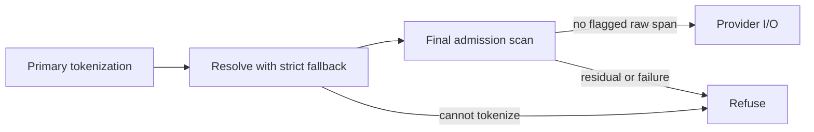

# Proxy runtime

`gaze-proxy` is a pass-through-per-provider HTTP runtime. Its north-star role is
to keep PII out of provider calls while preserving each SDK's native request and
response shape.

## Adapter contract

Adapters implement `ProviderAdapter`:

- `contract()` declares the adapter's protocol, session, routing and coverage
  behavior. It is required: an adapter that declares no contract does not
  compile. `AdapterContract::legacy()` opts into the string-surface path below,
  where the proxy re-scans the whole outbound request body after redaction and
  refuses the request if anything is left unprotected.
- `matches_path(method, path)` claims provider-native endpoints.
- `request_pii_surfaces(body)` returns mutable text leaves to redact before
  forwarding upstream.
- `response_pii_surfaces(body)` returns mutable text leaves to restore on the
  owner-visible response.
- `sse_event_pii_surfaces(event)` handles provider-native event payloads.
- `requests_json_output(request)` reports whether the request asked the model
  for JSON output. It defaults to `false`.

Adapters do not decide what is PII. They only describe where strings live; the
configured `gaze::Pipeline` and recognizer registry make detection decisions.

Each surface declares restore syntax. Protection scans its text as supplied.

| `SurfaceSyntax` | Restore |
|---|---|
| `Text` | Original bytes |
| `Json` | Escape values inside serialized JSON string literals, including tool/function/MCP arguments; works across SSE fragment boundaries |
| `ModelOutput` | `Json` when JSON output was requested, otherwise `Text` |

A value received inside a JSON string is stored in escaped spelling and written
as-is into JSON. Legacy sessions record these tokens; restoring the same value
into `Text` retains its escapes (`\"`, `\u00fc`) rather than decoding them.

OpenAI detects `json_object` / `json_schema` in `response_format.type`
(Chat Completions) or `text.format.type` (Responses). Gemini detects
`generationConfig.responseMimeType = application/json`; thought summaries stay
`Text`.

## Provider surface matrix

| Provider | Request surfaces | Response surfaces | Streaming surfaces |
| --- | --- | --- | --- |
| OpenAI | `messages[].content`, `system`, `tool_calls[].function.arguments`, `input` | `choices[].message.content`, `choices[].message.tool_calls[].function.arguments`, `output` | `choices[].delta.content`, `choices[].delta.tool_calls[].function.arguments` |
| Anthropic | Strict, schema-aware Messages codec; see the [public contract](anthropic-messages-contract.md) | Strict, schema-aware Messages codec; see the [public contract](anthropic-messages-contract.md) | Strict lifecycle with proved replay; see the [public contract](anthropic-messages-contract.md) |
| Gemini | `contents[].parts[].text`, `functionCall.args`, `functionResponse.response`, `systemInstruction.parts[].text` | `candidates[].content.parts[].text`, `functionCall.args` | same parts shape per chunk |

The legacy OpenAI and Gemini adapters walk tool and function objects as native
JSON without provider-shape transcoding. The strict Anthropic direct profile is
different: it admits only its documented Messages schema, rejects unknown or
opaque media surfaces, and proves the complete transformed request or response.

## Safety nets and refusals

Configured nets, including setup-policy Nym, enforce this request path before
provider I/O:



This shares the library path used by `gaze clean --safety-net-fallback strict`.
The proxy never deletes flagged bytes one way or performs clean's extra
redact-fallback batch. A Nym `DATE_OF_BIRTH` may become
`<…:Custom:date_1>`. A `user <handle> born <ISO date>` case that clean's default
handles with username/birth-date tokens can still be refused as
`residual_suspect` for `custom:date` / `custom:username`.

Undetected PII still passes, for example an uncued `DD.MM.YYYY` date below
Nym's threshold. With no configured net, resolution/admission do nothing and
only primary protection runs.

A refusal carries its reason, never the text:

- `error`: the `ProtectionError` variant: `Residual` (a net flagged raw bytes
  that could not be protected), `SafetyNet` (a net failed to run), `Primary`,
  `Provenance`, `UnsupportedCoverage` or `EmptyPrimary`.
- `fallback_reason`: set when step 2 refused: `residual_suspect` (a later scan
  flagged something new), `overlap_conflict`, `validator_veto` or
  `anchor_missing`. It is `null` when admission refused.
- `suspect_classes`: class names, deduplicated, in a stable order. Admission
  names the suspect it rejected. A step 2 refusal names every class the nets
  flagged in that string.

The legacy OpenAI and Gemini adapters answer `422 Unprocessable Entity`:

```json
{
  "error": "Refused",
  "refusal": {
    "error": "Residual",
    "fallback_reason": "residual_suspect",
    "suspect_classes": ["name", "location"]
  }
}
```

The Anthropic direct profile answers `422` with its usual error envelope and
the same `refusal` object:

```json
{
  "type": "error",
  "error": {
    "type": "api_error",
    "message": "proxy_validation_failed",
    "code": "ProtectionRefused",
    "phase": "RequestTransform",
    "refusal": {
      "error": "Residual",
      "fallback_reason": "residual_suspect",
      "suspect_classes": ["name", "location"]
    }
  }
}
```

Each refusal also writes one line to the proxy's stderr, which `gaze proxy
start` sends to its log file:

```text
gaze-proxy: request refused: {"error":"Residual","fallback_reason":"residual_suspect","suspect_classes":["name","location"]}
```

Without a configured net, steps 2 and 3 do nothing and the proxy forwards the
primary output as before.

## Anthropic direct sessions

`AnthropicAdapter::new` is intentionally ephemeral and single-request. It creates
an internal session for that request and rejects any `x-gaze-session-id` header;
it does not infer continuity from a supplied header.

Continuity is opt-in through the adapter builder or equivalent host
configuration. Once enabled, every request must carry `x-gaze-session-id` with
a canonical lowercase UUIDv4 value. Active mappings are bounded and held in
memory; expiry is reported as `SessionExpired` (`410`) and is not silently
recreated. See the [strict Anthropic Messages contract](anthropic-messages-contract.md)
for registry bounds, principal resolution, and the migration from legacy
header behavior.

## Daemon lifecycle

`gaze proxy start` persists config, reexecs `gaze proxy serve --_foreground-daemon`,
and writes a pidfile:

```text
<pid>
bind=<addr>
started_at=<rfc3339>
```

The pidfile is UTF-8 and capped at 200 bytes. It lives in the platform local-data
directory:

- macOS: `~/Library/Application Support/gaze/proxy.pid`
- Linux: `$XDG_DATA_HOME/gaze/proxy.pid` or `~/.local/share/gaze/proxy.pid`
- Windows: `%LOCALAPPDATA%\gaze\proxy.pid`

Status and start always validate the recorded PID with process liveness checks.
If the PID is dead, the command treats the pidfile as stale and removes it
before continuing. Stop is signal-only: `SIGTERM`, bounded wait, optional
`SIGKILL` with `--force`.

The proxy exposes `/_gaze_proxy/healthz` for local health inspection. The path is
reserved outside all adapter-matched provider routes.
