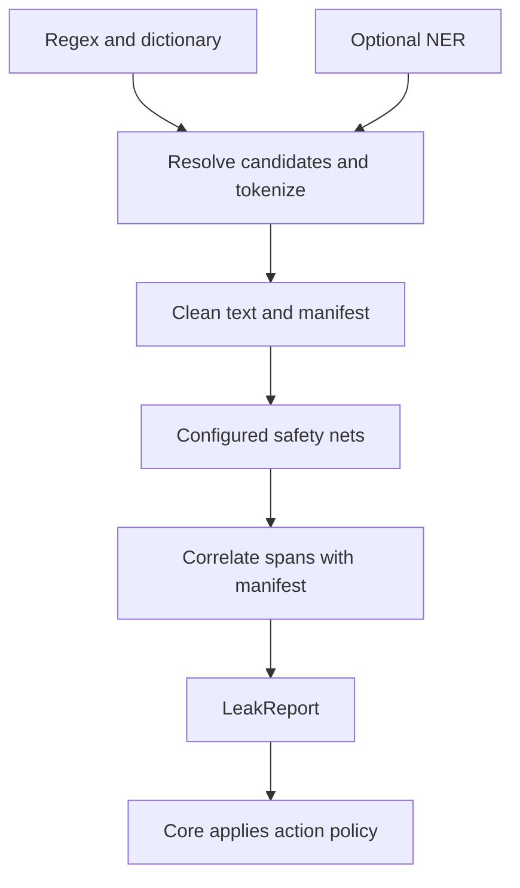

# Safety nets

Safety nets scan clean output for PII the primary pipeline missed. Backends
return metadata-only suspects; the core applies the caller's action policy.
They cannot edit text or the manifest, veto candidates, or restore tokens.
Validator checks run earlier in [validator veto](../detection/validator-veto.md).

A policy without `[safety_net]` runs no net. `gaze setup` enables Nym-small;
`gaze setup --safety-net none` opts out. OPF is opt-in with
`--safety-net openai-filter`. See [CLI flags](../../../crates/gaze-cli/README.md#safety-net).

Before inference, verified placeholders receive a stable eight-character digest
in place of their random session hex. Byte lengths and real output stay unchanged.
Unowned token-shaped text stays literal. Findings inside verified placeholders
are dropped; crossing findings retain exposed bytes. Nym also scans a
[neutral view](nym-neutral-view.md).

## How a safety net fits the pipeline



Manifest correlation distinguishes `Uncovered`, `PartialBleed`, and
`ClassMismatch`; findings inside owned placeholders are dropped first.

## Observer-only contract

`SafetyNet` has no replacement-text return value or mutable manifest access.
The core's `SafetyNetPolicy` decides whether to observe (`Strict`, `Tolerant`),
replace spans (`Redact`), or tokenize and scan again (`Resolve`). Policy-less
entry points use `SafetyNetPolicy::default()`: `Resolve` + `Redact`.

`Pipeline::clean_with_safety_net_detect_context` cleans, records token spans,
checks the successful output with registered nets, and returns
`(CleanDocument, LeakReport)`. Only the core tokenizer/redactor changes output.
For report-only use, pass explicit `Strict` to
`Pipeline::clean_with_safety_net_policy_detect_context`, or call
`Pipeline::scan_safety_nets`. See [modes](safety-net-modes.md#the-fallback-applies-only-under-resolve).

## North-star fit

Backend results contain no source bytes. Suspects carry backend/version,
decoding parameters, and optional replay identity for audit. The core's
redaction marker is one-way; resolved tokens remain restorable. Structured
reports carry field paths. Backend failures use typed `SafetyNetError`s and
fail closed; audit rows contain metadata only.

## Trait shape

`gaze-types` defines the public contract.

```rust
pub trait SafetyNet: Send + Sync {
    fn id(&self) -> &str;
    fn supported_locales(&self) -> &[LocaleTag];
    fn check(
        &self,
        clean_text: &str,
        context: SafetyNetContext<'_>,
    ) -> Result<Vec<LeakSuspect>, SafetyNetError>;
}
```

`SafetyNetContext` is `#[derive(Copy)]`, byte-free, and exposes:

- `manifest: &Manifest` — emitted token spans for the clean text segment,
  used by `Manifest::diff_against` to classify each suspect as
  `Uncovered`, `PartialBleed`, or `ClassMismatch`.
- `locale_chain: &[LocaleTag]` — session-level locale fallback chain.
  `RawDocument::Structured` shares one chain across all fields by design;
  per-field locale annotations are out of scope for v0.6.
- `document_kind: DocumentKind` — `Text` or `Structured`.
- `session_id: Option<&str>` — opaque audit session id.
- `field_path: Option<&str>` — JSONPath-style field selector for structured
  fields, e.g. `$.user.email`.

`SafetyNet::check` returns `Vec<LeakSuspect>`. A suspect carries a clean-text
byte span, a mapped Gaze `PiiClass`, the backend id, an optional confidence
score, the `LeakKind` produced by manifest correlation, the validated
`raw_label`, and an optional `field_path`. Raw payload bytes never appear on
this struct.

## What the pipeline does with a suspect

Under an enforcing mode the pipeline acts on the report. These rules decide how; the
mode catalog is in [safety-net modes](safety-net-modes.md).

### The redaction marker

Redaction writes `[REDACTED:<class>]`, such as `[REDACTED:name]` or
`[REDACTED:custom:phone]`. It marks a one-way replacement; restore leaves it
unchanged. It has no session prefix or ordinal and never parses as a token.
`gaze::is_redaction_marker` is the shared predicate; strict restore and the
hallucination guard treat it as prose, and indexing skips it.

The emitter lowercases the class, keeps `:` separators, and maps other
non-alphanumeric bytes to `-`, including `_`. This prevents a class such as
`address_2` from producing token-shaped text. It also handles directly built
or deserialized custom/family classes. The audit row keeps the exact class.

Markers have non-owned `Action::Redact` manifest entries for the original
bytes and all contributing suspect IDs. A merged region uses its lowest-offset
suspect's class; audit still writes one row per suspect.

A finding is protected only when wholly inside a recorded marker. Typing a
marker grants no protection. A straddling finding uses normal rules and can
deny when it overlaps a manifest entry. Invalid ranges, reversed spans, or
split characters cannot be excused by marker overlap.

`scripts/bench/marker_ab.py` compared `full-stack-nym-redact` against deletion
on 2,910 documents: the same 1,296 spans in 1,014 documents, identical leaked
and false-positive bytes, no new refusals, and identical clean text after
removing markers. Output grows by the marker length; selected spans do not
change. The resolve arm cannot test this because its fallback did not fire.

### Terminal admission after a `Redact` fallback

The fallback tokenizes a whole post-resolve residual set when possible;
otherwise it writes markers. Terminal scanning sees the changed text. Its
report gets at most one reversible round and one bounded replacement, then
one final scan. These bounds are straight-line code, not retries.

| Case | Condition | Outcome |
|---|---|---|
| `FallbackIncomplete` | Finding covers bytes fallback audit says it removed | Deny before further replacement |
| `SeamManufactured` | Finding strictly contains a deletion seam, rather than abutting it | One bounded replacement; a second denies. Unreachable with markers, retained pending measured removal |
| `Unjudgeable` | Invalid range, contradictory coverage, or an unminted token shape | Deny |
| `Admit` | Remaining finding no stage may act on | Complete with the finding in `LeakReport` |

After the bounds are spent, only `Admit` completes. Admission is wider than
its predecessor, so previously completing documents do not newly deny.
The reversible round writes `decided_by: Resolve`, `action: Tokenize`, and the
triggering `FallbackReason`. Its trace is `("safety_net", "resolve", "tokenize")`.

`map_clean_boundary_to_raw` uses manifest alignment and equal-length
untokenized runs. Markers are ordinary one-way manifest entries, so no deletion
ledger is needed. Legacy ledger reconciliation remains unreachable. Each
resolution gap must map to the same number of raw and clean bytes. Fallback
documents with terminal findings pay an extra model pass.

### Sub-word suspects are never acted on

For name, location, and organization classes, a span starting or ending between
letters or digits is a sub-word finding (`Pass` in `Passwort`). `Resolve`,
`Redact`, and their enforcing stages leave it raw, write a `Preserve` audit
row, and retain the finding and `LeakReportTelemetry::UnactionableSubword`
(CLI JSON kind `UnactionableSubword`) with net, class, and offsets. Observe
modes are unchanged.

| Rule | Effect |
|---|---|
| Judge against the scanned text | Later edits cannot change the original boundary decision |
| Token `<` / `>` is a word boundary | A following gap may be a whole word |
| Touching a token shape is never sub-word | Foreign-token refusal still applies |
| No minimum length | A standalone initial such as `J.` is a whole word |
| Identifier classes are exempt | Values may sit inside `ID12345` |
| Incomplete fallback or a second seam still denies | Sub-word handling cannot excuse failed replacement |

This costs recall for nets that flag a real name inside a longer word, such as
`Meier` in `Meiers`: `Resolve` + `Redact` and `Redact` leave it raw with honest
metadata. `Strict` fallback refuses it as a residual. Earlier releases acted
on the flagged fragment. Whole-word decoders still benefit from this guard.

## Locale gating

Each `SafetyNet` declares `supported_locales`. When the session-level locale
chain does not intersect the backend's supported locales, the orchestrator
emits a `LeakReportTelemetry::LocaleSkipped` event instead of running the
backend. Skip telemetry is bytes-free and is recorded against the same
`safety_net_log` table as suspects.

`LocaleTag::Other(_)` matches strictly against the wire form, not the BCP-47
prefix; this matches the locale-chain semantics described in
[`docs/explanation/policy/locale-chain.md`](../policy/locale-chain.md).

## Locale-aware registry dispatch

`Pipeline::with_safety_net(single_backend)` remains the compatibility path. For deployments with language-specific safety nets, `Pipeline::with_safety_net_registry(LocaleAwareModelRegistry)` activates locale-aware Pass-3 dispatch instead. The registry resolves one backend per clean segment using the existing four-tier order: exact locale, parent language, `Global`, then fail-closed.

The v1 dispatch contract is first-match wins. If a tier resolves multiple backends, Gaze invokes only the first registered backend and records that resolved backend id on the safety-net audit row. Multi-backend aggregation is intentionally left as follow-up work so the audit trail stays simple and deterministic.

CLI registry activation is explicit:

```sh
gaze clean \
  --policy quickstart-policy.toml \
  --locale de-DE \
  --safety-net-registry \
  --safety-net-add openai-filter \
  --opf-command /opt/opf/bin/opf \
  --opf-checkpoint ~/.local/share/gaze/models/opf \
  --opf-locales de-DE,de-AT
```

`--safety-net-registry` cannot be combined with `--safety-net-backend`; the registry is the backend selector in that mode. The only registry-capable backend is `openai-filter`; `nym` is deliberately not registry-capable (see [Audit](#audit)).

## Closed error variant set

[`SafetyNetError`](../../../crates/gaze-types/src/lib.rs) is an exhaustive,
serde-stable enum:

| Variant | Meaning |
|---------|---------|
| `Unavailable { reason }` | Safety net was requested but is not configured. |
| `WeightsMissing { path }` | Required checkpoint or model file is missing. Path is sanitized to `<missing:filename>`. |
| `ModelUnavailable { reason }` | Backend could not be loaded, perms verification failed, or runtime is missing. |
| `InputTooLarge { limit, actual }` | Clean text exceeded the configured input cap. |
| `Runtime { message }` | Backend execution failed, including subprocess timeouts. |
| `InvalidOutput { message }` | Backend returned malformed output (non-UTF-8 stdout, non-finite score, unknown label). |

The CLI maps each variant to a stable `SafetyNetFailure` exit-3 sub-variant
so adopters can branch on `Unavailable` versus `Timeout` versus
`InvalidOutput` without parsing free-form text.

## Structured-document per-field behavior

For every scalar string in `RawDocument::Structured`, the pipeline cleans,
builds a field manifest, checks the configured nets with a JSONPath
`field_path`, and merges reports. One session locale chain applies to all
fields; skip telemetry is per field. Query a field with
`gaze audit safety-net query --field-path '$.user.email'`.

### The structured path is observer-only, and says so

Only `Strict` and `Tolerant` are supported. `Redact` or `Resolve` returns
`Error::UnsupportedSafetyNetModeForStructured` before any field is tokenized.
Use `Pipeline::clean_with_safety_net_policy_detect_context` with an explicit
observer policy, and enforce strict reports at your boundary. For already-clean
input, use `Pipeline::scan_safety_nets_structured`.
Policy-less `clean_with_safety_net*` defaults to `Resolve`, so it is text-only.
Per-field enforcement is not implemented.

### One walker

`walk_structured` in `crates/gaze/src/pipeline.rs` handles pseudonymize,
clean-and-scan, and scan-only through `LeafOp`. The operation controls
empty-string skipping, scalar scanning, rebuilding, and root path prefix.
Parity and fail-closed tests live in `crates/gaze/tests/safety_net.rs`.

## Backends

Two backends ship: the [OpenAI Privacy Filter adapter](opf-adapter.md), an opt-in
`opf` subprocess with its own page, and the Nym-small adapter below, which
`gaze setup` enables.

## Nym-small adapter

`--safety-net nym` runs [`Wismut/nym-pii-multilingual-small`](https://huggingface.co/Wismut/nym-pii-multilingual-small)
v3 (int8 ONNX, ModernBERT, 22 languages including German and English) in
process through ONNX Runtime. The `gaze setup` policy enables it by default. With no policy, nothing loads
unless `nym` is selected explicitly. Source:
[`crates/gaze-recognizers/src/safety_net/nym/`](../../../crates/gaze-recognizers/src/safety_net/nym/mod.rs),
behind the `safety-net-nym` feature (on in the default `gaze-cli` build through
`setup`).

The net flags; the pipeline decides. Suspects go through the same resolve,
fallback and audit path as every other net.

### Pinned bundle

`gaze setup` downloads `int8/config.json`,
`int8/model_int8.onnx` and `int8/tokenizer.json` at revision
`4348999cd3c2e20c49615e9af7c6bbb45b64cd85` into
`${XDG_DATA_HOME:-$HOME/.local/share}/gaze/models/nym-small-int8`, writes the
canonical `SHA256SUMS`, and verifies it. At load the backend checks the SHA-256
of `SHA256SUMS` against `NYM_SMALL_INT8_BUNDLE_SHA256`, every listed file
against its digest, owner and modes (directory `0700`, no group/world write, no
symlinks), and that `config.json` lists exactly the 81 BIO labels the decoder
assumes. Any failure is a typed `SafetyNetError` before the model loads; there
is no download at inference time. `gaze mcp doctor` reports the bundle: absent
passes (the net is opt-in), present-but-invalid fails.

### Which labels can fire

The model labels 40 entity types. Six carry a Gaze class; the other 34 can
never be enabled, and none is folded into a generic class such as `Name`.

| Nym label | Gaze class | op-B default |
|---|---|---|
| `BUILDING_NUMBER` | `custom:building_number` | on, `>= 0.5` |
| `LICENSE_PLATE` | `custom:license_plate` | on, `>= 0.5` |
| `USERNAME` | `custom:username` | on, `>= 0.5` |
| `DATE_OF_BIRTH` | `custom:date` | on, `>= 0.9` |
| `TAX_ID` | `custom:tax_id` | off |
| `ZIP_CODE` | `custom:postal_code` | off |

The allowlist and thresholds are policy data (`[safety_net.nym]`, see
[policy reference](../../reference/policy.md#safety_net-and-safety_netnym)). Without the table
the backend uses op-B, the operating point measured in the probe below. An
unknown label, a label without a Gaze class, a label without a threshold, a
threshold for a label that is not enabled, or a threshold outside `(0, 1]` fails
at policy load. TAX_ID stays off because its precision was 0.23 to 0.26 at every
threshold; ZIP_CODE stays off because it flagged the invalid-identifier decoys
in the negative corpus (op-A precision 0.572 on the gate set).

### Decoding

Per piece, the entity mass of a label is `P(B-label) + P(I-label)`. The piece's
label is the argmax over all 40 labels, so a piece that looks most like
`GIVEN_NAME` is never relabelled into an enabled label. It counts only when that
label is enabled and its mass reaches the label's threshold. Spans are assembled
from whole words with the same word rule as the pipeline's sub-word guard
(`gaze_types::is_inside_word`, one definition): any counted piece labels its
word, the strongest piece picks the label, the score is the minimum over the
pieces carrying it, and a word whose first counted piece is `I-` extends an open
span of the same label.

The tokenizer reports character offsets; the decoder trims metaspace whitespace
and converts them to UTF-8 byte offsets, with fixtures on umlauts, NFD combining
marks, emoji, NBSP, NARROW NBSP, CRLF line breaks and a span that ends the
text.

A decoded span is then trimmed of structural punctuation at both edges: JSON
double quotes, colons, commas, square brackets, braces and whitespace. A piece
can carry the quote or brace next to a value (`"Anna`), so without the trim a
suspect over tool-call JSON reaches into the syntax around the value. Trimming
only narrows a span and never widens it; the new edges border a structural
character, so they never cut a word, and a span that is syntax alone is
dropped. Inner punctuation stays: `M-AB 1234` keeps its hyphen and space.

### Every byte is scanned

Input is tokenized without truncation and scored in windows of 512 pieces that
overlap by 64; a piece seen twice keeps the row from the window where it sits
furthest from an edge. A piece no window scored, or a non-whitespace character
no piece covers, is `SafetyNetError::InvalidOutput`, never a silent gap. Input
above `--safety-net-input-limit-bytes` is `InputTooLarge`.

### Audit

Every suspect carries `safety_net_id = "nym-small-int8"`, the score, and
`raw_label = "LABEL>=THRESHOLD"` (for example `LICENSE_PLATE>=0.5`), so the row
records which rule fired without a schema change. For that reason Nym is not
available through `--safety-net-registry`: registry dispatch reports a model
span's class, not its label and threshold, and the CLI refuses the combination.

### Runtime

ONNX Runtime on CPU with deterministic compute, one inter-op thread and one
intra-op thread by default (`--nym-intra-threads`, `GAZE_NYM_INTRA_THREADS`).
The model weights are embedding-int8 with fp16 body weights and fp32 compute,
so there is no int8-kernel speedup.

### Measured

The 2,910-document probe ran op-B through the full pipeline and
measured: 6,017 leaked gold bytes bought under scored-label contract v2,
+517 false-positive bytes, action precision 0.890, 1 false flag across
1,024 PII-free documents, 1 one-way deletion. See
[the in-process reproduction](#reproduction-in-process) for the numbers of this
backend on the canonical benchmark runner (`clean_for_bench --config
full-stack-nym-resolve`).

### Reproduction in process

`clean_for_bench --config full-stack-nym-resolve`, one intra-op thread,
compared with `pass2-ner` on the same commit and 2,910 documents:

| Row | Leaked bytes v2 | Bytes removed v2 | FP bytes added | Action precision | One-way deletions | Exact restore |
|---|---:|---:|---:|---:|---:|---:|
| rules + NER, no net | 20,727 | | | | | 2,910 / 2,910 |
| `full-stack-nym-resolve` | 14,573 | 6,154 | +526 | 0.891 | 1 | 2,909 / 2,910 |

The probe mapped building numbers to `location` and plates to `account_number`.
Separate classes let 42 more spans tokenize, removing 137 more bytes.
Shared-host timings are not latency evidence.

A spaces-only token mask was tested and rejected: it lost context and reduced
removed leaked bytes from 6,154 to 5,039 (18%). Current token views are
described [above](nym-neutral-view.md). Findings inside verified tokens are
dropped under every resolve fallback, including strict.

### Known gaps and open review items

- Room, platform and seat numbers. `BUILDING_NUMBER` fires on "Raum 204"
  and "Gleis 9, Wagen 23, Platz 45": the 1,024-document negative corpus
  contains none of these shapes, so its false-flag rate says nothing about them.
  The fixture `room-number-known-gap` pins the current behaviour; an
  address-context guard is a follow-up.
- Latency measured (2026-09-24). On a quiet MacBook Pro M5 Max with 64 GB RAM, macOS 26.5, release build, 30 documents: rules + NER p50 40.0 ms / p95 65.3 ms; with Nym p50 89.8 ms / p95 171.9 ms, peak memory 1,027 MB. This closes the default-decision latency item; it is a small local sample, not a fleet guarantee.

### Licence review (open)

The model card declares MIT (inherited from `jhu-clsp/mmBERT-small`); the
repository has no LICENSE file. v3 training data includes 77.5k Wikipedia
passages auto-labelled by gemma-4-26b. Whether CC-BY-SA obligations reach
weights trained on that text, and whether the teacher model's terms add
conditions, still needs legal review.

On 2026-09-24 the user accepted this open question and decided to enable Nym
in generated setup policies with an explicit setup notice. That notice names
the model and MIT model-card licence, links this item, names the upstream
source and pinned revision, and gives `gaze setup --safety-net none` as the
opt-out. Gaze does not vendor the weights; setup fetches the pinned revision
from the upstream repository.

## Safety nets in `gaze index`

`gaze index ingest` detects prose names and organizations with the pinned Davlan
NER bundle (`--ner-model-dir` or `GAZE_NER_MODEL_DIR`), not with a safety net.
A net there is optional and checks ingest output under `--on-residual`.
`gaze index search` always needs an output net: TokenBridge scans every snippet
before it is shown and denies a search when no net ran, so the CLI refuses
up front with a typed `SafetyNetConfig` error. Both remaining nets satisfy it:
`--safety-net openai-filter` (with `--opf-command` and `--opf-checkpoint`) or
`--safety-net nym` (with `--nym-model-dir`).

## Activation surface

`[safety_net].backend = "nym"` activates Nym for policy-driven assembly in
Rust and for CLI verbs that load the policy. `[safety_net.nym]` configures its
bundle location, allowlist and thresholds. An absent table or `backend =
"none"` runs no net. OpenAI Privacy Filter can only be selected on the
command line in this release. A missing feature or invalid bundle fails
closed before input is processed.

The minimum CLI form is:

```sh
gaze clean \
  --policy=policy.toml \
  --safety-net=openai-filter \
  --openai-filter-command=/opt/opf/bin/opf \
  --openai-filter-checkpoint=/opt/opf/checkpoint \
  --safety-net-mode=strict
```

Programmatic adopters call `Pipeline::with_safety_net(OpenAiFilterSafetyNet::new(config))`
behind the `safety-net` feature on `gaze` and `safety-net-openai` on
`gaze-recognizers`. Both features are off by default; the safety-net code
path is excluded from the default `cargo build` graph.

For policy-driven Rust assembly, enable `gaze-assembly/safety-net-nym` and
call `build_pipeline`. The CLI calls the same Nym attachment code. Its
repeatable `--safety-net` values replace policy selection; `none` disables
all nets for one run, with a notice if policy Nym was active. Multiple selected
nets run and the pipeline unions their suspects. Bundle paths resolve from
CLI flag, then environment, then policy; library assembly reads only the
policy path unless given an explicit override.

## Benchmark

The committed safety-net matrix populates direct-detector and observer-residual
cells for the OpenAI Privacy Filter against the 150-fixture coverage-loop
corpus. Full numbers, pins, and caveats are in
[`docs/reference/benchmarks/README.md`](../../reference/benchmarks/README.md#safety-net-matrix);
the original v0.9 report is archived at the `v0.13.0` tag as
[v0.9 safety-net benchmark](https://github.com/CertaMesh/gaze/blob/v0.13.0/docs/reference/benchmarks/v0.9-safety-net-benchmark.md).
The Nym-small measurements are in [Measured](#measured).

## Replay hash

`LeakReport.replay_hash: Option<String>` hashes backend id/version, decoding
parameters, and operating point. Replay requires externally fixing the command,
checkpoint, operating point, minimum score, and decode parameters. The adapter
records the hash; it does not pin upstream downloads. Changed checkpoints may
change both hash and suspects.

## `safety_net_log` audit table

When `gaze clean --audit-db <path>` is combined with `--safety-net <kind>`,
each suspect plus each `LocaleSkipped` telemetry event is appended to the
`safety_net_log` table in the same SQLite database that holds the
deterministic redaction log.

```sql
CREATE TABLE IF NOT EXISTS safety_net_log (
    id INTEGER PRIMARY KEY,
    safety_net_id TEXT NOT NULL,
    raw_label TEXT NOT NULL,
    mapped_class TEXT NOT NULL,
    leak_kind TEXT NOT NULL,
    span_len INTEGER NOT NULL,
    document_kind TEXT NOT NULL,
    field_path TEXT NULL,
    score REAL NULL,
    created_at INTEGER NOT NULL,
    session_id TEXT NULL,
    pipeline_class TEXT NULL,
    safety_net_replay_hash TEXT NULL,
    backend_id TEXT NULL,
    backend_version TEXT NULL,
    decoding_params_hash TEXT NULL,
    telemetry_kind TEXT NULL
);
```

The schema stores metadata only:

- `raw_label` is the validated upstream label, such as `private_email` —
  not the upstream raw text.
- `mapped_class` is the Gaze `PiiClass` produced by the class map.
- `span_len` is the byte length of the suspect span; the offsets are not
  persisted.
- `field_path` is the structured field selector when applicable.
- `pipeline_class` is the manifest class for `ClassMismatch` rows.
- `telemetry_kind` is set for `LocaleSkipped` rows so downstream queries
  can filter telemetry from suspects.

The `safety_net_log_does_not_persist_suspect_or_placeholder_bytes` and
`restricted_columns_have_no_raw_payload_fields` tests are run on every PR
by the `safety-net-sanity` gate; both lock that no upstream raw text or
placeholder bytes are stored.

The schema lives in `gaze-audit`; the protected-path Dylint gate keeps
`gaze` core free of `gaze-audit` imports outside the explicit
audit-responsible allowlist
(see [`docs/explanation/contributing/xtask-gates.md`](../contributing/xtask-gates.md#cargo-metadata-audit-isolation)).

### Querying suspects

`gaze audit safety-net query --audit-db <path>` filters the
`safety_net_log` table by leak kind, raw label, mapped class, structured
field path, and creation time. The query is opened
`SQLITE_OPEN_READ_ONLY` so the CLI cannot mutate the log even if compromised.

## CI gate

Run `cargo run -p xtask -- safety-net-sanity` before shared-branch pushes.
It covers manifest/structured invariants (`gaze`), CLI modes (`gaze-cli`), OPF
boundary/labels/stderr (`gaze-recognizers`), and bytes-free audit (`gaze-audit`).
Source: [gate](../../../crates/xtask/src/safety_net_sanity.rs).

## Future work (deferred to a post-v0.6.0 release)

Deferred OPF work includes live-model drift checks, an in-process backend,
pinned fetch command, persistent subprocess, and false-positive review UI.
Current OPF spawns once per clean. Import concrete audit sinks from
`gaze-audit`.

## See also

- [`docs/reference/policy.md`](../../reference/policy.md) — policy configuration.
- [`crates/gaze-cli/README.md`](../../../crates/gaze-cli/README.md) — full flag
  reference, exit-code map, and synthetic examples.
- [`docs/reference/crates.md`](../../reference/crates.md) — workspace map, including the
  safety-net feature gates on `gaze`, `gaze-recognizers`, and `gaze-cli`.
- [`docs/explanation/contributing/xtask-gates.md`](../contributing/xtask-gates.md) — `safety-net-sanity` and
  `class-map-override-safety` gates.
- [`AGENTS.md`](../../../AGENTS.md#project-north-star) —
  the five-axis north star that the safety-net contract is checked against.
- [OpenAI Privacy Filter adapter](opf-adapter.md) — the subprocess backend.
- [Safety-net modes](safety-net-modes.md) — what the pipeline does with a suspect under each mode.
