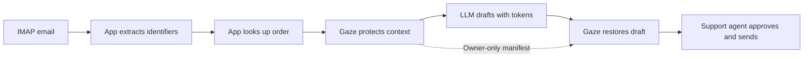

# AI support drafts that never see the customer

[`gaze-ghostwriter`](https://github.com/CertaMesh/gaze-ghostwriter) is a Laravel
package that reads a support inbox over IMAP and drafts replies with an LLM.
The app looks up the customer's records; Gaze protects the context and restores
the draft; a support agent approves sending.

## The loop, step by step

For example, the model drafts `Hi <Name_N>, your refund of <Amount_N> for order
<OrderId_N> was processed on <Date_N>.` The `_N` is a session-specific ordinal.
Order IDs and refund amounts need tenant-specific custom recognizers in the
host policy. Bundled `core` rules cover email, names, IBAN, phone, postal, and
credit-card shapes.

## Try the loop

Use the [Laravel package](https://github.com/CertaMesh/gaze-ghostwriter),
[CLI quickstart](../../README.md#quickstart), or
[`gaze-cli` reference](../../crates/gaze-cli/README.md).
Agent tool calls can use the same manifest to restore arguments before execution.
