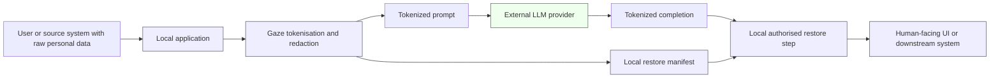
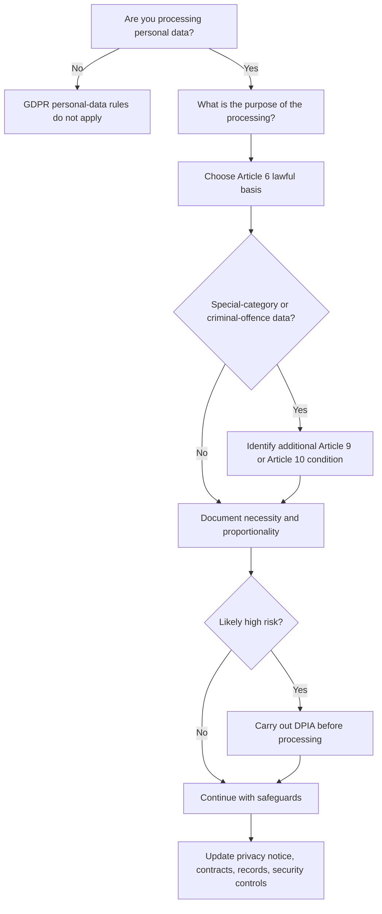
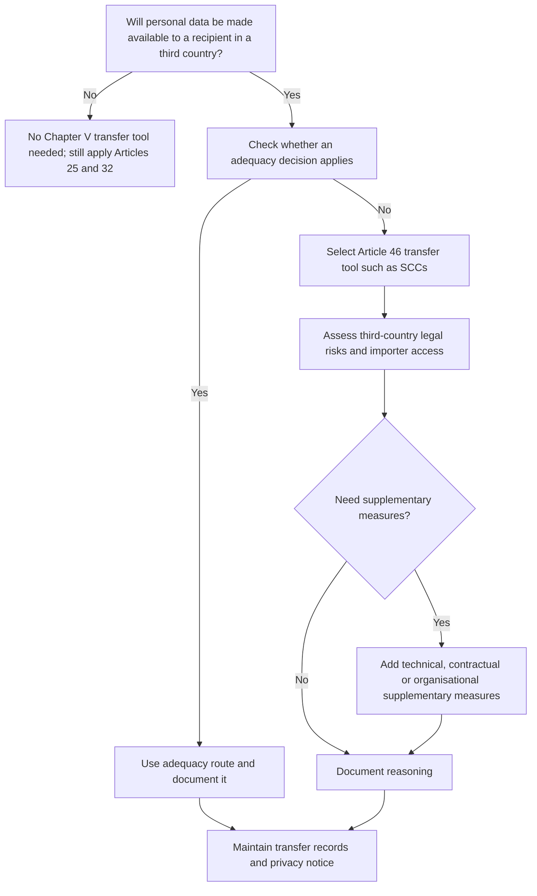

# GDPR / DPIA Guidance for Adopters

This document is written for developers and Data Protection Officers (DPOs) who are evaluating Gaze for a workflow that processes personal data under the EU General Data Protection Regulation (GDPR).

It is **not legal advice**. Whether a specific deployment of Gaze satisfies your organisation's GDPR obligations depends on your processing purpose, legal basis, and risk profile — questions that only your DPO or counsel can answer for you. This guidance describes how Gaze behaves so that you can plug those facts into your own assessment.

If Gaze is used on personal data, adopters should ensure their [privacy notice](https://ec.europa.eu/newsroom/article29/item-detail.cfm?item_id=622227) explains **the purpose of tokenisation, the legal basis, recipients and processors, international transfers, retention logic, and how [data-subject rights](https://www.edpb.europa.eu/our-work-tools/our-documents/guidelines/guidelines-012022-data-subject-rights-right-access_en) can be exercised**.

---

## 1. Controller / Processor relationship

GDPR distinguishes between the *controller* (who decides why and how personal data is processed) and the *processor* (who processes data on behalf of the controller).

When you deploy Gaze inside your own application:

- **You (the adopter) remain the controller** for the personal data that flows through your system. You decide which messages to redact, which third-party LLM to call, and how long to retain the restore manifest.
- **Gaze, as a library or local binary, runs entirely inside your trust boundary.** The Gaze maintainers do not see, store, or have any access to the personal data your application processes. There is no Gaze-operated cloud service in the open-source distribution; the runtime executes in your process, your container, or your VM.
- The third-party LLM provider (OpenAI, Anthropic, Google, etc.) that receives Gaze-tokenized prompts **may act as your processor, but that role must be assessed [functionally under the GDPR](https://www.edpb.europa.eu/our-work-tools/our-documents/guidelines/guidelines-072020-concepts-controller-and-processor-gdpr_en) and confirmed in both contract and actual practice**; depending on who determines the purposes and essential means of processing, the provider may instead be an independent controller or a joint controller. **Where the provider acts as a processor, put in place an [Article 28-compliant data processing agreement](https://ico.org.uk/for-organisations/uk-gdpr-guidance-and-resources/accountability-and-governance/contracts-and-liabilities-between-controllers-and-processors-multi/) and review its [sub-processors](https://www.edpb.europa.eu/system/files/2024-10/edpb_opinion_202422_relianceonprocessors-sub-processors_en.pdf) and transfer mechanisms.** In all cases you only send it pseudonymised tokens, not raw personal data, which is the entire point of using Gaze. CNIL's guidance on [determining the legal qualification of AI system providers](https://www.cnil.fr/en/determining-legal-qualification-ai-system-providers) is directly relevant when allocating these roles.

Because Gaze does not phone home, transmit telemetry, or aggregate adopter data, there is no Gaze-side controller or processor role for the open-source product. If you later subscribe to a hosted commercial offering operated by the maintainers, that offering will have its own Data Processing Agreement (DPA) covering the controller-processor relationship explicitly.

## 2. Pseudonymisation vs anonymisation

GDPR Art. 4(5) defines pseudonymisation as:

> "The processing of personal data in such a manner that the personal data can no longer be attributed to a specific data subject without the use of additional information, provided that such additional information is kept separately and is subject to technical and organisational measures..."

Gaze is **pseudonymisation, not anonymisation**.

- Tokens emitted by Gaze (`<Email_1>`, `<Name_1>`, `<OrderId_1>`) cannot, on their own, be attributed to a specific individual.
- The restore manifest is the "additional information" that maps tokens back to the original values. Gaze keeps the manifest separately from the redacted text by design — the manifest lives on your server; only tokens cross the boundary to the LLM.
- **For the adopter that can reverse Gaze tokens through the restore manifest, tokenized output will ordinarily remain personal data because it is [pseudonymised, not anonymised](https://eur-lex.europa.eu/eli/reg/2016/679/oj/eng).** For another recipient that [cannot reasonably re-identify](https://curia.europa.eu/jcms/upload/docs/application/pdf/2025-09/cp250107en.pdf) the person, the qualification may depend on the specific legal, technical and organisational circumstances. **Do not describe Gaze-tokenized text as [anonymous by default](https://ico.org.uk/for-organisations/uk-gdpr-guidance-and-resources/personal-information-what-is-it/what-is-personal-data/what-is-personal-data/).**

**Anonymisation** would mean the original values cannot be recovered by *anyone* by any means — including by you. Gaze deliberately does not do that. Anonymisation would prevent the legitimate downstream use cases Gaze is designed for (rehydrating an LLM-generated draft so the support agent or end user actually sees the customer's name).

Practical consequence: pseudonymised data remains in scope for GDPR. Your lawful basis, transparency obligations, data-subject rights, and retention duties still apply to the manifest. They apply with **reduced risk** (and qualify for the favourable treatment Art. 32 grants to pseudonymisation as a technical measure), but they do not disappear.

## 3. Retention defaults

Gaze does not impose a fixed retention period on the restore manifest. The right value depends on your workflow — a synchronous support-reply flow may need the manifest for seconds; a multi-day agent investigation may need it for days.

What Gaze provides:

- **Ephemeral sessions** (`Scope::Ephemeral` in the library API) — the namespace exists only while the `Session` is held in memory and is dropped when the `Session` is dropped. No persistence, no on-disk artifact. See [`docs/explanation/core/session-contract.md`](../../explanation/core/session-contract.md).
- **Daemon-mode session eviction** — when Gaze runs as a long-lived daemon (`gaze daemon`), sessions are evicted by least-recently-used policy when the configured cap is exceeded, and idle sessions older than `--session-idle-timeout` are evicted automatically. Eviction drops the restore map for that session. See [`docs/explanation/daemon/daemon-mode.md`](../../explanation/daemon/daemon-mode.md).
- **No implicit persistence** — Gaze does not write the manifest to disk unless you explicitly opt into a persistent backend in your adopter integration. The audit log (`gaze-audit`) records metadata about what was tokenised, never the raw value or token-to-value pair.

**Recommended adopter defaults:**

- Keep the manifest in process memory for the lifetime of the current request or agent turn, not longer.
- If you must persist a manifest across requests (e.g. for a multi-step agent workflow), set the shortest TTL that the workflow can tolerate, and have your DPO sign off on the chosen retention.
- Treat the restore manifest as **[high-risk personal data infrastructure](https://www.bfdi.bund.de/EN/Fachthemen/Inhalte/Technik/SDM.html)**: protect it with strict [role-based access control](https://www.edpb.europa.eu/our-work-tools/our-documents/guidelines/guidelines-42019-article-25-data-protection-design-and_en), [encryption](https://eur-lex.europa.eu/eli/reg/2016/679/oj/eng), deletion schedules, and [auditable restore workflows](https://www.edpb.europa.eu/our-work-tools/our-documents/guidelines/guidelines-42019-article-25-data-protection-design-and_en), because compromise of the manifest can defeat the pseudonymisation layer.

## 4. Restore-authorisation boundary

Re-materialising original values from tokens is a privileged operation. Gaze enforces this with what we call the *restore boundary* — see [`docs/explanation/core/restore-boundary.md`](../../explanation/core/restore-boundary.md) for the full contract. In short:

- A token can be restored to its original value **only if** the currently-active manifest authorises that specific token-to-value mapping.
- Unknown tokens, tokens from another session, tokens from another tenant, and malformed tokens all fail closed (returns a typed restore failure, no guessing, no fallback).
- Restore decisions are auditable: each restore call can be logged with metadata (`recognizer_id`, `recognizer_version_id`, session, timestamp) into the SQLite audit log without ever logging the raw value.

For adopters this means:

- **Decide explicitly who and what can call `restore()` in your application.** Treat it the same way you treat your database read credentials — narrow scope, audited path.
- **Do not expose `restore()` to the LLM.** The LLM should never receive a restored value, only tokens. Restore happens after the LLM has produced its output and before that output reaches the human who is authorised to see the original data (e.g. the support agent reviewing a draft reply).
- **Log restore calls.** The audit log is metadata-only by design — turn it on so you have a defensible trail of when, by whom, and for which session a restore happened.

## 5. Dual-use and misuse risks

Privacy tooling can be misused. We want to be honest about where Gaze could go wrong if deployed without care:

- **Hiding identity from the human reviewer, not from the model.** If an adopter pseudonymises data so well that even the eventual human reviewer cannot tell who they are accountable to, that may produce GDPR-compliant LLM traffic but irresponsible decision-making downstream. Gaze restores values for the authorised human; for human support UIs, restore only the minimum value necessary for the task, only for authorised users, and only at the point where restoration is actually needed; **[data protection by default](https://www.edpb.europa.eu/our-work-tools/our-documents/guidelines/guidelines-42019-article-25-data-protection-design-and_en) does not support blanket restoration as the default display mode.**
- **Using pseudonymisation as a substitute for lawful basis.** Pseudonymisation is a *technical measure*, not a lawful basis under Art. 6. If you have no lawful basis to process personal data, pseudonymising it does not create one.
- **Re-using session-bound tokens across sessions to "track" individuals.** Gaze's tokens are session-scoped and counter-based (`<Email_1>`, `<Email_2>`) precisely so they cannot be used as a covert stable identifier across sessions. Do not concatenate or persist tokens across sessions to reconstruct a pseudo-stable ID — that would defeat the design. Re-using session-bound tokens across sessions for longitudinal analytics **should be treated as further processing that requires a fresh purpose analysis, an appropriate [legal basis](https://ico.org.uk/for-organisations/uk-gdpr-guidance-and-resources/lawful-basis/a-guide-to-lawful-basis/), [updated transparency](https://ec.europa.eu/newsroom/article29/item-detail.cfm?item_id=622227), and—where risk is high—[DPIA review](https://www.cnil.fr/en/guidelines-dpia).** In some deployments this may amount to a new processing purpose.
- **Disabling the SafetyNet in production.** The optional second-pass detector (Pass-3 SafetyNet) catches bytes the rule layer missed. Adopters who turn it off for latency are reducing detection coverage; the resulting deployment is less safe than the default.
- **Using Gaze to redact AI output that has already been generated *without* tokenising the input.** Output-only redaction (after the LLM has seen the raw data) does not protect against the boundary leak — the model provider already received the data. Gaze is designed to be applied **before** the model boundary.

If you discover a deployment pattern that creates a privacy risk we did not anticipate, please file a GitHub issue or contact the maintainers via `SECURITY.md`.

## 6. Limits of pseudonymisation

Pseudonymisation reduces re-identification risk; it does not eliminate it. Adopters should be aware of these limits:

- **Quasi-identifier combinations.** Gaze tokenises explicit identifiers (names, emails, phone numbers, national IDs). It does *not* automatically tokenise combinations of non-identifying facts that, taken together, could uniquely identify someone (e.g. "32-year-old female lawyer in Galway with a peanut allergy and a 2018 Volvo"). If your free-text payload is rich in this kind of context, you may need an additional anonymisation pass, a different consent model, or a smaller payload — pseudonymising the email alone is not enough.
- **Re-identification by linkage.** If the same individual's data passes through the LLM in multiple separate sessions, an adversary with access to those sessions could in principle link them by the surrounding context (writing style, recurring topics, indirect identifiers). Session-scoped tokens prevent token-based linkage; they cannot prevent linkage by other means.
- **NER coverage gaps.** Free-text name detection depends on the NER backend you configure. No NER is perfect — unusual names, transliterations, and culture-specific naming conventions can be missed. The roadmap-funded coverage evaluation harness exists to measure exactly this gap; for now, adopters processing high-stakes free text should not rely on NER alone.
- **Recognizer false negatives.** A recognizer that does not match emits no token. The optional SafetyNet exists to catch this case, but no detection layer is exhaustive. Treat the detection coverage table in the project README as a floor, not a guarantee, and configure your policy for your specific data classes.
- **Pseudonymisation does not automatically anonymise audit logs; [logs and metadata may themselves remain personal data](https://curia.europa.eu/jcms/upload/docs/application/pdf/2016-10/cp160112en.pdf) or sensitive security records and should have their own [retention, access-control, and minimisation rules](https://ico.org.uk/for-organisations/uk-gdpr-guidance-and-resources/accountability-and-governance/documentation/).** The `gaze-audit` SQLite log records *that* a token was emitted (class, recognizer, version, timestamp) but **never** the raw value or the token-to-value mapping. The audit log is metadata-only by design — but metadata-only does not mean out of GDPR scope. Treat the manifest as the highest-risk artefact, **and** treat the audit log and its metadata as a sensitive record in their own right, with dedicated retention, access-control, and minimisation rules — not as something outside GDPR.
- **No protection against compromise of your own host.** Gaze runs in your process. If your host is compromised, the attacker has access to the manifest and can restore everything. Gaze is a boundary-protection tool against third-party LLM exposure, not an in-host security tool.

---

## 7. Visual aids

These diagrams translate the GDPR legal model into operational steps. The legal logic behind them comes from Articles 25, 28, 32, 35 and Chapter V, plus EDPB guidance on controller/processor roles and transfers.

### Data flow and restore boundary

### Lawful basis decision tree

### International transfer decision flow

---

## 8. Suggested DPIA checklist

If you are completing a Data Protection Impact Assessment for a Gaze deployment, the following items will probably come up. DPIA triggers and methodology are explained in the [CNIL DPIA guidelines](https://www.cnil.fr/en/guidelines-dpia) and the [ICO DPIA guidance](https://ico.org.uk/for-organisations/uk-gdpr-guidance-and-resources/accountability-and-governance/data-protection-impact-assessments-dpias/):

- [ ] **Processing purpose** — what is the LLM call actually for? Is the purpose proportionate to the personal data involved?
- [ ] **Lawful basis** — Art. 6 ground for the underlying processing? Special-category data (Art. 9) involved?
- [ ] **Data minimisation** — is the payload to the LLM the smallest set of attributes needed to answer the question?
- [ ] **Pseudonymisation scope** — which classes does your policy enable? Which are left detected-but-not-tokenised, and why?
- [ ] **Manifest retention** — how long does the manifest live? Where is it stored? Who can access it?
- [ ] **Restore authorisation** — which application paths are allowed to call restore? Are restore calls logged?
- [ ] **Audit log access** — who can read the audit log? Is access itself logged?
- [ ] **Third-party LLM provider** — what does their DPA cover? **If the processing involves a transfer of personal data to a third country, verify first whether an [adequacy decision](https://commission.europa.eu/law/law-topic/data-protection/international-dimension-data-protection/adequacy-decisions_en) applies; if not, use an [Article 46 transfer tool such as SCCs](https://commission.europa.eu/law/law-topic/data-protection/international-dimension-data-protection/new-standard-contractual-clauses-questions-and-answers-overview_en) and assess whether [supplementary measures](https://www.edpb.europa.eu/our-work-tools/our-documents/recommendations/recommendations-012020-measures-supplement-transfer_en) are needed.** For U.S. providers, adequacy under the **[EU-U.S. Data Privacy Framework](https://eur-lex.europa.eu/eli/dec_impl/2023/1795/oj/eng)** is available only for organisations on the official DPF list.
- [ ] **Data-subject rights** — how do you handle access / erasure requests? Deleting the manifest entry can **materially reduce identifiability from the adopter's perspective**, but it should not be described as automatic anonymisation or complete [Article 17](https://eur-lex.europa.eu/eli/reg/2016/679/oj/eng) compliance. **Assess [residual identifiability](https://curia.europa.eu/jcms/upload/docs/application/pdf/2025-09/cp250107en.pdf) in logs, [backups, exports, and third-party systems](https://www.edpb.europa.eu/our-work-tools/our-documents/guidelines/guidelines-012022-data-subject-rights-right-access_en), and execute erasure across all systems under your control where Article 17 applies.**
- [ ] **Records of processing (RoPA)** — maintain or update a **[record of processing activities](https://www.dataprotection.ie/en/dpc-guidance/records-of-processing-article-30-guidance)** covering tokenisation, restore-manifest storage, recipients, transfers, retention periods, and security measures.
- [ ] **Breach response** — if the manifest is exfiltrated, what is your notification plan? Have an incident procedure that covers **manifest compromise, unauthorised restore events, misdirected prompts, provider-side exposure, and [72-hour supervisory notification analysis](https://www.edpb.europa.eu/our-work-tools/our-documents/guidelines/guidelines-92022-personal-data-breach-notification-under_en)** (see also the DPC's [practical guide to breach notifications](https://www.dataprotection.ie/en/dpc-guidance/breach-notification-practical-guide)).

This list is not exhaustive and is not a substitute for engaging your DPO.

---

## 9. Authoritative sources

These primary and official sources support the guidance above and are the highest-value references for legal, security, and procurement teams. They are reproduced from the validated legal review and are not a substitute for your own DPO or counsel.

| Topic | Source | Why it belongs |
|---|---|---|
| Core law | [General Data Protection Regulation (EU) 2016/679](https://eur-lex.europa.eu/eli/reg/2016/679/oj/eng) (EUR-Lex) | Primary source for all legal propositions. |
| Controller vs processor | [Guidelines 07/2020 on the concepts of controller and processor in the GDPR](https://www.edpb.europa.eu/our-work-tools/our-documents/guidelines/guidelines-072020-concepts-controller-and-processor-gdpr_en) (EDPB) | Authoritative and directly relevant to LLM-provider role analysis. |
| Design/default | [Guidelines 4/2019 on Article 25 Data Protection by Design and by Default](https://www.edpb.europa.eu/our-work-tools/our-documents/guidelines/guidelines-42019-article-25-data-protection-design-and_en) (EDPB) | Best support for restore-boundary and minimisation language. |
| Consent | [Guidelines 05/2020 on consent under Regulation 2016/679](https://www.edpb.europa.eu/our-work-tools/our-documents/guidelines/guidelines-052020-consent-under-regulation-2016679_en) (EDPB) | Needed if the guide mentions consent at all. |
| Transparency | [Guidelines on Transparency under Regulation 2016/679 (WP260 rev.01)](https://ec.europa.eu/newsroom/article29/item-detail.cfm?item_id=622227) (European Commission archive of endorsed WP29 guidance) | Best official transparency explainer for Articles 12–14. |
| Access rights | [Guidelines 01/2022 on data subject rights – Right of access](https://www.edpb.europa.eu/our-work-tools/our-documents/guidelines/guidelines-012022-data-subject-rights-right-access_en) (EDPB) | Useful for restore-manifest and output access handling. |
| DPIA | [Guidelines on DPIA](https://www.cnil.fr/en/guidelines-dpia) (CNIL) | Official and practical. |
| RoPA | [Records of Processing Activities (RoPA) under Article 30 GDPR](https://www.dataprotection.ie/en/dpc-guidance/records-of-processing-article-30-guidance) (Irish DPC) | Direct Article 30 implementation aid. |
| Security | [The standard data protection model](https://www.bfdi.bund.de/EN/Fachthemen/Inhalte/Technik/SDM.html) (BfDI) | Strong German official source translating legal duties into TOMs. |
| Processor contracts | [Contracts and liabilities between controllers and processors](https://ico.org.uk/for-organisations/uk-gdpr-guidance-and-resources/accountability-and-governance/contracts-and-liabilities-between-controllers-and-processors-multi/) (ICO) | UK source, but very practical. |
| Article 30 documentation | [What do we need to document under Article 30 of the UK GDPR?](https://ico.org.uk/for-organisations/uk-gdpr-guidance-and-resources/accountability-and-governance/documentation/what-do-we-need-to-document-under-article-30-of-the-gdpr/) (ICO) | Handy checklist-style support. |
| Personal-data qualification | [Sheet n°1: Identify personal data](https://www.cnil.fr/en/sheet-ndeg1-identify-personal-data) (CNIL) | Good official source for anonymisation vs pseudonymisation. |
| AI provider qualification | [Determining the legal qualification of AI system providers](https://www.cnil.fr/en/determining-legal-qualification-ai-system-providers) (CNIL) | Highly relevant to external LLM-provider role analysis. |
| Transfers | [Guidelines 05/2021 on the interplay between Article 3 and Chapter V](https://www.edpb.europa.eu/our-work-tools/our-documents/guidelines/guidelines-052021-interplay-between-application-article-3_en) (EDPB) | Important for remote LLM access and third-country analysis. |
| Transfers | [Recommendations 01/2020 on measures that supplement transfer tools](https://www.edpb.europa.eu/our-work-tools/our-documents/recommendations/recommendations-012020-measures-supplement-transfer_en) (EDPB) | Essential after Schrems II when no adequacy applies. |
| SCCs | [New Standard Contractual Clauses – Questions and Answers overview](https://commission.europa.eu/law/law-topic/data-protection/international-dimension-data-protection/new-standard-contractual-clauses-questions-and-answers-overview_en) (European Commission) | Official SCC implementation support. |
| Adequacy | [Adequacy decisions](https://commission.europa.eu/law/law-topic/data-protection/international-dimension-data-protection/adequacy-decisions_en) (European Commission) | Current official adequacy inventory, including DPF review material. |
| EU-U.S. transfers | [Commission Implementing Decision (EU) 2023/1795](https://eur-lex.europa.eu/eli/dec_impl/2023/1795/oj/eng) (EUR-Lex) | Current EU-U.S. adequacy decision. |
| Schrems I | [Schrems (C-362/14) press release](https://curia.europa.eu/jcms/jcms/P_180250/) (CURIA) | Official case-law reference. |
| Schrems II | [Data Protection Commissioner v Facebook Ireland and Maximillian Schrems (C-311/18) press release](https://curia.europa.eu/jcms/upload/docs/application/pdf/2020-07/cp200091en.pdf) (CURIA) | Official Schrems II reference. |
| Current DPF litigation | [Latombe v Commission (T-553/23)](https://infocuria.curia.europa.eu/tabs/redirect/juris/liste.jsf?num=T-553%2F23) (InfoCuria) | Better citation than vague references to "Schrems III". |
| Pseudonymisation case law | [EDPS v SRB press release](https://curia.europa.eu/jcms/upload/docs/application/pdf/2025-09/cp250107en.pdf) (CURIA) | Important nuance for recipient-side identifiability. |
| German official-language transfer note | [Anwendungshinweise zum Angemessenheitsbeschluss EU-US DPF](https://www.datenschutzkonferenz-online.de/media/ah/230904_DSK_Ah_EU_US.pdf) (DSK, German) | Useful German-language official note for procurement and legal teams. |

---

## 10. Reporting privacy concerns

If you find a Gaze behaviour that creates or worsens a privacy risk:

- **Privacy-sensitive bugs** — file a GitHub issue with the `privacy` label, or use the channels in `SECURITY.md` for vulnerabilities that should not be disclosed publicly until a fix lands.
- **Deployment-pattern feedback** — open a GitHub Discussion. The maintainers want to learn from real-world adopter experience so this guidance can improve.
