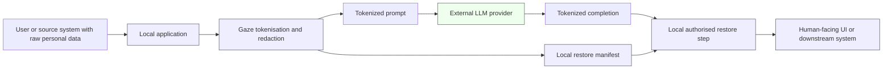
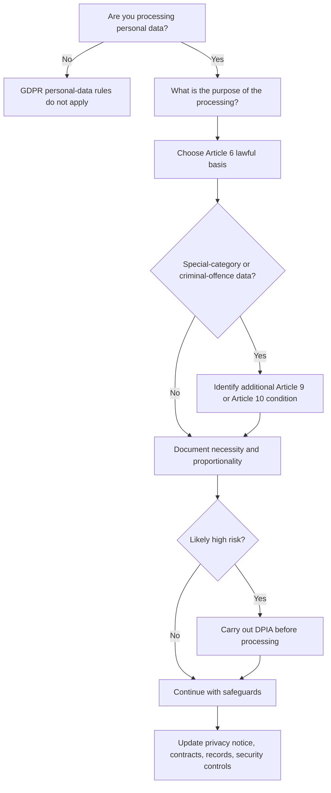
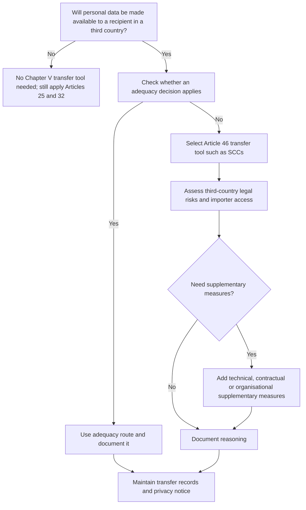

# GDPR / DPIA Guidance for Adopters

This document is written for the developers, Data Protection Officers (DPOs), privacy counsel, security reviewers, and procurement teams who are evaluating Gaze for a workflow that processes personal data under the EU General Data Protection Regulation (Regulation (EU) 2016/679, "GDPR").

> **This is not legal advice, and it is not a compliance certification.**
> Using Gaze does **not** make a deployment GDPR-compliant. Whether a specific deployment of Gaze satisfies your organisation's obligations depends on your processing purpose, legal basis, data flows, contracts, and risk profile — questions that only your own DPO or counsel can answer for your facts. The purpose of this document is narrow: to describe, accurately and conservatively, **how Gaze actually behaves**, and to separate **what Gaze provides** from **what you, the adopter, must configure, deploy, and document yourself**, so that you can feed those facts into your own assessment.

Throughout, claims about Gaze's behaviour are grounded in the project's architecture documents (linked inline). Claims about the law are kept conservative and are not a substitute for your own analysis. Where a property depends on how *you* deploy Gaze — for example, whether the restore manifest is encrypted at rest, how long it is retained, or who can call restore — this document says so explicitly rather than implying Gaze handles it for you.

If Gaze is used on personal data, adopters should ensure their [privacy notice](https://ec.europa.eu/newsroom/article29/item-detail.cfm?item_id=622227) explains **the purpose of tokenisation, the legal basis, recipients and processors, international transfers, retention logic, and how [data-subject rights](https://www.edpb.europa.eu/our-work-tools/our-documents/guidelines/guidelines-012022-data-subject-rights-right-access_en) can be exercised**.

### How to read this document

| Section | Question it helps you answer |
|---|---|
| [1. Controller / processor roles](#1-controller--processor-roles) | Who is the controller, and what is the LLM provider's role? |
| [2. Pseudonymisation vs anonymisation](#2-pseudonymisation-vs-anonymisation) | Is Gaze-tokenised data still "personal data"? For whom? |
| [3. Data protection by design and by default (Art. 25)](#3-data-protection-by-design-and-by-default-article-25) | How does Gaze *support* — not satisfy — Article 25? |
| [4. Retention of the restore manifest](#4-retention-of-the-restore-manifest) | How long does the manifest live, and who controls that? |
| [5. The restore-authorisation boundary](#5-the-restore-authorisation-boundary) | How is re-identification controlled, and who may trigger it? |
| [6. Enterprise security considerations](#6-enterprise-security-considerations) | Storage, encryption-at-rest, keys, tenant isolation, incident response. |
| [7. Audit logs and metadata](#7-audit-logs-and-metadata) | Are audit logs "risk-free"? (No.) |
| [8. International transfers (Chapter V)](#8-international-transfers-chapter-v) | Does sending only tokens remove transfer obligations? (No.) |
| [9. Erasure and other data-subject rights (Art. 17)](#9-erasure-and-other-data-subject-rights-article-17) | Does deleting the manifest satisfy a right-to-erasure request? |
| [10. Limits of pseudonymisation](#10-limits-of-pseudonymisation) | Where can re-identification still happen? |
| [11. Dual-use and misuse risks](#11-dual-use-and-misuse-risks) | How could a careless deployment go wrong? |
| [12. Visual aids](#12-visual-aids) | The legal model as operational flowcharts. |
| [13. Suggested DPIA checklist](#13-suggested-dpia-checklist) | A DPO-grade checklist for a Gaze deployment. |
| [14. When to consult counsel — limits of this guidance](#14-when-to-consult-counsel--limits-of-this-guidance) | Where you **must** get your own legal advice. |
| [15. Authoritative sources](#15-authoritative-sources) | Primary law and official guidance. |
| [16. Reporting privacy concerns](#16-reporting-privacy-concerns) | How to report a privacy risk in Gaze itself. |

---

## 1. Controller / processor roles

GDPR distinguishes the *controller* (who determines the purposes and means of processing), the *processor* (who processes personal data on the controller's behalf and on its documented instructions), the *joint controllers* (who jointly determine purposes and means), and the *independent controller* (who determines its own purposes for data it receives). These are **functional roles**: they are assessed against what actually happens in a given processing operation, not assigned categorically to a vendor type. See [EDPB Guidelines 07/2020 on the concepts of controller and processor](https://www.edpb.europa.eu/our-work-tools/our-documents/guidelines/guidelines-072020-concepts-controller-and-processor-gdpr_en).

**What Gaze is, in role terms.** When you deploy the open-source Gaze library or local binary inside your own application:

- **You (the adopter) are the controller** for the personal data that flows through your system. You decide which content to tokenise, which LLM to call, and how long to retain the restore manifest.
- **Gaze runs entirely inside your trust boundary.** It executes in your process, container, or VM. The Gaze maintainers operate no cloud service in the open-source distribution: Gaze does not phone home, transmit telemetry, or aggregate adopter data. Consequently, for the open-source product there is **no Gaze-operated controller or processor role at all** — there is no maintainer-side processing of your personal data to characterise. (If you later subscribe to a hosted commercial offering operated by the maintainers, that offering would have its own Data Processing Agreement; this document covers only the open-source product.)

**The LLM provider's role is not something Gaze decides.** A common misconception is that the third-party LLM provider (OpenAI, Anthropic, Google, etc.) is *always* your processor, or that using Gaze converts the provider into a processor, or removes the need to characterise the relationship. None of that is correct:

- The provider's role **depends on the specific deployment, the contract, and the provider's actual behaviour** — for example, whether the provider processes prompts *only* to return a completion on your instructions, or also uses them to train or improve models, to safety-tune, to run abuse-detection, or to retain logs for its own purposes. Behaviour that serves the provider's own purposes points away from a pure processor role.
- **Sending only tokens does not, by itself, determine the provider's legal role.** Tokenisation changes *what data* the provider receives (see [§2](#2-pseudonymisation-vs-anonymisation)); it does not change *who decides the purposes and means* of the provider's processing. The role analysis must still be done on the merits.

The following scenarios are **illustrative, not legal conclusions** — your facts and contracts govern:

| If, in practice… | The provider may be characterised as… | Consequence to assess |
|---|---|---|
| The provider processes your prompts only to return completions, on your instructions, under terms that forbid use for its own purposes | A **processor** | Put in place an [Article 28-compliant data processing agreement](https://ico.org.uk/for-organisations/uk-gdpr-guidance-and-resources/accountability-and-governance/contracts-and-liabilities-between-controllers-and-processors-multi/); review its [sub-processors](https://www.edpb.europa.eu/system/files/2024-10/edpb_opinion_202422_relianceonprocessors-sub-processors_en.pdf) and transfer mechanisms. |
| The provider uses inputs for its own purposes (e.g. model training, product improvement) under its own terms | An **independent controller** for that processing | You need your own lawful basis and transparency for that disclosure; an Art. 28 DPA does not fit an independent-controller relationship. |
| You and the provider jointly determine purposes and essential means | **Joint controllers** | An Art. 26 arrangement is needed, allocating responsibilities and a contact point. |

CNIL's guidance on [determining the legal qualification of AI system providers](https://www.cnil.fr/en/determining-legal-qualification-ai-system-providers) is directly on point for this analysis. **Confirm the role in both the contract and actual practice** — a DPA that labels the provider a "processor" does not make it one if the provider in fact processes for its own purposes.

> **What Gaze does here:** keeps raw personal data inside your trust boundary and sends only pseudonymised tokens across the model boundary. **What it does not do:** characterise, change, or remove any controller/processor relationship. That analysis remains yours.

## 2. Pseudonymisation vs anonymisation

GDPR Art. 4(5) defines pseudonymisation as:

> "the processing of personal data in such a manner that the personal data can no longer be attributed to a specific data subject without the use of additional information, provided that such additional information is kept separately and is subject to technical and organisational measures to ensure that the personal data are not attributed to an identified or identifiable natural person."

**Gaze performs pseudonymisation, not anonymisation.**

- Tokens emitted by Gaze (for example `<Email_1>`, `<Person_1>`, `<OrderId_1>`) cannot, on their own, be attributed to a specific individual.
- The **restore manifest is the "additional information"** that maps tokens back to the original values. Gaze keeps the manifest separate from the redacted text by design — the manifest stays on your side; only tokens cross the boundary to the LLM. See the [session contract](../../explanation/core/session-contract.md).
- **Anonymisation** would mean the original values cannot be recovered by *anyone*, by any reasonably likely means, including by you. Gaze deliberately does **not** do this: reversibility is the point, because it enables the legitimate downstream use cases Gaze is built for (e.g. rehydrating an LLM-generated draft so an authorised support agent sees the customer's real name). Do **not** describe Gaze-tokenised text as [anonymous by default](https://www.cnil.fr/en/sheet-ndeg1-identify-personal-data).

### Identifiability is assessed per party

Whether Gaze-tokenised output is "personal data" is **not a single global answer**. It depends on whether re-identification is *reasonably likely* for the specific party holding the data — the "means reasonably likely to be used" test (Recital 26), informed by the recipient-side reasoning in the [EDPS v SRB](https://curia.europa.eu/jcms/upload/docs/application/pdf/2025-09/cp250107en.pdf) case. Analyse each party separately:

| Party | What they hold | Likely classification (assess on your facts) |
|---|---|---|
| **You, the adopter** | The tokenised text **and** the restore manifest (the additional information) | Tokenised data **ordinarily remains personal data** in your hands, because you can reverse it. Pseudonymisation, not anonymisation. |
| **A downstream recipient** (e.g. an internal team, a partner) who receives tokens **without** the manifest and cannot reasonably obtain it | Tokens only | **Depends on reasonable re-identification.** If that recipient cannot, by means reasonably likely to be used, re-identify the individual (including via the surrounding free-text context — see [§10](#10-limits-of-pseudonymisation)), the data may not be personal data *for that recipient*. This is fact-specific; do not assume it. |
| **The third-party LLM provider** | Whatever it receives and retains (tokens, plus any context in the prompt), under its own logging/retention/training behaviour | **Depends on what it receives and retains** and whether it can reasonably re-identify. The provider does not receive the manifest from Gaze, which reduces — but does not necessarily eliminate — identifiability, especially where free-text context is rich. |

**Practical consequence.** Pseudonymised data remains in scope of the GDPR for any party who can reasonably re-identify — and that ordinarily includes you. Your lawful basis, transparency obligations, data-subject rights, retention duties, and security obligations continue to apply to the manifest and to the underlying personal data. They apply with **reduced risk** — pseudonymisation is an expressly recognised technical measure (Art. 25, Art. 32, and a favourable factor in Recital 28) — but they do not disappear. See the [EDPB Guidelines 01/2025 on pseudonymisation](https://www.edpb.europa.eu/our-work-tools/our-documents/guidelines/guidelines-012025-pseudonymisation_en) (verify current adoption status) for the regulator's framework.

## 3. Data protection by design and by default (Article 25)

Article 25 requires controllers to implement appropriate technical and organisational measures **by design** (built into the processing from the outset) and **by default** (so that, without action by the individual, only the personal data necessary for each purpose is processed). See [EDPB Guidelines 4/2019 on Article 25](https://www.edpb.europa.eu/our-work-tools/our-documents/guidelines/guidelines-42019-article-25-data-protection-design-and_en).

Article 25 is an **obligation on you, the controller** — it cannot be discharged by a tool. Gaze provides **primitives that can support** an Article 25 design; whether your overall processing actually meets Article 25 depends on how you configure, deploy, and govern those primitives, and on the rest of your system.

| Article 25 objective | Primitive Gaze provides | What you must still do |
|---|---|---|
| **Data minimisation at the model boundary** | Detects and tokenises configured PII classes so raw identifiers are not sent to the LLM | Decide which classes to enable; minimise the *non-identifying* context in the prompt too (Gaze does not minimise free-text payload size or remove quasi-identifiers — see [§10](#10-limits-of-pseudonymisation)). |
| **Pseudonymisation before disclosure** | Applies pseudonymisation **before** the model boundary, deterministically | Apply Gaze on the **input** path, not only on output; output-only redaction does not protect data the model already received (see [§11](#11-dual-use-and-misuse-risks)). |
| **Confidentiality / least privilege on re-identification** | A [restore boundary](../../explanation/core/restore-boundary.md) that fails closed and is auditable (see [§5](#5-the-restore-authorisation-boundary)) | Decide *who* and *what* may call restore; restore only the minimum necessary, only where necessary. |
| **Storage limitation by default** | Ephemeral sessions, daemon-mode eviction, no implicit on-disk persistence (see [§4](#4-retention-of-the-restore-manifest)) | Choose the shortest retention your workflow tolerates; configure encryption at rest and deletion (see [§6](#6-enterprise-security-considerations)). |

> Gaze **supports** data-protection-by-design objectives; it does not, and cannot, **achieve Article 25 compliance** on your behalf. Document in your own records how each configured control maps to your Article 25 analysis.

## 4. Retention of the restore manifest

Gaze does not impose a fixed retention period on the restore manifest. The right value depends on your workflow — a synchronous support-reply flow may need the manifest for seconds; a multi-day agent investigation may need it for days. Storage limitation (Art. 5(1)(e)) is your obligation; Gaze gives you primitives to keep retention short.

**What Gaze provides:**

- **Ephemeral sessions** (`Scope::Ephemeral`) — the pseudonym namespace exists only while the `Session` is held in memory and is dropped when the `Session` is dropped. No persistence, no on-disk artefact, and `export()` is not available for this scope. See the [session contract](../../explanation/core/session-contract.md).
- **Daemon-mode session eviction** — when Gaze runs as a long-lived stdio runtime (`gaze daemon`), sessions are evicted by least-recently-used policy when the configured `--session-cap` is exceeded, and sessions idle beyond `--session-idle-timeout` are evicted automatically. Eviction drops the restore map for that session (an in-memory drop, not a guarantee about copies you exported). See [daemon mode](../../explanation/daemon/daemon-mode.md).
- **No implicit persistence** — Gaze does not write the manifest to disk unless you explicitly export a session snapshot and persist it. Persistence, its location, its encryption, and its deletion are entirely **your** responsibility (see [§6](#6-enterprise-security-considerations)).

**Recommended adopter defaults:**

- Keep the manifest in process memory for the lifetime of the current request or agent turn, not longer, where the workflow allows it.
- If you must persist a manifest across requests (for example, a multi-step agent workflow that exports and re-imports a session snapshot), set the shortest TTL the workflow can tolerate, encrypt it at rest, and have your DPO sign off on the chosen retention.
- Treat the restore manifest as **[high-risk personal-data infrastructure](https://www.bfdi.bund.de/EN/Fachthemen/Inhalte/Technik/SDM.html)**: protect it with strict [role-based access control](https://www.edpb.europa.eu/our-work-tools/our-documents/guidelines/guidelines-42019-article-25-data-protection-design-and_en), encryption at rest, deletion schedules, and an auditable restore path, because compromise of the manifest defeats the pseudonymisation layer.

## 5. The restore-authorisation boundary

Re-materialising original values from tokens is a **privileged operation**, not a routine string substitution. Gaze enforces this at what the architecture calls the *restore boundary* — a deterministic, manifest-bound, fail-closed egress check. See [restore-boundary integrity](../../explanation/core/restore-boundary.md) for the full contract. Note the scope of the design: the restore boundary is **manifest-integrity enforcement and deterministic outbound control**, *not* prompt-injection detection, jailbreak prevention, or intent classification. It answers one question — "was this value authorised by the active manifest?" — and nothing about the meaning or motive of surrounding text.

**What Gaze guarantees at the boundary:**

- A token is restored to its original value **only if** the currently-active session manifest authorises that exact token-to-value mapping.
- **Unknown tokens, tokens minted in another session, tokens from another tenant boundary, and malformed tokens all fail closed** — they return a typed restore failure. Restore never guesses, never falls back to a best-effort value, and never passes a token-shaped string through as raw.
- Restore decisions are **deterministic and auditable**: a restore can be logged with metadata (recognizer identity, session, timestamp, the typed outcome) without ever writing the raw value to the audit sink (see [§7](#7-audit-logs-and-metadata)).

**Restore is not "on by default" — it is a capability you must deliberately wire and constrain.** For adopters this means:

- **Decide explicitly which application paths may call `restore()`, and for whom.** Treat it like a privileged database credential: narrow scope, least privilege, audited path. Restoration should not be a blanket display mode; [data protection by default](https://www.edpb.europa.eu/our-work-tools/our-documents/guidelines/guidelines-42019-article-25-data-protection-design-and_en) points the other way.
- **Restore the minimum necessary, only where necessary.** A human-facing surface should re-materialise only the specific values the task requires, only for users authorised to see them, and only at the point where restoration is actually needed — not eagerly across an entire record.
- **Never expose `restore()` to the LLM.** The model should only ever receive tokens. Restoration happens *after* the model produces output and *before* that output reaches the authorised human (for example, the support agent reviewing a draft reply).
- **Keep restore inside the same trust boundary as the manifest.** Cross-session and cross-tenant restore already fail closed, but the surrounding authorisation (which user, which role, which tenant) is yours to enforce in the calling application.
- **Log restore calls.** The audit log is metadata-only by design — turn it on so you have a defensible record of when, by whom, and for which session a restore occurred.

## 6. Enterprise security considerations

This section is written for security and infrastructure reviewers. It states precisely what Gaze does and — importantly — what it leaves to your deployment. Gaze is a **boundary-protection tool against third-party LLM exposure; it is not a host-security, key-management, or storage-encryption product.**

### 6.1 Manifest storage and encryption at rest

The restore manifest contains original PII. When you persist a manifest across requests, you do so by exporting a session snapshot:

- `Session::export()` produces a **`SensitiveSnapshot`**. The snapshot payload contains the original sensitive values in serialised form.
- **The snapshot is cryptographically *signed*, not *encrypted*.** Gaze applies an Ed25519 signature over the snapshot envelope; on `Session::import()` the signature is verified and a tampered or truncated snapshot is rejected with a typed "snapshot signature verification failed" error. The signature provides **integrity and tamper-evidence**, *not confidentiality*.
- **Encryption at rest is the adopter's responsibility.** Gaze's own API documentation is explicit on this point: the exported bytes must be persisted **encrypted at rest because they contain original PII**. If you write `snapshot.into_bytes()` to disk, a database, or a cache without encrypting it with your own mechanism, the PII is stored in cleartext. Gaze does not encrypt it for you.

> **Reviewer takeaway:** do not record "manifest is encrypted by Gaze" — that is false. Record "manifest snapshot is signed by Gaze for integrity; confidentiality at rest is provided by *(your KMS / disk encryption / database encryption)*."

### 6.2 Key management

- Each `Session` holds an in-process signing key used for snapshot integrity. The `Session` type is intentionally non-`Debug` so the signing key and token manifest are not accidentally logged.
- Snapshots carry a key/version marker so importers can validate against the expected scheme. Rotation policy, secret storage for any keys you introduce (e.g. for your own at-rest encryption), and HSM/KMS integration are **your** responsibility.

### 6.3 Tenant and session isolation

- Gaze isolates by **`Session`**, which is the pseudonym-namespace boundary. Two `Session`s never share counters or value-to-token lookups, regardless of `Scope`. A token minted in one `Session` **fails closed** when restore is attempted against a different `Session`/tenant manifest (see [§5](#5-the-restore-authorisation-boundary)).
- **"Tenant isolation" is therefore an adopter mapping, not a Gaze-native concept.** Gaze gives you isolated namespaces; mapping one tenant (or one logical conversation) onto one `Session`, and never sharing a `Session` across tenants or unrelated conversations, is your responsibility. Sharing one `Session` across contexts re-introduces cross-context linkability — the exact failure mode pseudonymisation is meant to prevent (see the [session contract](../../explanation/core/session-contract.md#single-shared-session-across-conversations)).

### 6.4 Compromise scenarios

| Scenario | Effect | Why Gaze cannot prevent it |
|---|---|---|
| **Host / process compromise** | The attacker can read the in-memory manifest and signing key and can restore everything | Gaze runs inside your process; an attacker at that privilege level is inside the trust boundary. |
| **Manifest snapshot exfiltrated from storage** | If stored unencrypted, the PII is exposed directly; if encrypted, exposure depends on your key handling | The snapshot is signed, not encrypted (see [§6.1](#61-manifest-storage-and-encryption-at-rest)); confidentiality is your control. |
| **Compromised key used to forge a snapshot** | A forged snapshot could pass import if the attacker controls the signing key | Key custody is your responsibility (see [§6.2](#62-key-management)). |
| **Misdirected / over-broad restore** | More PII re-materialised than necessary, or to the wrong user | The calling application owns user/role authorisation around `restore()` (see [§5](#5-the-restore-authorisation-boundary)). |

### 6.5 Incident response and monitoring

- Build manifest compromise, unauthorised or anomalous restore activity, misdirected prompts, and provider-side exposure into your incident-response plan, including [72-hour supervisory notification analysis](https://www.edpb.europa.eu/our-work-tools/our-documents/guidelines/guidelines-92022-personal-data-breach-notification-under_en) (see also the DPC's [practical guide to breach notifications](https://www.dataprotection.ie/en/dpc-guidance/breach-notification-practical-guide)).
- Use the metadata-only audit log (see [§7](#7-audit-logs-and-metadata)) as a forensic trail for restore activity. Monitoring, alerting, and retention of that trail are your deployment's responsibility.

## 7. Audit logs and metadata

Gaze ships an optional audit sink (`gaze-audit`) that records **metadata only** about what was tokenised. This is true and load-bearing — but "metadata-only" is **not** the same as "outside the scope of the GDPR".

**What Gaze's own audit log is:**

- The redaction log records *that* a token was emitted — its class, the recognizer and version, the action, the timestamp, an opaque session id, and conflict/provenance metadata. There is **no raw-value column and no token-to-value column**: the approved export/query column set (`AUDIT_RESTRICTED_COLUMNS`) deliberately excludes any field that could carry raw PII, token values, or document content, and a build-time isolation gate keeps raw values out of the audit path. Queries open the database read-only.

**Why it is still not risk-free:**

- **Metadata can itself be personal data**, depending on deployment. Identifiers such as the session id, timestamps, and field names — when combined with other information reasonably available — can relate to an identifiable person. The CJEU's reasoning in [*Breyer* (C-582/14)](https://curia.europa.eu/jcms/upload/docs/application/pdf/2016-10/cp160112en.pdf) is the canonical example that data which is not identifying *in isolation* can still be personal data in context. Treat the audit log as a sensitive record with its own [retention, access-control, and minimisation rules](https://ico.org.uk/for-organisations/uk-gdpr-guidance-and-resources/accountability-and-governance/documentation/), not as something out of scope.
- **Adopter-added logging is a separate, larger risk.** Gaze controls only its own audit sink. Any logging *you* add around Gaze — request logs, application logs, traces, and especially logs of the raw prompt or the restored output — is outside Gaze's metadata-only guarantee and may contain raw personal data. Bringing your own logging stack under the same retention, access-control, and minimisation discipline is your responsibility.

> **Risk ordering:** the restore manifest remains the highest-risk artefact. But the audit log (Gaze's own metadata) and your surrounding application logs are **not** risk-free and need their own controls.

## 8. International transfers (Chapter V)

If personal data is made available to a recipient in a third country (outside the EEA), Chapter V of the GDPR applies **in addition to** the lawful-basis and security requirements. Routing prompts to a remotely hosted LLM commonly involves such a transfer.

**Gaze reduces transfer exposure but does not remove transfer obligations:**

- Gaze sends only **tokens** across the model boundary, so the data made available to the provider is pseudonymised rather than raw. This reduces the *volume and directness* of personal data exposed in a transfer.
- It does **not** follow that no transfer occurs or that Chapter V is satisfied. Tokenised data **may still be personal data** for a party that can reasonably re-identify (see [§2](#2-pseudonymisation-vs-anonymisation)), the surrounding free-text context can carry identifying information (see [§10](#10-limits-of-pseudonymisation)), and the provider may still be a third-country recipient. The interplay between Article 3 territorial scope and Chapter V is set out in [EDPB Guidelines 05/2021](https://www.edpb.europa.eu/our-work-tools/our-documents/guidelines/guidelines-052021-interplay-between-application-article-3_en).

**What you must do for any third-country transfer:**

1. **Determine whether a transfer occurs** and to which country/recipient.
2. **Check for an [adequacy decision](https://commission.europa.eu/law/law-topic/data-protection/international-dimension-data-protection/adequacy-decisions_en).** For U.S. providers, adequacy under the **[EU-U.S. Data Privacy Framework](https://eur-lex.europa.eu/eli/dec_impl/2023/1795/oj/eng)** is available **only for organisations certified on the official DPF list** for the relevant data categories — verify the specific entity's certification; do not assume DPF coverage. Note ongoing litigation ([Latombe v Commission, T-553/23](https://infocuria.curia.europa.eu/tabs/redirect/juris/liste.jsf?num=T-553%2F23)) and the *Schrems* line ([Schrems I, C-362/14](https://curia.europa.eu/jcms/jcms/P_180250/); [Schrems II, C-311/18](https://curia.europa.eu/jcms/upload/docs/application/pdf/2020-07/cp200091en.pdf)).
3. **If no adequacy applies, use an [Article 46 transfer tool](https://commission.europa.eu/law/law-topic/data-protection/international-dimension-data-protection/new-standard-contractual-clauses-questions-and-answers-overview_en)** such as Standard Contractual Clauses.
4. **Carry out a transfer impact assessment** of the third country's law and the importer's access, and add [supplementary measures](https://www.edpb.europa.eu/our-work-tools/our-documents/recommendations/recommendations-012020-measures-supplement-transfer_en) where needed. Pseudonymisation can be a relevant supplementary measure, but its sufficiency is fact-specific and must be assessed, not assumed.
5. **Document the transfer** in your records and privacy notice.

The [international-transfer decision flow](#international-transfer-decision-flow) in §12 summarises this.

## 9. Erasure and other data-subject rights (Article 17)

Deleting a manifest entry is a meaningful control, but it is easy to overstate what it achieves. Be precise:

- **Deleting the manifest reduces identifiability from your perspective** — once the token-to-value mapping is gone from systems under your control, you can no longer reverse those tokens.
- **It is not, by itself, proven anonymisation, and it does not automatically satisfy Article 17.** Several things can remain:
  - **Backups and exported snapshots.** Any exported `SensitiveSnapshot` you persisted is an additional copy of the manifest; so are database backups and replicas. Erasure must reach these, subject to your documented backup-cycle approach.
  - **Downstream and third-party copies.** Data already sent to the LLM provider, copies in downstream systems, and logs (including any raw-data logging you added — see [§7](#7-audit-logs-and-metadata)) are not deleted by removing your manifest entry.
  - **The residual content itself.** Tokenised text and free-text context may still permit re-identification by other means (see [§10](#10-limits-of-pseudonymisation)).
  - **Competing obligations.** Retention obligations (e.g. legal-hold, accounting) and the exemptions and conditions in Articles 17(1)–(3) may modify or limit an erasure request.
- **Assess [residual identifiability](https://curia.europa.eu/jcms/upload/docs/application/pdf/2025-09/cp250107en.pdf) across logs, backups, exports, and third-party systems, and execute erasure across all systems under your control where Article 17 applies.** Conservative wording for your records: *"deleting the manifest entry materially reduces identifiability from the controller's perspective; it is not asserted to be anonymisation or automatic Article 17 compliance."*

The same care applies to the other rights — access (Art. 15), rectification (Art. 16), portability (Art. 20), and objection (Art. 21): plan how each is fulfilled given that the underlying values live in the manifest and the working data lives across your systems.

## 10. Limits of pseudonymisation

Pseudonymisation reduces re-identification risk; it does not eliminate it. Adopters should be aware of these limits:

- **Quasi-identifier combinations.** Gaze tokenises explicit identifiers (names, emails, phone numbers, national IDs, and the classes you configure). It does **not** automatically tokenise combinations of non-identifying facts that, taken together, could single out an individual (e.g. "32-year-old female lawyer in Galway with a peanut allergy and a 2018 Volvo"). If your free-text payload is rich in this kind of context, pseudonymising the email alone is not enough — you may need an additional minimisation pass, a different consent model, or a smaller payload.
- **Re-identification by linkage.** If the same individual's data passes through the LLM in multiple separate sessions, an adversary with access to those sessions could in principle link them by surrounding context (writing style, recurring topics, indirect identifiers). Session-scoped tokens prevent token-based linkage; they cannot prevent linkage by other means.
- **NER coverage gaps.** Free-text name detection depends on the NER backend you configure. No NER is perfect — unusual names, transliterations, and culture-specific naming conventions can be missed. Adopters processing high-stakes free text should not rely on NER alone.
- **Recognizer false negatives.** A recognizer that does not match emits no token. The optional second-pass [SafetyNet](../../explanation/safety-net/safety-nets.md) exists to surface bytes the deterministic layer missed, but no detection layer is exhaustive. Treat the detection-coverage table in the project [README](../../../README.md) as a **floor, not a guarantee**, and configure your policy for your specific data classes.
- **Host compromise.** Pseudonymisation protects the model boundary, not your own host. If your host is compromised, the manifest and signing key are exposed (see [§6.4](#64-compromise-scenarios)).

## 11. Dual-use and misuse risks

Privacy tooling can be misused. Being honest about where a careless deployment goes wrong is part of using Gaze responsibly:

- **Hiding identity from the human reviewer, not just from the model.** If you pseudonymise so aggressively that the eventual authorised human cannot exercise accountable judgement, you may produce GDPR-clean LLM traffic but poor downstream decisions. Restore only the minimum value necessary, only for authorised users, and only where needed (see [§5](#5-the-restore-authorisation-boundary)); blanket restoration as a default display mode is not supported by data-protection-by-default.
- **Using pseudonymisation as a substitute for lawful basis.** Pseudonymisation is a *technical measure*, not an [Art. 6 lawful basis](https://ico.org.uk/for-organisations/uk-gdpr-guidance-and-resources/lawful-basis/a-guide-to-lawful-basis/). If you have no lawful basis to process the personal data, pseudonymising it does not create one.
- **Re-using session-bound tokens across sessions to "track" individuals.** Tokens are session-scoped and counter-based precisely so they cannot serve as covert stable identifiers across sessions. Re-using them across sessions for longitudinal analytics should be treated as **further processing** requiring a fresh purpose analysis, an appropriate legal basis, [updated transparency](https://ec.europa.eu/newsroom/article29/item-detail.cfm?item_id=622227), and — where risk is high — [DPIA review](https://www.cnil.fr/en/guidelines-dpia).
- **Disabling the SafetyNet in production to save latency.** The optional second-pass detector catches bytes the rule layer missed. Turning it off reduces detection coverage; the resulting deployment is less safe than the default.
- **Output-only redaction.** Redacting AI output *after* the model has already seen the raw input does not protect against the boundary leak — the provider already received the data. Apply Gaze **before** the model boundary.

If you discover a deployment pattern that creates a privacy risk we did not anticipate, please file a GitHub issue or use the channels in `SECURITY.md`.

---

## 12. Visual aids

These diagrams translate the GDPR legal model into operational steps. The legal logic behind them comes from Articles 25, 28, 32, 35 and Chapter V, plus EDPB guidance on controller/processor roles and transfers. They are aids, not legal conclusions.

### Data flow and restore boundary

### Lawful basis decision tree

### International transfer decision flow

---

## 13. Suggested DPIA checklist

If you are completing a Data Protection Impact Assessment for a Gaze deployment, the following items will typically arise. This list is **not exhaustive** and is **not a substitute for engaging your DPO**. DPIA triggers and methodology are explained in the [CNIL DPIA guidelines](https://www.cnil.fr/en/guidelines-dpia) and the [ICO DPIA guidance](https://ico.org.uk/for-organisations/uk-gdpr-guidance-and-resources/accountability-and-governance/data-protection-impact-assessments-dpias/).

**Purpose and lawfulness**
- [ ] **Processing purpose** — what is the LLM call actually for? Is it proportionate to the personal data involved?
- [ ] **Lawful basis (Art. 6)** — which ground covers the underlying processing? Is pseudonymisation being mistaken for a lawful basis (it is not — see [§11](#11-dual-use-and-misuse-risks))?
- [ ] **Special-category / criminal-offence data (Arts. 9–10)** — is any present? If so, identify the additional condition, and reconsider whether such data should reach the LLM at all.
- [ ] **Further processing** — does any secondary use (e.g. analytics on tokens across sessions) constitute a new purpose requiring its own basis and transparency?

**Data and minimisation**
- [ ] **Data minimisation** — is the payload to the LLM the smallest set of attributes needed? Are quasi-identifiers in free text addressed (see [§10](#10-limits-of-pseudonymisation))?
- [ ] **Pseudonymisation scope** — which classes does your policy enable? Which are detected-but-not-tokenised, and why? Is the SafetyNet enabled?

**Roles, contracts, transfers**
- [ ] **Controller/processor analysis (Art. 28 / Art. 26)** — what is the LLM provider's actual role (see [§1](#1-controller--processor-roles))? Is the contract consistent with practice? Is there an Art. 28 DPA where the provider is a processor?
- [ ] **Sub-processors** — are the provider's sub-processors reviewed and covered?
- [ ] **International transfers (Chapter V)** — is there a third-country transfer? Adequacy or Art. 46 tool? For U.S. providers, is the specific entity DPF-certified for the relevant data? Is a transfer impact assessment and any supplementary measure in place (see [§8](#8-international-transfers-chapter-v))?

**Storage, security, retention**
- [ ] **Manifest storage and encryption at rest** — where is the manifest/snapshot stored? Is it encrypted at rest by *your* mechanism (Gaze signs, it does not encrypt — see [§6.1](#61-manifest-storage-and-encryption-at-rest))?
- [ ] **Key management** — how are at-rest encryption keys and any signing keys stored, rotated, and access-controlled?
- [ ] **Tenant / session isolation** — is one `Session` mapped per tenant/conversation boundary, never shared across tenants (see [§6.3](#63-tenant-and-session-isolation))?
- [ ] **Manifest retention** — how long does the manifest live? What is the TTL and deletion mechanism?
- [ ] **Access controls** — who can read the manifest, the audit log, and any application logs? Is access itself logged?
- [ ] **Restoration controls** — which paths may call restore? Restricted to least privilege and minimum-necessary? Restore calls logged?
- [ ] **Audit logging** — is Gaze's metadata-only audit log enabled and treated as a sensitive record? Is adopter-added logging brought under the same discipline (see [§7](#7-audit-logs-and-metadata))?
- [ ] **Backup handling** — are backups and exported snapshots accounted for in retention and erasure?
- [ ] **Incident response** — is there a procedure covering manifest compromise, unauthorised restore, misdirected prompts, and provider-side exposure, including 72-hour notification analysis (see [§6.5](#65-incident-response-and-monitoring))?

**Rights and accountability**
- [ ] **Data-subject rights** — how are access, rectification, erasure, portability, and objection handled, given the manifest/working-data split (see [§9](#9-erasure-and-other-data-subject-rights-article-17))? In particular, is manifest deletion **not** being described as automatic anonymisation or automatic Art. 17 compliance?
- [ ] **Records of processing (RoPA, Art. 30)** — is there a [record of processing activities](https://www.dataprotection.ie/en/dpc-guidance/records-of-processing-article-30-guidance) covering tokenisation, manifest storage, recipients, transfers, retention periods, and security measures?

---

## 14. When to consult counsel — limits of this guidance

This document describes Gaze's behaviour and maps it to common GDPR questions. It cannot resolve the questions that depend on your facts. **Consult your DPO or external counsel** before relying on any of the following, each of which is a legal determination, not an engineering one:

- **Whether your tokenised output is "personal data"** for a given recipient or provider (the reasonable-re-identification test is fact-specific — see [§2](#2-pseudonymisation-vs-anonymisation)).
- **The LLM provider's role** (processor / independent controller / joint controller) and whether your contract matches practice (see [§1](#1-controller--processor-roles)).
- **Your lawful basis**, and any Article 9/10 conditions for special-category or criminal-offence data.
- **Whether a Chapter V transfer occurs and how to legitimise it** — adequacy, SCCs, DPF certification of the specific entity, transfer impact assessment, and the sufficiency of pseudonymisation as a supplementary measure (see [§8](#8-international-transfers-chapter-v)).
- **Whether and how an erasure (or other rights) request is satisfied** across manifest, backups, exports, downstream systems, and the provider, and how retention obligations interact (see [§9](#9-erasure-and-other-data-subject-rights-article-17)).
- **Whether a DPIA is mandatory** for your processing, and whether prior consultation with a supervisory authority is required.
- **Breach assessment and notification** for any specific incident.

**Assumptions and boundaries of this guidance:**

- It addresses the **open-source Gaze** product running inside your trust boundary. A hosted/commercial offering would have a different role and contract analysis.
- It assumes you deploy Gaze **before** the model boundary on the input path, with restore as a privileged, constrained operation.
- It does **not** assess any specific LLM provider, contract, jurisdiction, or sector-specific regime (e.g. health, finance, telecoms, employment, or the EU AI Act), and it does not constitute advice on those.
- Regulatory guidance and case law evolve. Some sources cited here are subject to change, ongoing litigation, or pending adoption (for example the EU-U.S. DPF litigation and the EDPB pseudonymisation guidelines); **verify the current status of any source before relying on it.**

## 15. Authoritative sources

These primary and official sources support the guidance above and are the highest-value references for legal, security, and procurement teams. They support — but do not replace — your own DPO or counsel analysis.

| Topic | Source | Why it belongs |
|---|---|---|
| Core law | [General Data Protection Regulation (EU) 2016/679](https://eur-lex.europa.eu/eli/reg/2016/679/oj/eng) (EUR-Lex) | Primary source for all legal propositions. |
| Controller vs processor | [Guidelines 07/2020 on the concepts of controller and processor](https://www.edpb.europa.eu/our-work-tools/our-documents/guidelines/guidelines-072020-concepts-controller-and-processor-gdpr_en) (EDPB) | Authoritative for the LLM-provider role analysis. |
| AI provider qualification | [Determining the legal qualification of AI system providers](https://www.cnil.fr/en/determining-legal-qualification-ai-system-providers) (CNIL) | Directly on point for external LLM-provider roles. |
| Sub-processors | [Opinion 22/2024 on processors and sub-processors](https://www.edpb.europa.eu/system/files/2024-10/edpb_opinion_202422_relianceonprocessors-sub-processors_en.pdf) (EDPB) | Supports the Art. 28 sub-processor review. |
| Design/default | [Guidelines 4/2019 on Article 25 Data Protection by Design and by Default](https://www.edpb.europa.eu/our-work-tools/our-documents/guidelines/guidelines-42019-article-25-data-protection-design-and_en) (EDPB) | Basis for the Article 25 and restore-boundary language. |
| Pseudonymisation | [Guidelines 01/2025 on pseudonymisation](https://www.edpb.europa.eu/our-work-tools/our-documents/guidelines/guidelines-012025-pseudonymisation_en) (EDPB) | Regulator framework for pseudonymisation; verify adoption status. |
| Pseudonymisation case law | [EDPS v SRB press release](https://curia.europa.eu/jcms/upload/docs/application/pdf/2025-09/cp250107en.pdf) (CURIA) | Recipient-side identifiability nuance. |
| Personal data in context | [Breyer (C-582/14) press release](https://curia.europa.eu/jcms/upload/docs/application/pdf/2016-10/cp160112en.pdf) (CURIA) | Data not identifying in isolation can still be personal data — relevant to logs/metadata. |
| Personal-data qualification | [Sheet n°1: Identify personal data](https://www.cnil.fr/en/sheet-ndeg1-identify-personal-data) (CNIL) | Anonymisation vs pseudonymisation. |
| Consent | [Guidelines 05/2020 on consent](https://www.edpb.europa.eu/our-work-tools/our-documents/guidelines/guidelines-052020-consent-under-regulation-2016679_en) (EDPB) | Needed where consent is the basis. |
| Transparency | [Transparency guidelines (WP260 rev.01)](https://ec.europa.eu/newsroom/article29/item-detail.cfm?item_id=622227) (EC archive of endorsed WP29 guidance) | Official transparency explainer for Arts. 12–14. |
| Access rights | [Guidelines 01/2022 on data subject rights – Right of access](https://www.edpb.europa.eu/our-work-tools/our-documents/guidelines/guidelines-012022-data-subject-rights-right-access_en) (EDPB) | Restore-manifest and output access handling. |
| DPIA | [Guidelines on DPIA](https://www.cnil.fr/en/guidelines-dpia) (CNIL) | Official and practical DPIA methodology. |
| Breach notification | [Guidelines 9/2022 on personal data breach notification](https://www.edpb.europa.eu/our-work-tools/our-documents/guidelines/guidelines-92022-personal-data-breach-notification-under_en) (EDPB) | 72-hour notification analysis. |
| RoPA | [Records of Processing Activities under Article 30](https://www.dataprotection.ie/en/dpc-guidance/records-of-processing-article-30-guidance) (Irish DPC) | Direct Article 30 implementation aid. |
| Security | [The standard data protection model](https://www.bfdi.bund.de/EN/Fachthemen/Inhalte/Technik/SDM.html) (BfDI) | Translates legal duties into technical/organisational measures. |
| Processor contracts | [Contracts and liabilities between controllers and processors](https://ico.org.uk/for-organisations/uk-gdpr-guidance-and-resources/accountability-and-governance/contracts-and-liabilities-between-controllers-and-processors-multi/) (ICO) | Practical Art. 28 support. |
| Article 30 documentation | [What do we need to document under Article 30?](https://ico.org.uk/for-organisations/uk-gdpr-guidance-and-resources/accountability-and-governance/documentation/) (ICO) | Checklist-style support. |
| Transfers (interplay) | [Guidelines 05/2021 on the interplay between Article 3 and Chapter V](https://www.edpb.europa.eu/our-work-tools/our-documents/guidelines/guidelines-052021-interplay-between-application-article-3_en) (EDPB) | Remote LLM access and third-country analysis. |
| Transfers (supplementary measures) | [Recommendations 01/2020 on measures that supplement transfer tools](https://www.edpb.europa.eu/our-work-tools/our-documents/recommendations/recommendations-012020-measures-supplement-transfer_en) (EDPB) | Post-*Schrems II* supplementary-measures framework. |
| SCCs | [New Standard Contractual Clauses – Q&A overview](https://commission.europa.eu/law/law-topic/data-protection/international-dimension-data-protection/new-standard-contractual-clauses-questions-and-answers-overview_en) (European Commission) | Official SCC implementation support. |
| Adequacy | [Adequacy decisions](https://commission.europa.eu/law/law-topic/data-protection/international-dimension-data-protection/adequacy-decisions_en) (European Commission) | Current official adequacy inventory. |
| EU-U.S. transfers | [Commission Implementing Decision (EU) 2023/1795](https://eur-lex.europa.eu/eli/dec_impl/2023/1795/oj/eng) (EUR-Lex) | Current EU-U.S. adequacy decision (DPF). |
| Schrems I | [Schrems (C-362/14) press release](https://curia.europa.eu/jcms/jcms/P_180250/) (CURIA) | Official case-law reference. |
| Schrems II | [Schrems II (C-311/18) press release](https://curia.europa.eu/jcms/upload/docs/application/pdf/2020-07/cp200091en.pdf) (CURIA) | Official Schrems II reference. |
| Current DPF litigation | [Latombe v Commission (T-553/23)](https://infocuria.curia.europa.eu/tabs/redirect/juris/liste.jsf?num=T-553%2F23) (InfoCuria) | Live challenge to the DPF adequacy decision. |
| German transfer note | [Anwendungshinweise zum Angemessenheitsbeschluss EU-US DPF](https://www.datenschutzkonferenz-online.de/media/ah/230904_DSK_Ah_EU_US.pdf) (DSK, German) | German-language official note for procurement/legal. |

---

## 16. Reporting privacy concerns

If you find a Gaze behaviour that creates or worsens a privacy risk:

- **Privacy-sensitive bugs** — file a GitHub issue with the `privacy` label, or use the channels in `SECURITY.md` for vulnerabilities that should not be disclosed publicly until a fix lands.
- **Deployment-pattern feedback** — open a GitHub Discussion. The maintainers want to learn from real-world adopter experience so this guidance can improve.
