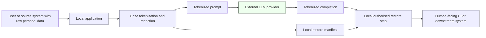
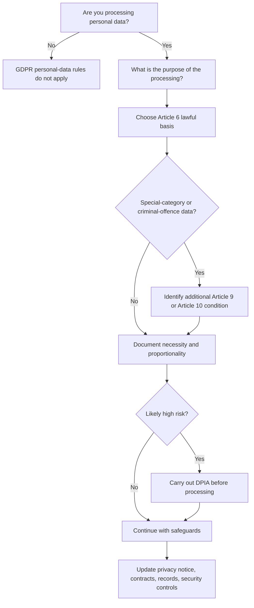
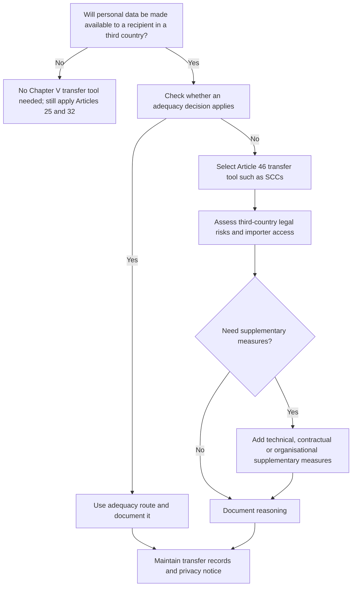

# GDPR / DPIA Guidance for Adopters

This guide helps developers, DPOs, counsel, security reviewers, and procurement
teams assess an open-source Gaze deployment under the EU GDPR.

This is not legal advice or a compliance certification. Gaze does not make a
deployment GDPR-compliant. Your DPO or counsel must assess its purpose, legal
basis, data flows, contracts, and risks.

Your privacy notice should explain tokenisation, lawful basis, recipients and
processors, transfers, retention, and how people can exercise their rights.
Gaze architecture links describe technical controls; official sources appear
in [§15](#15-authoritative-sources).

## How to read this document

Use §§1–3 for roles and legal scope, §§4–7 for storage and restore controls,
§§8–11 for transfers, rights, and limits, and [§13](#13-suggested-dpia-checklist)
for a deployment checklist.

## 1. Controller / processor roles

Roles follow actual purposes and means, not vendor labels. An adopter deciding
why and how personal data is processed acts as controller. Assess your own role
and the LLM provider's role against contracts and practice.

Open-source Gaze runs inside your process, container, or VM. Maintainers operate
no service for that data: no phone-home, telemetry, or aggregation. There is no
maintainer-side processing to classify. A hosted offering would need its own
role and contract assessment.

| Provider behavior | Role to assess | Required analysis |
|---|---|---|
| Completions only, on your instructions | Processor | Article 28 DPA, sub-processors, transfers |
| Own purposes, such as training or product improvement | Independent controller for that processing | Lawful basis and transparency for disclosure |
| Jointly decides purposes and essential means | Joint controller | Article 26 arrangement and contact point |

These are examples, not legal conclusions. Sending tokens changes the data
received; it does not determine the provider's role. A processor label in a DPA
must match actual practice. See [EDPB 07/2020](https://www.edpb.europa.eu/our-work-tools/our-documents/guidelines/guidelines-072020-concepts-controller-and-processor-gdpr_en)
and [CNIL's AI provider guidance](https://www.cnil.fr/en/determining-legal-qualification-ai-system-providers).

## 2. Pseudonymisation vs anonymisation

Gaze substitutes identifiers with reversible tokens. The restore manifest is
the additional information under Article 4(5); keep it separate and protected.
See the [session contract](../../explanation/core/session-contract.md).
Do not label tokenised text anonymous by default.

### Identifiability is assessed per party

Apply Recital 26's reasonably-likely-means test to each holder, including the
context they receive and other information they can obtain.

| Holder | Assessment |
|---|---|
| Adopter with tokens and manifest | Ordinarily personal data: the adopter can restore it |
| Recipient with tokens only | Depends on reasonable access to mappings and identifying context |
| LLM provider | Depends on received context, retention, logging, training, and reasonable re-identification |

Lawful basis, transparency, rights, retention, and security duties continue for
parties that can reasonably re-identify. Pseudonymisation reduces risk; it does
not remove those duties. See [EDPS v SRB](https://curia.europa.eu/jcms/upload/docs/application/pdf/2025-09/cp250107en.pdf)
and [EDPB 01/2025](https://www.edpb.europa.eu/our-work-tools/our-documents/guidelines/guidelines-012025-pseudonymisation_en);
verify the current status of guidance before relying on it.

## 3. Data protection by design and by default (Article 25)

Article 25 applies to the controller's whole deployment. Gaze supports these
controls; you must configure and document them.

| Objective | Gaze control | Adopter duty |
|---|---|---|
| Minimise model input | Detect and tokenise configured classes | Enable needed classes; reduce free text and quasi-identifiers |
| Protect before disclosure | Clean input before model transit | Enforce the input path; output-only cleaning is too late |
| Limit re-identification | Manifest-bound restore | Authorize users and paths; restore only necessary values |
| Limit storage | Ephemeral sessions and daemon eviction | Set retention, encryption, and deletion for persisted copies |

See [EDPB Article 25 guidance](https://www.edpb.europa.eu/our-work-tools/our-documents/guidelines/guidelines-42019-article-25-data-protection-design-and_en).

## 4. Retention of the restore manifest

Choose the shortest retention the workflow permits; Gaze sets no fixed period.

- `Scope::Ephemeral` keeps the namespace in memory until the `Session` drops;
  `export()` is unavailable.
- `gaze daemon` evicts least-recently-used sessions over `--session-cap` and
  sessions idle beyond `--session-idle-timeout`. This drops the in-memory map,
  not exported copies. See [daemon mode](../../explanation/daemon/daemon-mode.md).
- In the library session flow, you explicitly export and persist snapshots.
  You choose storage, encryption, and deletion.

Prefer request- or turn-lifetime memory. If persistence is needed, set the
shortest usable TTL, encrypt at rest, and obtain DPO approval for retention.
Restrict manifest access and audit restore: manifest compromise defeats the
pseudonymisation layer.

## 5. The restore-authorisation boundary

The [restore boundary](../../explanation/core/restore-boundary.md) checks the
active manifest's exact token-to-value mappings. Strict restore returns typed
failures for unknown, malformed, foreign-session, or foreign-tenant tokens.
It never guesses originals. Decisions are deterministic and can be audited
without raw values.

This enforces manifest integrity and outbound control. It does not detect
prompt injection, jailbreaks, or intent.

You must authorize callers around restore: user, role, tenant, and application
path. Keep restore within the manifest's trust boundary and inaccessible to the
LLM. Restore only needed values for authorized users after model output, then
log the call with metadata. Avoid blanket restoration as a display default.

## 6. Enterprise security considerations

Gaze protects the model boundary. You secure the host, storage, and keys.

### 6.1 Manifest storage and encryption at rest

`Session::export()` returns a `SensitiveSnapshot` containing original PII.
Gaze signs the envelope with Ed25519; `Session::import()` verifies it and rejects
tampered or truncated snapshots with a typed signature-verification error.
Signing provides integrity, not confidentiality. Encrypt `snapshot.into_bytes()`
with your own storage mechanism; otherwise the PII is stored in cleartext.

### 6.2 Key management

Each `Session` holds an in-process signing key and is non-`Debug` to prevent
accidental logging. Snapshots carry a key/version marker. You manage rotation,
secret storage, at-rest encryption keys, and HSM/KMS integration.

### 6.3 Tenant and session isolation

Separate `Session`s have separate counters and value-to-token maps, regardless
of `Scope`. Foreign-session tokens fail strict restore. You map tenants and
conversations to sessions; never share one across unrelated boundaries.
Sharing reintroduces linkability. See the [session contract](../../explanation/core/session-contract.md#single-shared-session-across-conversations).

### 6.4 Compromise scenarios

| Compromise | Effect |
|---|---|
| Host/process | Attacker can read the manifest and signing key and restore values |
| Unencrypted snapshot | Original PII exposed directly |
| Encrypted snapshot | Exposure depends on your key controls |
| Signing key | Forged snapshots may pass import |
| Over-broad or misdirected restore | PII reaches an unauthorized user or exceeds the task's need |

### 6.5 Incident response and monitoring

Plan for manifest compromise, unauthorized or anomalous restore, misdirected
prompts, and provider exposure. Include [72-hour notification analysis](https://www.edpb.europa.eu/our-work-tools/our-documents/guidelines/guidelines-92022-personal-data-breach-notification-under_en).
Enable metadata audit trails; you own monitoring, alerts, and retention.

## 7. Audit logs and metadata

The optional `gaze-audit` sink records class, recognizer/version, action,
timestamp, opaque session ID, and conflict/provenance metadata. It has no raw
value or token-to-value column. `AUDIT_RESTRICTED_COLUMNS` excludes raw PII,
token values, and document content; a build-time isolation gate protects the
path. Queries open the DB read-only.

Metadata can still identify someone when linked to other information. Treat
session IDs, timestamps, and field names as sensitive records with retention,
access, and minimisation controls. See [Breyer](https://curia.europa.eu/jcms/upload/docs/application/pdf/2016-10/cp160112en.pdf).
Your request logs, traces, raw prompts, and restored-output logs fall outside
Gaze's metadata-only guarantee and need separate controls.

## 8. International transfers (Chapter V)

Making personal data available outside the EEA can trigger Chapter V alongside
lawful-basis and security duties. Tokens and surrounding context may remain
personal data for the recipient; Gaze does not settle the transfer analysis.

1. Identify the recipient, country, and whether a transfer occurs.
2. Check the current [adequacy decisions](https://commission.europa.eu/law/law-topic/data-protection/international-dimension-data-protection/adequacy-decisions_en).
   For the EU-U.S. DPF, verify the specific entity's certification and relevant
   data categories on the official list; do not assume coverage.
3. If adequacy does not apply, assess an Article 46 tool such as
   [SCCs](https://commission.europa.eu/law/law-topic/data-protection/international-dimension-data-protection/new-standard-contractual-clauses-questions-and-answers-overview_en).
4. Assess third-country law and importer access, with supplementary measures
   where needed. Whether pseudonymisation is sufficient depends on the facts.
5. Record the transfer and update the privacy notice.

Verify current decisions and case law, including DPF challenges and Schrems I/II.
See [EDPB 05/2021](https://www.edpb.europa.eu/our-work-tools/our-documents/guidelines/guidelines-052021-interplay-between-application-article-3_en)
and the [transfer flow](#international-transfer-decision-flow).

## 9. Erasure and other data-subject rights (Article 17)

Deleting the mapping reduces your ability to identify someone through tokens.
It does not prove anonymisation or automatically satisfy Article 17.

Account for exported snapshots, backups, replicas, application logs, downstream
systems, and provider copies. Deleting your manifest does not delete those.
Residual free text may still identify people. Legal holds and Articles 17(1)–(3)
conditions or exceptions can affect erasure.

Assess remaining identifiability and erase across systems where required,
including a documented backup-cycle approach. Plan access (Article 15),
rectification (16), portability (20), and objection (21) across both the
manifest and working-data copies.

## 10. Limits of pseudonymisation

| Limit | Adopter response |
|---|---|
| Combinations of age, job, place, health, or other quasi-identifiers can identify someone | Minimise context; consider smaller payloads or another lawful processing approach |
| Writing style and recurring topics can link separate sessions | Assess contextual linkage; session tokens only prevent token-based linkage |
| NER can miss unusual names, transliterations, and naming conventions | Do not rely on NER alone for high-stakes free text |
| Unmatched identifiers produce no token; no detector is exhaustive | Configure tenant classes, test real data, and consider the [safety net](../../explanation/safety-net/safety-nets.md) |
| Host compromise exposes mappings and keys | Secure the host and manifest storage |

The [coverage table](../../../README.md) describes coverage, not a guarantee.

## 11. Dual-use and misuse risks

Keep enough information for authorized humans to make accountable decisions;
restore only what they need. Pseudonymisation supplies no Article 6 lawful basis.

Cross-session tracking is further processing: assess purpose, lawful basis,
transparency, and DPIA needs. Disabling a configured safety net reduces coverage.
Output-only cleaning cannot undo input already disclosed to the provider.
Report unsafe deployment patterns through [§16](#16-reporting-privacy-concerns).

## 12. Visual aids

These flows are assessment aids, not legal conclusions.

### Data flow and restore boundary

```mermaid
flowchart LR
    A[User or source system with raw personal data]
    B[Local application]
    C[Gaze tokenisation and redaction]
    D[Local restore manifest]
    E[Tokenized prompt]
    F[External LLM provider]
    G[Tokenized completion]
    H[Local authorised restore step]
    I[Human-facing UI or downstream system]

    A --> B
    B --> C
    C --> D
    C --> E
    E --> F
    F --> G
    G --> H
    D --> H
    H --> I

    classDef local fill:#eef,stroke:#556;
    classDef external fill:#efe,stroke:#565;
    class B,C,D,H,I local;
    class F external;
```

### Lawful basis decision tree

```mermaid
flowchart TD
    A[Are you processing personal data?]
    A -->|No| Z[GDPR personal-data rules do not apply]
    A -->|Yes| B[What is the purpose of the processing?]
    B --> C[Choose Article 6 lawful basis]
    C --> D{Special-category or criminal-offence data?}
    D -->|Yes| E[Identify additional Article 9 or Article 10 condition]
    D -->|No| F[Document necessity and proportionality]
    E --> F
    F --> G{Likely high risk?}
    G -->|Yes| H[Carry out DPIA before processing]
    G -->|No| I[Continue with safeguards]
    H --> I
    I --> J[Update privacy notice, contracts, records, security controls]
```

### International transfer decision flow

```mermaid
flowchart TD
    A[Will personal data be made available to a recipient in a third country?]
    A -->|No| B[No Chapter V transfer tool needed; still apply Articles 25 and 32]
    A -->|Yes| C[Check whether an adequacy decision applies]
    C -->|Yes| D[Use adequacy route and document it]
    C -->|No| E[Select Article 46 transfer tool such as SCCs]
    E --> F[Assess third-country legal risks and importer access]
    F --> G{Need supplementary measures?}
    G -->|Yes| H[Add technical, contractual or organisational supplementary measures]
    G -->|No| I[Document reasoning]
    H --> I
    D --> J[Maintain transfer records and privacy notice]
    I --> J
```

---

## 13. Suggested DPIA checklist

Review with your DPO. This list is not exhaustive; see [CNIL's DPIA guidance](https://www.cnil.fr/en/guidelines-dpia).

- [ ] Purpose, necessity, proportionality, Article 6 basis, and any Article 9/10 condition.
- [ ] Further processing, including analytics or tracking across sessions.
- [ ] Smallest necessary payload; quasi-identifiers addressed.
- [ ] Enabled classes, detected-but-preserved classes and reasons, safety-net configuration.
- [ ] Provider's actual role, matching contract, Article 28 DPA or Article 26 arrangement.
- [ ] Sub-processors reviewed; transfer countries, entity certification, tools, assessment, and supplementary measures documented.
- [ ] Manifest storage, adopter-provided encryption, signing/encryption key custody and rotation.
- [ ] Separate sessions per tenant/conversation; minimum usable TTL and deletion schedule.
- [ ] Access to manifests, audit records, and application logs restricted and logged.
- [ ] Restore limited to authorized paths and necessary values; calls audited.
- [ ] Metadata audit enabled; surrounding logs controlled; backups and exports covered.
- [ ] Incident response covers compromise, unauthorized restore, misdirected prompts, provider exposure, and notification analysis.
- [ ] Access, rectification, erasure, portability, and objection cover all copies; manifest deletion is not labelled automatic anonymisation or compliance.
- [ ] Article 30 records cover tokenisation, storage, recipients, transfers, retention, and security.

## 14. When to consult counsel — limits of this guidance

Ask your DPO or counsel to determine recipient identifiability, provider roles,
lawful basis and Article 9/10 conditions, transfers and sufficient safeguards,
rights and retention conflicts, DPIA/prior-consultation duties, and breach
notification for your facts.

This guide covers open-source Gaze inside your trust boundary, applied before
model transit with restricted restore. It assesses no particular provider,
contract, country, or sector regime (including health, finance, telecoms,
employment, or the EU AI Act). Hosted products need separate analysis.
Regulatory guidance and case law change; verify source status before relying
on it.

## 15. Authoritative sources

Verify current status; these sources support your own assessment.

| Topic | Official source |
|---|---|
| Core law | [General Data Protection Regulation (EU) 2016/679](https://eur-lex.europa.eu/eli/reg/2016/679/oj/eng) (EUR-Lex) |
| Controller vs processor | [Guidelines 07/2020 on the concepts of controller and processor](https://www.edpb.europa.eu/our-work-tools/our-documents/guidelines/guidelines-072020-concepts-controller-and-processor-gdpr_en) (EDPB) |
| AI provider qualification | [Determining the legal qualification of AI system providers](https://www.cnil.fr/en/determining-legal-qualification-ai-system-providers) (CNIL) |
| Sub-processors | [Opinion 22/2024 on processors and sub-processors](https://www.edpb.europa.eu/system/files/2024-10/edpb_opinion_202422_relianceonprocessors-sub-processors_en.pdf) (EDPB) |
| Design/default | [Guidelines 4/2019 on Article 25 Data Protection by Design and by Default](https://www.edpb.europa.eu/our-work-tools/our-documents/guidelines/guidelines-42019-article-25-data-protection-design-and_en) (EDPB) |
| Pseudonymisation | [Guidelines 01/2025 on pseudonymisation](https://www.edpb.europa.eu/our-work-tools/our-documents/guidelines/guidelines-012025-pseudonymisation_en) (EDPB) |
| Pseudonymisation case law | [EDPS v SRB press release](https://curia.europa.eu/jcms/upload/docs/application/pdf/2025-09/cp250107en.pdf) (CURIA) |
| Personal data in context | [Breyer (C-582/14) press release](https://curia.europa.eu/jcms/upload/docs/application/pdf/2016-10/cp160112en.pdf) (CURIA) |
| Personal-data qualification | [Sheet n°1: Identify personal data](https://www.cnil.fr/en/sheet-ndeg1-identify-personal-data) (CNIL) |
| Consent | [Guidelines 05/2020 on consent](https://www.edpb.europa.eu/our-work-tools/our-documents/guidelines/guidelines-052020-consent-under-regulation-2016679_en) (EDPB) |
| Transparency | [Transparency guidelines (WP260 rev.01)](https://ec.europa.eu/newsroom/article29/item-detail.cfm?item_id=622227) (EC archive of endorsed WP29 guidance) |
| Access rights | [Guidelines 01/2022 on data subject rights – Right of access](https://www.edpb.europa.eu/our-work-tools/our-documents/guidelines/guidelines-012022-data-subject-rights-right-access_en) (EDPB) |
| DPIA | [Guidelines on DPIA](https://www.cnil.fr/en/guidelines-dpia) (CNIL) |
| Breach notification | [Guidelines 9/2022 on personal data breach notification](https://www.edpb.europa.eu/our-work-tools/our-documents/guidelines/guidelines-92022-personal-data-breach-notification-under_en) (EDPB) |
| RoPA | [Records of Processing Activities under Article 30](https://www.dataprotection.ie/en/dpc-guidance/records-of-processing-article-30-guidance) (Irish DPC) |
| Security | [The standard data protection model](https://www.bfdi.bund.de/EN/Fachthemen/Inhalte/Technik/SDM.html) (BfDI) |
| Processor contracts | [Contracts and liabilities between controllers and processors](https://ico.org.uk/for-organisations/uk-gdpr-guidance-and-resources/accountability-and-governance/contracts-and-liabilities-between-controllers-and-processors-multi/) (ICO) |
| Article 30 documentation | [What do we need to document under Article 30?](https://ico.org.uk/for-organisations/uk-gdpr-guidance-and-resources/accountability-and-governance/documentation/) (ICO) |
| Transfers (interplay) | [Guidelines 05/2021 on the interplay between Article 3 and Chapter V](https://www.edpb.europa.eu/our-work-tools/our-documents/guidelines/guidelines-052021-interplay-between-application-article-3_en) (EDPB) |
| Transfers (supplementary measures) | [Recommendations 01/2020 on measures that supplement transfer tools](https://www.edpb.europa.eu/our-work-tools/our-documents/recommendations/recommendations-012020-measures-supplement-transfer_en) (EDPB) |
| SCCs | [New Standard Contractual Clauses – Q&A overview](https://commission.europa.eu/law/law-topic/data-protection/international-dimension-data-protection/new-standard-contractual-clauses-questions-and-answers-overview_en) (European Commission) |
| Adequacy | [Adequacy decisions](https://commission.europa.eu/law/law-topic/data-protection/international-dimension-data-protection/adequacy-decisions_en) (European Commission) |
| EU-U.S. transfers | [Commission Implementing Decision (EU) 2023/1795](https://eur-lex.europa.eu/eli/dec_impl/2023/1795/oj/eng) (EUR-Lex) |
| Schrems I | [Schrems (C-362/14) press release](https://curia.europa.eu/jcms/jcms/P_180250/) (CURIA) |
| Schrems II | [Schrems II (C-311/18) press release](https://curia.europa.eu/jcms/upload/docs/application/pdf/2020-07/cp200091en.pdf) (CURIA) |
| Current DPF litigation | [Latombe v Commission (T-553/23)](https://infocuria.curia.europa.eu/tabs/redirect/juris/liste.jsf?num=T-553%2F23) (InfoCuria) |
| German transfer note | [Anwendungshinweise zum Angemessenheitsbeschluss EU-US DPF](https://www.datenschutzkonferenz-online.de/media/ah/230904_DSK_Ah_EU_US.pdf) (DSK, German) |

## 16. Reporting privacy concerns

Report privacy bugs in a GitHub issue with the `privacy` label. Use
[`SECURITY.md`](../../../SECURITY.md) for vulnerabilities needing private
handling before a fix. Share deployment feedback in GitHub Discussions.
