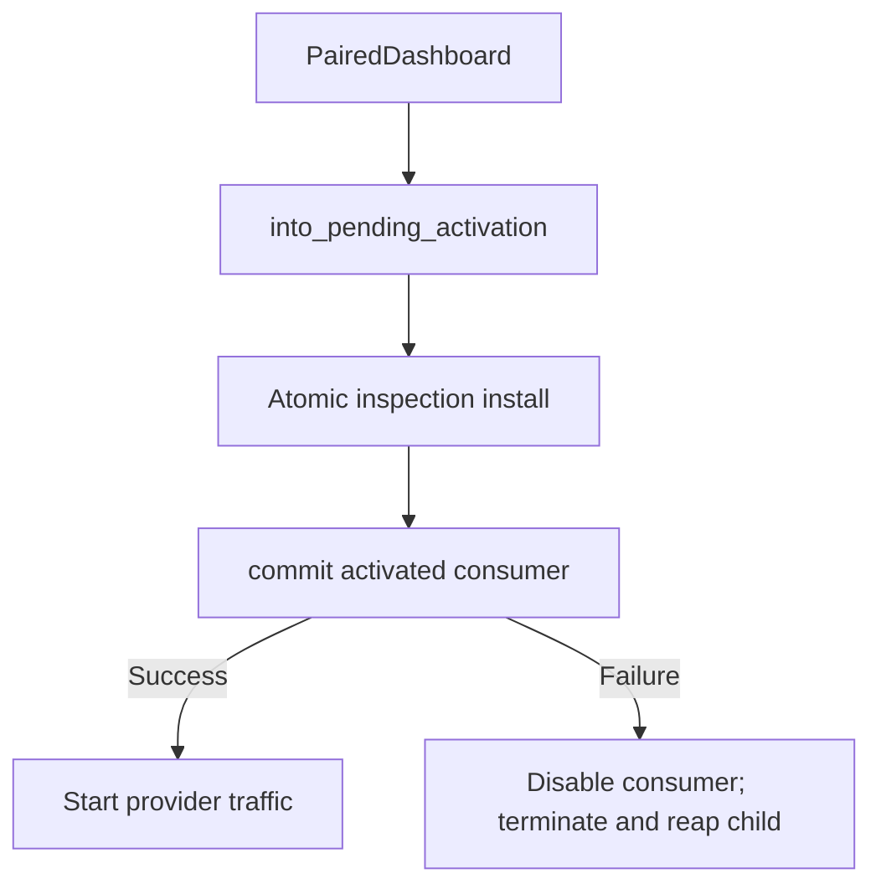

# Run the local dashboard

Rust hosts must opt in explicitly; construct no dashboard object on the off
path. The CLI handles this flow with `gaze proxy serve --dashboard`; see
[dashboard flags](../../reference/cli.md#dashboard-flags-opt-in-dashboard-cargo-feature).

## Prerequisites

Requires Unix-domain sockets and a reviewed API that sets and verifies both
core-dump limits at zero. Darwin returns `NoDumpUnavailable` before binding,
token generation, or sensitive IPC. There is no in-process/thread fallback
and no claim of macOS crash-artifact suppression.

## 1. Select immutable startup capture

Start with `DashboardPayloadAcceptance::provider_visible()`. Adding `OwnerRaw`
requires `OwnerRawRiskAcknowledgement::acknowledge_pii_risk()`; `OwnerRestored`
requires `OwnerRestoredRiskAcknowledgement::acknowledge_reidentification_risk()`.
Capture is fixed at launch; browser requests cannot widen it.

Use `LoopbackBind::fresh_ephemeral_v4()` for a fresh literal IPv4 loopback address
and port zero. Configured literal loopback addresses also require port zero;
display an origin-reuse warning.

## 2. Spawn the sensitive child

Pass the hidden child command to `SpawnedDashboardChild::spawn`. It owns both
listeners, creates a private `0700` socket directory, passes only socket paths
to that child, and checks peer PID credentials where available. No constructor
accepts an unrelated child/channel pair.

The child calls `ChildInheritedHandles::connect_from_environment`, then
`DashboardChildEntrypoint::run`. It rejects non-socket handles and verifies
no-dump readiness before binding or creating sensitive state.

## 3. Complete pairing

Pass the child to `DashboardSupervisor::prepare`. Your `PairingDelivery` must
send the canonical 43-byte credential only through a controlling terminal or a
reviewed, acknowledged local channel. Never put it in arguments, environment,
logs, files, URLs, cookies, HTML, browser storage, or telemetry.

`PairedDashboard` is returned only after the child frame and nonce-bound
delivery acknowledgement complete.

## 4. Atomically install inspection

`into_pending_activation()` returns `PendingDashboardActivation`,
`PendingInspectionConsumerV1`, and the immutable `DashboardCaptureDescriptorV1`.
Pass the consumer and descriptor to the atomic gaze-inspection installer
(`gaze_proxy::install_proxy_inspection_v1` for proxies). It returns the proxy
producer and `ActivatedInspectionConsumerV1`.

Pass that activated consumer to `PendingDashboardActivation::commit`. Commit
checks the one-shot binding before socket, writer, runtime, or admission side
effects; a foreign registration returns `ActivationFailed`. Descriptor equality,
caller assertions, generic closures, or post-install wrappers cannot replace
this binding.

Retain no extra sink, choose no epoch, inject no loose control object, and start
no provider traffic before commit. Any post-install failure requires disabling
the consumer and fully terminating/reaping the child before provider operation.

## 5. Operate and stop

`DashboardControl::purge` permits reuse within the registration.
`rotate_pairing_secret` requires a fresh acknowledged delivery and invalidates
the old authentication generation. Shutdown is one-way and completes only after
disable, zeroization, termination, and reap.

`DashboardStatus::Disabled` is a dashboard-only failure. Do not retry capture
in that launch or change the provider enforcement result.
