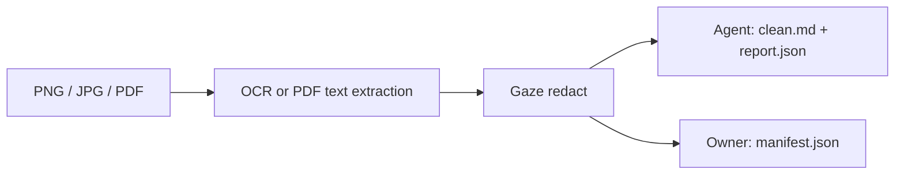

# Ingest documents into a SafeBundle

`gaze document clean` creates a split SafeBundle. See the
[extension contract](../../explanation/document/document-extension.md).

## When to use document ingestion

Use this path for PNG, JPG, or PDF input.



`clean.md` contains tokenized Markdown. `report.json` records OCR, layout, and
PII counts without raw PII. `manifest.json` holds the restore mapping; keep it
out of LLM workspaces. Runtime path validation separates the agent and owner outputs.

## Prerequisites

- A `gaze` binary built with the `document` feature.
- `tesseract` on PATH for OCR.
- The pdfium runtime when PDF input is used.

Install from the repository:

```sh
cargo install --path crates/gaze-cli --features document
```

Install Tesseract with your platform package manager:

```sh
brew install tesseract
sudo apt-get install tesseract-ocr
```

For PDFs, install a pdfium shared library and make it visible to the runtime
with your platform's dynamic-library path.

## Run `gaze document clean`

Run OCR plus Gaze redaction:

```sh
# Convenience shorthand: --out creates agent/ + owner/ subdirs.
gaze document clean ./invoice.pdf --out ./safe-bundle/

# Explicit: caller controls both paths.
gaze document clean ./invoice.pdf --agent-out ./agent-bundle/ --owner-out ./owner-vault/
```

The command creates missing output directories and prints a one-line JSON summary.

```text
safe-bundle/
  agent/
    clean.md
    report.json
  owner/
    manifest.json
```

## Read the SafeBundle

Share `agent/clean.md` and `agent/report.json`. Keep `owner/manifest.json` private.
Reports use `BundleReport`, `bundle_version = 2`; v1 reports still deserialize.

| Field | Meaning |
|---|---|
| `page_index` | Zero-based page |
| `ocr_source` | `vector_pdf` for selectable text; `ocr` for raster OCR |
| `ocr_backend` | Backend name when OCR produced the page |
| `confidence` | Page confidence, `0.0..=1.0` |
| `low_confidence` | Confidence below `low_confidence_threshold` (default `0.65`) |
| `column_count` | Detected column count |

### Layout report v2 features

Selectable PDF text bypasses OCR. Raster input is deskewed before OCR.
Multi-column spans use conservative reading order; table-like grids retain
inline cell boundaries.

## Restore cleaned output

Restore model output with the owner-held `manifest.json`; never ask the model
to infer originals. Follow the [restore contract](../../../crates/gaze-cli/README.md#restore)
for your embedding surface.

## Plug in another OCR backend with `OcrBackend`

`OcrBackend` is the narrow second-party extension point for OCR drivers:

```rust
pub trait OcrBackend: Send + Sync {
    fn name(&self) -> &str;
    fn recognize(&self, image: ImageInput, hints: OcrHints) -> Result<Vec<OcrSpan>, OcrError>;
}
```

The default backend is `TesseractBackend`. Alternative drivers receive finalized
image bytes and return flat spans with bounding boxes and optional confidence.
Magic-byte validation is mandatory before bytes are accepted as PNG, JPEG, or
TIFF image input; unsupported payloads fail closed before OCR.

## Next steps

- [`docs/explanation/document/document-extension.md`](../../explanation/document/document-extension.md)
  — document extension contract and bundle boundary.
- [`crates/gaze-document/README.md`](../../../crates/gaze-document/README.md) —
  runtime requirements, crate API, and feature flags.
