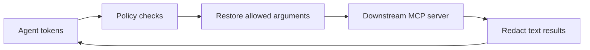

# Set up the MCP bridge

Connect the agent only to `gaze mcp bridge`.



For the trust model and fail-closed dispatch order, see the
[MCP bridge architecture](../../explanation/mcp/mcp-bridge.md).

## Prerequisites

- A `gaze` binary built with the `mcp` feature.
- One or more downstream MCP servers that can run over stdio.
- A bridge TOML file that names those servers and the per-tool policy.
- A 32-byte session key when using persistent file sessions.

Install the CLI from the repository with MCP support:

```sh
cargo install --path crates/gaze-cli --features mcp
```

## Start from a config

Copy a starter:

```sh
cp docs/how-to/mcp/bridge-configs/safe-defaults.toml gaze.mcp.toml
```

Available starters:

| Config | Use it for |
|---|---|
| [`safe-defaults.toml`](bridge-configs/safe-defaults.toml) | A minimal deny-by-default bridge with processed text results. |
| [`email-calendar.toml`](bridge-configs/email-calendar.toml) | Email and calendar tools where only selected recipient/body fields may receive restored tokens. |
| [`filesystem.toml`](bridge-configs/filesystem.toml) | Filesystem tools that should process results while denying sensitive path and content arguments by default. |
| [`cua.toml`](bridge-configs/cua.toml) | Computer-use tools where typed text can contain restored tokens but screenshots are denied. |
| [`policy.toml`](bridge-configs/policy.toml) | A policy-only snippet for embedding into a larger bridge config. |
| [`dangerous-outputs.toml`](bridge-configs/dangerous-outputs.toml) | Isolated tests for the explicit unsafe `result.mode = "allow"` opt-in. |

## Configure downstream servers

Edit each `[servers.<name>]` entry so `command`, `args`, `env`, and `cwd` match
the downstream MCP server you want the bridge to spawn:

```toml
[servers.email]
command = "example-email-mcp"
args = ["--stdio"]
```

The bridge discovers each downstream tool and exposes it to the agent with a
namespaced name such as `email.send`.

## Keep the policy deny-by-default

Start with a restrictive default policy:

```toml
[policy.default]
allow_sensitive_fields = false
requires_approval = false
on_block = "refuse"
log_raw = false

[policy.default.result]
mode = "process"
```

Allow only top-level fields that need restored values:

```toml
[policy.tools."email.send".arguments.to]
allow_sensitive_fields = true

[policy.tools."email.send".arguments.body]
allow_sensitive_fields = true
requires_approval = true
```

Keep `log_raw = false`. Use `result.mode = "process"` for normal deployments so
text results are redacted before the agent sees them. `result.mode = "allow"` is
an explicit unsafe opt-in and should stay limited to isolated tests where the
downstream server cannot produce raw PII.

## Choose session storage

Use ephemeral sessions for short-lived local runs:

```toml
[session]
mode = "ephemeral"
```

Use file sessions when multiple bridge calls need the same restore manifest:

```toml
[session]
mode = "file"
dir = ".gaze/bridge-sessions"
key_env = "GAZE_BRIDGE_SESSION_KEY"
```

Provide a 32-byte key through the named environment variable:

```sh
export GAZE_BRIDGE_SESSION_KEY="$(openssl rand -base64 32)"
```

Keep the key in a secret manager for shared or long-lived deployments; plan rotation.

## Verify the tool surface

Check discovery before connecting an agent:

```sh
gaze mcp bridge --config gaze.mcp.toml --dry-run --print-tools
```

The command starts the downstream MCP servers, prints the namespaced tools and
denied resource/prompt counts, and exits with `policy loaded fail-closed` when
the bridge config is accepted.

## Connect an MCP client

Point your MCP client at the bridge command instead of the downstream servers:

```json
{
  "mcpServers": {
    "gaze-bridge": {
      "command": "/absolute/path/to/gaze",
      "args": [
        "mcp",
        "bridge",
        "--config",
        "/absolute/path/to/gaze.mcp.toml"
      ],
      "env": {
        "GAZE_BRIDGE_SESSION_KEY": "replace-with-a-secret-manager-reference"
      }
    }
  }
}
```

Keep downstream servers private to the bridge; never register them directly with the agent.

## Run the bridge

Start the stdio bridge:

```sh
gaze mcp bridge --config gaze.mcp.toml
```

Use `--session-dir` to override `[session].dir` for file mode without editing
the checked-in config:

```sh
gaze mcp bridge --config gaze.mcp.toml --session-dir ./.gaze/local-bridge-sessions
```

The bridge writes its audit metadata under the same MCP manifest directory used
by `gaze mcp serve`; that metadata records paths and policy decisions, not raw
argument or result payloads.
