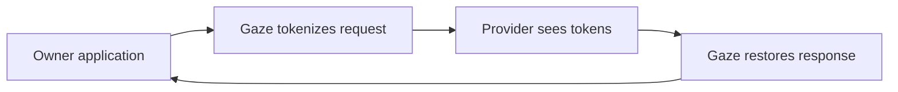

# Set up the proxy

`gaze proxy` protects API-key HTTP traffic. See the
[runtime contract](../../explanation/proxy/proxy-runtime.md).
Anthropic adopters must also follow the
[strict Anthropic Messages contract](../../explanation/proxy/anthropic-messages-contract.md).

## When to use the proxy

Route API-key SDK traffic for OpenAI, Anthropic, or Gemini through Gaze. Keep
the provider key and change the SDK base URL.



The pipeline covers SSE deltas and tool-call JSON. Provider adapters select
text surfaces; detection uses your configured policy.

## Prerequisites

- A `gaze` binary on PATH; default releases include proxy support.
- A policy TOML file on disk. See [`docs/reference/policy.md`](../../reference/policy.md) for policy
  authoring.
- An application or SDK that can override provider base URLs with environment
  variables or equivalent client options.
- Provider API keys for the upstream services your application already calls.

For a minimal proxy policy, start with this deterministic email rule.
Ephemeral session scope is valid for the proxy. For `gaze clean`, use
`scope = "conversation"` instead: ephemeral sessions forbid the session blob
export that `gaze clean` requires and return `PolicyConfig` (exit 2).

```toml
[session]
scope = "ephemeral"

[[rule]]
kind = "class"
class = "email"
action = "tokenize"
```

## Start the proxy

Start the daemon with your policy:

```sh
gaze proxy start --policy ./policy.toml
```

The default listener is:

```text
http://127.0.0.1:8787
```

`start` persists the daemon config, launches the foreground proxy process, and
writes a pidfile in the platform local-data directory. Use `serve` instead when
you want the proxy in the foreground for a process supervisor you already own:

```sh
gaze proxy serve --policy ./policy.toml --bind 127.0.0.1:8787
```

## Point your SDK at the proxy

OpenAI SDKs usually expect `/v1` in the base URL:

```sh
export OPENAI_API_KEY=sk-test-api-key
export OPENAI_BASE_URL=http://127.0.0.1:8787/v1
```

Anthropic SDKs usually expect the provider root:

```sh
export ANTHROPIC_API_KEY=sk-ant-test-api-key
export ANTHROPIC_BASE_URL=http://127.0.0.1:8787
```

Do not append `/v1`: the strict Anthropic client base URL is the proxy root and
the SDK must issue exactly `POST /v1/messages`. The direct constructor is
ephemeral and rejects `x-gaze-session-id`. If the embedding host explicitly
enables session continuity, send `x-gaze-session-id` on every request with a
canonical lowercase UUIDv4 value. The proxy requires `x-api-key` and
`anthropic-version`; the default version allowlist contains only `2023-06-01`.
`anthropic-beta` is denied until its complete value is explicitly allowlisted.

Only `content-type`, `x-api-key`, `anthropic-version`, and the optional
allowlisted beta header can reach the Anthropic upstream. Unconfigured
`Authorization`, cookies, and other SDK headers are dropped. A configured local
`Authorization` credential is consumed as singleton principal input and is
also never forwarded.

Gemini clients use the Google API key and a Gemini base URL override:

```sh
export GOOGLE_API_KEY=test-google-api-key
export GEMINI_BASE_URL=http://127.0.0.1:8787
```

Run your application; the proxy cleans requests and restores owner-visible responses.

## Verify the proxy is running

Check the daemon state:

```sh
gaze proxy status
```

Expected shape:

```text
gaze-proxy running (pid=12345, bind=127.0.0.1:8787)
  adapters: openai -> https://api.openai.com/
            anthropic -> https://api.anthropic.com/
            gemini -> https://generativelanguage.googleapis.com/
```

Inspect logs:

```sh
gaze proxy logs
gaze proxy logs --follow
```

For a local health check, call the reserved proxy endpoint:

```sh
curl http://127.0.0.1:8787/_gaze_proxy/healthz
```

## Stop, restart, and supervise the proxy

Stop the daemon:

```sh
gaze proxy stop
```

Restart it with the persisted config:

```sh
gaze proxy restart
```

Use a bounded stop window when a deployment needs one:

```sh
gaze proxy stop --timeout 30s
gaze proxy restart --timeout 30s
```

The CLI also exposes supervisor install hooks:

```sh
gaze proxy install-launchd
gaze proxy install-systemd-user
```

Those hooks are reserved for the platform integration path. Today they return a
typed message directing you to `gaze proxy start` and `gaze proxy stop`.

## What the proxy does not cover

The proxy supports provider API keys (`OPENAI_API_KEY`, `ANTHROPIC_API_KEY`,
`GOOGLE_API_KEY`). ChatGPT Plus, Claude.ai, and Gemini Advanced use browser
sessions/cookies and web endpoints; those are outside this contract.

## Next steps

- [`docs/explanation/proxy/proxy-runtime.md`](../../explanation/proxy/proxy-runtime.md) —
  adapter matrix, session TTL, and daemon lifecycle.
- [`docs/explanation/proxy/anthropic-messages-contract.md`](../../explanation/proxy/anthropic-messages-contract.md) —
  strict Anthropic setup, wire surfaces, limits, errors, inspection boundary,
  migration, and manual official-SDK gate.
- [`crates/gaze-proxy/README.md`](../../../crates/gaze-proxy/README.md) — crate
  README and provider endpoint list.
- [`docs/reference/cli.md#gaze-proxy`](../../reference/cli.md#gaze-proxy) — CLI guide and flag
  summary.
