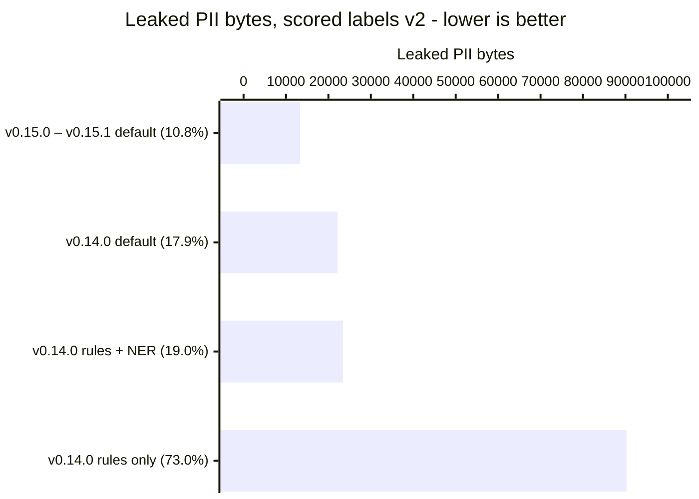
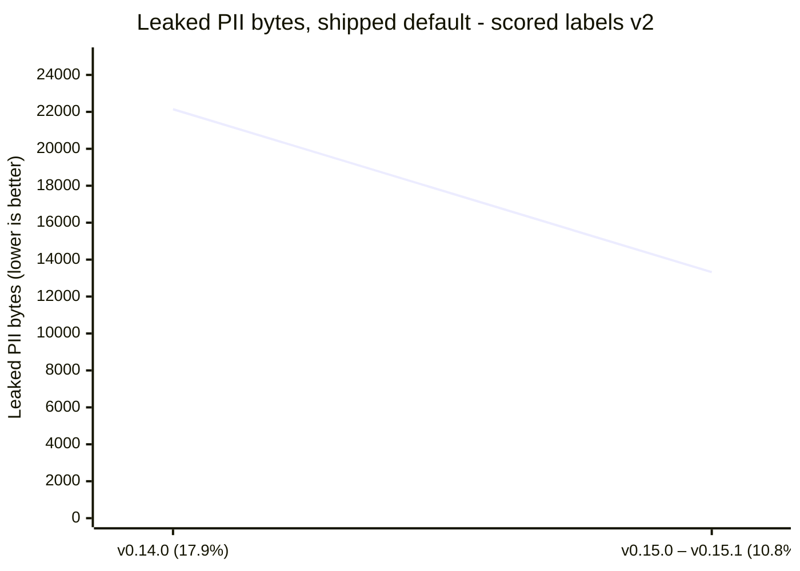
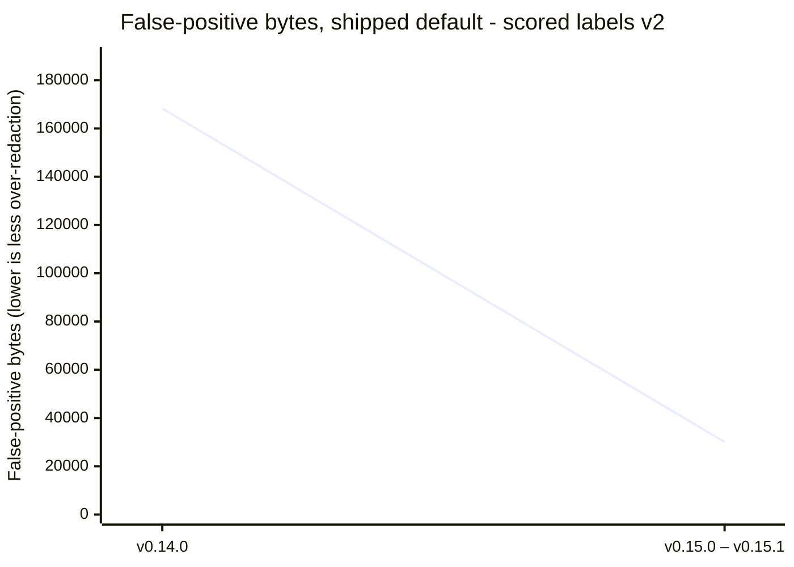
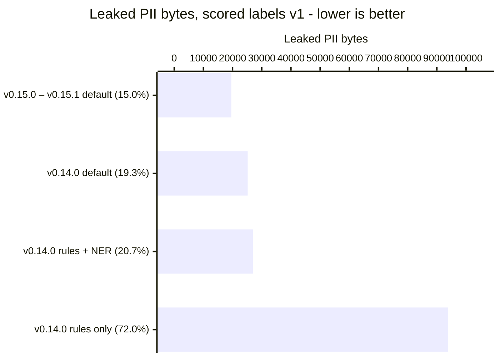
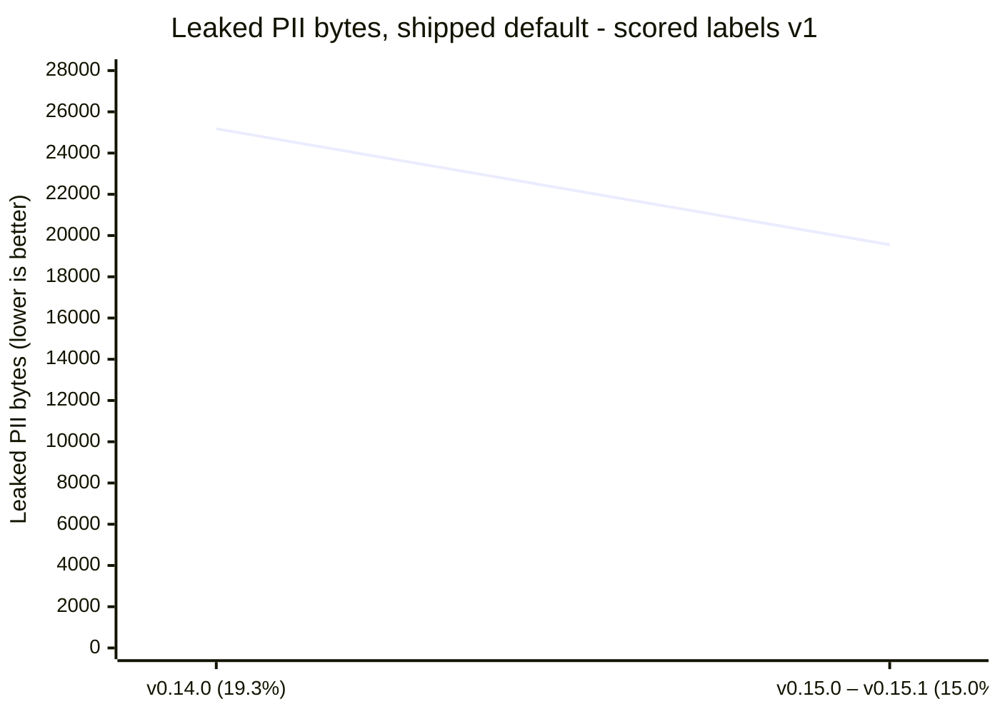

# Gaze Benchmarks

The single benchmark document for Gaze. It carries the current release's
measured numbers as a table and as charts, the methodology behind them, and the
commands to reproduce them.

Everything under [Current release](#current-release), [Charts](#charts), and
[Release history](#release-history) is **generated** from
[`release-history.json`](release-history.json) by
[`scripts/bench/render_benchmark_doc.py`](../../../scripts/bench/render_benchmark_doc.py).
Do not hand-edit inside the `<!-- BEGIN GENERATED -->` markers; CI re-renders
and fails on drift.

| Section | Contents |
| --- | --- |
| [What we measure, and how](#what-we-measure-and-how) | corpora, arms, metrics, goals |
| [A scorecard measures the corpus, not the recognizer](#a-scorecard-measures-the-corpus-not-the-recognizer) | how to read these numbers honestly |
| [Current release](#current-release) | the headline table |
| [Charts](#charts) | per-arm and release-over-release |
| [Release history](#release-history) | one row per released version |
| [Safety-Net Matrix](#safety-net-matrix) | backend pins and matrix shape |
| [NER Model Leaderboard](#ner-model-leaderboard) | candidate backends |
| [How to reproduce](#how-to-reproduce) | commands, harness, hardware |
| [Evidence before the release gate](#evidence-before-the-release-gate) | archived per-PR reports |

Related contracts kept as separate documents:

- [`evidence-protocol-v1.md`](evidence-protocol-v1.md) — normative contract for
  the optional offline T1 evidence path (route observations, synthetic paired
  arithmetic, recursive aggregate receipt validation). Explicitly **not** an
  end-to-end paired evaluation of route observations.
- [`negative-corpus-annotation-contract.md`](negative-corpus-annotation-contract.md)
  — synthetic EN/DE hard-negative annotation and zero-PII contract.
- [`class-commitments-v1.json`](class-commitments-v1.json) — fixture-only
  class-commitment schema and its two fixture rows. Scope is
  `fixture_only_not_a_corpus_commitment`; it is not a corpus commitment.

---

## What we measure, and how

### The question

Would annotated PII bytes reach a downstream LLM? Gold spans and Gaze
prediction spans are merged before their intersection is measured in **UTF-8
bytes**. Label matching is deliberately not part of the primary score:
pseudonymization safety depends first on covering the bytes, and Gaze's class
vocabulary does not match every source taxonomy exactly. Per-label recall still
exposes class-shaped gaps.

### How to read metric headers

Result headers use one direction marker plus a written goal: `↑` **higher is
better**, `↓` **lower is better**, `↔` an **exact or invariant target**, `info`
a **descriptive field with no optimization direction**. Historical evidence
without a contractual threshold uses `goal lower` / `goal higher` /
`goal no regression`; it does not invent a numeric gate.

`info` is intentional for support counts, observed configuration columns in
mixed-metric tables, diagnostic partitions, and deltas whose favorable sign
depends on the metric. Pin, evidence, command, rationale, and category tables
stay plain because they are not optimization results.

### The arms

Every release scorecard runs the same two configurations:

| Arm | What it is |
| --- | --- |
| `rule-floor-extended` | the shipped deterministic recognizers alone |
| `pass2-ner` | that floor plus the pinned Davlan mBERT `NerRecognizer` (threshold `0.3` by default), with no safety net |

Two additional arms run a safety net under the shipped `Resolve`/`Redact` policy,
with exact-restore checks, manifest-integrity checks, and a post-policy
SafetyNet scan. `full-stack-opf-resolve` exercises the OpenAI Privacy Filter. It
is excluded from the default run because it needs a separately installed
verified 2.6 GB checkpoint and a warmed daemon, and it has a measured
fail-closed invalid-output rate. `full-stack-nym-resolve` exercises the in-process
Nym-small net and needs its pinned bundle. The v0.15 `gaze setup` default is
rules plus NER plus Nym; its measurement lands with the v0.15 release row.

Warm per-document latency of the Nym arm is measured by
[`scripts/bench/nym-warm-latency.py`](../../../scripts/bench/nym-warm-latency.py)
(`uv run --with tokenizers python scripts/bench/nym-warm-latency.py --repo-root .`
after `gaze setup --safety-net nym`). It times the release harness warm for
`pass2-ner` and `full-stack-nym-resolve` over the coverage-loop corpus plus
512- and 1,024-piece synthetic documents, whose piece counts it checks against
the installed tokenizer before timing, and prints p50, p95 and mean with a
hardware line and the host load average. No numbers are recorded here yet: a
latency row needs a quiet host (load average below 2), and every run so far was
on a shared, loaded one.

Release rows up to v0.14.0 predate the removal of the Kiji DistilBERT safety net
and report `full-stack-kiji-resolve`, which was the shipped default then. Those rows
are kept as measured.

### Scored-label contracts

Which corpus labels count as gold PII is itself a versioned contract. Rows
measured before contracts existed use **v1**, which scores every label.
[`scored-labels-v2.json`](scored-labels-v2.json) rules on each of the 29 corpus
labels with a reason; it puts the credential labels `PASSWORD` and
`SECURITYTOKEN` out of contract (user ruling 2026-09-16: credentials are not
personal data), treats Gaze's own credential classes as neutral predictions, and
marks `USERNAME`, `URL`, `COMPANYNAME`, `COUNTRY` and `STATE` as rulings still
pending. **v2 is the headline contract** (user decision 2026-09-26): it scores
the labels Gaze commits to detect, while v1 scores every original gold label
and stays beside it for comparison with releases measured before v2 existed.
A release can carry both: its row is measured under one contract and
re-scored under the other from the same commit and corpus, each with its own
committed scorecard. Out-of-contract bytes are neither leaked nor false
positive. Numbers from different contracts are never compared as a
regression, every table and chart names its contract, and a release not
measured under a contract shows *not measured* there instead of borrowing the
other contract's numbers. See
[`scripts/bench/README.md`](../../../scripts/bench/README.md#scored-label-contracts).

Contract column note: the history table carries leak and false-positive
columns per contract, v2 first. A release row whose own contract is not v1
shows "scored labels vN" beside its version. v3
rows carry the same headline columns as v2 plus the gold-gap diagnostic below.

### Gold-gap protection (contract v3, diagnostic)

The corpus labels a PII value where it is introduced and, in the audited
candidates, not where it recurs. "My name is Emma Clarke … Emma has always
enjoyed …" labels the first `Emma` only, so protecting the second one scores
four false-positive bytes under v2.
[`scored-labels-v3.json`](scored-labels-v3.json) has v2's labels unchanged and
adds a `gold_gap` rule: a predicted span that overlaps no scored gold and no
ignored byte, whose ASCII-whitespace-trimmed bytes equal a scored gold value in
the same document, whose class is listed against that label in the contract's
own `compatible_labels` table, and whose trimmed edges touch no word character
(a letter, digit or combining mark, a symbol Unicode names as a letter, or an
unassigned code point: a superset of Rust's `char::is_alphanumeric`, pinned by
a test against a table the repo's rustc generates), is reported as
`gold_gap_protected_bytes` (per label, attributed to the first compatible gold
span in document order, each byte once).
Only trimmed bytes are credited; padding stays false positive.

**This is a diagnostic column; the v2 headline is unchanged.** Leaked,
true-positive and false-positive bytes and byte precision are computed exactly
as under v2 and stay the release-gate numbers. The diagnostic adds
`false_positive_bytes_after_gold_gap` (v2 FP − gold-gap) and
`adjusted_precision` = TP / (TP + FP after gold-gap); every scored predicted
byte is TP, FP after gold-gap, or gold-gap, with ignored bytes separate. The
negative corpus has no gold, so nothing there can qualify.

Byte equality is not identity: a same-document homonym ("May" the name and
"May" the month) passes all four conditions. The column means nothing until a
human audit of [`gold-gap-sample-v3.json`](gold-gap-sample-v3.json) passes: 200
seeded (20260922) candidates from the final eligibility set, every rule-class
candidate, at least one draw from every non-empty stratum, at least 40 each of
`FIRSTNAME`, `SURNAME` and `CITY`, ambiguous shapes (English dictionary words,
values used unlabelled in another document, a committed German noun/surname
seed list) drawn at twice the plain rate with recorded design weights that sum
to the eligibility population, IDs and byte offsets only (no document text).
Acceptance, declared before any verdict: the one-sided 95 %
Clopper-Pearson upper bound on the candidate false-credit rate is at most 5 %,
which is **at most 4** "no" or "uncertain" of 200 (bound 4.52 %; 5 would give
5.18 %), with document-clustered counts reported. Scoring and sampling:
`scripts/bench/gold_gap_evidence.py`.

### Zero-leak production goals

Production scorecard targets, not claims about any particular historical report:

| Production metric | Direction and goal |
| --- | --- |
| Leaked labeled PII bytes | ↓ lower is better; goal 0 |
| Missed entities | ↓ lower is better; goal 0 |
| Zero-leak documents | ↑ higher is better; goal 100% |
| Exact restore | ↑ higher is better; goal 100% of completed documents |
| Valid, trace-consistent manifests | ↑ higher is better; goal 100% of completed documents |
| Final redact actions | ↓ lower is better; goal 0 |
| Silent detector skips | ↓ lower is better; goal 0 |
| Actionable residual suspects | ↓ lower is better; goal 0 |
| Production/benchmark divergence | ↔ invariant target; goal 0 |
| False-positive bytes/documents and clean-document changes | ↔ invariant ratchet; goal no regression |
| *Ratchet exception (gold noise)* | A change may raise holdout false-positive bytes only by spans that are genuine identifiers the corpus gold does not label, and only when the A4 negative corpus does not move at all (bytes and documents, every category); each such span is enumerated shape-normalised with the reason it is real, and the reviewer re-confirms the list — never tune a rule to skip real PII to keep the counter flat |

The scorecard is **non-compensating**: safety, reversibility, trust,
availability, precision, and latency are reported as separate axes. Latency is
compared only after the correctness gates pass.

### Primary corpus — English/German synthetic holdout

The primary product-language corpus is the English and German rows of the
upstream test split of
[`DataikuNLP/kiji-pii-training-data`](https://huggingface.co/datasets/DataikuNLP/kiji-pii-training-data),
paired with the complete committed A4 EN/DE hard-negative corpus. The split is
**evaluation-only**: it must never enter Gaze training, fine-tuning, prompt
examples, dictionaries, rule authoring, or threshold selection.

| Field | Pinned value |
| --- | --- |
| Repository | `DataikuNLP/kiji-pii-training-data` |
| Revision | `0275550f0b1f1b8f2dc9356fd31ac1c788b8228b` |
| File | `data/test-00000-of-00001.parquet` |
| License | `Apache-2.0` |
| Declared data kind | synthetic PII only |
| Full test rows | `5,150` |
| File bytes | `2,013,107` |
| SHA-256 | `916c63792345bf3c2e0888941b3d14526c43b7c7fe8af60e0d283fed71b1234d` |
| Selected English rows | `1,033` |
| Selected German rows | `853` |
| Selected annotations | `14,719` |
| Observed selected labels | `29` |
| Selection seed | Not applicable; the complete pinned EN/DE selection is used without sampling or shuffling |
| Negative corpus | [`crates/xtask/fixtures/negative_corpus/en_de_negative.jsonl`](../../../crates/xtask/fixtures/negative_corpus/en_de_negative.jsonl) |

The runner refuses any file whose byte size or digest differs. It also verifies
the full row count, validates every selected annotation boundary and annotated
substring, and converts source character offsets to UTF-8 byte offsets before
scoring.

The word `kiji` in the dataset name does **not** refer to a Gaze model. The
corpus is unrelated to the removed Kiji DistilBERT safety net.

**Limits.** Every selected row contains annotated PII, so the split measures
false-positive bytes only within positive documents and cannot replace a
negative-only corpus — hence the paired A4 negatives. Synthetic templates
underrepresent OCR errors, streaming boundaries, JSON tool calls, tenant
identifiers, and ambiguous natural language. The test split is isolated from
training, but upstream train and test data may share a generator and templates:
if a future model uses another split from the same repository, that score is
**same-generator evaluation** and cannot be its only promotion gate.

### Secondary corpus — OpenPII micro, multilingual

The validation split of `ai4privacy/pii-masking-micro-100k` is retained as a
secondary multilingual masking holdout and Unicode-offset stress test,
including its Japanese slice. The same evaluation-only rule applies.

| Field | Pinned value |
| --- | --- |
| Repository | `ai4privacy/pii-masking-micro-100k` |
| Revision | `3cd59c65631280839f830d3ba96dcdfe1785cab1` |
| File | `data/validation.jsonl` |
| License | `CC-BY-4.0` |
| Declared data kind | synthetic PII only |
| Rows | `9,990` |
| Bytes | `32,536,978` |
| SHA-256 | `bb15da1b5fbb11b3cc6fd4c95eca256197573ecd066230eb3c1fe6898f27a578` |
| Annotations | `72,087` |
| Observed labels | `26` (a small tail beyond the 19 advertised on the dataset card; the runner reports observed counts rather than dropping it) |

Two additional recall slices are published for this corpus: **direct
identifiers** (names, contact details, account identifiers, addresses) and
**contextual PII** (dates, ages, titles, sex, gender, time, amount, currency).
All labels stay in the primary all-PII score; the slices do not weaken the
fail-closed contract.

**Datasets evaluated and rejected.** PIIMB has an excellent masking-oriented,
character-level methodology with negative sentences, but its assembled
benchmark is CC BY-NC 4.0 and so cannot be the default reproducible corpus for
Gaze's unrestricted adopter workflow. REDACT is useful as a future curated
secondary evaluation, but its files require access approval. Neither constraint
justifies weakening the current synthetic holdout gate.

---

## A scorecard measures the corpus, not the recognizer

These numbers score one synthetic EN/DE holdout. A perfect row here is evidence
about **this corpus**, not proof that a recognizer is complete — shapes the
corpus does not contain are unmeasured. Recall claims about a rule change need a
direct differential probe, not a scorecard row. The generated
[agentic layers](#agentic-layers-and-the-rule-gate) cover some of the agent
shapes this corpus lacks, and they have the same limit: they measure only the
families and surfaces they generate.

Two consequences worth stating plainly:

1. **Consolidating N rules into one is a widening only if the shared form is a
   superset of every original, including the loosest.** A clean scorecard across
   all three arms has previously coexisted with a real recall regression on
   whitespace shapes this corpus happens not to contain.
2. **False-positive bytes are a ratchet, not a free variable.** They are
   reported beside recall precisely so precision cannot be traded away silently
   to make a leak counter fall.
3. **Gold that fails its own checksum stays scored.** The synthetic corpus
   generates many tax-ID, card and IBAN values that fail their Steuer-ID, Luhn
   or mod-97 check, and Gaze's validator-backed rules refuse them by design.
   Those bytes still count as surviving PII in the headline. From the first
   release measured with the split, the current-release section adds a table
   for the shipped default arm: gold spans per validator-backed label, how many
   fail their validator, validator-backed versus shape-only recall, and the
   surviving bytes split into valid and invalid gold. The two split columns add
   up to that label's surviving bytes; they never replace them, and no
   validator is loosened to move them.

---

## Current release

<!-- BEGIN GENERATED: current-release -->

**v0.15.1** — measured on the released tree.

> `policy-file` is the exact policy `gaze setup --non-interactive` writes in v0.15.1 (every bundled PII rulepack except `secrets`, their locales, the pinned Davlan NER model and the Nym safety net), SHA-256 `f909a23aecacc5695388223be5e71bc1e303c845563396d6658448396a0a9ebe`, byte-identical to the v0.15.0 policy. Latency was measured on a shared host; quiet-host latency is in [Latency](#latency).

| Provenance | Value |
| --- | --- |
| Release | `v0.15.1` |
| Commit | `f769f823b281022a080725faef4f61ae2561d975` |
| Measured | 2026-09-26 |
| Machine | MacBook Pro, Apple M5 Max, 18 cores, 64 GB, macOS 26.5 (25F71) |
| Harness | [`scripts/bench/run_no_opf_benchmark.py`](../../../scripts/bench/run_no_opf_benchmark.py) |
| Scorecard | [`scorecard-v0.15.1.json`](scorecard-v0.15.1.json) |
| Scorecard sha256 | `350f10a0a7a02006f16d5aab69512c5f7f63e69f8f69e263f4ae5d4c0670a1c4` |
| Corpus | `DataikuNLP/kiji-pii-training-data+gaze` @ `0275550f0b1f1b8f2dc9356fd31ac1c788b8228b+a4-negative-v1` |
| Corpus sha256 | `11614c80f6d0fe78feb4c592fc9674efac08d73fe5549ad1bed8dd057b7592d2` |
| Corpus component `dataiku` | `916c63792345bf3c2e0888941b3d14526c43b7c7fe8af60e0d283fed71b1234d` |
| Corpus component `negative_corpus` | `d9e5807b9f9152932973214e38e1c44a75e9a413f53b5c8954fba0f3f25b1116` |
| Population | 2,910 documents / 14,719 entities |
| Profile | `full` |
| Seed | `20260710` |
| NER threshold | `0.3` |
| Model bundle `davlan-mbert-ner-hrl-onnx` | `7b0b9d0d200bf7f3a39654257f8723998316600852edff8404834eb7edfc5c16` |
| Model bundle `nym-small-int8` | `71f9023bcf86ead7234434f11a4881c0b0a87622ba4e2e44b74f55d3ede7c767` |
| Scorecard, scored labels v2 | [`scorecard-v0.15.1-scored-labels-v2.json`](scorecard-v0.15.1-scored-labels-v2.json) |
| Scorecard sha256, scored labels v2 | `e20a8fb6b1f6f4d3098b93f3e77d62d73c7cc4c34c96aff527bbbb072931de55` |

**Scored labels v2 (headline: the labels Gaze commits to detect).** Gold PII bytes: 123,621.

| Arm info | Gold PII bytes info | Surviving PII bytes ↓ | Leak rate ↓ | False-positive bytes ↔ | Byte precision ↑ | Zero-leak documents ↑ | Restore exact ↑ | Manifest valid ↑ | Availability ↑ | Failed closed ↓ | clean p95 ms ↓ |
| --- | ---: | ---: | ---: | ---: | ---: | ---: | ---: | ---: | ---: | ---: | ---: |
| `policy-file` **(shipped default)** | 123,621 | 13,319 | 10.7741% | 30,073 | 0.785767 | 55.7732% | 100.0000% | 100.0000% | 100.0000% | 0 | 126.17 |

**Scored labels v1 (all original gold labels, kept for comparison with earlier releases).** Gold PII bytes: 130,282.

| Arm info | Gold PII bytes info | Surviving PII bytes ↓ | Leak rate ↓ | False-positive bytes ↔ | Byte precision ↑ | Zero-leak documents ↑ | Restore exact ↑ | Manifest valid ↑ | Availability ↑ | Failed closed ↓ | clean p95 ms ↓ |
| --- | ---: | ---: | ---: | ---: | ---: | ---: | ---: | ---: | ---: | ---: | ---: |
| `policy-file` **(shipped default)** | 130,282 | 19,556 | 15.0105% | 30,073 | 0.786412 | 50.4124% | 100.0000% | 100.0000% | 100.0000% | 0 | 138.72 |

Validator-backed labels on `policy-file`, scored labels v1. Gold that fails its own checksum stays scored gold: the two leaked-bytes columns split the surviving bytes above, they do not replace them. Shape recall is what a shape-only match (validator ignored) would cover.

| Label | Validator | Gold | Gold failing its validator | Validator-backed recall | Shape recall | Leaked bytes, valid gold | Leaked bytes, invalid gold |
| --- | --- | ---: | ---: | ---: | ---: | ---: | ---: |
| `CREDITCARDNUMBER` | luhn | 126 | 96 | 0.238095 | 0.984127 | 0 | 1,396 |
| `EMAIL` | email_rfc | 375 | 0 | 0.994667 | 0.994667 | 19 | 0 |
| `IBAN` | iban_mod97 | 207 | 67 | 0.004831 | 0.227053 | 0 | 1,580 |
| `PHONENUMBER` | e164_phone, e164_phone_national_de, e164_phone_national_us | 359 | 41 | 0.754875 | 0.908078 | 526 | 454 |
| `TAXNUM` | de_steuer_id_mod1110 | 212 | 210 | 0.000000 | 0.047170 | 28 | 1,822 |

<!-- END GENERATED: current-release -->

---

## Charts

<!-- BEGIN GENERATED: charts -->

#### Scored labels v2 (headline: the labels Gaze commits to detect)

**Leaked PII bytes — v0.15.0 – v0.15.1 against the previous release with different results.** Lower is better; the goal is zero. Scored under scored labels v2; every bar is a measured arm in [`release-history.json`](release-history.json). The percentage in each label is the leak rate: leaked bytes out of 123,621 gold PII bytes.



**Trend across releases — each release's shipped default.** Scored under scored labels v2. The shipped arm changes between releases; the history table names it per row.





#### Scored labels v1 (all original gold labels, kept for comparison with earlier releases)

**Leaked PII bytes — v0.15.0 – v0.15.1 against the previous release with different results.** Lower is better; the goal is zero. Scored under scored labels v1; every bar is a measured arm in [`release-history.json`](release-history.json). The percentage in each label is the leak rate: leaked bytes out of 130,282 gold PII bytes.



**Trend across releases — each release's shipped default.** Scored under scored labels v1. The shipped arm changes between releases; the history table names it per row.




<!-- END GENERATED: charts -->

---

## Release history

Consecutive releases with the same results share one row, labelled oldest –
newest: same results means the same shipped arm, refused documents, leaked PII
bytes, false-positive bytes, restore-exact rate and gold-gap diagnostic (when
the contract reports one) under the same scored-label contract, corpus and
provisional status, while clean p95 latency, date, commit and machine are
ignored because they vary with the host. The table and trend
charts show the last three such rows, and a merged row shows its newest
release. [`release-history.json`](release-history.json) keeps every release,
and every row's numbers come from the `scorecard-vX.Y.Z.json` files it links,
which stay committed as the machine-readable evidence.

<!-- BEGIN GENERATED: history -->

| Release | Measured | Commit | Machine | Scorecards | Shipped arm | Refused ↓ | Leaked PII bytes, all processed, v2 ↓ | Leaked PII bytes, common documents, v2 ↓ | False-positive bytes, v2 ↔ | Leaked PII bytes, all processed, v1 ↓ | Leaked PII bytes, common documents, v1 ↓ | False-positive bytes, v1 ↔ | Restore exact ↑ | clean p95 ms ↓ |
| --- | --- | --- | --- | --- | --- | ---: | ---: | ---: | ---: | ---: | ---: | ---: | ---: | ---: |
| v0.14.0 | 2026-09-11 | `f66a3f2` | MacBook Pro, Apple M5 Max, 18 cores, 64 GB, macOS 26.5 (25F71) | [`scorecard-v0.14.0.json`](scorecard-v0.14.0.json), [`scorecard-v0.14.0-scored-labels-v2.json`](scorecard-v0.14.0-scored-labels-v2.json) | `full-stack-kiji-resolve` | 0 | 22,144 | 22,144 | 168,259 | 25,179 | 25,179 | 168,276 | 78.4192% | 195.86 |
| v0.15.0 – v0.15.1 | 2026-09-26 | `f769f82` | MacBook Pro, Apple M5 Max, 18 cores, 64 GB, macOS 26.5 (25F71) | [`scorecard-v0.15.0.json`](scorecard-v0.15.0.json), [`scorecard-v0.15.0-scored-labels-v2.json`](scorecard-v0.15.0-scored-labels-v2.json), [`scorecard-v0.15.1.json`](scorecard-v0.15.1.json), [`scorecard-v0.15.1-scored-labels-v2.json`](scorecard-v0.15.1-scored-labels-v2.json) | `policy-file` | 0 | 13,319 | 13,319 | 30,073 | 19,556 | 19,556 | 30,073 | 100.0000% | 138.72 |

- **v0.14.0, scored labels v2:** v0.14.0's own `clean_for_bench` (sha256 `fccad457ec06…`, built from `f66a3f2b`) scored by today's harness ([`rescore_past_release.py`](../../../scripts/bench/rescore_past_release.py) at `c495a6f1`); trace/manifest agreement checked with `tokenize` as manifest actions, the rule that release was built with.

<!-- END GENERATED: history -->

Rows marked *(provisional)* were not measured on the released tree; their note
records what was measured instead.

### Per-release notes

**v0.14.0.** Measured on `f66a3f2b`, whose `crates/` tree is identical to the
release branch head; the tag lands on the release merge commit and differs from
the measured tree only in docs and version pins.

- **Release readiness failed (harness exit 4).** This is the standing outcome on
  this corpus, not a new regression: the readiness gate has never passed here.
  The production cell reports non-zero leaked bytes, documents with leaks,
  uncovered entities, strict rejections, residual suspects, and final redact
  actions, each against a goal of zero.
- **Restore exact is 78.4% by design, not by defect.** The 628 documents that do
  not restore exactly are exactly the 628 where the SafetyNet took its one-way
  `redact` fallback instead of `resolve`. Redacted bytes are irreversible by
  design, so those documents cannot round-trip; `2,910 - 628 = 2,282`
  reconciles. Every manifest-integrity counter, token restore failures included,
  is zero, and the restore-success decision rate is 1.0. This is documented
  fallback behaviour, and it is not the strict-scan false-failure class fixed in
  #473.
- **Scored labels v2 was measured afterwards, on v0.14.0's own code.** v0.14.0's
  harness predates `--scored-labels`, so
  [`rescore_past_release.py`](../../../scripts/bench/rescore_past_release.py)
  runs v0.14.0's own debug `clean_for_bench` (built from `f66a3f2b` with its
  Kiji feature and the same pinned Kiji bundle) under today's corpus loaders,
  validation and scoring. Scored under v1 the same way, it reproduces this row
  exactly on all three arms
  ([`scorecard-v0.14.0-rescore-calibration-v1.json`](scorecard-v0.14.0-rescore-calibration-v1.json)),
  so the v2 numbers
  ([`scorecard-v0.14.0-scored-labels-v2.json`](scorecard-v0.14.0-scored-labels-v2.json))
  differ from v1 only by the contract. One validator rule is the release's own:
  v0.14.0 did not yet record safety-net redactions as manifest entries (#623
  changed that), so trace/manifest agreement is checked on tokenizations only,
  as this row originally was.
- **The release-over-release comparison is informal.** No `--compare-baseline`
  was passed, so `regression-status.json` reports `not_compared`. Read by hand
  against the last committed full run at `a8f7182` over a byte-identical scored
  population, production surviving PII bytes fell 21.3% (31,995 to 25,179) and
  production false-positive bytes rose by 113 (+0.07%). That rise is
  holdout-side only: the A4 negative corpus did not move at all, in bytes,
  documents, or any of its eight categories. A gated run would put those 113
  bytes through the gold-noise ratchet exception above.

---

## Latency

Quiet-host timing from the `latency-vX.Y.Z.json` file each release commits,
produced by [`scripts/bench/cli-latency.py`](../../../scripts/bench/cli-latency.py).
The `clean p95 ms` column in the tables above comes from the accuracy run on
a loaded host, so read latency here. Rows follow the release groups of the
history table; a group reads its newest release's file, and a release without
one shows *not measured*. Latency never decides whether two releases share a
row.

<!-- BEGIN GENERATED: latency -->

**In-process pipeline.** Warm is the per-document `clean` time once models are loaded; cold is the first document, model load included.

| Release | Setup | Warm p50 ms ↓ | Warm p95 ms ↓ | Cold first document ms ↓ | Peak RSS MiB ↓ |
| --- | --- | ---: | ---: | ---: | ---: |
| v0.14.0 | not measured | — | — | — | — |
| v0.15.0 – v0.15.1 | `gaze setup` without Nym (rules + NER) | 20.36 | 33.30 | 763.90 | 591.2 |
| v0.15.0 – v0.15.1 | `gaze setup` (rules + NER + Nym) | 69.42 | 138.88 | 2126.90 | 1049.9 |

**CLI.** One-shot starts `gaze clean` per document; the daemon (`gaze daemon`) loads once and serves every document after the first.

| Release | Setup | One-shot p50 ms ↓ | One-shot p95 ms ↓ | Daemon warm p50 ms ↓ | Daemon warm p95 ms ↓ |
| --- | --- | ---: | ---: | ---: | ---: |
| v0.14.0 | not measured | — | — | — | — |
| v0.15.0 – v0.15.1 | `gaze setup` without Nym (rules + NER) | 771.50 | 821.52 | 20.29 | 32.35 |
| v0.15.0 – v0.15.1 | `gaze setup` (rules + NER + Nym) | 2140.15 | 2187.25 | 69.50 | 141.50 |

- **v0.15.0 – v0.15.1:** [`latency-v0.15.1.json`](latency-v0.15.1.json), verdict `valid`, 30 documents, 1-minute load 1.77 at start. Host: Apple M5 Max, 18 cores, 64 GiB RAM, macOS-26.5-arm64-arm-64bit-Mach-O, ort 2.0.0-rc.12, Nym bundle 71f9023bcf86…, intra-op threads 1.

<!-- END GENERATED: latency -->

---

## Safety-Net Matrix

The tracked benchmark snapshot lives at
[`crates/gaze-recognizers/benches/safety_net_matrix_snapshot.json`](../../../crates/gaze-recognizers/benches/safety_net_matrix_snapshot.json).
`cargo bench -p gaze-recognizers --features safety-net-openai --bench safety_net_matrix`
validates that the snapshot pins match runtime constants and prints the JSON for
CI logs.

Current status: `observer_residual_and_direct_run_v1`. Direct-detector and
observer-residual cells are populated for the OpenAI Privacy Filter.

### Matrix shape

The snapshot schema is version 2, keyed by backend, locale, and mode:

| Dimension | Values |
| --- | --- |
| Backends | `openai_privacy_filter` |
| Locales | `Global`, `EnUs`, `DeDe` |
| Modes | `direct_detector`, `observer_residual` |

That is 6 cells. Each `direct_detector` cell carries nullable precision,
recall, F1, and per-class metrics. Each `observer_residual` cell also carries
nullable `observer_residual_recall`, `agreement_with_rule_floor`,
`expansion_fraction`, `contradiction_fraction`, and `novel_tp_over_rule_floor`.

The top-level `strict_span_leak_rate` block is mode-independent and records one
nullable headline field per backend-locale pair. It measures end-to-end
fail-closed behavior rather than detector precision/recall.

Cells are populated from pinned local backend runs. Publishing claims without
those pins would violate the axis-4 trust contract.

The Kiji DistilBERT rows were removed with the backend. See
[Kiji DistilBERT removal](#kiji-distilbert-removal).

### Backend integrity pins

OpenAI Privacy Filter:

| Pin | Value |
| --- | --- |
| Source repo | `openai/privacy-filter` |
| Source commit | `f7f00ca7fb869683eb732c010299d901457f19c3` |
| Checkpoint bundle SHA256 | `4680158333621f3f344f58366f59612d52eff67ce6f46cff7becede5be1853ae` |
| Required checkpoint artifacts | `["config.json", "dtypes.json", "model.safetensors", "viterbi_calibration.json"]` |

OPF publishes a source repository and an `opf` Python CLI that downloads its
checkpoint into `~/.opf/privacy_filter` by default, or into the directory
selected by `OPF_CHECKPOINT` / `--checkpoint`. It does not publish a GitHub
release binary, so Gaze does not pin a binary checksum — the source commit and
checkpoint bundle are the trust anchors. The bundle hash was captured from a
clean local `opf download` on 2026-05-15 and is SHA256 over a
line-per-file `SHA256SUMS` manifest for the required artifact list in
declaration order.

### Runnable paths

```bash
python3 scripts/bench/opf-bench-scorer.py --repo-root . --mode all --measure-latency --python python3
cargo bench -p gaze-recognizers --bench safety_net_matrix
```

| Evidence | Path |
| --- | --- |
| Matrix snapshot | [`crates/gaze-recognizers/benches/safety_net_matrix_snapshot.json`](../../../crates/gaze-recognizers/benches/safety_net_matrix_snapshot.json) |
| Perf snapshot | [`crates/gaze-recognizers/benches/safety_net_perf_snapshot.json`](../../../crates/gaze-recognizers/benches/safety_net_perf_snapshot.json) |
| Bench source | [`crates/gaze-recognizers/benches/safety_net_matrix.rs`](../../../crates/gaze-recognizers/benches/safety_net_matrix.rs) |

---

## NER Model Leaderboard

Compares pinned Hugging Face NER candidates as Gaze safety-net backends on the
committed 150-fixture coverage-loop corpus. Configuration lives in
[`crates/gaze-recognizers/benches/ner_models.toml`](../../../crates/gaze-recognizers/benches/ner_models.toml);
evidence is written to
[`crates/gaze-recognizers/benches/ner_models_snapshot.json`](../../../crates/gaze-recognizers/benches/ner_models_snapshot.json).

Measured 2026-05-15 on macOS 26.5 arm64, Apple M5 Max. The scorer used Python
3.10.20 for the Tiny/Mobile/Mini candidates. Corpus: 150 fixtures, `target/coverage-report.json` SHA256
`760f96163a68ce5f7dbc0409aa5109aa1a3ed190001536647e1881ba9d40a49c`.

Macro averages are across the committed `Global`, `EnUs`, and `DeDe` locale
cells. Warm p50 keeps the model/session loaded over the same 150 direct fixture
texts.

| Model info | HF repo @ commit info | License info | Params info | Bundle size ↓ (goal lower) | Direct recall ↑ (goal 1.000) | Observer recall ↑ (goal 1.000) | Warm p50 ↓ (goal no regression) |
| --- | --- | --- | ---: | ---: | ---: | ---: | ---: |
| openobscure TinyBERT4L PII NER int8 | `openobscure/tinybert4l-pii-ner-int8@f8399a9` | Apache-2.0 | 14M | 13.95MB | 0.070 | 0.271 | 1.087ms |
| mrm8488 MobileBERT NER | `mrm8488/mobilebert-finetuned-ner@3f9a1f3` | MIT | 25M | 94.29MB | 0.124 | 0.661 | 16.494ms |
| osiria MiniLM-L6-H384 Italian NER | `osiria/minilm-l6-h384-italian-cased-ner@125c646` | MIT | 22.6M | 174.30MB | 0.124 | 0.667 | 4.703ms |

Full leaderboard, including the larger multilingual candidates. `Median ms` is
the scorer's direct-mode one-shot subprocess median, **not** warm in-process
latency:

| Rank info | Model info | License info | Shippable default? info | Direct P/R/F1 ↑ (goal 1.000 each) | Observer-residual P/R/F1 ↑ (goal 1.000 each) | Median ms ↓ (goal no regression) |
| ---: | --- | --- | --- | ---: | ---: | ---: |
| 1 | Davlan multilingual BERT-NER (HRL) | AFL-3.0 | Yes | 0.558 / 0.125 / 0.200 | 0.518 / 0.661 / 0.558 | 1911.349 |
| 2 | Babelscape WikiNeural Multilingual | CC-BY-NC-SA-4.0 | No, non-commercial | 0.476 / 0.125 / 0.194 | 0.507 / 0.667 / 0.547 | 1786.361 |
| 3 | osiria MiniLM-L6-H384 Italian NER | MIT | Yes, locale caveat | 0.117 / 0.124 / 0.105 | 0.206 / 0.667 / 0.264 | 1566.991 |
| 4 | mrm8488 MobileBERT NER | MIT | Yes | 0.232 / 0.124 / 0.141 | 0.362 / 0.661 / 0.369 | 1760.778 |
| 5 | dslim/bert-base-NER (English) | MIT | Yes | 0.300 / 0.124 / 0.152 | 0.290 / 0.655 / 0.323 | 1737.297 |
| 6 | openobscure TinyBERT4L PII NER int8 | Apache-2.0 | Yes, recall caveat | 0.424 / 0.070 / 0.113 | 0.478 / 0.271 / 0.296 | 76.548 |

**Screening notes.** `onnx-community/TinyBERT-finetuned-NER-ONNX` and
`adel-cybral/TinyBERT-finetuned-NER` did not publish a clean permissive license
in HF metadata and were skipped; `openobscure/tinybert4l-pii-ner-int8` is
Apache-2.0 and was pinned, but it is a PII-specific TinyBERT head rather than a
strict CoNLL clone. `SKNahin/NER_MobileBert` was skipped for missing license
metadata. No permissive English or multilingual general MiniLM NER head with the
desired PER/LOC/ORG/MISC fit was found.

### Kiji DistilBERT removal

The Kiji DistilBERT safety net, which earlier leaderboard rounds validated as
the int8 in-process default, was removed after the 2026-09-16 safety-net
leaderboard. On the 2,910-document benchmark it recovered 1,831 leaked gold
bytes (scored-label contract v2) for +169,657 false-positive bytes, a 2.5%
action precision. At removal, the default was `pass2-ner`; `gaze setup` now
enables Nym. The Kiji leaderboard rows and the Kiji int8, ORT, tract, and
candle runtime measurements are readable at the
[`v0.14.0` tag](https://github.com/CertaMesh/gaze/blob/v0.14.0/docs/reference/benchmarks/README.md#ner-model-leaderboard).

### Runnable paths

```bash
python3 scripts/bench/ner-bench-scorer.py --repo-root . --python python3 --mode all --model openobscure-tinybert4l-pii-ner-int8 --model mrm8488-mobilebert-ner --model osiria-minilm-italian-ner
python3 scripts/bench/ner-warm-latency.py --repo-root .
```

---

## How to reproduce

### The release run

Each release measures its own tree. The three steps below are the whole contract:

```bash
# 1. Produce the scorecard on the release commit.
uv sync --project scripts/bench --locked
uv run --project scripts/bench python scripts/bench/run_no_opf_benchmark.py full \
  --seed 20260710 --no-download

# 2. Commit it under its release name and regenerate this document.
cp target/bench-data/no-opf/full/scorecard-v4.json \
   docs/reference/benchmarks/scorecard-vX.Y.Z.json
uv run --project scripts/bench python scripts/bench/render_benchmark_doc.py \
  --scorecard docs/reference/benchmarks/scorecard-vX.Y.Z.json \
  --version vX.Y.Z \
  --machine "<CPU, cores, RAM, OS and build>" \
  --append-history
```

Then score the same commit under the headline contract and record it on the
row just appended. The run must use the same commit, corpus and policy; the
renderer refuses a result that differs in any of them.

```bash
# 3. Re-score under contract v2 (the headline) and record it on the row.
uv run --project scripts/bench python scripts/bench/run_no_opf_benchmark.py full \
  --seed 20260710 --no-download \
  --scored-labels docs/reference/benchmarks/scored-labels-v2.json
cp target/bench-data/no-opf/full/scorecard-v4.json \
   docs/reference/benchmarks/scorecard-vX.Y.Z-scored-labels-v2.json
uv run --project scripts/bench python scripts/bench/render_benchmark_doc.py \
  --scorecard docs/reference/benchmarks/scorecard-vX.Y.Z-scored-labels-v2.json \
  --version vX.Y.Z \
  --append-contract-result
```

A quick smoke run uses the scorer's seeded stratified sampler instead of the
complete corpus:

```bash
uv run --project scripts/bench python scripts/bench/run_no_opf_benchmark.py quick --no-download
```

The first run may omit `--no-download`; the runner fetches and verifies the
pinned 2 MB Parquet file under ignored `target/bench-data/`.

`--machine` is required because the scorecard schema does not capture the host.
It is the one hand-carried reproducibility field, and it is recorded per release
in [`release-history.json`](release-history.json). Use a placeholder for any
path: `$HOME/...`, `~/...`, `<model-cache>/...`. **Never publish an absolute
home directory.**

### Where the numbers come from

The rendered table is a projection of the schema-v4 scorecard. This mapping is
the contract, enforced by
[`scripts/bench/test_render_benchmark_doc.py`](../../../scripts/bench/test_render_benchmark_doc.py),
which mutates each source path in turn and requires the rendered value to move:

| Column | Scorecard JSON path |
| --- | --- |
| Arm | `runs[].config` |
| Gold PII bytes | `runs[].metrics.utf8_bytes.pii` |
| Surviving PII bytes | `runs[].metrics.utf8_bytes.leaked` |
| Leak rate | `runs[].metrics.utf8_bytes.leak_rate` |
| False-positive bytes | `runs[].metrics.utf8_bytes.false_positive` |
| Byte precision | `runs[].metrics.utf8_bytes.precision` |
| Zero-leak documents | `runs[].metrics.zero_leak_document_rate` |
| Restore exact | `runs[].pipeline_contract.restore_exact_rate` |
| Manifest valid | `runs[].pipeline_contract.manifest_valid_document_rate` |
| Availability | `runs[].pipeline_availability.completion_rate` |
| Failed closed | `runs[].pipeline_availability.failed_closed_documents` |
| clean p95 ms | `runs[].latency_ms.clean_ms.p95` |

Provenance rows come from `gaze.revision`, `gaze.dirty`, `generated_at`,
`dataset.repository`, `dataset.revision`, `dataset.integrity`,
`parameters.profile`, `parameters.sampling_seed`, `parameters.ner_threshold`,
and `runner_provenance.entry_point`. A scorecard with `gaze.dirty: true` is
refused: a release row has to be reproducible.

Verify that the committed document still matches its history file:

```bash
python3 scripts/bench/render_benchmark_doc.py --check
```

This runs in CI on every pull request. It is stdlib-only and needs no corpus, no
model, and no network.

### The runner's other outputs

Beyond `scorecard-v4.json`, `run_no_opf_benchmark.py` writes a Markdown summary,
per-language / per-label / per-negative-category diagnostics, and separate
machine-readable regression and release-readiness verdicts under ignored
`target/bench-data/no-opf/`. Regression uses zero-tolerance integer-count
ratchets. Release readiness is an independent candidate-only verdict.
Performance tolerance is separately configured and informational by default.

Required model bundles are verified before any cell starts. Warmups, measured
repetitions, discarded warmup samples, and external cold-start to first
validated response are Python-runner provenance; response latency consumes the
producer's honest `clean_ms`. See
[`scripts/bench/README.md`](../../../scripts/bench/README.md) for model
locations, planning runtime, and the guarded baseline-acceptance command.

### Agentic layers and the rule gate

The Kiji/A4 corpus is prose. It contains no tool-call JSON, no `key=value`
logs, no CSV and no NBSP, which are the shapes agents actually send. A rule fix
for one of those shapes cannot move the Kiji numbers, so the runner also scores
three generated layers beside it:

| Layer | What it is | Where it lives in the scorecard |
| --- | --- | --- |
| C | Kiji EN/DE holdout plus the A4 negative corpus | `runs[]` (unchanged) |
| A | Generated identifiers in agentic surfaces, each checksum value with a checksum-invalid twin | `layers.A.runs[]` |
| D | Generated benign lookalikes: amounts, SKUs, `#RRGGBB`, `L99 9999`, versions, order and tracking IDs, UUID fragments, room and seat numbers, invoice and log dates, and the counterweights below | `layers.D.runs[]` |
| R | Repeat-value slice: one value repeated in several shapes in one document, next to decoys that collide with it | `layers.R.runs[]` |

[`scripts/bench/agentic_layers.py`](../../../scripts/bench/agentic_layers.py)
generates all three deterministically, with no network access and no
model:

- **Layer A families:** payment card; IBAN for DE (spaced and compact), AT,
  NL, FR and GB; Steuer-ID; BSN; NHS number; CPF; email; German and US phone
  numbers; dates of birth; and sender names in email headers, including
  hyphenated surnames.
- **Layer A surfaces:** prose with a cue, prose without a cue, NBSP-spaced,
  NARROW-NBSP-spaced, log `key=value`, CSV, and tool-call JSON. The tool-call
  JSON is the single-encoded `arguments` string that `gaze-proxy` cleans.
- **Checksum code:** written from the published standards, not from Gaze's
  validators. Standard test vectors pin it, and the validator probe
  cross-checks it on every run.
- **Invalid twins:** they stay scored gold, as in the Kiji validator gold
  census. `layers.A.validator_gold_census` and each run's
  `validator_recall_by_label` split the result by validity. That split uses
  Gaze's validators, which reject NBSP and NARROW NBSP group separators, so an
  NBSP-spaced valid IBAN, NHS number, Steuer-ID or phone number counts there as
  validator-failed. The `per_cell` validity is the generator's own verdict.
- **Gold spans:** they are the inserted values at their UTF-8 byte offsets.
- **Layer R, the repeat-value slice:** each document repeats a name, an email,
  an IBAN, a phone number or a Steuer-ID two to four times. Names appear in a
  `From:` header, as `Ms Surname`, in a sign-off, in lower and upper case,
  NBSP-joined and split across a line break, including hyphenated surnames.
  Identifiers appear spaced in prose and compact in JSON and a log line. Every
  repeat is gold. The same documents carry decoys, which are never gold:
  ordinary words spelled like a name part (`Rose garden`, `in May`,
  `Will you`, `Grant approved`, `Page 3`, `the Court hearing`), words and file
  names that contain a name part (`Annual` for Ann, `Iceberg` for Berg), and
  digit runs shared with a repeated identifier. Any byte predicted over a decoy
  counts as a false positive. A given name and a surname are separate gold
  spans, as in Kiji, so a single token over the full name also counts the
  separator between them (1 byte for a space, 2 for an NBSP) as a false
  positive. The JSONL output records the decoy spans. Several test templates
  also carry the fixed log timestamp `2026-04-17T08:03:51Z`, and Gaze
  tokenizes it as a date. That is template noise in the false-positive bytes
  of layers A and R: 130 B in each of R's phone and Steuer-ID repeat cells. It
  is identical on both sides of a gate comparison. This
  slice is the baseline for a change that re-finds known values across a
  document: it has to lower R's leaked bytes without raising R's
  false-positive bytes. The value makers take a partition, so a layer B
  transcript can reuse the same pools.

Every result is also reported per `layer|family|surface|validity` cell under
`per_cell`. [`scored-labels-agentic.json`](scored-labels-agentic.json) rules on
every generated label, and it fails closed on a label it does not list, on a
ruling for a label the generator no longer emits, and on a generator version
mismatch. Layers A, D and R use this contract in every run, so
`--scored-labels` changes layer C only.

**Counterweights.** Some layer A gold can be reached only by a context-free
rule, a rule that looks at shape alone. These are checksum-invalid twins and
dates of birth in prose without a cue. A rule that tags every 9-digit run or
every `DD.MM.YYYY` date would lower layer A's leak there. Layer D therefore
carries the same shapes as benign values, so that rule pays for its catch in
false-positive bytes:

- reference numbers of 9, 10 and 11 digits, bare and in the NHS, Steuer-ID and
  CPF groupings, each failing every checksum of its length;
- space-grouped 16-digit voucher codes that fail Luhn, the card twin's shape;
- delivery and due dates in German and US format, dated 2024 to 2027.

`COUNTERWEIGHTS` in `agentic_layers.py` maps each such gold cell to its D
family. A test fails when a context-free-only cell has neither a counterweight
nor a written exemption. It also fails when a counterweight lacks one of its
gold's display shapes. A shape maps digits to `9` and letters to `A`, and keeps
every other character exactly, because a rule for `9999 9999` never sees
`9999-9999`. IBAN twins are exempt: an IBAN shape that fails mod-97 has no
common benign use.

Two deliberately over-broad rules check the counterweights end to end.
[`mutant-bare-nine-digits.toml`](../../../scripts/bench/fixtures/agentic/mutant-bare-nine-digits.toml)
tags every bare 9-digit run, and
[`mutant-spaced-sixteen-digits.toml`](../../../scripts/bench/fixtures/agentic/mutant-spaced-sixteen-digits.toml)
tags every space-grouped 16-digit run without a Luhn check. Append one to the
policy and run `agentic_layers.py measure`. Each must lower layer A's leak and
raise layer D's false-positive bytes on its counterweight (`ref_number_9` or
`ref_number_16`), where the unmodified policy has none.

**Held-out protocol.** Templates, machine keys, name pools, email domains,
phone prefixes, the layer R name-word and decoy pools, and seeds are split
into a `dev` and a `test` partition before anything is generated. Machine keys
differ even when case and `-`/`_` are ignored. Descriptive cue phrases are
split too, but the standard names of the identifiers (`IBAN`, `Steuer-ID`,
`BSN`, `NHS number`, `CPF`) appear in both partitions, because a real document
uses exactly those words. Every perturbation (the NBSP variants
and the invalid twin) comes from its parent document inside that parent's
partition. The runner scores `test` only. Use `dev` for rule work:

```bash
python3 scripts/bench/agentic_layers.py generate --partition dev \
  --output target/bench-data/agentic-dev.jsonl
```

`layers.generator` records the generator version, the seed and the corpus
SHA-256. `scripts/bench/test_agentic_layers.py` pins both partition hashes, so
a generator change must bump `GENERATOR_VERSION`, the contract's
`generator_version` and the pins together. Once a test generation has been
published, its failures belong in the next dev generation.

**The rule gate.** A pull request that adds or widens a detection rule merges
only on a fresh base-versus-candidate pair of full-profile runs: the base is
the merge base on `main`, the candidate is the PR head, and both use the same
policy, seed and corpus. The pair is scored under contract v2 and again under
v1:

```bash
uv run --project scripts/bench python scripts/bench/run_no_opf_benchmark.py full \
  --seed 20260710 --no-download --release --policy <gaze-setup-policy.toml> \
  --scored-labels docs/reference/benchmarks/scored-labels-v2.json \
  --output-dir target/bench-data/gate-base-v2   # then candidate, then both under v1
python3 scripts/bench/agentic_layers.py gate \
  --base target/bench-data/gate-base-v2/full/scorecard-v4.json \
  --candidate target/bench-data/gate-cand-v2/full/scorecard-v4.json
```

For each contract, the production arm's numbers must satisfy all of these:

1. **No layer leaks more.** Leaked bytes do not rise in C, A, D or R.
2. **No layer refuses more.** A refused document drops out of the leak count,
   so a rise in failed-closed documents in any layer fails the gate.
3. **Net bytes improve.** At least one layer's leaked bytes fall, and the
   false-positive bytes added, summed over all four layers, are fewer than the
   leaked bytes saved, summed the same way. A false-positive-only fix passes
   instead when no layer's leaked bytes change and the summed false-positive
   bytes fall.

Layer A's leak is gated on valid and unchecked gold only. Its checksum-invalid
twins stay in the headline and are reported beside the gate but never gated,
because only a rule without a checksum can reach them, and the layer D
counterweights already price that kind of rule separately. This net-bytes
limit is the user's decision of 2026-09-26. It is pinned by two real
full-harness runs in
[`gate-pin-mutants.json`](../../../scripts/bench/fixtures/agentic/gate-pin-mutants.json):
the bare 9-digit rule saves 180 valid leaked bytes for 270 added
false-positive bytes, and the spaced 16-digit rule saves none. Both fail.

The gate prints every layer's numbers, twins included. It exits `0` on
pass, `1` on fail, and `2` when the two scorecards differ in policy, arm
set, Kiji dataset, corpus hash or contract file, because such a pair is not
comparable. `agentic_layers.py totals <scorecard>` prints the gated totals of
one scorecard, and `agentic_layers.py grid <scorecard>` prints the family × surface
coverage grid and the layer R table for a PR description. Multi-turn
transcripts, restore round trips and token stability (the planned layer B) are
not measured yet.

**Past releases.** Each time these docs change, the layers are also measured
for the displayed releases so that the comparison stays honest.
`agentic_layers.py measure` scores layers A, D and R with any bench binary.
Use a release's own `clean_for_bench`, built at its tag, with the arm that
release shipped. `--vocabulary-root` points at a checkout of that tag, so the
release's own rulepacks validate its source IDs:

```bash
python3 scripts/bench/agentic_layers.py measure --label v0.15.1 \
  --binary <v0.15.1 checkout>/target/release/examples/clean_for_bench \
  --vocabulary-root <v0.15.1 checkout> \
  --config policy-file --policy <gaze-setup-policy.toml> \
  --output target/bench-data/layers-v0.15.1.json
```

The output has `layers` and an empty `runs`. The release's committed
scorecard already holds its layer C numbers.

Two options exist for v0.14.0 only, and the output records both:

- `--manifest-actions tokenize` applies the manifest rule from before #623,
  the same one `rescore_past_release.py` uses.
- `--split-composite-source-ids` handles v0.14.0's joined source IDs such as
  `email.header.name+ner`. The source-ID grammar refuses the `+`, and that
  grammar is also in v0.14.0's own harness; the Kiji corpus never contains the
  email-header shape that triggers it. With the option, each part is checked
  on its own against the grammar and the release's vocabulary.

Both options are off by default.

### Hardware spec template

Fill this out for every published or PR-local benchmark run; the `--machine`
string should summarise it:

| Field | Value |
| --- | --- |
| Date | `YYYY-MM-DD` |
| Git commit | `<full commit sha>` |
| OS / kernel | `<name and version>` |
| Architecture | `<arch>` |
| CPU | `<model>` |
| RAM | `<bytes or GB>` |
| Rust | `rustc -V` |
| Python | `python --version` |
| Model cache | `$HOME/.cache/gaze/<bundle>` or another placeholder path |
| Relevant env | `GAZE_*` values that affect runtime/model selection |
| Notes | thermal state, cgroup/VM limits, cold-cache/warm-cache status |

Do not publish absolute home paths. Use `$HOME/...`, `~/...`, or
`<model-cache>/...`.

### Locked Python harness

| File | Role |
| --- | --- |
| [scripts/bench/README.md](../../../scripts/bench/README.md) | Canonical runner contract, setup, outputs, verdicts, baseline acceptance |
| [scripts/bench/pyproject.toml](../../../scripts/bench/pyproject.toml) | Locked Python project configuration |
| [scripts/bench/uv.lock](../../../scripts/bench/uv.lock) | Exact Python dependency lock |
| [scripts/bench/no_opf_models.toml](../../../scripts/bench/no_opf_models.toml) | Canonical no-OPF model and producer-ID configuration |
| [scripts/bench/run_no_opf_benchmark.py](../../../scripts/bench/run_no_opf_benchmark.py) | Canonical local no-OPF regression entry point |
| [scripts/bench/gaze_bench_score.py](../../../scripts/bench/gaze_bench_score.py) | Shared scorecard, comparator, and verdict logic |
| [scripts/bench/render_benchmark_doc.py](../../../scripts/bench/render_benchmark_doc.py) | Renders this document's generated sections from the release history |
| [scripts/bench/dataiku_en_de_gaze_bench.py](../../../scripts/bench/dataiku_en_de_gaze_bench.py) | Dataiku EN/DE whole-pipeline producer |
| [scripts/bench/openpii_gaze_bench.py](../../../scripts/bench/openpii_gaze_bench.py) | Secondary OpenPII producer and scorer |
| [scripts/bench/gaze-pipeline-bench.py](../../../scripts/bench/gaze-pipeline-bench.py) | Coverage-loop pipeline snapshot generator |
| [scripts/bench/opf-bench-scorer.py](../../../scripts/bench/opf-bench-scorer.py) | OPF direct and observer-residual scorer |
| [scripts/bench/ner-bench-scorer.py](../../../scripts/bench/ner-bench-scorer.py) | NER model-matrix scorer |
| [scripts/bench/ner-warm-latency.py](../../../scripts/bench/ner-warm-latency.py) | Warm NER latency runner |
| [scripts/bench/onnx-token-classification-runner.py](../../../scripts/bench/onnx-token-classification-runner.py) | Generic ONNX token-classification adapter |
| [scripts/bench/transformers-runner.py](../../../scripts/bench/transformers-runner.py) | Transformers token-classification adapter |
| [scripts/bench/opf_daemon.py](../../../scripts/bench/opf_daemon.py) | Warm OPF diagnostic daemon and client bridge |
| [scripts/bench/safety_net_bench_lib.py](../../../scripts/bench/safety_net_bench_lib.py) | Shared fixture loading and strict scoring support |

### Rust benchmarks and committed snapshots

| File | Role |
| --- | --- |
| [clean_for_bench.rs](../../../crates/gaze-recognizers/examples/clean_for_bench.rs) | Long-lived pipeline producer for coverage-loop benchmarking |
| [safety_net_matrix.rs](../../../crates/gaze-recognizers/benches/safety_net_matrix.rs) | SafetyNet matrix and in-process warm benchmark source |
| [pipeline_end_to_end.rs](../../../crates/gaze/benches/pipeline_end_to_end.rs) | End-to-end pipeline snapshot assertion source |
| [tier4_pipeline_gating.rs](../../../crates/gaze/benches/tier4_pipeline_gating.rs) | Tier 4 gating benchmark source |
| [ner_models.toml](../../../crates/gaze-recognizers/benches/ner_models.toml) | NER model-matrix configuration |
| [ner_models_snapshot.json](../../../crates/gaze-recognizers/benches/ner_models_snapshot.json) | Committed NER leaderboard snapshot |
| [safety_net_matrix_snapshot.json](../../../crates/gaze-recognizers/benches/safety_net_matrix_snapshot.json) | Committed SafetyNet quality matrix |
| [safety_net_perf_snapshot.json](../../../crates/gaze-recognizers/benches/safety_net_perf_snapshot.json) | Committed one-shot SafetyNet performance snapshot |
| [gaze_pipeline_bench_snapshot.json](../../../crates/gaze-recognizers/benches/gaze_pipeline_bench_snapshot.json) | Committed end-to-end pipeline snapshot |

End-to-end pipeline (`pass1_ms` is matching rule-floor wall clock; `pass3_ms` is
full-pipeline minus the rule-floor delta for Pass-3 configs):

```bash
python3 scripts/bench/gaze-pipeline-bench.py --repo-root . --no-update
cargo bench -p gaze-pii --bench pipeline_end_to_end
```

Tier 4 pipeline gating (opt-in observer-only skip gates, capitals heuristic,
prefix cache, length bucketing; asserts zero SafetyNet suspects for every config
in its synthetic fixture set). Contract:
[`docs/explanation/pipeline/tier4-pipeline-gating.md`](../../explanation/pipeline/tier4-pipeline-gating.md).

```bash
cargo bench -p gaze-pii --bench tier4_pipeline_gating --all-features
```

### Coverage-loop corpus

Used by the SafetyNet matrix, the NER leaderboard, and the pipeline benches:

| Field | Value |
| --- | --- |
| Corpus path | [`crates/gaze-recognizers/testdata/coverage-loop/corpus`](../../../crates/gaze-recognizers/testdata/coverage-loop/corpus) |
| Fixture count | `150` |
| Corpus SHA256 | `c6e78cca59df550fad18e59e9877da03da82c73b80c2368e5233d76353ccfa2f` |
| Coverage report SHA256 | `760f96163a68ce5f7dbc0409aa5109aa1a3ed190001536647e1881ba9d40a49c` |
| Build manifest | [`crates/gaze-recognizers/testdata/coverage-loop/build-manifest.json`](../../../crates/gaze-recognizers/testdata/coverage-loop/build-manifest.json) |

The corpus is synthetic by design and must remain free of real PII.

---

## Evidence before the release gate

Before v0.14.0, benchmark evidence was committed per pull request rather than
per release: a BASE half, a CANDIDATE half, two-run determinism repeats, and
bisect probes for each change. Those files did their job at review time, and
none of them was measured on a released tree — several were measured on branch
heads that squash-merge has since removed from history.

They are no longer carried in the working tree. Every one remains readable at
the `v0.13.0` tag, and the links below are pinned there permanently:

| Report | Era |
| --- | --- |
| [v0.12 consolidated post-wave scorecard](https://github.com/CertaMesh/gaze/blob/v0.13.0/docs/reference/benchmarks/v0.12-consolidated-post-wave-scorecard.md) | v0.12 |
| [v0.12 post-wave scorecard (`a8f7182`)](https://github.com/CertaMesh/gaze/blob/v0.13.0/docs/reference/benchmarks/v0.12-post-wave-a8f7182-scorecard.md) | v0.12 |
| [v0.12 government-ID scorecard](https://github.com/CertaMesh/gaze/blob/v0.13.0/docs/reference/benchmarks/v0.12-government-id-scorecard.md) | v0.12 |
| [v0.12 Kiji decoder scorecard](https://github.com/CertaMesh/gaze/blob/v0.13.0/docs/reference/benchmarks/v0.12-kiji-decoder-scorecard.md) | v0.12 |
| [v0.12 locale-basis drain scorecard](https://github.com/CertaMesh/gaze/blob/v0.13.0/docs/reference/benchmarks/v0.12-locale-basis-drain-scorecard.md) | v0.12 |
| [#3025 slice U — structured containment](https://github.com/CertaMesh/gaze/blob/v0.13.0/docs/reference/benchmarks/v0.12-3025u-bfcf264-scorecard.md) | v0.12 |
| [#3025 slice G — shared gov-ID connector](https://github.com/CertaMesh/gaze/blob/v0.13.0/docs/reference/benchmarks/v0.12-3025g-edfb167-scorecard.md) | v0.12 |
| [#3025 slice A — passport + national_id](https://github.com/CertaMesh/gaze/blob/v0.13.0/docs/reference/benchmarks/v0.12-3025a-cfb3aed-scorecard.md) | v0.12 |
| [v0.12 EN/DE whole-pipeline baseline](https://github.com/CertaMesh/gaze/blob/v0.13.0/docs/reference/benchmarks/v0.12-en-de-whole-pipeline-baseline.md) | v0.12 |
| [v0.12 no-OPF Kiji error buckets](https://github.com/CertaMesh/gaze/blob/v0.13.0/docs/reference/benchmarks/v0.12-no-opf-error-buckets.md) | v0.12 |
| [v0.12 OpenPII external baseline](https://github.com/CertaMesh/gaze/blob/v0.13.0/docs/reference/benchmarks/v0.12-openpii-baseline.md) | v0.12 |
| [v0.12 warm OPF daemon sample](https://github.com/CertaMesh/gaze/blob/v0.13.0/docs/reference/benchmarks/v0.12-opf-daemon-sample.md) | v0.12 |
| [v0.9 safety-net benchmark](https://github.com/CertaMesh/gaze/blob/v0.13.0/docs/reference/benchmarks/v0.9-safety-net-benchmark.md) | v0.9 |
| [v0.9 NER model leaderboard](https://github.com/CertaMesh/gaze/blob/v0.13.0/docs/reference/benchmarks/v0.9-ner-model-leaderboard.md) | v0.9 |
| [v0.9 runtime comparison](https://github.com/CertaMesh/gaze/blob/v0.13.0/docs/reference/benchmarks/v0.9-runtime-comparison.md) | v0.9 |
| [v0.9 Gaze pipeline benchmark](https://github.com/CertaMesh/gaze/blob/v0.13.0/docs/reference/benchmarks/v0.9-gaze-pipeline-benchmark.md) | v0.9 |
| [v0.9.0-rc.1 combined revalidation](https://github.com/CertaMesh/gaze/blob/v0.13.0/docs/reference/benchmarks/v0.9.0-rc1-combined-revalidation.md) | v0.9 |
| [v0.8 Kiji benchmark](https://github.com/CertaMesh/gaze/blob/v0.13.0/docs/reference/benchmarks/v0.8-kiji-benchmark.md) | v0.8 |
| [v0.8 Kiji class-taxonomy gap](https://github.com/CertaMesh/gaze/blob/v0.13.0/docs/reference/benchmarks/v0.8-kiji-class-gap.md) | v0.8 |

Their raw schema-v3 and schema-v4 scorecard JSONs are at the same tag. Historical
reports retain their original bounded claims and do **not** imply that they meet
current production targets.
