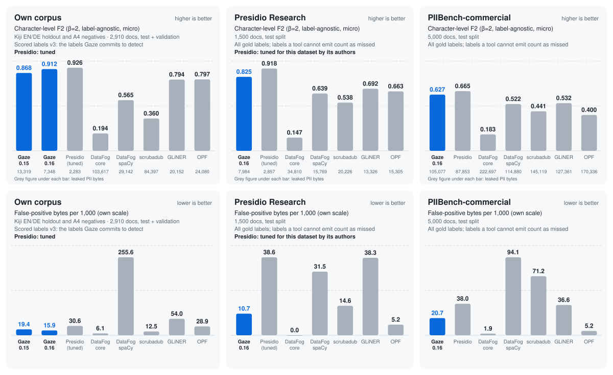
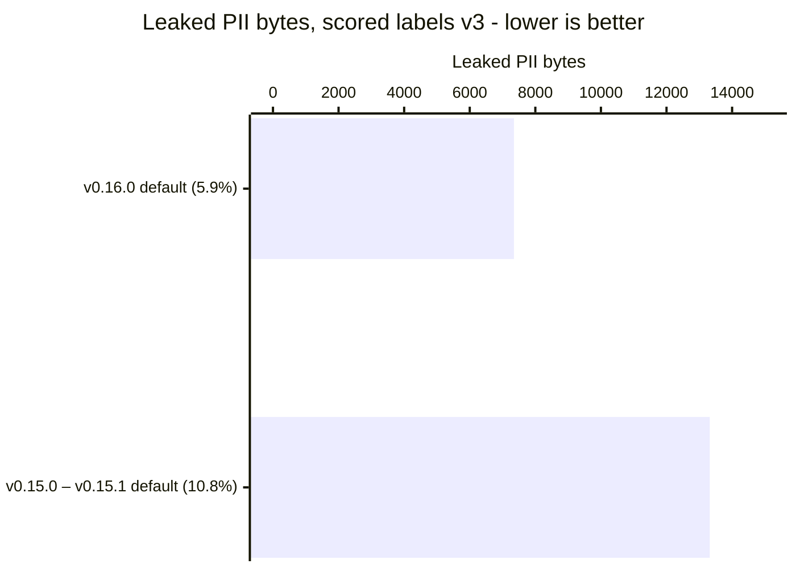
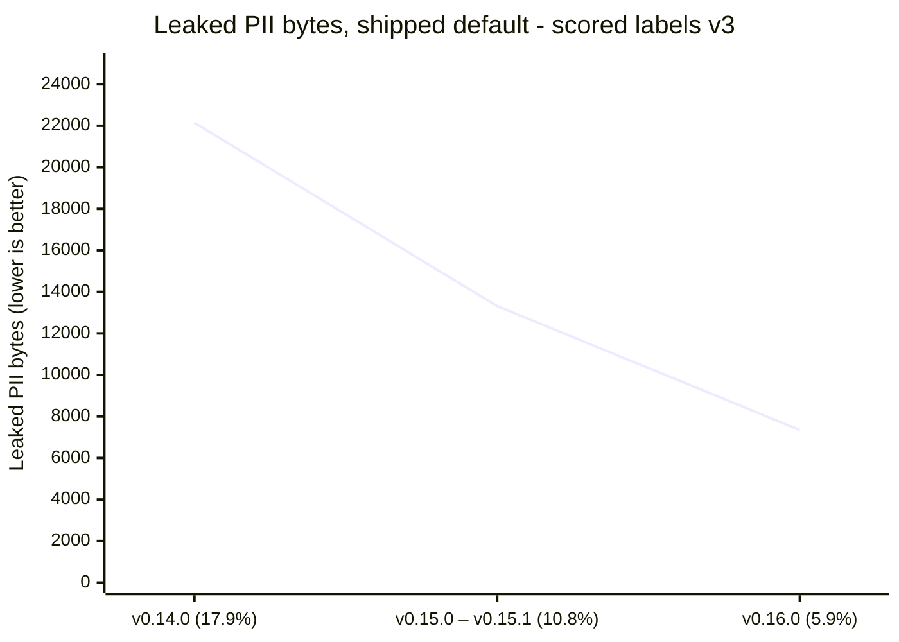
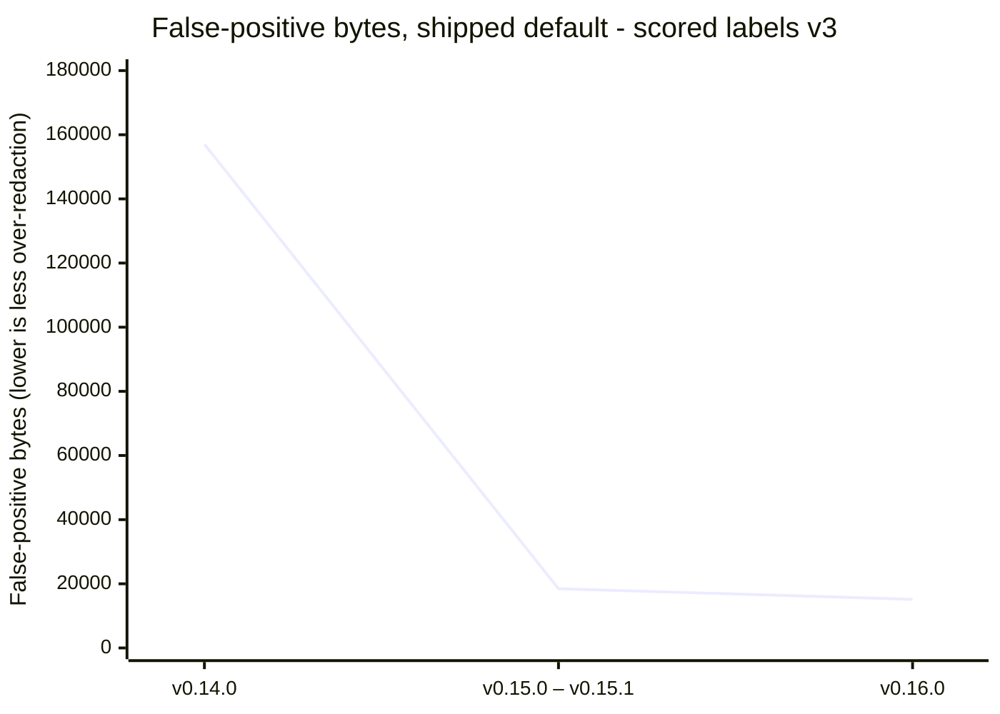
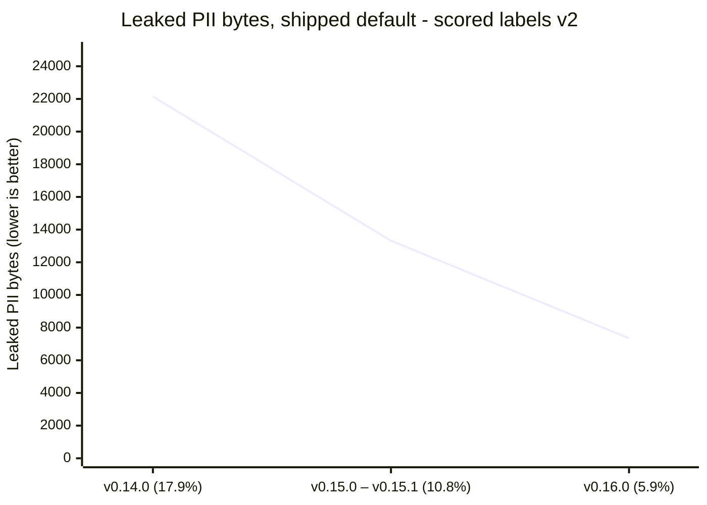
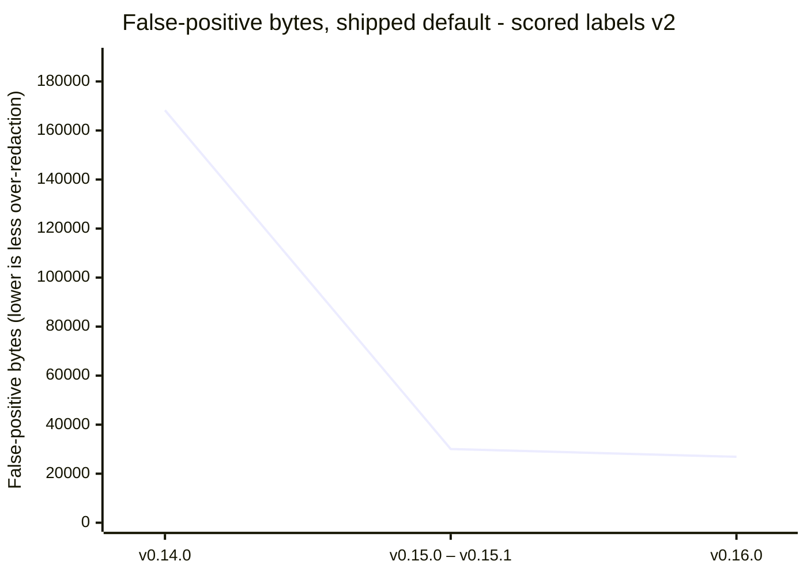
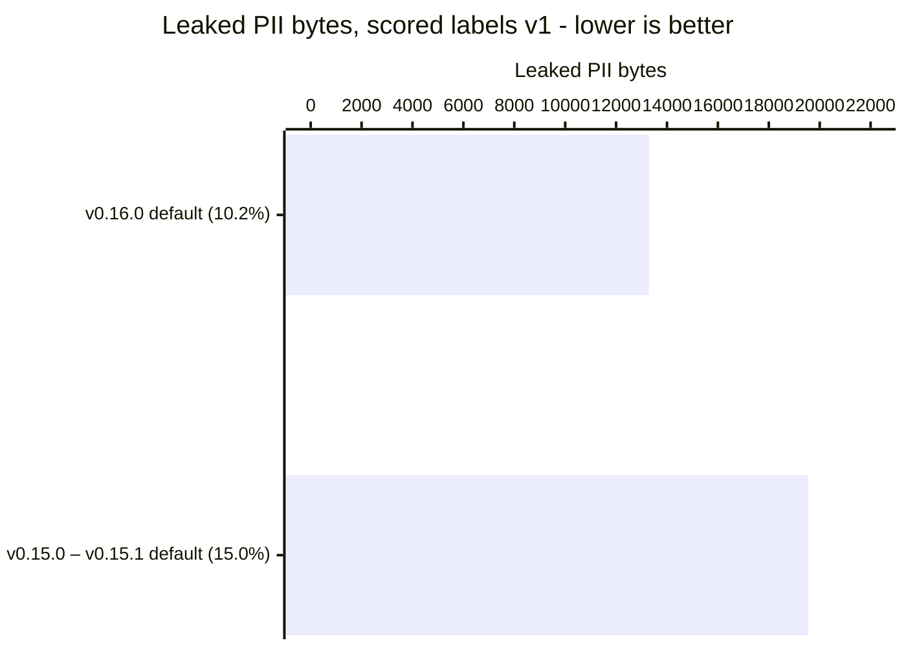
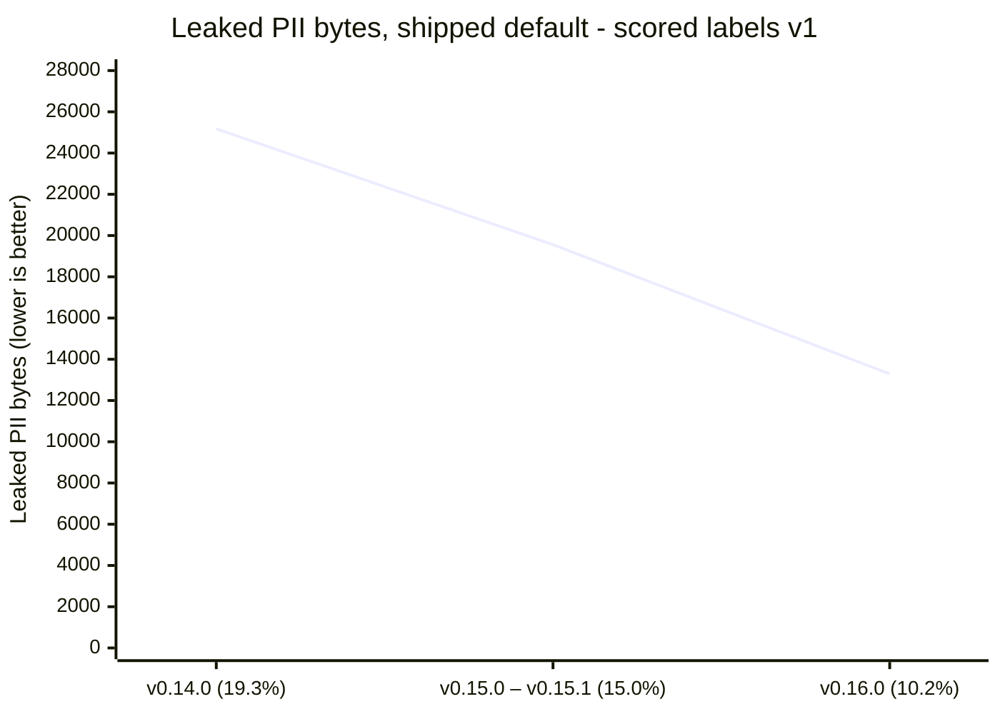
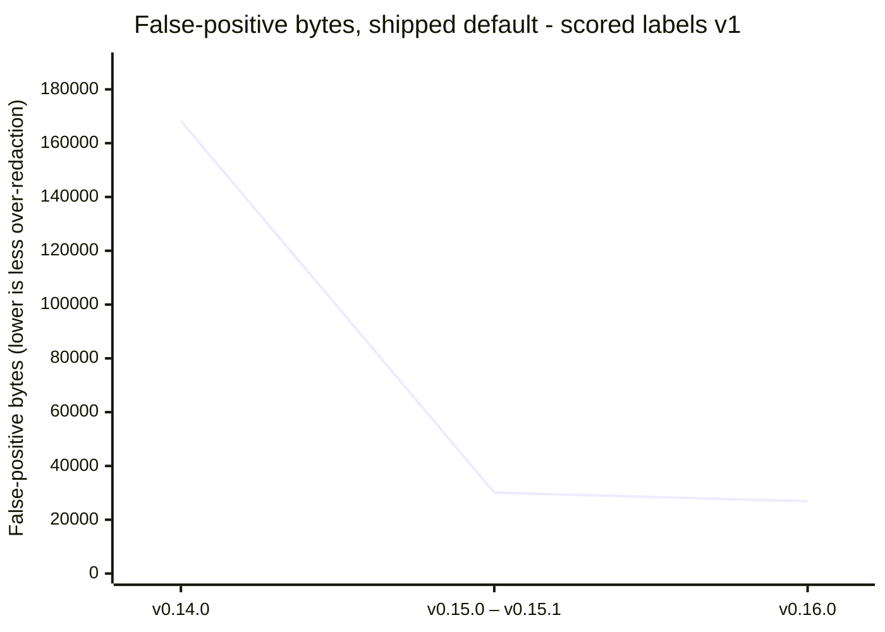

# Gaze Benchmarks

The single benchmark document for Gaze. It carries the current release's
measured numbers as a table and as charts, the methodology behind them, and the
commands to reproduce them.

[Competitor comparison](competitors.md) scores Presidio, GLiNER-PII, and OPF
on the same documents and byte scorer as Gaze. Perplexity PII-Tracer is scored
the same way on [its own page](competitors-pii-tracer.md).

Everything under [Current release](#current-release), [Charts](#charts), and
[Release history](#release-history) is **generated** from
[`release-history.json`](release-history.json) by
[`scripts/bench/render_benchmark_doc.py`](../../../scripts/bench/render_benchmark_doc.py).
Do not hand-edit inside the `<!-- BEGIN GENERATED -->` markers; CI re-renders
and fails on drift.

| Section | Contents |
| --- | --- |
| [What we measure, and how](#what-we-measure-and-how) | corpora, arms, metrics, goals |
| [A scorecard measures the corpus, not the recognizer](#a-scorecard-measures-the-corpus-not-the-recognizer) | how to read these numbers honestly |
| [Current release](#current-release) | the headline table |
| [Charts](#charts) | per-arm and release-over-release |
| [Release history](#release-history) | one row per released version |
| [Leak ledger](#leak-ledger) | every leaked gold byte by root cause |
| [Competitors' own benchmarks](#competitors-own-benchmarks) | Gaze and competitors on Presidio Research and PIIBench-commercial |
| [Safety-Net Matrix](#safety-net-matrix) | backend pins and matrix shape |
| [NER Model Leaderboard](#ner-model-leaderboard) | candidate backends |
| [How to reproduce](#how-to-reproduce) | commands, harness, hardware |
| [Evidence before the release gate](#evidence-before-the-release-gate) | archived per-PR reports |

Related contracts kept as separate documents:

- [`evidence-protocol-v1.md`](evidence-protocol-v1.md) — normative contract for
  the optional offline T1 evidence path (route observations, synthetic paired
  arithmetic, recursive aggregate receipt validation). Explicitly **not** an
  end-to-end paired evaluation of route observations.
- [`negative-corpus-annotation-contract.md`](negative-corpus-annotation-contract.md)
  — synthetic EN/DE hard-negative annotation and zero-PII contract.
- [`class-commitments-v1.json`](class-commitments-v1.json) — fixture-only
  class-commitment schema and its two fixture rows. Scope is
  `fixture_only_not_a_corpus_commitment`; it is not a corpus commitment.

---

## What we measure, and how

### The question

Would annotated PII bytes reach a downstream LLM? Gold spans and Gaze
prediction spans are merged before their intersection is measured in **UTF-8
bytes**. Label matching is deliberately not part of the primary score:
pseudonymization safety depends first on covering the bytes, and Gaze's class
vocabulary does not match every source taxonomy exactly. Per-label recall still
exposes class-shaped gaps.

### How to read metric headers

Result headers use one direction marker plus a written goal: `↑` **higher is
better**, `↓` **lower is better**, `↔` an **exact or invariant target**, `info`
a **descriptive field with no optimization direction**. Historical evidence
without a contractual threshold uses `goal lower` / `goal higher` /
`goal no regression`; it does not invent a numeric gate.

`info` is intentional for support counts, observed configuration columns in
mixed-metric tables, diagnostic partitions, and deltas whose favorable sign
depends on the metric. Pin, evidence, command, rationale, and category tables
stay plain because they are not optimization results.

### The arms

Every release scorecard runs the same two configurations:

| Arm | What it is |
| --- | --- |
| `rule-floor-extended` | the shipped deterministic recognizers alone |
| `pass2-ner` | that floor plus the pinned Davlan mBERT `NerRecognizer` (threshold `0.3` by default), with no safety net |

Two additional arms run a safety net under the shipped `Resolve`/`Redact` policy,
with exact-restore checks, manifest-integrity checks, and a post-policy
SafetyNet scan. `full-stack-opf-resolve` exercises the OpenAI Privacy Filter. It
is excluded from the default run because it needs a separately installed
verified 2.6 GB checkpoint and a warmed daemon, and it has a measured
fail-closed invalid-output rate. `full-stack-nym-resolve` exercises the in-process
Nym-small net and needs its pinned bundle. The v0.16 `gaze setup` default is
rules plus NER plus Nym; its tagged measurement is in the v0.16 release row.

The v0.16 comparison mapping adds `custom:age` → `AGE`. Historical comparison
predictions are unavailable for a live replay. Their published scores are retained:
the older Gaze revisions cannot emit that label, and their composed mappings and
common-label intersections are unchanged. The committed
[`refresh_age_mapping.py`](../../../scripts/bench/compare/refresh_age_mapping.py)
audit verifies those claims against each row’s recorded harness revision. Release
character scores are replayed from the committed observations; new third-party
v0.16 rows come from paired builds of the release tag.

Warm per-document latency of the Nym arm is measured by
[`scripts/bench/nym-warm-latency.py`](../../../scripts/bench/nym-warm-latency.py)
(`uv run --with tokenizers python scripts/bench/nym-warm-latency.py --repo-root .`
after `gaze setup --safety-net nym`). It times the release harness warm for
`pass2-ner` and `full-stack-nym-resolve` over the coverage-loop corpus plus
512- and 1,024-piece synthetic documents, whose piece counts it checks against
the installed tokenizer before timing, and prints p50, p95 and mean with a
hardware line and the host load average. No numbers are recorded here yet: a
latency row needs a quiet host (load average below 2), and every run so far was
on a shared, loaded one.

Release rows up to v0.14.0 predate the removal of the Kiji DistilBERT safety net
and report `full-stack-kiji-resolve`, which was the shipped default then. Those rows
are kept as measured.

### Scored-label contracts

Which corpus labels count as gold PII is itself a versioned contract. Rows
measured before contracts existed use **v1**, which scores every label.
[`scored-labels-v2.json`](scored-labels-v2.json) rules on each of the 29 corpus
labels with a reason; it puts the credential labels `PASSWORD` and
`SECURITYTOKEN` out of contract (user ruling 2026-09-16: credentials are not
personal data), treats Gaze's own credential classes as neutral predictions, and
marks `USERNAME`, `URL`, `COMPANYNAME`, `COUNTRY` and `STATE` as rulings still
pending. [`scored-labels-v3.json`](scored-labels-v3.json) keeps v2's labels
and credits a protected, unlabelled repeat of a labelled value (see
[Gold-gap protection](#gold-gap-protection-contract-v3)). **v3 is the headline
contract** (user decision 2026-09-26, after its audit passed): it scores the
labels Gaze commits to detect without charging correct protection as a false
positive. v2 (the same labels, no credit) and v1 (every original gold label)
stay beside it. A release can carry several: its row is measured under one
contract and re-scored under the others from the same commit and corpus, each
with its own committed scorecard. Out-of-contract bytes are neither leaked nor false
positive. Numbers from different contracts are never compared as a
regression, every table and chart names its contract, and a release not
measured under a contract shows *not measured* there instead of borrowing the
other contract's numbers. See
[`scripts/bench/README.md`](../../../scripts/bench/README.md#scored-label-contracts).

Contract column note: the history table carries leak and false-positive
columns per contract, v3 first. A release row whose own contract is not v1
shows "scored labels vN" beside its version. v3 tables add a gold-gap
credited bytes column beside false-positive bytes.

### Gold-gap protection (contract v3)

The corpus labels a PII value where it is introduced and, in the audited
candidates, not where it recurs. "My name is Emma Clarke … Emma has always
enjoyed …" labels the first `Emma` only, so protecting the second one scores
four false-positive bytes under v2.
[`scored-labels-v3.json`](scored-labels-v3.json) has v2's labels unchanged and
adds a `gold_gap` rule: a predicted span that overlaps no scored gold and no
ignored byte, whose ASCII-whitespace-trimmed bytes equal a scored gold value in
the same document, whose class is listed against that label in the contract's
own `compatible_labels` table, and whose trimmed edges touch no word character
(a letter, digit or combining mark, a symbol Unicode names as a letter, or an
unassigned code point: a superset of Rust's `char::is_alphanumeric`, pinned by
a test against a table the repo's rustc generates), is reported as
`gold_gap_protected_bytes` (per label, attributed to the first compatible gold
span in document order, each byte once).
Only trimmed bytes are credited; padding stays false positive.

**How the headline reads it.** Leaked and true-positive bytes are exactly
v2's: the credit touches only false positives. The v3 headline shows
false-positive bytes after the credit (`false_positive_bytes_after_gold_gap`,
v2 FP − gold-gap) and byte precision after it (`adjusted_precision` =
TP / (TP + FP after gold-gap)), with the credited bytes in their own column;
every scored predicted byte is TP, FP after gold-gap, or gold-gap, with ignored
bytes separate. The negative corpus has no gold, so nothing there can qualify.
The scorecard itself keeps v2's `utf8_bytes` block and reports the credit
beside it in `metrics.gold_gap`, whose `status` field reads `diagnostic`
because it is a fixed setting of the pinned contract file; the renderer does
the adjustment in one place. The merge and release gates still read v2 and v1.

Byte equality is not identity: a same-document homonym ("May" the name and
"May" the month) passes all four conditions, so the column counts only because
the gold-gap audit of [`gold-gap-sample-v3.json`](gold-gap-sample-v3.json)
passed. The sample: 200
seeded (20260922) candidates from the final eligibility set, every rule-class
candidate, at least one draw from every non-empty stratum, at least 40 each of
`FIRSTNAME`, `SURNAME` and `CITY`, ambiguous shapes (English dictionary words,
values used unlabelled in another document, a committed German noun/surname
seed list) drawn at twice the plain rate with recorded design weights that sum
to the eligibility population, IDs and byte offsets only (no document text).
Acceptance, declared before any verdict: the one-sided 95 %
Clopper-Pearson upper bound on the candidate false-credit rate is at most 5 %,
which is **at most 4** "no" or "uncertain" of 200 (bound 4.52 %; 5 would give
5.18 %), with document-clustered counts reported. Scoring and sampling:
`scripts/bench/gold_gap_evidence.py`.

**Audit result (2026-09-27): passed, 3 of 200.** Three model judges ruled on
every card: Claude Opus first, then Codex and TypeSafe, whose verdict files were
sealed by SHA-256 before either read the Opus proposals. 188 cards were
unanimous. The user decided the 12 contested cards on the audit page and
confirmed 10 consensus cards; a user verdict overrides the models. Before the
user answered, a TypeSafe tiebreak (a rule fixed before any re-ask ran) had
settled the 12 at 4 failures; its record is kept, and it differs from the
user on five cards. The Codex judge's brief disclosed the Opus counts and
failing card IDs (not reasons) before it judged. The three failures sit in
three different documents, and the document-cluster design effect is 0.99, so
clustering does not widen the 3.83 % bound: `gg-025` and `gg-059` are
uncertain because the corpus put the gold label on the wrong occurrence (the
`Wien` inside a street name, a date where it is not the birth date), and
`gg-190` is no (a spouse credited as the labelled person). Design-weighted
failure rate 1.13 %, byte-weighted 0.72 %. Every entry's verdict and how it
was reached are in the sample file. The tiebreak run is
`scripts/bench/gold_gap_tiebreak.py`, its text-free results
`scripts/bench/fixtures/gold-gap-tiebreak-v3.json`, and
`gold_gap_evidence.py accept` checks every verdict against them before it
recomputes the result.

### Zero-leak production goals

Production scorecard targets, not claims about any particular historical report:

| Production metric | Direction and goal |
| --- | --- |
| Leaked labeled PII bytes | ↓ lower is better; goal 0 |
| Missed entities | ↓ lower is better; goal 0 |
| Zero-leak documents | ↑ higher is better; goal 100% |
| Exact restore | ↑ higher is better; goal 100% of completed documents |
| Valid, trace-consistent manifests | ↑ higher is better; goal 100% of completed documents |
| Final redact actions | ↓ lower is better; goal 0 |
| Silent detector skips | ↓ lower is better; goal 0 |
| Actionable residual suspects | ↓ lower is better; goal 0 |
| Production/benchmark divergence | ↔ invariant target; goal 0 |
| False-positive bytes/documents and clean-document changes | ↔ invariant ratchet; goal no regression |
| *Ratchet exception (gold noise)* | A change may raise holdout false-positive bytes only by spans that are genuine identifiers the corpus gold does not label, and only when the A4 negative corpus does not move at all (bytes and documents, every category); each such span is enumerated shape-normalised with the reason it is real, and the reviewer re-confirms the list — never tune a rule to skip real PII to keep the counter flat |

The scorecard is **non-compensating**: safety, reversibility, trust,
availability, precision, and latency are reported as separate axes. Latency is
compared only after the correctness gates pass.

### Primary corpus — English/German synthetic holdout

The primary product-language corpus is the English and German rows of the
upstream test split of
[`DataikuNLP/kiji-pii-training-data`](https://huggingface.co/datasets/DataikuNLP/kiji-pii-training-data),
paired with the complete committed A4 EN/DE hard-negative corpus. The split is
**evaluation-only**: it must never enter Gaze training, fine-tuning, prompt
examples, dictionaries, rule authoring, or threshold selection.

| Field | Pinned value |
| --- | --- |
| Repository | `DataikuNLP/kiji-pii-training-data` |
| Revision | `0275550f0b1f1b8f2dc9356fd31ac1c788b8228b` |
| File | `data/test-00000-of-00001.parquet` |
| License | `Apache-2.0` |
| Declared data kind | synthetic PII only |
| Full test rows | `5,150` |
| File bytes | `2,013,107` |
| SHA-256 | `916c63792345bf3c2e0888941b3d14526c43b7c7fe8af60e0d283fed71b1234d` |
| Selected English rows | `1,033` |
| Selected German rows | `853` |
| Selected annotations | `14,719` |
| Observed selected labels | `29` |
| Selection seed | Not applicable; the complete pinned EN/DE selection is used without sampling or shuffling |
| Negative corpus | [`crates/xtask/fixtures/negative_corpus/en_de_negative.jsonl`](../../../crates/xtask/fixtures/negative_corpus/en_de_negative.jsonl) |

The runner refuses any file whose byte size or digest differs. It also verifies
the full row count, validates every selected annotation boundary and annotated
substring, and converts source character offsets to UTF-8 byte offsets before
scoring.

The word `kiji` in the dataset name does **not** refer to a Gaze model. The
corpus is unrelated to the removed Kiji DistilBERT safety net.

**Limits.** Every selected row contains annotated PII, so the split measures
false-positive bytes only within positive documents and cannot replace a
negative-only corpus — hence the paired A4 negatives. Synthetic templates
underrepresent OCR errors, streaming boundaries, JSON tool calls, tenant
identifiers, and ambiguous natural language. The test split is isolated from
training, but upstream train and test data may share a generator and templates:
if a future model uses another split from the same repository, that score is
**same-generator evaluation** and cannot be its only promotion gate.

### Secondary corpus — OpenPII micro, multilingual

The validation split of `ai4privacy/pii-masking-micro-100k` is retained as a
secondary multilingual masking holdout and Unicode-offset stress test,
including its Japanese slice. The same evaluation-only rule applies.

| Field | Pinned value |
| --- | --- |
| Repository | `ai4privacy/pii-masking-micro-100k` |
| Revision | `3cd59c65631280839f830d3ba96dcdfe1785cab1` |
| File | `data/validation.jsonl` |
| License | `CC-BY-4.0` |
| Declared data kind | synthetic PII only |
| Rows | `9,990` |
| Bytes | `32,536,978` |
| SHA-256 | `bb15da1b5fbb11b3cc6fd4c95eca256197573ecd066230eb3c1fe6898f27a578` |
| Annotations | `72,087` |
| Observed labels | `26` (a small tail beyond the 19 advertised on the dataset card; the runner reports observed counts rather than dropping it) |

Two additional recall slices are published for this corpus: **direct
identifiers** (names, contact details, account identifiers, addresses) and
**contextual PII** (dates, ages, titles, sex, gender, time, amount, currency).
All labels stay in the primary all-PII score; the slices do not weaken the
fail-closed contract.

**Datasets evaluated and rejected.** PIIMB has an excellent masking-oriented,
character-level methodology with negative sentences, but its assembled
benchmark is CC BY-NC 4.0 and so cannot be the default reproducible corpus for
Gaze's unrestricted adopter workflow. REDACT is useful as a future curated
secondary evaluation, but its files require access approval. Neither constraint
justifies weakening the current synthetic holdout gate.

---

## A scorecard measures the corpus, not the recognizer

These numbers score one synthetic EN/DE holdout. A perfect row here is evidence
about **this corpus**, not proof that a recognizer is complete — shapes the
corpus does not contain are unmeasured. Recall claims about a rule change need a
direct differential probe, not a scorecard row. The generated
[agentic layers](#agentic-layers-and-the-rule-gate) cover some of the agent
shapes this corpus lacks, and they have the same limit: they measure only the
families and surfaces they generate.

Two consequences worth stating plainly:

1. **Consolidating N rules into one is a widening only if the shared form is a
   superset of every original, including the loosest.** A clean scorecard across
   all three arms has previously coexisted with a real recall regression on
   whitespace shapes this corpus happens not to contain.
2. **False-positive bytes are a ratchet, not a free variable.** They are
   reported beside recall precisely so precision cannot be traded away silently
   to make a leak counter fall.
3. **Gold that fails its own checksum stays scored.** The synthetic corpus
   generates many tax-ID, card and IBAN values that fail their Steuer-ID, Luhn
   or mod-97 check, and Gaze's validator-backed rules refuse them by design.
   Those bytes still count as surviving PII in the headline. From the first
   release measured with the split, the current-release section adds a table
   for the shipped default arm: gold spans per validator-backed label, how many
   fail their validator, validator-backed versus shape-only recall, and the
   surviving bytes split into valid and invalid gold. The two split columns add
   up to that label's surviving bytes; they never replace them, and no
   validator is loosened to move them.

---

## Current release

<!-- BEGIN GENERATED: current-release -->

**v0.16.0** — measured on the released tree.

> Measured on the signed release candidate whose crates tree is identical to tag v0.16.0. Byte metrics only; shared-host timings are not quiet-host latency. See [Latency](#latency).

| Provenance | Value |
| --- | --- |
| Release | `v0.16.0` |
| Commit | `7779119128ce4b5fdee6674f40937fb770264610` |
| Measured | 2026-10-08 |
| Machine | MacBook Pro, Apple M5 Max, 18 cores, 64 GB, macOS 26.5 (25F71) |
| Harness | [`scripts/bench/run_no_opf_benchmark.py`](../../../scripts/bench/run_no_opf_benchmark.py) |
| Scorecard | [`scorecard-v0.16.0.json`](scorecard-v0.16.0.json) |
| Scorecard sha256 | `059cb601cbdb98a7fde8ba8be3598aa141044e3c099f5fe6f1ebf1959bbc990b` |
| Corpus | `DataikuNLP/kiji-pii-training-data+gaze` @ `0275550f0b1f1b8f2dc9356fd31ac1c788b8228b+a4-negative-v1` |
| Corpus sha256 | `11614c80f6d0fe78feb4c592fc9674efac08d73fe5549ad1bed8dd057b7592d2` |
| Corpus component `dataiku` | `916c63792345bf3c2e0888941b3d14526c43b7c7fe8af60e0d283fed71b1234d` |
| Corpus component `negative_corpus` | `d9e5807b9f9152932973214e38e1c44a75e9a413f53b5c8954fba0f3f25b1116` |
| Population | 2,910 documents / 14,719 entities |
| Profile | `full` |
| Seed | `20260710` |
| NER threshold | `0.3` |
| Model bundle `davlan-mbert-ner-hrl-onnx` | `7b0b9d0d200bf7f3a39654257f8723998316600852edff8404834eb7edfc5c16` |
| Model bundle `nym-small-int8` | `71f9023bcf86ead7234434f11a4881c0b0a87622ba4e2e44b74f55d3ede7c767` |
| Scorecard, scored labels v2 | [`scorecard-v0.16.0-scored-labels-v2.json`](scorecard-v0.16.0-scored-labels-v2.json) |
| Scorecard sha256, scored labels v2 | `752c75cb094a950f5dda8d23be35facc5dec7f29e1a7b1a99dc4076b14fbb2c0` |
| Scorecard, scored labels v3 | [`scorecard-v0.16.0-scored-labels-v3.json`](scorecard-v0.16.0-scored-labels-v3.json) |
| Scorecard sha256, scored labels v3 | `d8eb05e7480aef7ee78a59008322ef89844e4c677648e82d0a29f49ac41c215a` |

**Scored labels v3 (headline: the labels Gaze commits to detect, with protected repeats of a labelled value credited).** Gold PII bytes: 123,621.

Leaked bytes are v2's. A protected, unlabelled, byte-identical repeat of a labelled value in the same document is credited instead of counted as a false positive (gold-gap credited bytes); false-positive bytes and byte precision are after that credit. [Audit of the credit](#gold-gap-protection-contract-v3).

| Arm info | Gold PII bytes info | Surviving PII bytes ↓ | Leak rate ↓ | False-positive bytes ↔ | Gold-gap credited bytes info | Byte precision ↑ | Zero-leak documents ↑ | Restore exact ↑ | Manifest valid ↑ | Availability ↑ | Failed closed ↓ | clean p95 ms ↓ |
| --- | ---: | ---: | ---: | ---: | ---: | ---: | ---: | ---: | ---: | ---: | ---: | ---: |
| `policy-file` **(shipped default)** | 123,621 | 7,348 | 5.9440% | 15,141 | 11,761 | 0.884784 | 71.4777% | 100.0000% | 100.0000% | 100.0000% | 0 | 390.59 |

**Scored labels v2 (the labels Gaze commits to detect, without gold-gap credit).** Gold PII bytes: 123,621.

| Arm info | Gold PII bytes info | Surviving PII bytes ↓ | Leak rate ↓ | False-positive bytes ↔ | Byte precision ↑ | Zero-leak documents ↑ | Restore exact ↑ | Manifest valid ↑ | Availability ↑ | Failed closed ↓ | clean p95 ms ↓ |
| --- | ---: | ---: | ---: | ---: | ---: | ---: | ---: | ---: | ---: | ---: | ---: |
| `policy-file` **(shipped default)** | 123,621 | 7,348 | 5.9440% | 26,902 | 0.812104 | 71.4777% | 100.0000% | 100.0000% | 100.0000% | 0 | 390.59 |

**Scored labels v1 (all original gold labels, kept for comparison with earlier releases).** Gold PII bytes: 130,282.

| Arm info | Gold PII bytes info | Surviving PII bytes ↓ | Leak rate ↓ | False-positive bytes ↔ | Byte precision ↑ | Zero-leak documents ↑ | Restore exact ↑ | Manifest valid ↑ | Availability ↑ | Failed closed ↓ | clean p95 ms ↓ |
| --- | ---: | ---: | ---: | ---: | ---: | ---: | ---: | ---: | ---: | ---: | ---: |
| `policy-file` **(shipped default)** | 130,282 | 13,291 | 10.2017% | 26,902 | 0.813042 | 62.8522% | 100.0000% | 100.0000% | 100.0000% | 0 | 390.59 |

Validator-backed labels on `policy-file`, scored labels v1. Gold that fails its own checksum stays scored gold: the two leaked-bytes columns split the surviving bytes above, they do not replace them. Shape recall is what a shape-only match (validator ignored) would cover.

| Label | Validator | Gold | Gold failing its validator | Validator-backed recall | Shape recall | Leaked bytes, valid gold | Leaked bytes, invalid gold |
| --- | --- | ---: | ---: | ---: | ---: | ---: | ---: |
| `CREDITCARDNUMBER` | luhn | 126 | 96 | 0.714286 | 0.984127 | 0 | 248 |
| `EMAIL` | email_rfc | 375 | 0 | 0.994667 | 0.994667 | 19 | 0 |
| `IBAN` | iban_mod97 | 207 | 67 | 0.246377 | 0.468599 | 0 | 214 |
| `PHONENUMBER` | e164_phone, e164_phone_national_de, e164_phone_national_us | 359 | 41 | 0.821727 | 0.908078 | 306 | 352 |
| `TAXNUM` | de_steuer_id_mod1110 | 212 | 210 | 0.047170 | 0.047170 | 28 | 1,157 |

<!-- END GENERATED: current-release -->

## Known gaps

**Known gaps:** house numbers and tenant-specific IDs such as order numbers pass through unless your policy adds a recognizer, and a CSV header does not yet mark the column under it (`name,bsn\nJan,111222333` leaves the BSN raw). Names and other values a recognizer found once are not carried to their other occurrences, so without NER a name repeated in prose can pass raw, and UK national-format phone numbers are not yet detected.

---

## Benchmark panels

One panel per benchmark, released Gaze versions and declared competitor configurations only. The chart and both tables are generated from the committed JSON by [`render_benchmark_doc.py`](../../../scripts/bench/render_benchmark_doc.py); untagged builds are never drawn.

<!-- BEGIN GENERATED: panels -->

<picture>
  <source media="(prefers-color-scheme: dark)" srcset="../../../docs/assets/benchmarks/benchmark-panels-dark.svg">
  
</picture>

**Character-level F2 (β=2, label-agnostic, micro)** (higher is better; best per row in bold):

| Benchmark | Gaze 0.15 | Gaze 0.16 | Presidio | DataFog core | DataFog spaCy | scrubadub | GLiNER | OPF |
|---|---:|---:|---:|---:|---:|---:|---:|---:|
| Own corpus | 0.868 | 0.912 | **0.926 (tuned)** | 0.194 | 0.565 | 0.360 | 0.794 | 0.797 |
| Presidio Research | not run | 0.825 | **0.918 (tuned)** | 0.147 | 0.639 | 0.538 | 0.692 | 0.663 |
| PIIBench-commercial | not run | 0.627 | **0.665** | 0.183 | 0.522 | 0.441 | 0.532 | 0.400 |

**Leaked PII bytes** (lower is better; best per row in bold):

| Benchmark | Gaze 0.15 | Gaze 0.16 | Presidio | DataFog core | DataFog spaCy | scrubadub | GLiNER | OPF |
|---|---:|---:|---:|---:|---:|---:|---:|---:|
| Own corpus | 13,319 | 7,348 | **2,283 (tuned)** | 103,617 | 29,142 | 84,397 | 20,152 | 24,080 |
| Presidio Research | not run | 7,984 | **2,857 (tuned)** | 34,810 | 15,769 | 20,226 | 13,326 | 15,305 |
| PIIBench-commercial | not run | 105,077 | **87,853** | 222,697 | 114,880 | 145,119 | 127,361 | 170,336 |

**False-positive bytes per 1,000 bytes** (lower is better; best per row in bold):

| Benchmark | Gaze 0.15 | Gaze 0.16 | Presidio | DataFog core | DataFog spaCy | scrubadub | GLiNER | OPF |
|---|---:|---:|---:|---:|---:|---:|---:|---:|
| Own corpus | 19.4 | 15.9 | 30.6 (tuned) | **6.1** | 255.6 | 12.5 | 54.0 | 28.9 |
| Presidio Research | not run | 10.7 | 38.6 (tuned) | **0.0** | 31.5 | 14.6 | 38.3 | 5.2 |
| PIIBench-commercial | not run | 20.7 | 38.0 | **1.9** | 94.1 | 71.2 | 36.6 | 5.2 |

A document a tool skips counts all its gold characters as missed and all its gold bytes as leaked. The declared competitor configurations skipped 0 of the own corpus's 2,910 documents and no documents on the third-party sets. Refused documents are ones Gaze failed closed on instead of cleaning: Gaze 0.15 0, Gaze 0.16 0.

Own corpus: Presidio tuned for this corpus on its validation half (highest F2), the best of three tuned Presidio rows by test-half F2; like every bar it shows all of layer C, validation half included; Presidio's defaults are in competitors.md.
Presidio Research: Presidio tuned for this dataset by its authors (their published custom setup).
PIIBench-commercial: PIIBench publishes no vendor-tuned Presidio, so Presidio is the declared best configuration.

- **Own corpus:** Kiji EN/DE holdout and A4 negatives, 2,910 documents, scored labels v3 (the labels Gaze commits to detect, protected repeats credited). Gaze from [`release-history.json`](release-history.json) (the shipped default of each tagged release); competitors from [`comparison.json`](comparison.json).
- **Presidio Research:** microsoft/presidio-research (1,500 documents, test split), every gold label scored (a label a tool cannot emit counts as missed); rows from [`their-benchmarks.json`](their-benchmarks.json).
- **PIIBench-commercial:** pritesh-2711/pii-bench (5,000 documents, test split), every gold label scored (a label a tool cannot emit counts as missed); rows from [`their-benchmarks.json`](their-benchmarks.json).
- **Configurations:** competitors use the rows declared in [`chart-configs.json`](../../../scripts/bench/compare/chart-configs.json), chosen before results were reviewed; full versions and settings are in [`competitors.md`](competitors.md). On the own corpus the Presidio bar is instead the best tuned Presidio row from [`presidio-tuned.json`](presidio-tuned.json) (selection and every tuned number in [`competitors.md`](competitors.md#tuned-presidio)).
- **Metric:** F2 counts Unicode code points (not grapheme clusters) inside the merged byte spans of each document, ignores labels, pools every document (micro), weights recall four times precision, scores 0 when precision and recall are both 0 (0/0 = 0), and counts all of a skipped document's gold characters as missed.
- **False positives:** F2 counts every false-positive character for every tool; the false-positive row (bytes redacted that are not PII, per 1,000 bytes of the scored documents) also credits a protected repeat of a labelled value on the own corpus (contract v3). Every tool is treated identically within each row, and the third-party sets have no such credit.
- **Gaze release scores:** each tagged release is scored by replaying its committed observation record over the corpus (`compare/release_char_level.py record`). The offline `check` that CI runs proves the stored numbers are consistent with the committed record, its evidence file and the UTF-8 structure of that evidence; only `record` (the corpus replay) proves the character counts, so a pull request that changes `release-char-level.json` or its evidence file must include the replay command's output in its description.
- **Vendors' own metrics:** Presidio Research: F2, binary PII vs O (presidio-evaluator); PIIBench-commercial: span F1, exact span + type (PIIBench seqeval). They appear in the third-party tables below, not in the panels.

<!-- END GENERATED: panels -->

## Charts

<!-- BEGIN GENERATED: charts -->

#### Scored labels v3 (headline: the labels Gaze commits to detect, with protected repeats of a labelled value credited)

**Leaked PII bytes — v0.16.0 against the previous release with different results.** Lower is better; the goal is zero. Scored under scored labels v3; every bar is a measured arm in [`release-history.json`](release-history.json). The percentage in each label is the leak rate: leaked bytes out of 123,621 gold PII bytes.


```mermaid
xychart-beta horizontal
    title "Leaked PII bytes, scored labels v3 - lower is better"
    x-axis ["v0.16.0 default (5.9%)", "v0.15.0 – v0.15.1 default (10.8%)"]
    y-axis "Leaked PII bytes" 0 --> 15000
    bar [7348, 13319]
```

**Trend across releases — each release's shipped default.** Scored under scored labels v3. The shipped arm changes between releases; the history table names it per row.


```mermaid
xychart-beta
    title "Leaked PII bytes, shipped default - scored labels v3"
    x-axis ["v0.14.0 (17.9%)", "v0.15.0 – v0.15.1 (10.8%)", "v0.16.0 (5.9%)"]
    y-axis "Leaked PII bytes (lower is better)" 0 --> 25000
    line [22144, 13319, 7348]
```


```mermaid
xychart-beta
    title "False-positive bytes, shipped default - scored labels v3"
    x-axis ["v0.14.0", "v0.15.0 – v0.15.1", "v0.16.0"]
    y-axis "False-positive bytes (lower is less over-redaction)" 0 --> 180000
    line [157048, 18488, 15141]
```

#### Scored labels v2 (the labels Gaze commits to detect, without gold-gap credit)

**Leaked PII bytes — v0.16.0 against the previous release with different results.** Lower is better; the goal is zero. Scored under scored labels v2; every bar is a measured arm in [`release-history.json`](release-history.json). The percentage in each label is the leak rate: leaked bytes out of 123,621 gold PII bytes.


```mermaid
xychart-beta horizontal
    title "Leaked PII bytes, scored labels v2 - lower is better"
    x-axis ["v0.16.0 default (5.9%)", "v0.15.0 – v0.15.1 default (10.8%)"]
    y-axis "Leaked PII bytes" 0 --> 15000
    bar [7348, 13319]
```

**Trend across releases — each release's shipped default.** Scored under scored labels v2. The shipped arm changes between releases; the history table names it per row.


```mermaid
xychart-beta
    title "Leaked PII bytes, shipped default - scored labels v2"
    x-axis ["v0.14.0 (17.9%)", "v0.15.0 – v0.15.1 (10.8%)", "v0.16.0 (5.9%)"]
    y-axis "Leaked PII bytes (lower is better)" 0 --> 25000
    line [22144, 13319, 7348]
```


```mermaid
xychart-beta
    title "False-positive bytes, shipped default - scored labels v2"
    x-axis ["v0.14.0", "v0.15.0 – v0.15.1", "v0.16.0"]
    y-axis "False-positive bytes (lower is less over-redaction)" 0 --> 190000
    line [168259, 30073, 26902]
```

#### Scored labels v1 (all original gold labels, kept for comparison with earlier releases)

**Leaked PII bytes — v0.16.0 against the previous release with different results.** Lower is better; the goal is zero. Scored under scored labels v1; every bar is a measured arm in [`release-history.json`](release-history.json). The percentage in each label is the leak rate: leaked bytes out of 130,282 gold PII bytes.


```mermaid
xychart-beta horizontal
    title "Leaked PII bytes, scored labels v1 - lower is better"
    x-axis ["v0.16.0 default (10.2%)", "v0.15.0 – v0.15.1 default (15.0%)"]
    y-axis "Leaked PII bytes" 0 --> 22000
    bar [13291, 19556]
```

**Trend across releases — each release's shipped default.** Scored under scored labels v1. The shipped arm changes between releases; the history table names it per row.


```mermaid
xychart-beta
    title "Leaked PII bytes, shipped default - scored labels v1"
    x-axis ["v0.14.0 (19.3%)", "v0.15.0 – v0.15.1 (15.0%)", "v0.16.0 (10.2%)"]
    y-axis "Leaked PII bytes (lower is better)" 0 --> 28000
    line [25179, 19556, 13291]
```


```mermaid
xychart-beta
    title "False-positive bytes, shipped default - scored labels v1"
    x-axis ["v0.14.0", "v0.15.0 – v0.15.1", "v0.16.0"]
    y-axis "False-positive bytes (lower is less over-redaction)" 0 --> 190000
    line [168276, 30073, 26902]
```

<!-- END GENERATED: charts -->

---

## Release history

Consecutive releases with the same results share one row, labelled oldest –
newest: same results means the same shipped arm, refused documents, leaked PII
bytes, false-positive bytes, restore-exact rate and gold-gap credit (when
the contract reports one) under the same scored-label contract, corpus and
provisional status, while clean p95 latency, date, commit and machine are
ignored because they vary with the host. The table and trend
charts show the last three such rows, and a merged row shows its newest
release. [`release-history.json`](release-history.json) keeps every release,
and every row's numbers come from the `scorecard-vX.Y.Z.json` files it links,
which stay committed as the machine-readable evidence.

<!-- BEGIN GENERATED: history -->

| Release | Measured | Commit | Machine | Scorecards | Shipped arm | Refused ↓ | Leaked PII bytes, all processed, v3 ↓ | Leaked PII bytes, common documents, v3 ↓ | False-positive bytes, v3 ↔ | Leaked PII bytes, all processed, v2 ↓ | Leaked PII bytes, common documents, v2 ↓ | False-positive bytes, v2 ↔ | Leaked PII bytes, all processed, v1 ↓ | Leaked PII bytes, common documents, v1 ↓ | False-positive bytes, v1 ↔ | Restore exact ↑ | clean p95 ms ↓ |
| --- | --- | --- | --- | --- | --- | ---: | ---: | ---: | ---: | ---: | ---: | ---: | ---: | ---: | ---: | ---: | ---: |
| v0.14.0 | 2026-09-11 | `f66a3f2` | MacBook Pro, Apple M5 Max, 18 cores, 64 GB, macOS 26.5 (25F71) | [`scorecard-v0.14.0.json`](scorecard-v0.14.0.json), [`scorecard-v0.14.0-scored-labels-v2.json`](scorecard-v0.14.0-scored-labels-v2.json), [`scorecard-v0.14.0-scored-labels-v3.json`](scorecard-v0.14.0-scored-labels-v3.json) | `full-stack-kiji-resolve` | 0 | 22,144 | 22,144 | 157,048 | 22,144 | 22,144 | 168,259 | 25,179 | 25,179 | 168,276 | 78.4192% | 195.86 |
| v0.15.0 – v0.15.1 | 2026-09-26 | `f769f82` | MacBook Pro, Apple M5 Max, 18 cores, 64 GB, macOS 26.5 (25F71) | [`scorecard-v0.15.0.json`](scorecard-v0.15.0.json), [`scorecard-v0.15.0-scored-labels-v2.json`](scorecard-v0.15.0-scored-labels-v2.json), [`scorecard-v0.15.0-scored-labels-v3.json`](scorecard-v0.15.0-scored-labels-v3.json), [`scorecard-v0.15.1.json`](scorecard-v0.15.1.json), [`scorecard-v0.15.1-scored-labels-v2.json`](scorecard-v0.15.1-scored-labels-v2.json), [`scorecard-v0.15.1-scored-labels-v3.json`](scorecard-v0.15.1-scored-labels-v3.json) | `policy-file` | 0 | 13,319 | 13,319 | 18,488 | 13,319 | 13,319 | 30,073 | 19,556 | 19,556 | 30,073 | 100.0000% | 138.72 |
| v0.16.0 | 2026-10-08 | `7779119` | MacBook Pro, Apple M5 Max, 18 cores, 64 GB, macOS 26.5 (25F71) | [`scorecard-v0.16.0.json`](scorecard-v0.16.0.json), [`scorecard-v0.16.0-scored-labels-v2.json`](scorecard-v0.16.0-scored-labels-v2.json), [`scorecard-v0.16.0-scored-labels-v3.json`](scorecard-v0.16.0-scored-labels-v3.json) | `policy-file` | 0 | 7,348 | 7,348 | 15,141 | 7,348 | 7,348 | 26,902 | 13,291 | 13,291 | 26,902 | 100.0000% | 390.59 |

- **v0.14.0, scored labels v2:** v0.14.0's own `clean_for_bench` (sha256 `fccad457ec06…`, built from `f66a3f2b`) scored by today's harness ([`rescore_past_release.py`](../../../scripts/bench/rescore_past_release.py) at `c495a6f1`); trace/manifest agreement checked with `tokenize` as manifest actions, the rule that release was built with.
- **v0.14.0, scored labels v3:** v0.14.0's own `clean_for_bench` (sha256 `9ef4ba9ef57f…`, built from `f66a3f2b`) scored by today's harness ([`rescore_past_release.py`](../../../scripts/bench/rescore_past_release.py) at `9dc171b1`); trace/manifest agreement checked with `tokenize` as manifest actions, the rule that release was built with.
- **v0.15.0, scored labels v3:** v0.15.0's own `clean_for_bench` (sha256 `2b4f5df0ba3b…`, built from `6fcba31a`) scored by today's harness ([`rescore_past_release.py`](../../../scripts/bench/rescore_past_release.py) at `9dc171b1`); trace/manifest agreement checked with `redact` and `tokenize` as manifest actions, the rule that release was built with.

<!-- END GENERATED: history -->

Rows marked *(provisional)* were not measured on the released tree; their note
records what was measured instead.

### Per-release notes

**v0.14.0.** Measured on `f66a3f2b`, whose `crates/` tree is identical to the
release branch head; the tag lands on the release merge commit and differs from
the measured tree only in docs and version pins.

- **Release readiness failed (harness exit 4).** This is the standing outcome on
  this corpus, not a new regression: the readiness gate has never passed here.
  The production cell reports non-zero leaked bytes, documents with leaks,
  uncovered entities, strict rejections, residual suspects, and final redact
  actions, each against a goal of zero.
- **Restore exact is 78.4% by design, not by defect.** The 628 documents that do
  not restore exactly are exactly the 628 where the SafetyNet took its one-way
  `redact` fallback instead of `resolve`. Redacted bytes are irreversible by
  design, so those documents cannot round-trip; `2,910 - 628 = 2,282`
  reconciles. Every manifest-integrity counter, token restore failures included,
  is zero, and the restore-success decision rate is 1.0. This is documented
  fallback behaviour, and it is not the strict-scan false-failure class fixed in
  #473.
- **Scored labels v2 was measured afterwards, on v0.14.0's own code.** v0.14.0's
  harness predates `--scored-labels`, so
  [`rescore_past_release.py`](../../../scripts/bench/rescore_past_release.py)
  runs v0.14.0's own debug `clean_for_bench` (built from `f66a3f2b` with its
  Kiji feature and the same pinned Kiji bundle) under today's corpus loaders,
  validation and scoring. Scored under v1 the same way, it reproduces this row
  exactly on all three arms
  ([`scorecard-v0.14.0-rescore-calibration-v1.json`](scorecard-v0.14.0-rescore-calibration-v1.json)),
  so the v2 numbers
  ([`scorecard-v0.14.0-scored-labels-v2.json`](scorecard-v0.14.0-scored-labels-v2.json))
  differ from v1 only by the contract. One validator rule is the release's own:
  v0.14.0 did not yet record safety-net redactions as manifest entries (#623
  changed that), so trace/manifest agreement is checked on tokenizations only,
  as this row originally was.
- **The release-over-release comparison is informal.** No `--compare-baseline`
  was passed, so `regression-status.json` reports `not_compared`. Read by hand
  against the last committed full run at `a8f7182` over a byte-identical scored
  population, production surviving PII bytes fell 21.3% (31,995 to 25,179) and
  production false-positive bytes rose by 113 (+0.07%). That rise is
  holdout-side only: the A4 negative corpus did not move at all, in bytes,
  documents, or any of its eight categories. A gated run would put those 113
  bytes through the gold-noise ratchet exception above.

---

## Per-mechanism arms

A release row measures the whole shipped stack, so it cannot say what one
mechanism is worth. A mechanism arm can: it is the stack with that mechanism
versus the stack without it, on the same binary, corpus and seed. The
mechanism is a policy delta file under
[`scripts/bench/mechanisms/`](../../../scripts/bench/mechanisms/): the TOML
sections the candidate policy adds to the base and nothing else. For a
mechanism `gaze setup` already turns on, the base is the setup policy minus
those sections. When the mechanism ships on by default, the release headline
already includes its effect; this table isolates it and does not add to it.

[`scripts/bench/mechanism_arms.py`](../../../scripts/bench/mechanism_arms.py)
`record` takes the four runner outputs (base and candidate, contracts v2 and
v1) and refuses them unless the candidate policy is exactly base plus delta,
every run shares one commit, clean tree, corpus, seed and scored population,
and each v1 run equals the v1 re-score of its v2 run's observation record.
It commits both v2 observation records under
[`mechanisms/`](mechanisms/); v3 is re-scored from them. `check` re-derives
every number below from those records and runs on every pull request. Every
row must carry every scored-label contract the repository has; after a new
`scored-labels-v<N>.json` lands, `refresh` re-derives all rows from the same
records, with no new benchmark run.

Three mechanisms have no policy-delta row. The repeat-value sweep
has no policy switch. `core-extended` is an alias for `core`, while `gaze setup`
selects the locale rulepacks separately, so there is no separate
`core-extended` default to remove. OPF is already measured by the opt-in
[`full-stack-opf-resolve`](#the-arms) benchmark arm. It has no new policy-delta row here
because its CLI runtime option cannot be expressed as an additive policy
section. These omissions do not imply that the mechanisms have zero effect.

Nym's pagination guard v1 refuses only ASCII-digit `BUILDING_NUMBER` spans whose
JSON, query, YAML, or structured field key is in the reviewed pagination/count
key table. The refusal is reported as typed `nym_pagination_key_v1` telemetry
and a metadata-only audit row; address fields and other Nym labels remain
eligible. The measured Nym rows below identify the source revision of each
guard version.

<!-- BEGIN GENERATED: mechanism-arms -->

Each row runs the same binary, corpus and seed twice: once with the base policy, once with the base policy plus one mechanism's policy delta. Nothing else differs, so the change is that mechanism's own effect. Layer C bytes; the contract v3 headline counts false-positive bytes after gold-gap credit.

6 measurements of unreleased builds stay in [`mechanism-arms.json`](mechanism-arms.json) with their evidence and are not shown here: public pages show tagged releases only.

Shipped releases, one column per release:

| Mechanism | `v0.16.0` | `v0.15.1` | `v0.15.0` | `v0.14.0` |
| --- | --- | --- | --- | --- |
| GLiNER date-of-birth judge | not measured for this release | not available: mechanism added in v0.16 | not available: mechanism added in v0.16 | not available: mechanism added in v0.16 |
| Nym safety net | not measured for this release | not measured for this release | not measured for this release | not available: mechanism added in v0.15 |
| Davlan NER | not measured for this release | not measured for this release | not measured for this release | not available: setup default added in v0.15 |
| Address-block growth | not measured for this release | not available: mechanism added in v0.16 | not available: mechanism added in v0.16 | not available: mechanism added in v0.16 |

<!-- END GENERATED: mechanism-arms -->

---

## Leak ledger

The headline says how many gold bytes leak; the leak ledger says why each one
does. For one commit it lists every gold span with at least one raw byte left
in the output, under the `gaze setup` policy, for layer C and the generated
agentic layers A, D and R, and gives it one root cause:

| Cause | Meaning |
| --- | --- |
| a no candidate | no recognizer produced anything overlapping the span; the closest one within 16 bytes is noted |
| b vetoed | a validator vetoed an overlapping candidate, a candidate was dropped before resolution (locale claim), or only a recognizer outside the locale chain matched |
| c lost in resolution | an overlapping candidate lost to another winner; the winner's class and the audit tier are noted |
| d partial span | a token covers part of the value and the rest stays raw; the sub-kind says whether a candidate that would have covered more lost resolution, was vetoed, won primary resolution but left the trace, or never existed |
| e repeat not swept | the same value is protected elsewhere in the document but not here |
| f junk-shaped gold | no candidate, and the gold looks like junk (an identifier label with no digit or at most four alphanumerics); it stays in the target until an audited contract change |
| g other | a primary-resolution winner covers the span but the final trace does not |

The candidate pool covers rule and NER recognizers, but excludes Nym safety-net
candidates. In a partial-span row, "no fuller candidate" means no fuller rule
or NER candidate; Nym may still have protected part of the span in the final trace.

The first matching cause wins, in the order d, b (validator), g, c, b (dropped
before resolution), b (locale-gated), e, f, a. One ordered table in the script
drives the classification, the row schema that `check` enforces, and the table
the script renders (`leak_ledger.py render` prints it; the page does not publish it).

[`scripts/bench/leak_ledger.py`](../../../scripts/bench/leak_ledger.py)
`probe` joins a clean-tree runner record with the candidate pool that the
bench producer prints under `GAZE_BENCH_CANDIDATE_POOL=1`, and refuses unless
every document's final trace equals the record's. It commits the record and
one value-free row per leaked span (document ID, label, byte offsets, cause,
rule IDs) under [`leak-ledger/`](leak-ledger/), indexed by
[`leak-ledger.json`](leak-ledger.json). `check` needs no corpus, model or
binary: it re-derives the leaked spans and their bytes from the record,
requires the rows to match them exactly, and requires every label's total to
equal the scorecard's `per_label_recall` leaked bytes under every
scored-label contract and the agentic layer contract. Every row must carry
exactly its cause's detail fields, so relabelling a cause without its evidence
fails `check` for every label, including the credential labels that only
contract v1 scores; those have their own table in the rendered output.

<!-- BEGIN GENERATED: leak-ledger -->

The leak ledger classifies every leaked gold byte of an unreleased build by root cause. Public pages show tagged releases only, so its table is not shown here. The classified rows ([`leak-ledger.json`](leak-ledger.json) and [its row file](leak-ledger/ledger-7779119128ce.jsonl.gz)) stay committed, and `python3 scripts/bench/leak_ledger.py check` re-derives their totals from the observation record under every scored-label contract.

<!-- END GENERATED: leak-ledger -->

---

## Latency

Quiet-host timing from the `latency-vX.Y.Z.json` file each release commits,
produced by [`scripts/bench/cli-latency.py`](../../../scripts/bench/cli-latency.py).
The `clean p95 ms` column in the tables above comes from the accuracy run on
a loaded host, so read latency here. Rows follow the release groups of the
history table; a group reads its newest release's file, and a release without
one shows *not measured*. Latency never decides whether two releases share a
row.

<!-- BEGIN GENERATED: latency -->

**In-process pipeline.** Warm is the per-document `clean` time once models are loaded; cold is the first document, model load included.

| Release | Setup | Warm p50 ms ↓ | Warm p95 ms ↓ | Cold first document ms ↓ | Peak RSS MiB ↓ |
| --- | --- | ---: | ---: | ---: | ---: |
| v0.14.0 | not measured | — | — | — | — |
| v0.15.0 – v0.15.1 | `gaze setup` without Nym (rules + NER) | 20.36 | 33.30 | 763.90 | 591.2 |
| v0.15.0 – v0.15.1 | `gaze setup` (rules + NER + Nym) | 69.42 | 138.88 | 2126.90 | 1049.9 |
| v0.16.0 | not measured | — | — | — | — |

**CLI.** One-shot starts `gaze clean` per document; the daemon (`gaze daemon`) loads once and serves every document after the first.

| Release | Setup | One-shot p50 ms ↓ | One-shot p95 ms ↓ | Daemon warm p50 ms ↓ | Daemon warm p95 ms ↓ |
| --- | --- | ---: | ---: | ---: | ---: |
| v0.14.0 | not measured | — | — | — | — |
| v0.15.0 – v0.15.1 | `gaze setup` without Nym (rules + NER) | 771.50 | 821.52 | 20.29 | 32.35 |
| v0.15.0 – v0.15.1 | `gaze setup` (rules + NER + Nym) | 2140.15 | 2187.25 | 69.50 | 141.50 |
| v0.16.0 | not measured | — | — | — | — |

- **v0.15.0 – v0.15.1:** [`latency-v0.15.1.json`](latency-v0.15.1.json), verdict `valid`, 30 documents, 1-minute load 1.77 at start. Host: Apple M5 Max, 18 cores, 64 GiB RAM, macOS-26.5-arm64-arm-64bit-Mach-O, ort 2.0.0-rc.12, Nym bundle 71f9023bcf86…, intra-op threads 1.

<!-- END GENERATED: latency -->

---

## Competitors' own benchmarks

The [competitor comparison](competitors.md) runs other tools on Gaze's corpus.
This section turns that around: Gaze and the same tools, in the same
configurations, run on the sets that competitors publish their own numbers on.
Each vendor's published number is reproduced with the vendor's own tool first,
and every row is also scored by the benchmark's own evaluator. Licences
decide which sets run; the tooling and the sets that are not run are described
in [`scripts/bench/compare/theirbench/`](../../../scripts/bench/compare/theirbench/README.md).

<!-- BEGIN GENERATED: their-benchmarks -->

Report-only: these sets are never used to design or tune Gaze rules. Every gold label counts (no scored-label contract). Leaked and false-positive bytes use the same scorer code as the main comparison; each benchmark's own metric comes from its own evaluator, fed the same spans. Lower leaked bytes is better. The table lists every measured competitor row and every tagged Gaze release; untagged builds are not shown. No latency is published here: the machine was shared during these runs, and per-row foreign-CPU samples are kept in their-benchmarks.json. Competitor rows use the main comparison's configurations; Presidio's default rows keep score threshold 0.0, so they differ from the notebook's vanilla configuration (threshold 0.4). Every set here is English only, so Presidio's three language configurations give identical rows.

#### PII-TRACE public subset (500 English conversations, 4,500 messages)

- Perplexity publishes no number for this subset: its paper reports the 1,922-document, 13-language test split, which is not public, so no vendor figure is reproduced. The bar here is PII-Tracer, the vendor's own tuned model: character F1 0.974, exact typed micro F1 0.726.
- All 2,653 gold spans sit in user messages; assistant messages have none, so a detection there is a false positive. The paper says PII-Tracer's training data shares production traffic with PII-TRACE and the subset carries no split label, so overlap with its training data cannot be ruled out; treat that row as an upper bound, not a clean holdout.
- Gaze and the other tools are not yet measured on this set; the table holds only the vendor's own model until they are.

Gold PII bytes: 55,580. Common-intersection labels: account_number, private_address, private_date, private_email, private_phone, private_url.

| Tool | Leaked B | FP B | Doc leak rate | Typed F1 | Typed F2 | Leaked B, common | Own metric (character F1, label-agnostic, the paper's metric) |
| --- | ---: | ---: | ---: | ---: | ---: | ---: | ---: |
| pii-tracer | 1,083 | 1,871 | 8.7% | held (typed-metric review) | held (typed-metric review) | 702 | 0.974 |

Gaze v0.16.0: not yet measured on this set, so no Gaze row is shown.

Typed cells read "held (typed-metric review)" for tools whose labels pass through collision-family or secret/password/token mappings, which the comparison's typed-scoring fix changed; leaked and false-positive bytes do not depend on labels and are unaffected.

Hardware: macOS-26.5-arm64-arm-64bit. Measured with comparison code `2571ac37`, typed metrics rescored with `2571ac37`; harness `abcfeafc`.

#### PIIBench-commercial (four permissively licensed PIIBench sources, test_5k)

- Published Presidio span F1 0.1385 is on the full ten-source mix (1,398 records) and is quoted, not reproduced. PIIBench's own harness gives Presidio 0.1789 on this commercial subset.
- Only these sources run: gretelai/synthetic_pii_finance_multilingual, nvidia/Nemotron-PII, DFKI-SLT/few-nerd, nlpaueb/finer-139. Excluded for their licences: Babelscape/multinerd: CC-BY-NC-SA-4.0; Isotonic/pii-masking-200k: CC-BY-NC-4.0 on its dataset card (the paper lists Apache-2.0); ai4privacy/pii-masking-300k: custom licence; commercial use requires a licence from ai4privacy; ai4privacy/pii-masking-400k: custom licence; commercial use requires a licence from ai4privacy; conll2003: Reuters corpus, non-commercial research agreement; wikiann: dataset card licence is unknown.
- PIIBench's current code keeps 71 label types where its paper reports 48: its normaliser maps only ai4privacy-style names. `MISC` and `FINANCIAL_ENTITY` are gold.

Gold PII bytes: 262,703. Common-intersection labels: CREDIT_CARD_NUMBER, CREDIT_DEBIT_CARD, DATE, DATE_OF_BIRTH, DATE_TIME, EMAIL, FAX_NUMBER, LOC, PHONE_NUMBER, POSTCODE, STREET_ADDRESS.

| Tool | Leaked B | FP B | Doc leak rate | Typed F1 | Typed F2 | Leaked B, common | Own metric (span F1, exact span + type, PIIBench seqeval) |
| --- | ---: | ---: | ---: | ---: | ---: | ---: | ---: |
| gaze-v0.15.1 | 107,701 | 47,616 | 79.8% | held (typed-metric review) | held (typed-metric review) | 33,941 | held (typed-metric review) |
| gaze-v0.16.0 | 105,077 | 48,309 | 79.5% | held (typed-metric review) | held (typed-metric review) | 32,190 | held (typed-metric review) |
| datafog-core | 222,697 | 4,529 | 99.9% | 0.128 | 0.092 | 52,232 | 0.099 |
| datafog-gliner | 112,941 | 71,574 | 75.6% | 0.315 | 0.308 | 25,463 | 0.200 |
| datafog-regex | 223,137 | 4,926 | 99.9% | 0.128 | 0.092 | 51,108 | 0.097 |
| datafog-spacy | 114,880 | 219,413 | 82.0% | 0.201 | 0.228 | 29,383 | 0.147 |
| gliner | 127,361 | 85,245 | 81.1% | 0.253 | 0.243 | 48,389 | 0.181 |
| gliner-high-recall | 113,436 | 118,822 | 77.5% | 0.235 | 0.241 | 45,994 | 0.176 |
| opf | 170,336 | 12,174 | 97.0% | held (typed-metric review) | held (typed-metric review) | 44,064 | held (typed-metric review) |
| pii-tracer | 128,632 | 22,988 | 95.2% | held (typed-metric review) | held (typed-metric review) | 33,519 | held (typed-metric review) |
| presidio-all | 87,936 | 235,332 | 80.7% | 0.208 | 0.239 | 34,630 | 0.157 |
| presidio-en | 87,936 | 235,332 | 80.7% | 0.208 | 0.239 | 34,630 | 0.157 |
| presidio-en-de | 87,936 | 235,332 | 80.7% | 0.208 | 0.239 | 34,630 | 0.157 |
| presidio-strong | 87,853 | 88,715 | 70.2% | 0.301 | 0.318 | 32,815 | 0.247 |
| presidio-strong-high-recall | 84,965 | 92,491 | 70.1% | 0.294 | 0.315 | 32,770 | 0.242 |
| scrubadub-base | 223,156 | 9,971 | 100.0% | held (typed-metric review) | held (typed-metric review) | 66,342 | held (typed-metric review) |
| scrubadub-spacy | 145,119 | 166,114 | 90.6% | held (typed-metric review) | held (typed-metric review) | 67,457 | held (typed-metric review) |

Top leaked labels for gaze-v0.16.0: `DATE` 15,632 B, `MISC` 15,614 B, `STREET_ADDRESS` 6,155 B, `OCCUPATION` 5,885 B, `NAME` 5,440 B.
False-positive bytes for gaze-v0.16.0 by emitted label: `organization` 25,627 B, `custom:url` 8,372 B, `location` 7,218 B, `name` 2,054 B, `custom:postal_code` 2,022 B.

pii-tracer was measured separately on the same documents, with harness `bfd35ce6` (typed metrics rescored with `bfd35ce6`); it changes neither the other rows nor the common-intersection labels.

Row gaze-v0.15.1: a clean checkout of tag `v0.15.1` (crates tree `70679f36`, benchmark binary `923d5735`, reproduced by a second run) scored with harness `e66d3360`; no timing is published.

Row gaze-v0.16.0: a clean checkout of tag `v0.16.0` (crates tree `276a8b2d`, benchmark binary `6369464a`, reproduced by a second run) scored with comparison code `6a7f1782` and harness `9b91f140`; no timing is published.

Typed cells read "held (typed-metric review)" for tools whose labels pass through collision-family or secret/password/token mappings, which the comparison's typed-scoring fix changed; leaked and false-positive bytes do not depend on labels and are unaffected.

Hardware: macOS-26.5-arm64-arm-64bit. Measured with comparison code `154f3da6`, typed metrics rescored with `2571ac37`; harness `dab4a195`. The measured harness commit `a8293dc0` is reachable from branch `archive/bench-harness`. The rescored harness commit `dab4a195` is reachable from branch `archive/bench-harness`.

#### Presidio Research synthetic set (synth_dataset_v2, 1,500 documents)

- Presidio custom (notebooks/5_Evaluate_Custom_Presidio_Analyzer.ipynb): published F2 0.91; reproduced 0.91 with the evaluator at `e2140e12`, the version that produced the published number; 0.848 with the pinned evaluator, which scores every row below.
- Presidio vanilla (notebooks/4_Evaluate_Presidio_Analyzer.ipynb): published F2 0.661; reproduced 0.664 with the evaluator at `ac490f9b`, the version that produced the published number; 0.593 with the pinned evaluator, which scores every row below.

Gold PII bytes: 39,531. Common-intersection labels: CREDIT_CARD, DATE_TIME, EMAIL_ADDRESS, PHONE_NUMBER, STREET_ADDRESS, ZIP_CODE.

| Tool | Leaked B | FP B | Doc leak rate | Typed F1 | Typed F2 | Leaked B, common | Own metric (F2, binary PII vs O, presidio-evaluator) |
| --- | ---: | ---: | ---: | ---: | ---: | ---: | ---: |
| gaze-v0.15.1 | 9,769 | 1,352 | 48.9% | held (typed-metric review) | held (typed-metric review) | 8,274 | 0.702 |
| gaze-v0.16.0 | 7,984 | 1,364 | 42.0% | held (typed-metric review) | held (typed-metric review) | 6,762 | 0.779 |
| datafog-core | 34,810 | 0 | 90.2% | 0.168 | 0.118 | 15,680 | 0.114 |
| datafog-gliner | 9,520 | 5,525 | 34.4% | 0.578 | 0.577 | 5,807 | 0.691 |
| datafog-regex | 35,039 | 0 | 90.6% | 0.165 | 0.116 | 15,893 | 0.115 |
| datafog-spacy | 15,769 | 4,015 | 53.1% | 0.470 | 0.458 | 13,290 | 0.572 |
| gliner | 13,326 | 4,884 | 44.7% | 0.528 | 0.489 | 8,173 | 0.615 |
| gliner-high-recall | 8,158 | 7,031 | 34.8% | 0.517 | 0.504 | 4,482 | 0.676 |
| opf | 15,305 | 667 | 57.8% | held (typed-metric review) | held (typed-metric review) | 5,905 | 0.551 |
| pii-tracer | 6,510 | 5,277 | 38.4% | held (typed-metric review) | held (typed-metric review) | 773 | 0.640 |
| presidio-all | 14,524 | 4,467 | 43.7% | 0.507 | 0.487 | 14,216 | 0.652 |
| presidio-en | 14,524 | 4,467 | 43.7% | 0.507 | 0.487 | 14,216 | 0.652 |
| presidio-en-de | 14,524 | 4,467 | 43.7% | 0.507 | 0.487 | 14,216 | 0.652 |
| presidio-strong | 12,383 | 3,243 | 50.5% | 0.534 | 0.519 | 12,300 | 0.603 |
| presidio-strong-high-recall | 12,058 | 3,243 | 49.5% | 0.531 | 0.518 | 12,300 | 0.614 |
| presidio-tuned-presidio-research | 2,857 | 4,918 | 22.3% | 0.068 | 0.072 | 2,469 | 0.857 |
| scrubadub-base | 35,019 | 6 | 87.3% | held (typed-metric review) | held (typed-metric review) | 16,726 | 0.147 |
| scrubadub-spacy | 20,226 | 1,856 | 63.7% | held (typed-metric review) | held (typed-metric review) | 17,062 | 0.481 |

Top leaked labels for gaze-v0.16.0: `STREET_ADDRESS` 4,032 B, `PHONE_NUMBER` 768 B, `TITLE` 750 B, `DATE_TIME` 601 B, `ORGANIZATION` 483 B.
False-positive bytes for gaze-v0.16.0 by emitted label: `organization` 643 B, `location` 484 B, `name` 232 B, `custom:building_number` 2 B, `custom:credit_card` 2 B.

pii-tracer was measured separately on the same documents, with harness `7b09e385` (typed metrics rescored with `bfd35ce6`); it changes neither the other rows nor the common-intersection labels.

Row gaze-v0.15.1: a clean checkout of tag `v0.15.1` (crates tree `70679f36`, benchmark binary `0e665110`, reproduced by a second run) scored with harness `e66d3360`; no timing is published.

Row gaze-v0.16.0: a clean checkout of tag `v0.16.0` (crates tree `276a8b2d`, benchmark binary `6369464a`, reproduced by a second run) scored with comparison code `6a7f1782` and harness `8e34c8ee`; no timing is published.

Row presidio-tuned-presidio-research: Presidio tuned for this dataset by its authors (their published custom setup). Setup: notebook 5, custom analyzer: OpenMed NER recognizer, title/year/age pattern recognizers, lemma context enhancement, 14 predefined recognizers removed, score threshold 0.3 (source `microsoft/presidio-research` `notebooks/5_Evaluate_Custom_Presidio_Analyzer.ipynb`, commit `6db3769a`). It replaces the declared presidio configuration on the chart panel; the other Presidio rows stay in this table.

Typed cells read "held (typed-metric review)" for tools whose labels pass through collision-family or secret/password/token mappings, which the comparison's typed-scoring fix changed; leaked and false-positive bytes do not depend on labels and are unaffected.

Hardware: macOS-26.5-arm64-arm-64bit. Measured with comparison code `154f3da6`, typed metrics rescored with `2571ac37`; harness `dab4a195`. The measured harness commit `a8293dc0` is reachable from branch `archive/bench-harness`. The rescored harness commit `dab4a195` is reachable from branch `archive/bench-harness`.

Not run:

- PII-TRACE full set (13,148 conversations, 13 languages, 1,922-document test split): not public; only the 500-conversation English subset is, and it is what runs here.
- PIIBench full ten-source mix: five sources carry non-commercial or custom-academic licences and WikiANN's licence is unknown; not downloaded or run.
- ai4privacy/pii-masking-300k (OPF's published set): custom licence; commercial use requires a licence from ai4privacy; not downloaded or run.

<!-- END GENERATED: their-benchmarks -->

## Safety-Net Matrix

The tracked benchmark snapshot lives at
[`crates/gaze-recognizers/benches/safety_net_matrix_snapshot.json`](../../../crates/gaze-recognizers/benches/safety_net_matrix_snapshot.json).
`cargo bench -p gaze-recognizers --features safety-net-openai --bench safety_net_matrix`
validates that the snapshot pins match runtime constants and prints the JSON for
CI logs.

Current status: `observer_residual_and_direct_run_v1`. Direct-detector and
observer-residual cells are populated for the OpenAI Privacy Filter.

### Matrix shape

The snapshot schema is version 2, keyed by backend, locale, and mode:

| Dimension | Values |
| --- | --- |
| Backends | `openai_privacy_filter` |
| Locales | `Global`, `EnUs`, `DeDe` |
| Modes | `direct_detector`, `observer_residual` |

That is 6 cells. Each `direct_detector` cell carries nullable precision,
recall, F1, and per-class metrics. Each `observer_residual` cell also carries
nullable `observer_residual_recall`, `agreement_with_rule_floor`,
`expansion_fraction`, `contradiction_fraction`, and `novel_tp_over_rule_floor`.

The top-level `strict_span_leak_rate` block is mode-independent and records one
nullable headline field per backend-locale pair. It measures end-to-end
fail-closed behavior rather than detector precision/recall.

Cells are populated from pinned local backend runs. Publishing claims without
those pins would violate the axis-4 trust contract.

The Kiji DistilBERT rows were removed with the backend. See
[Kiji DistilBERT removal](#kiji-distilbert-removal).

### Backend integrity pins

OpenAI Privacy Filter:

| Pin | Value |
| --- | --- |
| Source repo | `openai/privacy-filter` |
| Source commit | `f7f00ca7fb869683eb732c010299d901457f19c3` |
| Checkpoint bundle SHA256 | `4680158333621f3f344f58366f59612d52eff67ce6f46cff7becede5be1853ae` |
| Required checkpoint artifacts | `["config.json", "dtypes.json", "model.safetensors", "viterbi_calibration.json"]` |

OPF publishes a source repository and an `opf` Python CLI that downloads its
checkpoint into `~/.opf/privacy_filter` by default, or into the directory
selected by `OPF_CHECKPOINT` / `--checkpoint`. It does not publish a GitHub
release binary, so Gaze does not pin a binary checksum — the source commit and
checkpoint bundle are the trust anchors. The bundle hash was captured from a
clean local `opf download` on 2026-05-15 and is SHA256 over a
line-per-file `SHA256SUMS` manifest for the required artifact list in
declaration order.

### Runnable paths

```bash
python3 scripts/bench/opf-bench-scorer.py --repo-root . --mode all --measure-latency --python python3
cargo bench -p gaze-recognizers --bench safety_net_matrix
```

| Evidence | Path |
| --- | --- |
| Matrix snapshot | [`crates/gaze-recognizers/benches/safety_net_matrix_snapshot.json`](../../../crates/gaze-recognizers/benches/safety_net_matrix_snapshot.json) |
| Perf snapshot | [`crates/gaze-recognizers/benches/safety_net_perf_snapshot.json`](../../../crates/gaze-recognizers/benches/safety_net_perf_snapshot.json) |
| Bench source | [`crates/gaze-recognizers/benches/safety_net_matrix.rs`](../../../crates/gaze-recognizers/benches/safety_net_matrix.rs) |

---

## NER Model Leaderboard

Compares pinned Hugging Face NER candidates as Gaze safety-net backends on the
committed 150-fixture coverage-loop corpus. Configuration lives in
[`crates/gaze-recognizers/benches/ner_models.toml`](../../../crates/gaze-recognizers/benches/ner_models.toml);
evidence is written to
[`crates/gaze-recognizers/benches/ner_models_snapshot.json`](../../../crates/gaze-recognizers/benches/ner_models_snapshot.json).

Measured 2026-05-15 on macOS 26.5 arm64, Apple M5 Max. The scorer used Python
3.10.20 for the Tiny/Mobile/Mini candidates. Corpus: 150 fixtures, `target/coverage-report.json` SHA256
`760f96163a68ce5f7dbc0409aa5109aa1a3ed190001536647e1881ba9d40a49c`.

Macro averages are across the committed `Global`, `EnUs`, and `DeDe` locale
cells. Warm p50 keeps the model/session loaded over the same 150 direct fixture
texts.

| Model info | HF repo @ commit info | License info | Params info | Bundle size ↓ (goal lower) | Direct recall ↑ (goal 1.000) | Observer recall ↑ (goal 1.000) | Warm p50 ↓ (goal no regression) |
| --- | --- | --- | ---: | ---: | ---: | ---: | ---: |
| openobscure TinyBERT4L PII NER int8 | `openobscure/tinybert4l-pii-ner-int8@f8399a9` | Apache-2.0 | 14M | 13.95MB | 0.070 | 0.271 | 1.087ms |
| mrm8488 MobileBERT NER | `mrm8488/mobilebert-finetuned-ner@3f9a1f3` | MIT | 25M | 94.29MB | 0.124 | 0.661 | 16.494ms |
| osiria MiniLM-L6-H384 Italian NER | `osiria/minilm-l6-h384-italian-cased-ner@125c646` | MIT | 22.6M | 174.30MB | 0.124 | 0.667 | 4.703ms |

Full leaderboard, including the larger multilingual candidates. `Median ms` is
the scorer's direct-mode one-shot subprocess median, **not** warm in-process
latency:

| Rank info | Model info | License info | Shippable default? info | Direct P/R/F1 ↑ (goal 1.000 each) | Observer-residual P/R/F1 ↑ (goal 1.000 each) | Median ms ↓ (goal no regression) |
| ---: | --- | --- | --- | ---: | ---: | ---: |
| 1 | Davlan multilingual BERT-NER (HRL) | AFL-3.0 | Yes | 0.558 / 0.125 / 0.200 | 0.518 / 0.661 / 0.558 | 1911.349 |
| 2 | Babelscape WikiNeural Multilingual | CC-BY-NC-SA-4.0 | No, non-commercial | 0.476 / 0.125 / 0.194 | 0.507 / 0.667 / 0.547 | 1786.361 |
| 3 | osiria MiniLM-L6-H384 Italian NER | MIT | Yes, locale caveat | 0.117 / 0.124 / 0.105 | 0.206 / 0.667 / 0.264 | 1566.991 |
| 4 | mrm8488 MobileBERT NER | MIT | Yes | 0.232 / 0.124 / 0.141 | 0.362 / 0.661 / 0.369 | 1760.778 |
| 5 | dslim/bert-base-NER (English) | MIT | Yes | 0.300 / 0.124 / 0.152 | 0.290 / 0.655 / 0.323 | 1737.297 |
| 6 | openobscure TinyBERT4L PII NER int8 | Apache-2.0 | Yes, recall caveat | 0.424 / 0.070 / 0.113 | 0.478 / 0.271 / 0.296 | 76.548 |

**Screening notes.** `onnx-community/TinyBERT-finetuned-NER-ONNX` and
`adel-cybral/TinyBERT-finetuned-NER` did not publish a clean permissive license
in HF metadata and were skipped; `openobscure/tinybert4l-pii-ner-int8` is
Apache-2.0 and was pinned, but it is a PII-specific TinyBERT head rather than a
strict CoNLL clone. `SKNahin/NER_MobileBert` was skipped for missing license
metadata. No permissive English or multilingual general MiniLM NER head with the
desired PER/LOC/ORG/MISC fit was found.

### Kiji DistilBERT removal

The Kiji DistilBERT safety net, which earlier leaderboard rounds validated as
the int8 in-process default, was removed after the 2026-09-16 safety-net
leaderboard. On the 2,910-document benchmark it recovered 1,831 leaked gold
bytes (scored-label contract v2) for +169,657 false-positive bytes, a 2.5%
action precision. At removal, the default was `pass2-ner`; `gaze setup` now
enables Nym. The Kiji leaderboard rows and the Kiji int8, ORT, tract, and
candle runtime measurements are readable at the
[`v0.14.0` tag](https://github.com/CertaMesh/gaze/blob/v0.14.0/docs/reference/benchmarks/README.md#ner-model-leaderboard).

### Runnable paths

```bash
python3 scripts/bench/ner-bench-scorer.py --repo-root . --python python3 --mode all --model openobscure-tinybert4l-pii-ner-int8 --model mrm8488-mobilebert-ner --model osiria-minilm-italian-ner
python3 scripts/bench/ner-warm-latency.py --repo-root .
```

---

## How to reproduce

Pull requests that change detection or the benchmark use these commands under the [benchmark gain gate](../../../AGENTS.md#benchmark-gain-gate).

### The release run

Each release measures its own tree. The three steps below are the whole contract:

Release evidence must be measured with `--no-cache`. Cache replay records and
scorecards carry `cache_replay: true` and `cache_key_sha256`; the release-history
renderer refuses these scorecards. Fresh measurements carry `cache_replay: false`.

```bash
# 1. Produce the scorecard on the release commit.
uv sync --project scripts/bench --locked
uv run --project scripts/bench python scripts/bench/run_no_opf_benchmark.py full \
  --seed 20260710 --no-download --no-cache

# 2. Commit it under its release name and regenerate this document.
cp target/bench-data/no-opf/full/scorecard-v4.json \
   docs/reference/benchmarks/scorecard-vX.Y.Z.json
uv run --project scripts/bench python scripts/bench/render_benchmark_doc.py \
  --scorecard docs/reference/benchmarks/scorecard-vX.Y.Z.json \
  --version vX.Y.Z \
  --machine "<CPU, cores, RAM, OS and build>" \
  --append-history
```

Then score the same commit under contracts v2 and v3 and record both on the
row just appended. The run must use the same commit, corpus and policy; the
renderer refuses a result that differs in any of them. v3 needs no new run: it
re-scores the observation record the v2 run wrote.

```bash
# 3. Re-score under contract v2 and record it on the row.
uv run --project scripts/bench python scripts/bench/run_no_opf_benchmark.py full \
  --seed 20260710 --no-download --no-cache \
  --scored-labels docs/reference/benchmarks/scored-labels-v2.json
cp target/bench-data/no-opf/full/scorecard-v4.json \
   docs/reference/benchmarks/scorecard-vX.Y.Z-scored-labels-v2.json
uv run --project scripts/bench python scripts/bench/render_benchmark_doc.py \
  --scorecard docs/reference/benchmarks/scorecard-vX.Y.Z-scored-labels-v2.json \
  --version vX.Y.Z \
  --append-contract-result

# 4. Re-score the v2 run's observation record under contract v3 (the headline).
uv run --project scripts/bench python scripts/bench/rescore.py \
  target/bench-data/no-opf/full/observations-v1.jsonl.gz \
  --scored-labels docs/reference/benchmarks/scored-labels-v3.json \
  --output docs/reference/benchmarks/scorecard-vX.Y.Z-scored-labels-v3.json
uv run --project scripts/bench python scripts/bench/render_benchmark_doc.py \
  --scorecard docs/reference/benchmarks/scorecard-vX.Y.Z-scored-labels-v3.json \
  --version vX.Y.Z \
  --append-contract-result
```

A quick smoke run uses the scorer's seeded stratified sampler instead of the
complete corpus:

```bash
uv run --project scripts/bench python scripts/bench/run_no_opf_benchmark.py quick --no-download
```

The first run may omit `--no-download`; the runner fetches and verifies the
pinned 2 MB Parquet file under ignored `target/bench-data/`.

`--machine` is required because the scorecard schema does not capture the host.
It is the one hand-carried reproducibility field, and it is recorded per release
in [`release-history.json`](release-history.json). Use a placeholder for any
path: `$HOME/...`, `~/...`, `<model-cache>/...`. **Never publish an absolute
home directory.**

### Where the numbers come from

The rendered table is a projection of the schema-v4 scorecard. This mapping is
the contract, enforced by
[`scripts/bench/test_render_benchmark_doc.py`](../../../scripts/bench/test_render_benchmark_doc.py),
which mutates each source path in turn and requires the rendered value to move:

| Column | Scorecard JSON path |
| --- | --- |
| Arm | `runs[].config` |
| Gold PII bytes | `runs[].metrics.utf8_bytes.pii` |
| Surviving PII bytes | `runs[].metrics.utf8_bytes.leaked` |
| Leak rate | `runs[].metrics.utf8_bytes.leak_rate` |
| False-positive bytes | `runs[].metrics.utf8_bytes.false_positive` |
| Byte precision | `runs[].metrics.utf8_bytes.precision` |
| Zero-leak documents | `runs[].metrics.zero_leak_document_rate` |
| Restore exact | `runs[].pipeline_contract.restore_exact_rate` |
| Manifest valid | `runs[].pipeline_contract.manifest_valid_document_rate` |
| Availability | `runs[].pipeline_availability.completion_rate` |
| Failed closed | `runs[].pipeline_availability.failed_closed_documents` |
| clean p95 ms | `runs[].latency_ms.clean_ms.p95` |

Provenance rows come from `gaze.revision`, `gaze.dirty`, `generated_at`,
`dataset.repository`, `dataset.revision`, `dataset.integrity`,
`parameters.profile`, `parameters.sampling_seed`, `parameters.ner_threshold`,
and `runner_provenance.entry_point`. A scorecard with `gaze.dirty: true` is
refused: a release row has to be reproducible.

Verify that the committed document still matches its history file:

```bash
python3 scripts/bench/render_benchmark_doc.py --check
```

This runs in CI on every pull request. It is stdlib-only and needs no corpus, no
model, and no network.

### The runner's other outputs

Beyond `scorecard-v4.json`, `run_no_opf_benchmark.py` writes a Markdown summary,
per-language / per-label / per-negative-category diagnostics, and separate
machine-readable regression and release-readiness verdicts under ignored
`target/bench-data/no-opf/`. Regression uses zero-tolerance integer-count
ratchets. Release readiness is an independent candidate-only verdict.
Performance tolerance is separately configured and informational by default.

Required model bundles are verified before any cell starts. Warmups, measured
repetitions, discarded warmup samples, and external cold-start to first
validated response are Python-runner provenance; response latency consumes the
producer's honest `clean_ms`. See
[`scripts/bench/README.md`](../../../scripts/bench/README.md) for model
locations, planning runtime, and the guarded baseline-acceptance command.

### Agentic layers and the rule gate

The Kiji/A4 corpus is prose. It contains no tool-call JSON, no `key=value`
logs, no CSV and no NBSP, which are the shapes agents actually send. A rule fix
for one of those shapes cannot move the Kiji numbers, so the runner also scores
three generated layers beside it:

| Layer | What it is | Where it lives in the scorecard |
| --- | --- | --- |
| C | Kiji EN/DE holdout plus the A4 negative corpus | `runs[]` (unchanged) |
| A | Generated identifiers in agentic surfaces, each checksum value with a checksum-invalid twin | `layers.A.runs[]` |
| D | Generated benign lookalikes: amounts, SKUs, `#RRGGBB`, `L99 9999`, versions, order and tracking IDs, UUID fragments, room and seat numbers, invoice and log dates, and the counterweights below | `layers.D.runs[]` |
| R | Repeat-value slice: one value repeated in several shapes in one document, next to decoys that collide with it | `layers.R.runs[]` |

[`scripts/bench/agentic_layers.py`](../../../scripts/bench/agentic_layers.py)
generates all three deterministically, with no network access and no
model:

- **Layer A families:** payment card; IBAN for DE (spaced and compact), AT,
  NL, FR and GB; Steuer-ID; BSN; NHS number; CPF; email; German and US phone
  numbers; dates of birth; and sender names in email headers, including
  hyphenated surnames. The adjacency slice adds synthetic private-network
  IPv4/IPv6 host endpoints associated with a user's device (including mapped
  IPv4, three-address runs and documentation-range neighbours), four phone
  recognizer shapes, AT/CH, CA and GB postcodes, and birth dates after a cue.
  The setup policy excludes `secrets`, so `password.field` is not scored.
- **Layer A surfaces:** prose with a cue, prose without a cue, NBSP-spaced,
  NARROW-NBSP-spaced, log `key=value`, CSV, and tool-call JSON. The tool-call
  JSON is the single-encoded `arguments` string that `gaze-proxy` cleans.
  Adjacency cases place both orders of each pair (and a reversed triple)
  across prose, log lines, quoted CSV fields and JSON arrays, with exactly
  one space, comma, tab or NBSP between values. JSON array strings omit the
  tab case because its raw `\t` escape is two bytes rather than one separator.
- **Layer D adjacency counterweights:** adjacent versions, hex hashes, times,
  four-digit room numbers, due dates, word-attached double-colon paths, RFC 3849
  documentation IPs, loopback IPs and link-local IPs. They carry no gold.
  The v3 documents remain byte identical within each partition.
- **Labelled lookalikes (generator v5):** layer A adds a US or German
  postcode or a reserved-range phone (NANPA `555-01xx`, German `01555`) as
  the tail of an `ORDER-` style reference or after `EUR` / `USD`. A label
  names the value somewhere in the same document: lines above or below it,
  past a blank line, on the same line, in English, German, French, Spanish,
  Italian, Dutch and Portuguese, in Cyrillic or Japanese, in a log field, a
  CSV header, or a JSON ancestor key, sibling, nested `meta` field or a
  `type` string longer than 64 bytes. Every such value is gold and gated.
  Layer D adds each cell's twin with no cue anywhere. See
  [Labelled lookalikes](#labelled-lookalikes) below. The v4 documents remain
  byte identical within each partition.
- **Address blocks (generator v6):** layer A adds whole synthetic addresses
  with a secondary unit or box (`Suite`, `Apt.`, `Unit`, `Flat`, `Floor`,
  `PO Box`, `Wohnung`, `3. Etage`, `Postfach`), a house number after the
  street name, US military lines (`PSC 5512, Box 7730, APO AP ...`) and a
  state between city and ZIP, in prose, blocks, log fields, CSV columns and
  tool JSON. Every part is gold. Layer D adds the same designator words with
  no address anywhere. See [Address blocks](#address-blocks) below. The v5
  documents remain byte identical within each partition.
- **Phone shapes (generator v7):** layer A adds whole phone numbers in shapes
  the `+CC` and US/German national rules miss: French dotted groups
  (`04.65.71.xx.xx`), national digit groups with no `+` behind a phone label
  (`Phone: 0NN NNN NNN`, `Mobile: 0N NN NN NN`), a parenthesised trunk zero
  (`+44 (0)20 7946 0xxx`) and the `00` / `001` international prefixes, in
  prose, log fields, CSV columns and tool JSON. The whole number is gold,
  prefix included. Layer D adds each shape's benign neighbours with no phone
  label anywhere. See [Phone shapes](#phone-shapes) below. The v6 documents
  remain byte identical within each partition.
- **Cued ages, birth dates, short cards and postcodes (generator v8):** layer A
  adds values that only their wording makes personal: a person's age after
  `turned`, `at the age of` or `im Alter von`, before `geworden`, `y/o` or
  `year old female`; a date of birth given one sentence after the question
  (`date of birth? It's ...`); a 12- to 15-digit Maestro-length card number
  right after a card label; and postcodes in short or foreign shapes
  (`NNN NN`, `NN-NNN`, six digits, `NNNNN-NNN`, three digits) right after a
  postal label, in prose, log fields, CSV columns and tool JSON. The value
  alone is gold. Layer D adds the same wording and digit shapes where the text
  says they are not personal. See [Cued ages, birth dates, short cards and
  postcodes](#cued-ages-birth-dates-short-cards-and-postcodes) below. The v7
  documents remain byte identical within each partition; the generator and
  both partition hashes are pinned at v8.
- **CRLF blocks and German plates (generator v9):** layer A adds whole
  address parts joined by CRLF and cued German plates. Layer D adds
  designator and plate-shaped references, including manufacturing plates.
  See [CRLF blocks and German registration plates](#crlf-blocks-and-german-registration-plates)
  below. The v8 documents and contract remain byte identical; both v9
  partition hashes are pinned.
- **URLs in structured text (generator v10):** layer A adds a URL that points
  at a person (a profile page with the person's name in its path, or a
  personal site on their surname) where a structural delimiter ends it: a
  compact JSON value with sibling keys after it, JSON with `\/`-escaped
  slashes, a JSON-escaped quote, a double- or single-quoted HTML attribute
  with link text after it, a single-quoted attribute of a self-closing tag and
  HTML element text, plus a Markdown link and a path with an apostrophe as
  controls. The whole URL is gold. Layer D adds the
  same structures with no scheme and no `www` prefix anywhere. See [URLs in
  structured text](#urls-in-structured-text) below. The v9 documents remain
  byte identical within each partition; the generator and both partition
  hashes are pinned at v10.
- **Tax and government-ID ownership (generator v11):** twenty typed shapes
  add 80 A positives and 84 D benign twins per partition, across prose, logs,
  tool-call JSON and tool results. Whole-value ownership and explicit SSN-tail
  relations are checked independently of detector output. See
  [Tax and government-ID ownership cells](government-id-cells.md). The v10
  documents, contract and historical ledger remain byte-identical.
- **Checksum code:** written from the published standards, not from Gaze's
  validators. Standard test vectors pin it, and the validator probe
  cross-checks it on every run.
- **Invalid twins:** they stay scored gold, as in the Kiji validator gold
  census. `layers.A.validator_gold_census` and each run's
  `validator_recall_by_label` split the result by validity. That split uses
  Gaze's validators, which reject NBSP and NARROW NBSP group separators, so an
  NBSP-spaced valid IBAN, NHS number, Steuer-ID or phone number counts there as
  validator-failed. The `per_cell` validity is the generator's own verdict.
- **Gold spans:** they are the inserted values at their UTF-8 byte offsets.
- **Layer R, the repeat-value slice:** each document repeats a name, an email,
  an IBAN, a phone number or a Steuer-ID two to four times. Names appear in a
  `From:` header, as `Ms Surname`, in a sign-off, in lower and upper case,
  NBSP-joined and split across a line break, including hyphenated surnames.
  Identifiers appear spaced in prose and compact in JSON and a log line. Every
  repeat is gold. The same documents carry decoys, which are never gold:
  ordinary words spelled like a name part (`Rose garden`, `in May`,
  `Will you`, `Grant approved`, `Page 3`, `the Court hearing`), words and file
  names that contain a name part (`Annual` for Ann, `Iceberg` for Berg), and
  digit runs shared with a repeated identifier. Any byte predicted over a decoy
  counts as a false positive. A given name and a surname are separate gold
  spans, as in Kiji, so a single token over the full name also counts the
  separator between them (1 byte for a space, 2 for an NBSP) as a false
  positive. The JSONL output records the decoy spans. Several test templates
  also carry the fixed log timestamp `2026-04-17T08:03:51Z`, and Gaze
  tokenizes it as a date. That is template noise in the false-positive bytes
  of layers A and R: 130 B in each of R's phone and Steuer-ID repeat cells. It
  is identical on both sides of a gate comparison. This
  slice is the baseline for a change that re-finds known values across a
  document: it has to lower R's leaked bytes without raising R's
  false-positive bytes. The value makers take a partition, so a layer B
  transcript can reuse the same pools.

Every result is also reported per `layer|family|surface|validity` cell under
`per_cell`. [`scored-labels-agentic.json`](scored-labels-agentic.json) rules on
every generated label, and it fails closed on a label it does not list, on a
ruling for a label the generator no longer emits, and on a generator version
mismatch. Layers A, D and R use this contract in every run, so
`--scored-labels` changes layer C only.

**Counterweights.** Some layer A gold can be reached only by a context-free
rule, a rule that looks at shape alone. These are checksum-invalid twins and
dates of birth in prose without a cue. A rule that tags every 9-digit run or
every `DD.MM.YYYY` date would lower layer A's leak there. Layer D therefore
carries the same shapes as benign values, so that rule pays for its catch in
false-positive bytes:

- reference numbers of 9, 10 and 11 digits, bare and in the NHS, Steuer-ID and
  CPF groupings, each failing every checksum of its length;
- space-grouped 16-digit voucher codes that fail Luhn, the card twin's shape;
- delivery and due dates in German and US format, dated 2024 to 2027.

`COUNTERWEIGHTS` in `agentic_layers.py` maps each such gold cell to its D
family. A test fails when a context-free-only cell has neither a counterweight
nor a written exemption. It also fails when a counterweight lacks one of its
gold's display shapes. A shape maps digits to `9` and letters to `A`, and keeps
every other character exactly, because a rule for `9999 9999` never sees
`9999-9999`. IBAN twins are exempt: an IBAN shape that fails mod-97 has no
common benign use.

#### Labelled lookalikes

A weak postcode or phone rule may be vetoed when its match sits in a benign
structure (see [validator veto](../../explanation/detection/validator-veto.md)).
A veto that ignores a label elsewhere in the document leaves a real value raw,
and a veto that never fires leaves reference numbers tokenized. Layer A prices
the first mistake as leaked bytes, and layer D prices the second as
false-positive bytes.

Each layer A cell (`LabelledCell` in `agentic_layers.py`) names one layer D
twin (`LookalikeTwin`) and a label relation. The twin fixes the surface, the
value kind and the benign structure, so the cell cannot differ from it there.
The generator then checks every pair and fails closed unless both render:

- the same value display shape and locale;
- the same benign structure: a reference word joined by `-`, a currency code,
  or a 16-digit run;
- the same position: for tool JSON, the value's path from the root with each
  step's container kind, index and sibling count; otherwise whether its line
  is the first and the last non-blank line, and whether text precedes the
  structure or follows the value on that line;
- a cue word or a non-Latin letter in every A document, and neither anywhere in
  a D document.

| Layer A cells (gold, gated) | Layer D twin (no cue anywhere) |
| --- | --- |
| Postcode joined to a reference word, label 1 to 10 lines above, past a blank line, or below; German `PLZ` / `Postleitzahl` | `ORDER-99999` style references at the same line position, English and German |
| Postcode after `EUR` / `USD`, label above | Totals `EUR 99999` |
| Phone joined to a reference word, labelled above in English, German, Spanish, Italian, Dutch and Portuguese, or on the same line in French, Cyrillic and Japanese | `TICKET-999-555-0199` style references, block and inline |
| Log field, CSV header, and nested object, entries array, sibling-after, nested `meta` and long-`type` JSON labels | Order, invoice and ticket log lines, CSV rows and JSON records of the same topology |

`LOOKALIKE_COUNTERWEIGHTS` is derived from the cells. One twin has no A cell:
the Luhn-invalid 16-digit run of a `01555` phone shape. No phone number has 16
digits, so a labelled 16-digit run is not one phone value. The new gold is
unchecked (no checksum), so the credit tables are unchanged: it is always
gated. Each A cell has 6 documents per partition and each twin 4: 27 A cells
(+162 documents, +7.0 %) and 19 D twins (+76 documents, +9.0 %).

The cue vocabulary is one checked file,
[`lookalike_cue_vocabulary.json`](../../../scripts/bench/lookalike_cue_vocabulary.json),
with stems and whole words per family and the Latin letter ranges. The
generator classifies with it, and the veto's Rust test asserts its own lists
equal it.

The generated route is text (`text.clean_for_bench`), so JSON cells exercise
the text veto on pretty-printed tool JSON. A structured-input
(`RawDocument::Structured`) veto path is not measured here and needs its own
end-to-end tests.

Two deliberately over-broad rules check the counterweights end to end.
[`mutant-bare-nine-digits.toml`](../../../scripts/bench/fixtures/agentic/mutant-bare-nine-digits.toml)
tags every bare 9-digit run, and
[`mutant-spaced-sixteen-digits.toml`](../../../scripts/bench/fixtures/agentic/mutant-spaced-sixteen-digits.toml)
tags every space-grouped 16-digit run without a Luhn check. Append one to the
policy and run `agentic_layers.py measure`. Each must lower layer A's leak and
raise layer D's false-positive bytes on its counterweight (`ref_number_9` or
`ref_number_16`), where the unmodified policy has none.

#### Address blocks

An address identifies a person as a unit. When a rule finds the street, city
and postcode but not the unit designator between them, `Suite 312` or
`Apt. 771` stays raw next to tokens, and the address is half protected. Layer
A (`AddressCell` in `agentic_layers.py`) writes whole addresses and scores every
part under the layer C labels: `BUILDINGNUM` for the house number and for a
unit or box with its designator word, `STREET`, `CITY`, `STATE` and `ZIPCODE`.
A military address maps its `PSC`, `CMR` or `Unit` line to `STREET`, its `Box`
to `BUILDINGNUM`, `APO` / `FPO` / `DPO` to `CITY` and `AA` / `AE` / `AP` to
`STATE`, as the postal service does. The separators between parts are not gold.

| Layer A cells (gold, gated) | Layer D twins (no address anywhere) |
| --- | --- |
| US addresses with `Suite`, `Apt.`, `Unit`, `Floor` or `PO Box`, in prose, a multi-line block, a log field, CSV columns, a one-line JSON value and split JSON fields; a block with only the state between city and ZIP | `test Suite 4`, `Apartment 12` on a floor plan, `Unit 3` of a course, `Floor 20`, a `PO Box` form field, in prose, logs and JSON |
| US military lines in prose and blocks | `PSC 311` / `Unit 4` / `CMR 12` as a steering group, `Box 7` on a shelf |
| A GB address with `Flat` before the house number | `Flat 55` as a fee in a CSV |
| German addresses with the house number after the street, `Wohnung` / `Whg.`, `3. Etage` / `Stock` / `OG` and `Postfach`, in prose, a block, CSV and JSON | `Wohnung 958` in a listing, `im 7. Stock`, a mail folder `Postfach 954` |
| An address followed by a benign designator in the next sentence or line (`The regression Suite 810 is still red.`, `Postfach 123 der Buchhaltung`) | |

The benign designator after an address is a recorded decoy: an address rule
that grows past a sentence or line end pays for it in layer A false-positive
bytes. Every spelling of a designator (`Suite`, `Ste.`, `STE`, `Apt.`,
`Unit #`, `Fl.`, `P.O. Box`, `CMR`, …) rotates through a cell's documents, so
each one is generated on both sides. The generator fails closed unless every
A document writes exactly the placeholders its shape requires and each one is
gold under its own label (a house number and a unit are both `BUILDINGNUM`,
so labels alone cannot tell a missing house number from a present unit), a
unit value carries its cell's designator word, every unit spelling layer A
scores also appears as a layer D decoy (a rule that matches only `Ste.` must
pay somewhere), every twin is used, and no D document carries a postcode
shape. Values are synthetic:
invented street and city names, US ZIPs in the unassigned `000xx` range, German
PLZ in the unassigned `00xxx` range, GB postcodes in the unused `ZZ` area, and
number ranges split between the partitions. Each A cell has 6 documents per
partition and each twin 4: 19 A cells (+114 documents, +4.6 %) and 12 D twins
(+48 documents, +5.2 %).

The counterweights have their own end-to-end check:
[`mutant-standalone-designator.toml`](../../../scripts/bench/fixtures/agentic/mutant-standalone-designator.toml)
tags every designator and number with no address anchor. Appended to the
policy, it must lower layer A's leak on the address cells and raise layer D's
false-positive bytes on the `designator_*` twins. A rule for one spelling
alone (`\bSte\.? #?\d+[A-C]?\b`) must raise them too.

#### Phone shapes

A phone number written in a shape no rule knows leaks whole, and one whose
tail another rule claims leaks in part: in `02.61.91.xx.xx` the IPv4 rule
tokenizes `61.91.xx.xx` as an address and `02.` stays raw. Layer A
(`PhoneCell` in `agentic_layers.py`) writes each number whole and scores it
as `TELEPHONENUM`, including the `00` or `001` prefix and the `(0)` trunk.

| Layer A cells (gold, gated) | Layer D twins (no phone label anywhere) |
| --- | --- |
| French dotted groups whose last four groups parse as IPv4, after a label, in a log field, a CSV column and a bare signature line | firmware and part numbers written exactly as `0X.XX.XX.XX.XX`, five-group dotted versions whose first four groups parse as IPv4, dotted dates, OIDs |
| National groups `0NN NNN NNN` and `0N NN NN NN` behind `Phone:`, `Mobile:`, a log key, a CSV header or a JSON key | the same digit groups behind an order, invoice or ticket label, spaced amounts, rows of two-digit scores |
| `+CC (0)` trunk zero in prose and JSON | a signed score with a parenthesised zero (`+12 (0)`) |
| `00CC` prefix in prose and CSV | tickets written exactly as `00CC N NNNN NNNN` behind a spare country code, `00CC-NNNN-NNNN` part and SKU codes |
| `001` prefix before a NANPA number in prose and a log field | item codes written exactly as `001 NNN NNN NNNN` or `001-NNN-NNN-NNNN` whose exchange starts with 0 or 1, `001-123-456-789` document numbers |

National digit groups are gold only behind a phone label: the same digits
alone are an order or ticket number, and layer D writes them so. The
generator fails closed unless every A value fully matches its shape, every
national value follows a phone label, every shape A scores has a layer D
twin, every twin is used, no twin carries a phone label, and no twin value
has a phone reading. A twin may share a phone's exact written shape (the
narrow rule below must pay for it), but not its meaning: dotted pairs need a
firmware, build, part or model context, a `00` code a spare E.164 country
code (28 or 89), a `001` code an area or exchange starting with 0 or 1, which
NANP never assigns, and no twin writes `+CC (0)`, which has no benign use.

Values come from documented fictional ranges: ARCEP's numbers reserved for
fiction (`02 61 91`, `04 65 71`, `01 99 00`), the Bundesnetzagentur
media-production numbers (Berlin `030 23125`, Frankfurt `069 90009`, München
`089 99998`), Ofcom's drama range `020 7946 0xxx` and NANPA `555-01xx`. The
national groups have no documented range, so they are synthesized
non-reachable: the Spanish nine-digit and Danish eight-digit plans never
start with 0, and every generated value does. Benign dotted twins also draw
from the ARCEP fiction blocks, because any `0X.XX.XX.XX.XX` could be a real
French number. Each A cell has 6 documents per partition and each twin 4: 15
A cells (+90 documents, +3.5 %) and 17 D twins (+68 documents, +7.1 %).

Each shape has an over-broad rule with no label, country code or
numbering-plan check (`PHONE_BROAD_PATTERNS`). Every A value of the shape
matches it, and so does every twin of the shape, so shipping it costs layer D
false-positive bytes; a test checks this shape by shape. Each shape except
`(0)` also has a narrow rule (`PHONE_NARROW_PATTERNS`): its exact group widths
and separators with no label, plan or context check, the rule a detector would
actually write. Every A value of the shape matches it and so does at least one
same-shape twin; a test pins how many layer D documents each one reaches.
The patterns are committed as
[`mutant-broad-phone-shapes.toml`](../../../scripts/bench/fixtures/agentic/mutant-broad-phone-shapes.toml)
and
[`mutant-narrow-phone-shapes.toml`](../../../scripts/bench/fixtures/agentic/mutant-narrow-phone-shapes.toml).
Appended to the setup policy without its NER and Nym sections, on generator
v7 at `767de0a7`, the broad mutant lowered the phone cells' layer A leak from
704 to 168 bytes and raised the phone twins' layer D false positives from 241
to 874 bytes, every twin paying. The narrow mutant lowered the leak to 198
bytes and raised the twins' false positives to 578 bytes, every same-shape
twin paying (firmware 44 to 56, part numbers 33 to 56, `00` tickets 9 to 67,
`001` item codes 16 to 64 hyphenated and 0 to 64 spaced). Rules only (`rule-floor-extended`), main leaked 874
of 1,290 phone gold bytes and already put 188 false-positive bytes on the
twins, mostly through the IPv4 rule on dotted runs. Under the full
`gaze setup` policy (NER and Nym), main leaked 671 of those 1,290 bytes and
put 274 false-positive bytes on the twins.

The past-release rows in [Measured adjacency layer history](#measured-adjacency-layer-history)
are measured on generator v8, so they include these cells.

#### Cued ages, birth dates, short cards and postcodes

Some values are personal only because of the words around them. `47` is an
age in `I just turned 47` and nothing in `the bridge turned 47`; `3/11/1987`
is a birth date when it answers `date of birth?` one sentence earlier; a
12-digit number is a Maestro card after `card number` and an order number
after `Order`; `53-320` is a Polish postcode after `PLZ` and an error code
after `error`. The shipped rules miss all of these: `age.cue` needs a labelled
field, a copula or a person noun right before the number, `birth_date.cue`
stops at the sentence break, `card.cued` accepts 16 to 19 digits (14 to 15
starting with 3), and `postal.cued_four_digit` takes four digits only. Layer A
(`CueCell` in `agentic_layers.py`) scores the number, date, card or postcode
alone under `AGE`, `DATEOFBIRTH`, `CREDITCARDNUMBER` or `ZIPCODE`.

| Layer A cells (gold, gated) | Layer D twins (not personal) |
| --- | --- |
| A person's age after `turned` or before `geworden`, in prose and a log note | an object's age after `turned` or before `geworden`, a person who turned 45 or 90 degrees |
| after `at the age of` or `im Alter von`, in prose and a JSON note | a felled oak's, a bottled whisky's or a wine's age, a firm or a bridge `, at the age of N,` |
| before `y/o`, in prose and a CSV note | `My 12 y/o laptop` |
| before `year old female` / `year old male`, in prose and a JSON note | a year-old codebase or building, a year-old female cat or male horse |
| a date given as the answer one sentence after a date-of-birth question (`It's`, `It is`, `Es ist der`, `Das ist der`), in prose and a log transcript | a date after an unrelated sentence that follows the question (`Last login was ...`, `The form closes ...`) |
| 12 to 15 digits with a Maestro issuer prefix, compact or grouped 4-4-4, right after a card label, a card log key, a card JSON key or under a card column | the same digits after an order, tracking, transaction or reference label, 13-digit millisecond timestamps, a card terminal or reader serial |
| `NNN NN`, `NN-NNN`, six digits, `NNNNN-NNN` and three digits right after `ZIP`, `postcode`, `PLZ`, `Postleitzahl`, `CEP`, a postal JSON key or under a postal column | the same shapes after batch, seat, room, gate, error, part, invoice or build labels, and one clause after a postal word (`Postcode lookup failed for batch ...`, `ZIP upload finished in ... seconds`) |

The generator fails closed unless every layer A value reads as personal under
`cue_reading`, a reference reading written into the harness (a person word in
the sentence and no unit or object noun after the age; the sentence-break
copula; a card or postal label directly before the value or as its CSV
column's header), and no layer D value does. A near-cue twin must carry its
card or postal word, and every other card or postal twin none; the three-digit shape has only its near-cue twin, since
three-digit room, seat and version numbers already fill layer D. Card cells
alternate Luhn-valid and Luhn-failing values; contract v2 credits the failing
ones as it does every card, and the card twins join the card credit guard, so
a false-positive rise on them fails the gate outright. That guard applies to
scorecards measured on generator v8 or later. Ages are split between the
partitions (19 to 56 dev, 57 to 94 test) but cannot avoid the dev partition's
one- and two-digit house numbers. Each A cell has 6 documents per partition
and each twin 4: 25 A cells (+150 documents, +5.6 %) and 25 D twins (+100
documents, +9.7 %).

Each shape has an over-broad rule (`CUE_BROAD_PATTERNS`: the wording or the
digit shape alone) and a narrow one (`CUE_NARROW_PATTERNS`: a person word
anywhere before `turned` or `y/o`, `at the age of` before a person-range age
with no subject check, `year old female` with no check for an animal, any three
words between the date-of-birth question and the date, the card issuer prefix
and length with no cue, a postal word within 40 non-digit characters). Every A
value of a shape matches both, every twin of the shape matches its broad rule,
and every narrow rule reaches at least one same-shape twin; tests check this
and pin how many layer D documents each narrow rule reaches. Extending `card.cued`'s
32-character window to these lengths would reach the card-terminal twins; a
test pins that too. The patterns are committed as
[`mutant-broad-cued-shapes.toml`](../../../scripts/bench/fixtures/agentic/mutant-broad-cued-shapes.toml)
and
[`mutant-narrow-cued-shapes.toml`](../../../scripts/bench/fixtures/agentic/mutant-narrow-cued-shapes.toml).
Appended to the setup policy without its NER and Nym sections (`d675b3bb`), on
generator v8 at `9ccc898c`, the broad mutant lowered the new cells' layer A
leak from 861 to 0 bytes and raised their twins' layer D false positives from
40 to 1,279 bytes; the narrow mutant also lowered the leak to 0 and raised the
false positives to 1,341 bytes. Every shape's twins paid under both, the
narrow rules included (`at the age of` 0 to 188, `turned` 0 to 48, `y/o` 0 to
36, `year old female` 0 to 64, the sentence-break date 0 to 146, compact and
grouped cards 0 to 103 and 0 to 112, the five postcode shapes to 84 to 156
each, from 0 or, for the Brazilian shape, 40).
Rules only (`rule-floor-extended`), main leaked 891 of the 1,003 new gold bytes
and put no false positives on the twins; with the setup policy's rules it
leaked 861 and put 40 on the Brazilian-shape twins (the five-digit US and
German rules take their first five digits). Under the full `gaze setup` policy
(NER and Nym), main leaked 781 of those 1,003 bytes and put 88 false-positive
bytes on the twins. Every age, sentence-break date, grouped card, Luhn-failing
or 12-digit compact card and short postcode leaked; the Luhn-valid 13- to
15-digit cards were already protected by `card.structural`.

The past-release rows in [Measured adjacency layer history](#measured-adjacency-layer-history)
are measured on generator v8, so they include these cells.

**Held-out protocol.** Templates, machine keys, name pools, email domains,
phone prefixes, the layer R name-word and decoy pools, and seeds are split
into a `dev` and a `test` partition before anything is generated. Machine keys
differ even when case and `-`/`_` are ignored. Descriptive cue phrases are
split too, but the standard names of the identifiers (`IBAN`, `Steuer-ID`,
`BSN`, `NHS number`, `CPF`) appear in both partitions, because a real document
uses exactly those words. Every perturbation (the NBSP variants
and the invalid twin) comes from its parent document inside that parent's
partition. The runner scores `test` only. Use `dev` for rule work:

```bash
python3 scripts/bench/agentic_layers.py generate --partition dev \
  --output target/bench-data/agentic-dev.jsonl
```

`layers.generator` records the generator version, the seed and the corpus
SHA-256. `scripts/bench/test_agentic_layers.py` pins both partition hashes, so
a generator change must bump `GENERATOR_VERSION`, the contract's
`generator_version` and the pins together. Once a test generation has been
published, its failures belong in the next dev generation.

**The rule gate.** The merge rule lives in
[Benchmark gain gate](../../../AGENTS.md#benchmark-gain-gate). This section
only describes how `agentic_layers.py gate` measures it. Run a fresh base and
candidate pair of full-profile runs on the same policy, seed and corpus, once
per scored-label contract, then compare them:

```bash
uv run --project scripts/bench python scripts/bench/run_no_opf_benchmark.py full \
  --seed 20260710 --no-download --release --policy <gaze-setup-policy.toml> \
  --scored-labels docs/reference/benchmarks/scored-labels-v2.json \
  --output-dir target/bench-data/gate-base-v2   # then candidate, then both under v1
python3 scripts/bench/agentic_layers.py gate \
  --base target/bench-data/gate-base-v2/full/scorecard-v4.json \
  --candidate target/bench-data/gate-cand-v2/full/scorecard-v4.json
```

The gate checks the production arm of layers C, A, D and R. It checks leaked
bytes twice: on the gated bytes below, and on the headline leaked bytes over
all gold, so a regression cannot hide inside gold the gate leaves out.
It also checks exact restores and valid manifests per layer against the same
attempted-document population. Fewer refusals may not raise a layer's
restore-failure or invalid-manifest count; missing or impossible counts exit `2`.

When a candidate intentionally adds policy sections, declare them in a separate
TOML file and pass `--policy-delta <file.toml>` to the gate. This mode accepts
any new top-level sections. It reads both policies from their scorecard
provenance, requires their paths and SHA-256 values, verifies the file digests,
and compares parsed TOML values and types. Missing metadata on either or both
sides is refused. The candidate must equal the base plus exactly the declared
sections; edits to existing sections or undeclared keys are not comparable
(exit `2`). The gate names the delta file in the verdict and prints the base,
candidate and delta file SHA-256 digests for review. Keep both policy files at
their recorded paths until the gate runs.

`runner_provenance.policy_dependencies` records SHA-256 for external rulepacks,
their referenced dictionary term files, policy dictionary term files, and every
non-hidden regular file under active model directories. Local dotfiles are ignored.
The gate also compares Davlan, Nym, and enabled GLiNER DOB bundle digests in
`runner_provenance.model_bundles`. It compares files by logical policy reference, so different
worktree paths do not affect identity. With `--policy-delta`, only dependencies
owned by newly declared sections may differ. Scorecards without this identity
are refused; `--allow-legacy-policy-inputs` permits a comparison only when
**both** historical cards lack it. That explicit mode cannot prove external
file or model comparability and must not be used for a new detection merge.

**Gated gold**, under gate credit contract v2, includes checksum-invalid gold
for `IBAN` and `CREDITCARDNUMBER` (user ruling 2026-09-27) and for
`PHONENUMBER`, `TAXNUM` (Steuer-ID), `CPF`, `BSN`, and `NHSNUMBER` (user ruling
2026-09-28: credit each class when cued). Layer A credits the IBAN and card
twins on every surface, but credits the newer classes that have layer A
families only on cued surfaces. Their uncued `prose_nocue` twins remain outside
net-bytes credit.
Layer C counts validator-failed Kiji gold for all seven labels from its
per-label validator split. Other invalid gold stays outside net-bytes credit,
and any rise in its leaked bytes still fails. The headline and census count
all gold and do not change. Layer A has no phone family, so phone's new credit
is measurable only in layer C.

**Layer C cue limit:** its scorecards and saved observations have no per-gold
cue marker, so the gate currently credits all validator-failed `PHONENUMBER`,
`TAXNUM`, `CPF`, `BSN`, and `NHSNUMBER` gold there, including unlabelled values
E1 may still veto. A cue-aware C split is feasible only after a reviewed cue
annotation is added for each gold span and saved in the observation record;
the current aggregate scorecards cannot reconstruct it. That is a separate
benchmark contract change and remeasurement.

The credit comes with a **credit guard**. A rule that tags every
space-grouped 16-digit run would earn thousands of credited card bytes and
pass on net bytes, so the credit must never pay for false positives on the
benign twin shape. The gate fails any candidate whose layer D false-positive
bytes rise on a credited label's counterweight family, with no net-bytes
offset. `CREDIT_GUARD_FAMILIES` derives the families from `COUNTERWEIGHTS`:
`ref_number_16` for cards, `ref_number_11` for Steuer-ID and CPF,
`ref_number_9` for BSN, and `ref_number_10` for NHS numbers. IBAN is
counterweight-exempt because a mod-97-failing IBAN shape has no common benign
use. Phone has no layer A family or layer D counterweight yet. A scorecard
without a guarded family's cells is refused. Re-scored from the committed
release records under scored-label contract v2, the gated leaked bytes change
from the IBAN/card-only credit to gate credit contract v2:

| Release | Layer C before | Layer C after | Layer A before | Layer A after |
| --- | ---: | ---: | ---: | ---: |
| v0.14.0 | 19,832 | 22,144 | 19,409 | 22,132 |
| v0.15.0 | 11,043 | 13,319 | 12,835 | 15,280 |
| v0.15.1 | 11,043 | 13,319 | 12,662 | 15,107 |

`ReleaseGateCreditTests` in `test_agentic_layers.py` pins this table against
the committed records.

Gold validity is a property of the gold, but the validator probe that decides
it is built from the measured tree. `layers.gold_validity.C` therefore records
a SHA-256 over every layer C gold span's verdict, and the gate compares it. A
candidate whose validators classify any Kiji gold span differently from the
base is not comparable (exit `2`). Without this check, a validator regression
could turn valid PII into "failed its checksum" and drop it from the gated
bytes. The gate then needs an explicit review decision.

[`gate-pin-mutants.json`](../../../scripts/bench/fixtures/agentic/gate-pin-mutants.json)
pins the verdicts of two real full-harness runs against main on generator v3.
It remains a historical pin for the IBAN/card-only credit guard; its saved
aggregates do not contain the new `ref_number_9`, `ref_number_10`, or
`ref_number_11` guard counts needed to judge those mutants under contract v2:

- **The spaced 16-digit rule fails.** It saves 15 gated leaked bytes and adds
  551 false-positive bytes. Its 1,830 byte Kiji "gain" is entirely card and
  IBAN gold that fails Luhn or mod-97. This verdict predates the IBAN/card
  credit above. With that credit alone it would pass on net bytes; the
  IBAN/card-era gate fails it on the credit guard, because it raises layer D false
  positives on `ref_number_16`. `credit_guard` in the pin records that count,
  measured fresh on generator v4 for main and both mutants.
- **The bare 9-digit rule passed that gate.** It saves 353 gated leaked bytes: 180 of
  valid BSN, and 173 of Kiji driver-licence, ID-card, national-ID, SSN and
  building numbers. It adds 295 false-positive bytes.

**The gate is necessary, not sufficient**
([Benchmark gain gate](../../../AGENTS.md#benchmark-gain-gate), rule 5). It
measures only these corpora. A bare 9-digit rule would be refused in review
for the false positives it causes on reference numbers outside the corpus,
regardless of that historical pass.

The gate prints every layer's numbers, twins included. It exits `0` on
pass, `1` on fail, and `2` when the two scorecards differ in policy, arm
set, Kiji dataset, corpus hash or contract file, because such a pair is not
comparable. `agentic_layers.py totals <scorecard>` prints the gated totals of
one scorecard, and `agentic_layers.py grid <scorecard>` prints the family × surface
coverage grid and the layer R table for a PR description. Multi-turn
transcripts, restore round trips and token stability (the planned layer B) are
not measured yet.

**Past releases.** Each time these docs change, the layers are also measured
for the displayed releases so that the comparison stays honest.
`agentic_layers.py measure` scores layers A, D and R with any bench binary.
Use a release's own `clean_for_bench`, built at its tag, with the arm that
release shipped. `--vocabulary-root` points at a checkout of that tag, so the
release's own rulepacks validate its source IDs:

```bash
python3 scripts/bench/agentic_layers.py measure --label v0.15.1 \
  --binary <v0.15.1 checkout>/target/release/examples/clean_for_bench \
  --vocabulary-root <v0.15.1 checkout> \
  --config policy-file --policy <gaze-setup-policy.toml> \
  --output target/bench-data/layers-v0.15.1.json
```

The output has `layers` and an empty `runs`. The release's committed
scorecard already holds its layer C numbers.

Two options exist for v0.14.0 only, and the output records both:

- `--manifest-actions tokenize` applies the manifest rule from before #623,
  the same one `rescore_past_release.py` uses.
- `--split-composite-source-ids` handles v0.14.0's joined source IDs such as
  `email.header.name+ner`. The source-ID grammar refuses the `+`, and that
  grammar is also in v0.14.0's own harness; the Kiji corpus never contains the
  email-header shape that triggers it. With the option, each part is checked
  on its own against the grammar and the release's vocabulary.

Both options are off by default.

### CRLF blocks and German registration plates

Generator v9 adds 36 layer A documents and 40 layer D documents per
partition, under a new `block_` surface prefix. US suite, German Wohnung and
military address blocks write CRLF between gold parts. Cued German plates in
prose, log fields and JSON score the whole district, letter series and serial
number as `LICENSEPLATE`. These plates are unassignable (leading-zero serial),
using dev 0100-0399 and test 0600-0899. Every earlier generator v8 document stays byte
identical, and its scored-label contract is frozen by version.

The benign twins carry test-suite and storage-box labels before fixture
postcodes, including CRLF joins, bare CR and blank lines. They also carry
identically shaped build or batch references. Near-cue references include a plate word in an unrelated
clause. An English mounting-plate reference retains an immediate `plate` label: it is
a deliberately ambiguous manufacturing counterweight, not vehicle gold. Its typed
cell must keep both the cue and English language so the format-basis plate rule
cannot receive free precision credit. Typed cells check complete address gold, CRLF between parts,
whole-plate gold after an immediate label, and a benign counterweight paid
by both broad and narrow shape rules. Generation fails if these guards drift.

A model-free regex replay on the 76 new test documents applies every broad
or narrow pattern to each document and maps character offsets to UTF-8 byte
offsets before scoring. Both mutants cover 374 layer D benign
bytes. The broad mutant covers 411 gold bytes and 12 layer A false-positive
bytes; the narrow mutant covers 351 gold bytes and zero layer A false-positive
bytes. These deliberately bad fixtures live under
`scripts/bench/fixtures/agentic/`; the corpus guards require counterweights
for every shape under both mutants. The leading-zero serial correction
changes the corpus, so the earlier binary preview is superseded. Fresh binary
measurement and the full v2 and v1 gain gate remain required.

All four displayed release arms below have been re-measured on the frozen v9
test corpus. Their own release binaries provide detection; the current harness
provides the corpus and scoring. The earlier v8 ledger remains byte-identical.

### URLs in structured text

`url.anchored` matches from an `http` or `https` scheme or a `www` host
prefix to the next whitespace and then gives back trailing punctuation. In
prose that ends a URL where it should. In the text agents send, a URL usually
ends at a quote or a bracket instead: `{"website":"URL","status":"open"}`,
`<a href="URL">Profile</a>`, `<p>URL</p>`. The match then runs past the
closing quote and covers the keys, values or link text after it (#743). JSON
may also write every `/` as `\/`, and PHP's `json_encode()` does by default.
The scheme anchor does not accept the escaped separator (`:\/\/`), so such a
URL without a `www` prefix is not detected at all, and with one the escaped
scheme stays outside the token (#744). Layer A (`UrlCell` in `agentic_layers.py`)
scores the whole URL, scheme included, under `URL`. Every value points at a
person: a profile page with the person's name in its path, or a personal site
on their surname, on a reserved `.invalid` host.

| Surface | Layer A cells (gold, gated) | Layer D twins (no URL anchor anywhere) |
| --- | --- | --- |
| Tool JSON | a compact value with sibling keys after it, with an `https` scheme or a `www` prefix; the same with `\/`-escaped slashes, with and without the `www` prefix; a URL between JSON-escaped quotes inside a string (`\"URL\"`) | escaped routes (`\/internal\/jobs\/7417`), MIME types (`application\/json`) and service hosts with a path, escaped and plain |
| HTML | a double- or single-quoted `href` with link text after it; a single-quoted `href` of a self-closing tag (`href='URL'/>`); element text before a closing tag | a relative `href` (`manual/setup.html`) |
| Markdown | a link `[text](url)` (control) | a relative link |
| Prose | a path with an apostrophe, `/wiki/Name_O'Surname` (control) | a service host with a path |

The two controls are shapes the shipped rule already covers exactly: a fix
that stopped the match at `'` would leak the rest of the apostrophe path (a
mid-path `'` followed by a letter), and one that kept a Markdown link's
closing `)` would run over it. The self-closing cell catches the opposite
mistake: its closing `'` is followed by `/`, a character a URL may contain,
so a rule that ends at a quote only before a non-URL character still runs
over. The generator fails closed unless every layer A value fully matches its shape
(`URL_SHAPE_PATTERNS`: a scheme or `www` prefix, a `.invalid` host and a path,
plain or with every slash escaped), is the only URL anchor in its document and
reads as a whole URL in place under `url_reading` (a delimiter directly before
and directly after it), and unless no layer D document carries a scheme or a
`www` prefix anywhere. Each of the two shapes has an over-broad rule
(`URL_BROAD_PATTERNS`: any slash-joined or escaped path with no anchor) and a
narrow one (`URL_NARROW_PATTERNS`: a dotted host with a letter top-level label
followed by a path, plain or escaped). Every A value of a shape matches both,
every twin matches its broad rule, and each narrow rule reaches the
service-host twins; tests check this. A bare dotted name cannot serve as the
broad rule: Gaze refuses a custom pattern that matches one of its own token
shapes, such as `email1.deadbeef@gaze-fake.invalid`. The patterns are
committed as
[`mutant-broad-url-shapes.toml`](../../../scripts/bench/fixtures/agentic/mutant-broad-url-shapes.toml)
and
[`mutant-narrow-url-shapes.toml`](../../../scripts/bench/fixtures/agentic/mutant-narrow-url-shapes.toml).
Each A cell has 6 documents per partition and each twin 4: 11 A cells (+66
documents, +2.3 %) and 7 D twins (+28 documents, +2.5 %).

Appended to the setup policy without its NER and Nym sections (`ceef71ef`),
on generator v10 at `fc140879`, the broad mutant lowered the new cells' layer A
leak from 384 to 72 bytes and raised their twins' layer D false positives from
0 to 636 bytes; the narrow mutant lowered the leak to 90 and raised the
twins' false positives to 362 bytes, all on the service hosts. Rules only
(`rule-floor-extended`) and with the setup policy's rules alike, main leaked
384 of the 3,527 new gold bytes, all in the escaped cells: every byte of the
escaped URLs without the `www` prefix (354) and the escaped scheme in front
of it (30). It also put 570 false-positive bytes on the new layer A documents
themselves (the closing quotes, keys, values, link text and closing tags the
match ran over) and none on the twins. Under the full `gaze setup` policy
(NER and Nym, `fa3adffe`), main leaked 348 of those 3,527 bytes (NER and Nym cover 36
bytes of the escaped URLs), put the same 570 false-positive bytes on the new
A documents and none on the twins.

### Measured adjacency layer history

The preserved phone and cued-cell prose above describes the historical
[v8 measurements](agentic-adjacency-v8-history.json), and the release
statement of the CRLF and plate section the historical
[v9 measurements](agentic-adjacency-v9-history.json). Their links lead to this
current comparison, which has since been re-measured on v12 below.

The release rows below use generator v12's test partition and the setup
policy, so they include the v5 to v12 cells (labelled lookalikes, address
blocks, phone shapes, cued ages, birth dates, short cards, postcodes, CRLF
blocks and German plates, URLs in structured text, tax and government IDs,
ZIP compression lookalikes and personal age wording).
The table is rendered from
the [v12 ledger](agentic-adjacency-v12-history.json). The earlier
[v11 ledger](agentic-adjacency-v11-history.json) on corpus `bab908df…`,
[v10 ledger](agentic-adjacency-v10-history.json) on corpus `dfd4cba8…`,
[v9 ledger](agentic-adjacency-v9-history.json) on corpus `b2e36376…`,
[v8 ledger](agentic-adjacency-v8-history.json) on corpus `ddd23455…`,
[v4 ledger](agentic-adjacency-v4-history.json) on corpus `387a35ac…` and the
older `agentic_layers` aggregates embedded in
[`release-history.json`](release-history.json) (corpus `c751da0b…`) are
retained as historical data and do not feed this table.

Record the past-release `agentic_layers.py measure` outputs with
`render_agentic_adjacency_doc.py --record`, then render this table from its
committed ledger. Do not edit the rows by hand. The renderer pins the
generator version, so a later generator leaves these rows bound to v12 until
they are re-measured.

Generator v12 adds 80 postcode and age positives and 80 benign counterweights
per partition, with three templates per family. Postal instructions span
three-, four-, five- and six-digit, Swedish and Polish layouts. Personal
collective birthdays, future birthday months and child ages are scored;
archive sizes, compression counts, decimal motion and explicit company
anniversaries are benign. Each numeric value alone is gold or a decoy; street
suffixes supply context and are not additional street gold in these cells.
Earlier corpora and contracts remain byte-identical.

<!-- BEGIN GENERATED: agentic-adjacency -->

| Release and arm | A leaked / gold B | A FP B | D FP B | R leaked / gold B | R FP B |
| --- | ---: | ---: | ---: | ---: | ---: |
| `v0.15.1` `policy-file` | 22,029 / 62,109 | 2,249 | 5,149 | 374 / 5,142 | 403 |
| `v0.15.0` `policy-file` | 22,202 / 62,109 | 2,249 | 5,149 | 374 / 5,142 | 403 |
| `v0.14.0` `full-stack-kiji-resolve` | 31,620 / 62,109 | 6,382 | 4,366 | 525 / 5,142 | 190 |
| `v0.14.0` `pass2-ner` | 32,288 / 62,109 | 1,711 | 3,433 | 550 / 5,142 | 140 |

These are layers A, D and R only, measured by the current harness against each release's own binary. Layer C release headlines above are unchanged. The [committed measurement ledger](agentic-adjacency-v12-history.json) records binary and scorecard SHA-256 digests, arm and manifest semantics. Generator v12, test corpus `0748ced886e3…`, setup policy `f909a23aecac…`.

<!-- END GENERATED: agentic-adjacency -->

**How these rows were measured.** Each release's detection code and dependency
files match its tag. Its `clean_for_bench` was rebuilt with Rust 1.96.0
(`--release -p gaze-recognizers --example clean_for_bench`, feature
`safety-net-nym` for v0.15.x and `safety-net-kiji` for v0.14.0) on a MacBook
Pro, Apple M5 Max (18 cores, 64 GB, macOS 26.5). Each v0.15.x release uses
its own fresh `gaze setup --non-interactive` policy; both have digest
`f909a23a…`. The v0.14.0 arms use that policy's common model settings;
`full-stack-kiji-resolve` also requires its Kiji model directory environment
variable. Both v0.14.0 arms retain tokenize-only manifest semantics and
composite-source splitting. The ledger records binary revisions, digests
and these legacy semantics. These are byte measurements; concurrent benchmark
slots provide no latency evidence. Earlier machine and policy bindings stay
in their historical ledgers.

All historical arms completed without refusals. Historical contract limits
remain visible in the scorecards: each v0.15.x arm has four non-exact restores
and four invalid manifests in A. The v0.14.0 Kiji arm has 42 non-exact
restores in A, three in D and one in R, corresponding to its redact actions;
its manifests are valid. The v0.14.0 pass-2 NER arm restores every document
exactly with valid manifests. These old release results are historical
measurements, not a current detection-change gate.

### Hardware spec template

Fill this out for every published or PR-local benchmark run; the `--machine`
string should summarise it:

| Field | Value |
| --- | --- |
| Date | `YYYY-MM-DD` |
| Git commit | `<full commit sha>` |
| OS / kernel | `<name and version>` |
| Architecture | `<arch>` |
| CPU | `<model>` |
| RAM | `<bytes or GB>` |
| Rust | `rustc -V` |
| Python | `python --version` |
| Model cache | `$HOME/.cache/gaze/<bundle>` or another placeholder path |
| Relevant env | `GAZE_*` values that affect runtime/model selection |
| Notes | thermal state, cgroup/VM limits, cold-cache/warm-cache status |

Do not publish absolute home paths. Use `$HOME/...`, `~/...`, or
`<model-cache>/...`.

### Locked Python harness

| File | Role |
| --- | --- |
| [scripts/bench/README.md](../../../scripts/bench/README.md) | Canonical runner contract, setup, outputs, verdicts, baseline acceptance |
| [scripts/bench/pyproject.toml](../../../scripts/bench/pyproject.toml) | Locked Python project configuration |
| [scripts/bench/uv.lock](../../../scripts/bench/uv.lock) | Exact Python dependency lock |
| [scripts/bench/no_opf_models.toml](../../../scripts/bench/no_opf_models.toml) | Canonical no-OPF model and producer-ID configuration |
| [scripts/bench/run_no_opf_benchmark.py](../../../scripts/bench/run_no_opf_benchmark.py) | Canonical local no-OPF regression entry point |
| [scripts/bench/gaze_bench_score.py](../../../scripts/bench/gaze_bench_score.py) | Shared scorecard, comparator, and verdict logic |
| [scripts/bench/render_benchmark_doc.py](../../../scripts/bench/render_benchmark_doc.py) | Renders this document's generated sections from the release history |
| [scripts/bench/dataiku_en_de_gaze_bench.py](../../../scripts/bench/dataiku_en_de_gaze_bench.py) | Dataiku EN/DE whole-pipeline producer |
| [scripts/bench/openpii_gaze_bench.py](../../../scripts/bench/openpii_gaze_bench.py) | Secondary OpenPII producer and scorer |
| [scripts/bench/gaze-pipeline-bench.py](../../../scripts/bench/gaze-pipeline-bench.py) | Coverage-loop pipeline snapshot generator |
| [scripts/bench/opf-bench-scorer.py](../../../scripts/bench/opf-bench-scorer.py) | OPF direct and observer-residual scorer |
| [scripts/bench/ner-bench-scorer.py](../../../scripts/bench/ner-bench-scorer.py) | NER model-matrix scorer |
| [scripts/bench/ner-warm-latency.py](../../../scripts/bench/ner-warm-latency.py) | Warm NER latency runner |
| [scripts/bench/onnx-token-classification-runner.py](../../../scripts/bench/onnx-token-classification-runner.py) | Generic ONNX token-classification adapter |
| [scripts/bench/transformers-runner.py](../../../scripts/bench/transformers-runner.py) | Transformers token-classification adapter |
| [scripts/bench/opf_daemon.py](../../../scripts/bench/opf_daemon.py) | Warm OPF diagnostic daemon and client bridge |
| [scripts/bench/safety_net_bench_lib.py](../../../scripts/bench/safety_net_bench_lib.py) | Shared fixture loading and strict scoring support |

### Rust benchmarks and committed snapshots

| File | Role |
| --- | --- |
| [clean_for_bench.rs](../../../crates/gaze-recognizers/examples/clean_for_bench.rs) | Long-lived pipeline producer for coverage-loop benchmarking |
| [safety_net_matrix.rs](../../../crates/gaze-recognizers/benches/safety_net_matrix.rs) | SafetyNet matrix and in-process warm benchmark source |
| [pipeline_end_to_end.rs](../../../crates/gaze/benches/pipeline_end_to_end.rs) | End-to-end pipeline snapshot assertion source |
| [tier4_pipeline_gating.rs](../../../crates/gaze/benches/tier4_pipeline_gating.rs) | Tier 4 gating benchmark source |
| [ner_models.toml](../../../crates/gaze-recognizers/benches/ner_models.toml) | NER model-matrix configuration |
| [ner_models_snapshot.json](../../../crates/gaze-recognizers/benches/ner_models_snapshot.json) | Committed NER leaderboard snapshot |
| [safety_net_matrix_snapshot.json](../../../crates/gaze-recognizers/benches/safety_net_matrix_snapshot.json) | Committed SafetyNet quality matrix |
| [safety_net_perf_snapshot.json](../../../crates/gaze-recognizers/benches/safety_net_perf_snapshot.json) | Committed one-shot SafetyNet performance snapshot |
| [gaze_pipeline_bench_snapshot.json](../../../crates/gaze-recognizers/benches/gaze_pipeline_bench_snapshot.json) | Committed end-to-end pipeline snapshot |

End-to-end pipeline (`pass1_ms` is matching rule-floor wall clock; `pass3_ms` is
full-pipeline minus the rule-floor delta for Pass-3 configs):

```bash
python3 scripts/bench/gaze-pipeline-bench.py --repo-root . --no-update
cargo bench -p gaze-pii --bench pipeline_end_to_end
```

Tier 4 pipeline gating (opt-in observer-only skip gates, capitals heuristic,
prefix cache, length bucketing; asserts zero SafetyNet suspects for every config
in its synthetic fixture set). Contract:
[`docs/explanation/pipeline/tier4-pipeline-gating.md`](../../explanation/pipeline/tier4-pipeline-gating.md).

```bash
cargo bench -p gaze-pii --bench tier4_pipeline_gating --all-features
```

### Coverage-loop corpus

Used by the SafetyNet matrix, the NER leaderboard, and the pipeline benches:

| Field | Value |
| --- | --- |
| Corpus path | [`crates/gaze-recognizers/testdata/coverage-loop/corpus`](../../../crates/gaze-recognizers/testdata/coverage-loop/corpus) |
| Fixture count | `150` |
| Corpus SHA256 | `c6e78cca59df550fad18e59e9877da03da82c73b80c2368e5233d76353ccfa2f` |
| Coverage report SHA256 | `760f96163a68ce5f7dbc0409aa5109aa1a3ed190001536647e1881ba9d40a49c` |
| Build manifest | [`crates/gaze-recognizers/testdata/coverage-loop/build-manifest.json`](../../../crates/gaze-recognizers/testdata/coverage-loop/build-manifest.json) |

The corpus is synthetic by design and must remain free of real PII.

---

## Evidence before the release gate

Before v0.14.0, benchmark evidence was committed per pull request rather than
per release: a BASE half, a CANDIDATE half, two-run determinism repeats, and
bisect probes for each change. Those files did their job at review time, and
none of them was measured on a released tree — several were measured on branch
heads that squash-merge has since removed from history.

They are no longer carried in the working tree. Every one remains readable at
the `v0.13.0` tag, and the links below are pinned there permanently:

| Report | Era |
| --- | --- |
| [v0.12 consolidated post-wave scorecard](https://github.com/CertaMesh/gaze/blob/v0.13.0/docs/reference/benchmarks/v0.12-consolidated-post-wave-scorecard.md) | v0.12 |
| [v0.12 post-wave scorecard (`a8f7182`)](https://github.com/CertaMesh/gaze/blob/v0.13.0/docs/reference/benchmarks/v0.12-post-wave-a8f7182-scorecard.md) | v0.12 |
| [v0.12 government-ID scorecard](https://github.com/CertaMesh/gaze/blob/v0.13.0/docs/reference/benchmarks/v0.12-government-id-scorecard.md) | v0.12 |
| [v0.12 Kiji decoder scorecard](https://github.com/CertaMesh/gaze/blob/v0.13.0/docs/reference/benchmarks/v0.12-kiji-decoder-scorecard.md) | v0.12 |
| [v0.12 locale-basis drain scorecard](https://github.com/CertaMesh/gaze/blob/v0.13.0/docs/reference/benchmarks/v0.12-locale-basis-drain-scorecard.md) | v0.12 |
| [#3025 slice U — structured containment](https://github.com/CertaMesh/gaze/blob/v0.13.0/docs/reference/benchmarks/v0.12-3025u-bfcf264-scorecard.md) | v0.12 |
| [#3025 slice G — shared gov-ID connector](https://github.com/CertaMesh/gaze/blob/v0.13.0/docs/reference/benchmarks/v0.12-3025g-edfb167-scorecard.md) | v0.12 |
| [#3025 slice A — passport + national_id](https://github.com/CertaMesh/gaze/blob/v0.13.0/docs/reference/benchmarks/v0.12-3025a-cfb3aed-scorecard.md) | v0.12 |
| [v0.12 EN/DE whole-pipeline baseline](https://github.com/CertaMesh/gaze/blob/v0.13.0/docs/reference/benchmarks/v0.12-en-de-whole-pipeline-baseline.md) | v0.12 |
| [v0.12 no-OPF Kiji error buckets](https://github.com/CertaMesh/gaze/blob/v0.13.0/docs/reference/benchmarks/v0.12-no-opf-error-buckets.md) | v0.12 |
| [v0.12 OpenPII external baseline](https://github.com/CertaMesh/gaze/blob/v0.13.0/docs/reference/benchmarks/v0.12-openpii-baseline.md) | v0.12 |
| [v0.12 warm OPF daemon sample](https://github.com/CertaMesh/gaze/blob/v0.13.0/docs/reference/benchmarks/v0.12-opf-daemon-sample.md) | v0.12 |
| [v0.9 safety-net benchmark](https://github.com/CertaMesh/gaze/blob/v0.13.0/docs/reference/benchmarks/v0.9-safety-net-benchmark.md) | v0.9 |
| [v0.9 NER model leaderboard](https://github.com/CertaMesh/gaze/blob/v0.13.0/docs/reference/benchmarks/v0.9-ner-model-leaderboard.md) | v0.9 |
| [v0.9 runtime comparison](https://github.com/CertaMesh/gaze/blob/v0.13.0/docs/reference/benchmarks/v0.9-runtime-comparison.md) | v0.9 |
| [v0.9 Gaze pipeline benchmark](https://github.com/CertaMesh/gaze/blob/v0.13.0/docs/reference/benchmarks/v0.9-gaze-pipeline-benchmark.md) | v0.9 |
| [v0.9.0-rc.1 combined revalidation](https://github.com/CertaMesh/gaze/blob/v0.13.0/docs/reference/benchmarks/v0.9.0-rc1-combined-revalidation.md) | v0.9 |
| [v0.8 Kiji benchmark](https://github.com/CertaMesh/gaze/blob/v0.13.0/docs/reference/benchmarks/v0.8-kiji-benchmark.md) | v0.8 |
| [v0.8 Kiji class-taxonomy gap](https://github.com/CertaMesh/gaze/blob/v0.13.0/docs/reference/benchmarks/v0.8-kiji-class-gap.md) | v0.8 |

Their raw schema-v3 and schema-v4 scorecard JSONs are at the same tag. Historical
reports retain their original bounded claims and do **not** imply that they meet
current production targets.
