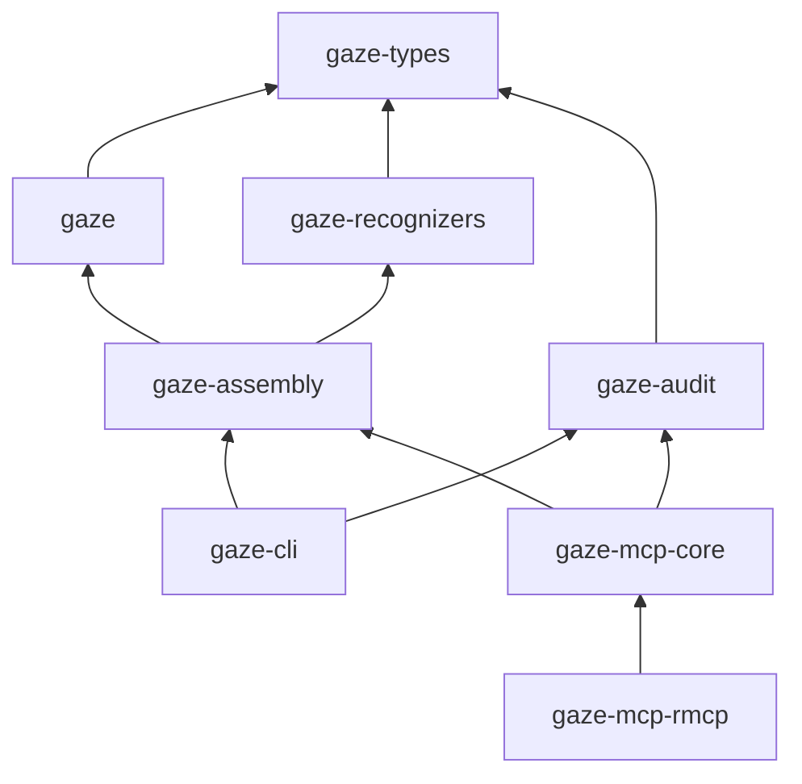

# Crates

[`Cargo.toml`](../../Cargo.toml) defines the workspace. All members except
`xtask` are published. The core package is `gaze-pii`, imported as `gaze`.
Follow each crate link for its README and full API.

## Workspace map

| Crate | Owns / use for | Entry points and boundaries |
|---|---|---|
| [`gaze-types`](../../crates/gaze-types) | Shared traits and values without runtime, SQLite or ML dependencies. | `Recognizer`, `Detector`, `Detection`, `Candidate`, `DetectContext`, `PiiClass`, `Action`, `RedactionEntry`, `RedactionLogger`, `RedactionLogError`, `LocaleChain`, `DictionaryBundle`, `RawDocument`, `CleanDocument`; serde-only. |
| [`gaze`](../../crates/gaze) | Core policy, sessions, restore, rulepacks, registries, validation and sandbox contracts; construct pipelines directly. | `Pipeline`, `PipelineBuilder`, `Session`, `Policy`, `RecognizerRegistry`, `Rulepack`, `SensitiveSnapshot`. Re-exports `gaze-types`; optional default-on `bundled-recognizers`; no normal `gaze-audit` dependency. |
| [`gaze-recognizers`](../../crates/gaze-recognizers) | Regex, dictionary, ONNX NER, embedded packs and safety-net backends. | `RegexDetector`, `DictionaryRecognizer`, `NerRecognizer`, `NerDetector`, `NerOptions`, `NormalizerKind`, `ValidatorKind`, `embedded`; OPF and Nym feature gates. Depends on `gaze-types`; `gaze` is a dev-dependency only. |
| [`gaze-audit`](../../crates/gaze-audit) | Passive SQLite sink and audit queries. | `SqliteLogger`, `AuditFilter`, `AuditLogRow`, `build_audit_query_sql`, `AUDIT_RESTRICTED_COLUMNS`. Implements `gaze_types::RedactionLogger`; depends on `gaze-types` and `rusqlite`. |
| [`gaze-assembly`](../../crates/gaze-assembly) | Build a pipeline from policy, context, rulepacks, locales and NER threshold using the CLI assembly path. | `build_pipeline`, `BuildError`, `CorePipelineConfig`; joins `gaze` and `gaze-recognizers`. |
| [`gaze-cli`](../../crates/gaze-cli) | Process boundary: argv, stdin/stdout JSON, safe stderr, exit codes, config loading and audit paths. | The `gaze` binary; see [CLI reference](cli.md). Composes runtime crates; external adapters can call it without linking Rust. |
| [`gaze-mcp-core`](../../crates/gaze-mcp-core) | Transport-free MCP tool dispatch, manifest storage, auth and session-ID policy. | `Tool`, sealed `ToolCtx`, `ToolRegistry`, `PiiEnvelope::dispatch`, `Frontend`, `DispatchHost`, `ManifestStore`, `AuthHook`, `SessionIdPolicy`. Depends on core/types/recognizers/assembly/audit. [Runtime](../explanation/mcp/mcp-runtime.md). |
| [`gaze-mcp-rmcp`](../../crates/gaze-mcp-rmcp) | rmcp framing, transport selection, principal resolution and server startup. | `RmcpFrontend`, stdio, opt-in streamable HTTP, adopter `PrincipalResolver`; depends on `gaze-mcp-core` and `rmcp`. Other transports implement `Frontend` directly. |
| [`gaze-mcp-bridge`](../../crates/gaze-mcp-bridge) | Policy-gated downstream MCP calls: restore only allowed argument fields, then redact results. | `BridgeHost`, `BridgeHostBuilder`, `BridgeConfig`, `FieldPolicy`, `ApprovalHook`, `DownstreamClient`, `BridgeSessionStore`; depends on core/assembly/MCP core/rmcp/types. Agents see tokens. |
| [`gaze-document`](../../crates/gaze-document) | PNG/JPG/PDF extraction, Tesseract OCR and SafeBundle output. | `write_bundle`, `SafeBundle`, `BundleReport`; optional PDF and MCP tools. Depends on core/types/recognizers, optionally MCP core. CLI `document` feature. [Contract](../explanation/document/document-extension.md). |
| [`gaze-proxy`](../../crates/gaze-proxy) | HTTP runtime for provider SDK base-URL swaps, request protection and owner-side response restore. | `ProxyConfig`, `ProviderAdapter`, provider adapters, `install_proxy_inspection_v1`; preserves native wire shapes. CLI composes the runtime. [Runtime](../explanation/proxy/proxy-runtime.md). |
| [`gaze-inspection`](../../crates/gaze-inspection) | Provider-neutral bounded inspection delivery and zeroizing payload wrappers. | `InstalledInspectionProducerV1`; depends on `gaze-types` and `zeroize`. Reveal delivers bytes that cannot be revoked from a sink; metadata delivery makes no traffic-analysis guarantee. |
| [`gaze-proxy-dashboard`](../../crates/gaze-proxy-dashboard) | Opt-in memory-only proxy inspection child. | `DashboardSupervisor`, `SpawnedDashboardChild`, `PairedDashboard::into_pending_activation`, `PendingDashboardActivation::commit`, `DashboardChildEntrypoint`, `DashboardControl`. Among Gaze crates, depends only on types/inspection, enforced by `dashboard-isolation`. Default-off CLI `dashboard` feature; explicit owner-domain risk acknowledgements. [Boundary](../explanation/dashboard/trust-boundary.md). |
| [`gaze-model-setup`](../../crates/gaze-model-setup) | Install and verify pinned NER, Nym and GLiNER DOB bundles. | `install_ner_bundle`, `install_nym_bundle`, `install_gliner_dob_bundle`, `ArtifactFetcher`, `InstallOutcome`, `SetupError`; depends on recognizers and download helpers. |
| [`gaze-token-bridge`](../../crates/gaze-token-bridge) | Experimental owner-side authorization and corpus-search translation. | `RedactionSession`, policy-scoped index domains, opt-in `SearchDocumentsTool` through `chokepoint`. Depends on core; MCP core optional. Redact before indexing; raw values and restore material stay owner-side. Residual fragments are protected but unsearchable. |
| [`xtask`](../../crates/xtask) | Internal behavioral gates and source scans. | `symmetric-potemkin`, `class-map-override-safety`, `recognizer-composition-validator`, `no-tenant-knowledge`, `safety-net-sanity`; shells out to tests. [Gate guide](../explanation/contributing/xtask-gates.md). |

## Dependency direction

The diagram shows the main dependency paths; the table gives optional edges.
`gaze` can include recognizers through `bundled-recognizers`. Recognizers
implement shared traits; assembly wires them into core pipelines.

## Published vs internal

Published crates must not depend on `xtask`. Release tooling derives the publish
plan from workspace metadata.

## Choosing a crate for new work

Use the ownership column above. Put shared traits in `gaze-types`, runtime
contracts in `gaze`, concrete backends in `gaze-recognizers`, assembly in
`gaze-assembly`, process behavior in `gaze-cli`, and repository gates in `xtask`.
Keep transport-specific code outside `gaze-mcp-core`. Consumer-specific database
and log adapters belong in the downstream consumer project.

## Safety-net feature gates (v0.6+)

| Crate | Feature | Activates |
|---|---|---|
| `gaze` | `safety-net` | `Pipeline::with_safety_net`, `clean_with_safety_net_detect_context`, shared SafetyNet re-exports. |
| `gaze-recognizers` | `safety-net` | Trait surface and `MockSafetyNet`. |
| `gaze-recognizers` | `safety-net-openai` | OPF subprocess adapter: `OpenAiFilterSafetyNet`, `SubprocessOpenAiFilterConfig`, `class_map`; implies `safety-net`. |
| `gaze-cli` | `safety-net-openai` | OPF flags, `audit safety-net query`, SafetyNet error exit mapping. |

OPF is off by default. See [Safety nets](../explanation/safety-net/safety-nets.md)
for observer invariants, adapter boundaries, stderr rules, replay hashes and schema.
