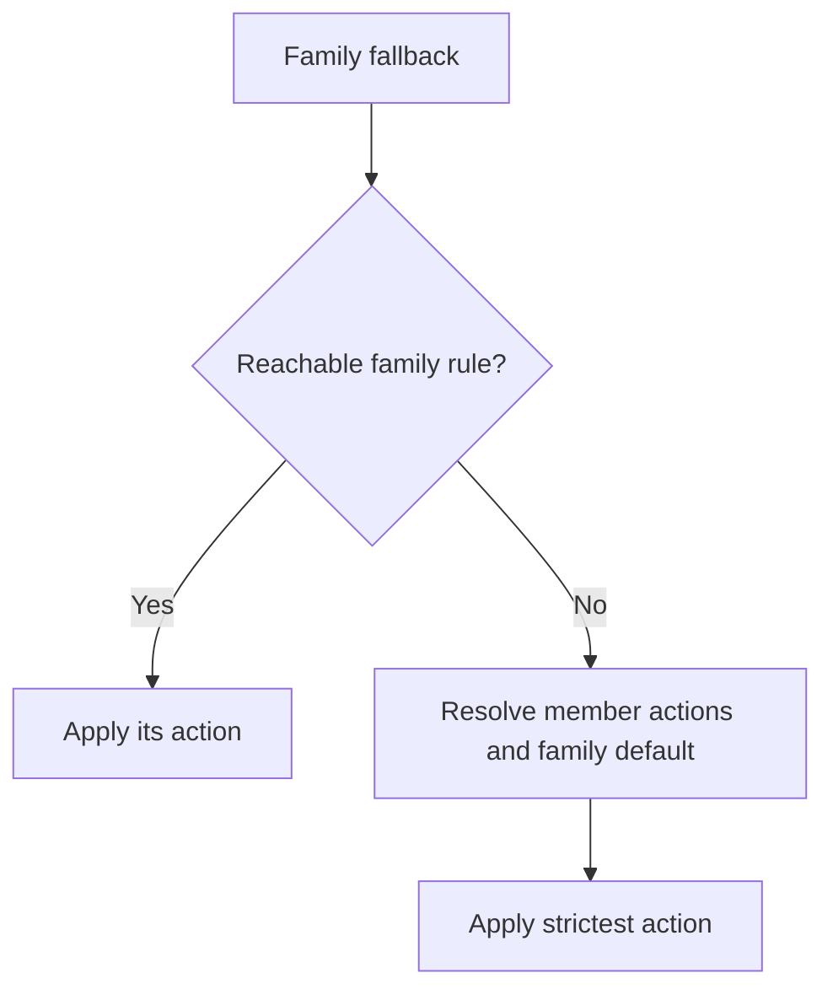

# Policy — authoring `policy.toml`

`gaze clean --policy=<path>` loads detectors, classes and actions from TOML.
The current schema is `0.1.0`. Sources: [parser](../../crates/gaze/src/policy.rs),
[CLI assembly](../../crates/gaze-cli/src/pipeline/build.rs) and
[recognizers](../../crates/gaze-recognizers).

## What `policy.toml` is for

Policy loading fails closed:

- File cannot be opened (missing path, permission denied) → exit `4`,
  stderr `{"error":"PolicyOpen","exit":4}`.
- File parses but is invalid (unknown key, bad regex, unknown class,
  unknown action, missing required field, no recognizers/rulepacks, no rules) → exit `2`,
  stderr `{"error":"PolicyConfig","exit":2}`.

Without `--policy`, clean loads `core`, tokenizes all active classes and unmatched
context/NER spans, and uses `global` unless `--locale` overrides it.

| Bundle setting | Result |
|---|---|
| No table, or `paths` without `bundled` | Keep `core`; add custom paths |
| `--rulepack-bundled` | Replace bundled selection |
| `--rulepack-bundled=none` or `bundled = []` | Disable bundled packs; stderr notices the missing core floor |

Use a policy for custom recognizers, dictionaries or actions.

## Minimal working example

`minimal.toml`:

```toml
[session]
scope = "persistent"
ttl_secs = 86400

[[rule]]
kind = "class"
class = "email"
action = "tokenize"

[[rule]]
kind = "default"
action = "tokenize"
```

Run it:

```console
$ printf 'Email %s@%s now' alice example.invalid | gaze clean --policy=minimal.toml
{"clean_text":"Email <{session_hex}:Email_1> now","session_blob":"<base64>","stats":{"detections":1}}
```

The policy omits `[policy.rulepacks]`, so the bundled `core` rulepack
supplies the email recognizer. Do not add a generic email regex as a custom
recognizer: it also matches Gaze's own email-shaped tokens, and the loader
rejects it with `TokenShapeShadow` ("shadows Gaze token shape sample").

Add `--audit-db=redaction.sqlite` to persist the metadata-only SQLite
redaction log for the invocation. Dictionary rows use
`dictionary:{name}[#term_index]` source labels so an operator can trace which
configured term fired without storing raw PII.

Rust adopters should import the concrete SQLite sink and audit-query API from
`gaze-audit` directly:

```rust
use gaze_audit::SqliteLogger;
```

`gaze::SqliteLogger` is unavailable; import it from `gaze-audit`.
`gaze::RedactionLogger` re-exports the trait from `gaze-types`.

The test `policy_md_minimal_working_example_loads` in
`crates/gaze/tests/policy_example.rs` loads this exact block.

## Classes

A `class` identifies what kind of PII a recognizer detects. Every recognizer
(regex, dictionary, NER) emits one class per match. Rules then act on classes.

### Built-in classes

Gaze ships four built-in classes:

| Class          | Description                              | Example token                    |
|----------------|------------------------------------------|----------------------------------|
| `Email`        | Email addresses                          | `<{session_hex}:Email_1>`        |
| `Name`         | Personal names                           | `<{session_hex}:Name_1>`         |
| `Location`     | Geographic locations (cities, addresses) | `<{session_hex}:Location_1>`     |
| `Organization` | Company / org names                      | `<{session_hex}:Organization_1>` |

Policy files spell built-ins case-insensitively as `"email"`, `"name"`,
`"location"`, and `"organization"`. Their token grammar is
`<{session_hex}:{Class}_{n}>` for the default `tokenize` action.

### Adding your own classes (no code changes required)

Adopters can define new classes purely via `policy.toml` — Gaze does not need
to be rebuilt or modified. Use `custom:<name>` to declare a project-specific
class.

#### Pattern 1 — domain-specific regex class

```toml
[[policy.custom_recognizers]]
kind = "regex"
name = "phone_us"
pattern = '\b\(?\d{3}\)?[-.\s]?\d{3}[-.\s]?\d{4}\b'
class = "custom:phone"

[[rule]]
kind = "class"
class = "custom:phone"
action = "tokenize"
```

Output tokens carry the `Custom:` namespace prefix to disambiguate from
built-ins:

```text
Input:  "Call [synthetic phone number] to confirm."
Output: "Call <{session_hex}:Custom:phone_1> to confirm."
```

#### Pattern 2 — tenant-specific dictionary class

```toml
[[policy.custom_recognizers]]
kind = "dictionary"
name = "tenant_orders"
terms_from_context = "orders"
class = "custom:order_id"

[[rule]]
kind = "class"
class = "custom:order_id"
action = "tokenize"
```

Then pass tenant data via `--context-json`:

```json
{
  "dictionaries": {
    "orders": { "terms": ["ORD-12345", "ORD-99999"], "case_sensitive": true }
  }
}
```

```text
Input:  "Reference ORD-12345 is shipped."
Output: "Reference <{session_hex}:Custom:order_id_1> is shipped."
```

#### Caller-known record context

`gaze clean --context-json context.json` also accepts a caller-known record.
Version 1 of the key alias table infers classes for common field names:

```json
{
  "record": {"customer": {"full_name": "[customer name]", "e_mail": "[customer email]"}}
}
```

Replace the bracketed values with the trusted app's actual record values before
calling Gaze; do not send this raw context to the agent.

Version 1 normalizes ASCII case and snake/camel/kebab separators:

| Class | Field aliases |
|---|---|
| `Email` | `email`, `e_mail`, `mail`, `courriel`, `emailadres`, `correioEletronico` |
| `custom:phone` | `phone`, `tel`, `telefon`, `mobile`, `handy`, `telephone`, `telefono`, `telefoon`, `telemovel`, `celular` |
| `Name` | `name`, `full_name`, `first_name`, `firstname`, `vorname`, `last_name`, `surname`, `nachname`, `nom`, `prenom`, `achternaam`, `voornaam`, `nome`, `sobrenome` |
| `custom:iban` | `iban` |
| `custom:birth_date` | `dob`, `date_of_birth`, `birthdate`, `geburtsdatum`, `date_de_naissance`, `geboortedatum`, `data_de_nascimento` |
| `custom:postal_code` | `zip`, `postcode`, `plz`, `code_postal`, `cep` |
| `Location` | `address`, `street`, `strasse`, `city`, `stadt`, `adresse`, `rue`, `ville`, `adres`, `straat`, `plaats`, `endereco`, `rua`, `cidade` |

`field_map` overrides inference, assigns unknown leaves a built-in or custom
class, or sets them to `"ignore"`. Unknown unmapped keys, paths without leaves,
arrays, nulls and duplicate JSON keys fail closed; errors contain paths, never values.

Values are trimmed and whitespace runs (including NBSP) collapse to one space.
Restore preserves source bytes. Individually skip values with fewer than three
letters or digit-only values shorter than four digits; valid registry-length,
mod-97-passing IBANs are exempt. `Context::record_value_rejections` lists safe
paths and typed refusal reasons, never values. Off-by-default accepted groups
are inert and absent from this list. Clean warns per refused path.

Common single names (`Will`, `Grace`, `May`, `Mark`) from the
[versioned dictionary](../../crates/gaze-recognizers/assets/record-common-names-v1.txt)
are retained. `corroborated_single` needs a NER person span, another record name
in the phrase, or a full record name elsewhere plus a name-position cue.
Other single names match changed-case copies by default; same-case exact needs
opt-in or another detector. Unicode folding and Aho–Corasick match the dictionary.
Default Nym has no person label, so model corroboration comes from NER.

Default kinds ([measured oracle](benchmarks/known-record-oracle.md)):

| Group | Enabled kinds |
|---|---|
| Credit card, IBAN, national ID, Steuer-ID | `exact`, `whitespace_flexible` |
| Passport, phone | `exact` |
| Multi-token name | `exact`, `case_folded`, `whitespace_case_folded` |
| Single-token name | `case_folded`, `corroborated_single` |

Other pairs are off, including address parts, email, single-name `exact` and
multi-name `whitespace_flexible`. Whitespace flexibility changes runs only,
never separators. Disabling address/single-name exact adds 337/123 leaked gold
bytes versus all-on. Exact caller-known phone/card stays on despite 69/99
layer-D benign bytes; ordinary recognizers are unchanged.

The adopter can replace a class group's allowed kinds in the same context JSON:

```json
{
  "record": {"customer": {"city": "[customer city]"}},
  "record_match_kinds": {
    "address_part": ["exact"]
  }
}
```

Keys are `name_single`, `name_multi`, `address_part`, or a canonical class name
such as `email` or `custom:phone`. Each list replaces that group's defaults;
an empty list disables it. Allowed kinds are `exact`, `case_folded`,
`whitespace_flexible`, `whitespace_case_folded`, and `corroborated_single`.
The last kind applies to common-word single-token names. Enabling an
off-by-default kind is an explicit precision choice; some measured kinds lost
more benign bytes than leaked bytes, while unmeasured kinds have unknown gain.
Case-folded kinds apply only to names; whitespace kinds require a
multi-token value. Incompatible combinations fail with a path-only error.
A record field whose class is off supplies no extra record detection;
ordinary recognizers still run.

Enabled name folds include `ß`/`SS`; restore keeps matched bytes. Matching
excludes reversed names, email case changes, fragments and fuzzy spellings.
The separate repeat-value sweep follows its own rules.

Every record class must resolve to `tokenize` or `format_preserve`; a
nonreversible column rule rejects context even with a reversible default.
Keys are limited to `[A-Za-z0-9_-]`; errors and audit IDs contain no values.
Keep raw context away from agents, command arguments and logs.

Limits: context JSON 4 MiB; encoded record 64 KiB; four object levels; 32 string
leaves; 256 UTF-8 bytes per value. `record-v2-` dictionary prefix is reserved.
The envelope still accepts `dictionaries`, `class_map` and `fields`. Record
context is call-scoped in clean; daemon refuses per-document context.

### Class naming rules

- Built-in class names (`Email`, `Name`, `Location`, `Organization`) live in the
  top-level token grammar (`<Email_N>`). Custom classes always render with a
  `Custom:` prefix (`<Custom:my_class_N>`), so a custom class named `"email"` is
  unambiguous from the built-in class because it has a different token shape.
- Custom classes use the `custom:<name>` policy spelling.
- Custom class names are normalized: characters outside `[a-z0-9_]` collapse to
  `_` one run at a time. Adopters should pass non-empty alphanumeric names;
  passing all-punctuation strings like `"!!!"` currently normalizes to an empty
  stem and emits `<Custom:_N>`. Validate adopter input before passing it to
  `PiiClass::custom` if this matters for your integration.
- Two recognizers may share a class, provided they follow the rulepack composition contract (`cooperates_with` in rulepacks as of v0.4.1+).

### Choosing class names

For tenant-specific classes (orders, songs, users, customer IDs), pick a stable
lowercase identifier. The class name appears in redaction-log entries as
`custom:<name>`, so audit-friendly names help debugging.

For universal categories (phone numbers, IBAN, IP addresses), check whether a
current or planned core rulepack already covers the class before defining your
own.

## Schema reference

Unknown keys fail unless a table is explicitly open. Use
`[policy.rulepacks]` and `[[policy.custom_recognizers]]`; top-level `[[detector]]`
is rejected.

### `[session]`

```toml
[session]
scope = "persistent"   # required
ttl_secs = 86400       # required when scope = "persistent"; optional otherwise
```

| Field      | Type     | Required                     | Notes                                           |
|------------|----------|------------------------------|-------------------------------------------------|
| `scope`    | string   | yes                          | One of `"ephemeral"`, `"conversation"`, `"persistent"`. |
| `ttl_secs` | integer  | yes if `scope = "persistent"`| Must be `> 0`. Zero is rejected.                |

#### Session scope and TTL

`[session]` declares the session contract the policy expects. `gaze clean`
exports a `SensitiveSnapshot` (the `session_blob` field of stdout) so that
`gaze restore` can rebuild the token↔value map later.

- `scope = "ephemeral"` — *not usable from the CLI*. The library refuses to
  export ephemeral sessions (`Error::ExportForbidden`); a CLI invocation
  with this scope would be unable to emit `session_blob`. `gaze clean`
  rejects it with `PolicyConfig`, exit 2, and a safe `detail` explaining
  the export restriction and suggesting `conversation` or `persistent`.
  No clean text or session blob is emitted.
- `scope = "conversation"` — the CLI uses conversation id `"cli"` and
  exports a session blob for a later `gaze restore` invocation.
- `scope = "persistent"` — exports a session blob with an expiry. Requires
  `ttl_secs > 0`.

The `--session-ttl=<secs>` CLI flag overrides the policy TTL for persistent
sessions. If the flag is omitted, `gaze clean` uses `[session].ttl_secs`;
a policy-less run falls back to `86400`.

The `--ner-threshold=<float>` CLI flag overrides `[ner].threshold` for one
`gaze clean` invocation. Precedence is CLI flag, then policy TOML, then the
default `0.3`. Values outside `0.0..=1.0` fail closed as `PolicyConfig`.

TTL enforcement on `gaze restore`: when the imported snapshot's `issued_at +
ttl_secs` has passed, restore fails with exit `3` `BlobExpired`. (The
`issued_at` field landed in v0.3.0-rc.2 — older blobs predating the field
treat the TTL as bypassed for forward-compatibility.)

### `[policy.rulepacks]`

Rulepacks declare reusable recognizers outside the host policy file. The CLI
loads bundled rulepacks by name and custom rulepack TOML files by path.

```toml
[policy.rulepacks]
bundled = ["core"]
paths = ["./tenant-rulepack.toml"]
```

Bundled rulepacks. The classes shown here come from the embedded rulepack TOML
`class` fields; runtime bundle activation derives the active class set from the
loaded rulepack rather than a separate hand-maintained list.

| Bundle | Recognizers | Classes | Notes |
|--------|-------------|---------|-------|
| `core` | `email.global`, `email.header.name`, `email.header.name.paren`, `name.*`, `phone.*`, `iban.structural`, `card.structural`, `ip.*`, `eth.address`, `postal.*` | `email`, `name`, `custom:phone`, `custom:iban`, `custom:credit_card`, `custom:ip_address`, `custom:eth_address`, `custom:postal_code` | Default bundle when `[policy.rulepacks]` is omitted. Recognizers declare `safety_tier` and `locale_basis`; format-basis identifiers run independently of the document locale, while linguistic names and quarantined national shapes remain document-gated. |
| `core-extended` | alias of `core` | same as `core` | Deprecated since v0.8.0; scheduled for removal in v0.10.0. The CLI alias emits a warning and auto-activates locale-gated recognizers for v0.8.x compatibility. |
| `secrets` | `security_token.anchored`, `password.field` | `custom:security_token`, `custom:password` | Included by newly generated `gaze setup` policies. Direct library callers and hand-authored policies load it next to `core` explicitly. |

Use `core` with an explicit locale when you want document-basis,
locale-shaped recognizers:

```toml
[policy.rulepacks]
bundled = ["core"]

[locale]
active = ["en-US"]
```

Credentials (API keys, access tokens, JWTs, `password:` records) are not
detected by `core`. `gaze setup` includes the separate `secrets` bundle; add it
explicitly in a hand-authored policy:

```toml
[policy.rulepacks]
bundled = ["core", "secrets"]
```

Or override the bundle list for one CLI run:

```bash
gaze clean --rulepack-bundled core --locale=en-US --policy ./policy.toml
```

See [Embedded recognizers](redaction-classes.md#embedded-recognizers) for
classes, shapes, tiers, validators and activation. Format-basis identifiers
run at every document locale; document-basis rules require a compatible chain.
Plain `en` does not activate `postal.us`.

Default builds enable `phone-parser`. Without it, phone validator wiring fails
closed with `RulepackError::UnsupportedValidator`; it never falls back to regex-only
phone detection. Use [documented fictional phone ranges](../../CONTRIBUTING.md#phone-number-fixtures)
for fixtures. Tenant IDs such as `Subscriber_0001234567` must not be treated as
phones or cards based on shape alone.

### Rulepack recognizers

Within a rulepack, every `[[recognizers]]` block has an `id`, `class`, and
`[recognizers.match]` table. If two recognizers in the same rulepack emit the
same `class`, at least one must explicitly list the other recognizer id in
`cooperates_with`.

```toml
[[recognizers]]
id = "email.header.name"
class = "Name"
locale_basis = "document"
cooperates_with = ["salutation.name"]

[recognizers.match]
kind = "regex"
pattern = '''(?m)^From:\s+([A-Z][a-z]+)\s+<[^>]+>'''
capture_groups = [1]
```

Regex rulepack recognizers may set `reject_match_regex` under
`[recognizers.context]` to reject a full regex match before any capture is
emitted. This guard sees text outside `capture_groups`; an invalid guard
regex fails pipeline assembly. It is unavailable in
`[[policy.custom_recognizers]]`.

Regex rulepacks may also set `complete_labelled_value = true` under
`[recognizers.match]` when a labelled identifier's captured value can continue
through adjacent groups. The scanner protects the complete value run and
records a typed `labelled_value_scan_reason` for a date boundary, field
boundary, other-class boundary, or a value over four groups or 40 bytes.
Those limits are audit signals, not reasons to leave a suffix raw. The setting
is rulepack-only; `[[policy.custom_recognizers]]` has no equivalent field. See
[labelled identifiers](../explanation/detection/labelled-identifiers.md).

When same-class spans strictly contain one another, the resolver prefers the
longer span regardless of evidence tier, score, or rule priority. If that
choice would expose bytes covered by the prior arbitration of the entire
candidate pool, the resolver keeps the prior result. Exact and partial
overlaps keep their normal precedence rules.

`locale_basis` accepts two values:

| Value | Meaning |
|-------|---------|
| `"document"` | `locales` gates eligibility against the resolved document locale chain. The registry walks the chain per class; an earlier locale wins partial and exact overlaps. Strict same-class containment reaches the resolver, which prefers the containing span when it preserves prior byte coverage and audits the loser ([Locale Chain](../explanation/policy/locale-chain.md)). This is the legacy default when an external/adopter rulepack omits the field. |
| `"format"` | `locales` records format provenance only. Assembly registers the recognizer regardless of document locale, and the registry runs it once outside locale fallback before ordinary conflict resolution. |

Bundled rulepacks must state `locale_basis` explicitly for every recognizer.
See the [recognizer inventory](redaction-classes.md#embedded-recognizers) for
each bundled rule's basis. Locale mismatch cannot suppress a format-basis
rule; disable it in a copied rulepack with `enabled = false` if needed.

Missing cooperation fails rulepack load with
`RulepackError::SameClassWithoutCooperation`. The check is strict by design:
there is no line-anchor heuristic or implicit overlap analysis.

#### Built-in validators

Regex rulepack recognizers may include an optional `[recognizers.validator]`
table. Validators are deterministic, closed-registry names. Unknown validator
strings fail policy load with `RulepackError::UnsupportedValidator`.

```toml
[recognizers.validator]
kind = "luhn"
```

The [validator catalog](redaction-classes.md#validatorkind) lists every name,
feature gate and check. Default failure handling vetoes the candidate. Supported
validators can use `on_fail = "record"` to retain the match and audit its failure;
see [recorded failures](../explanation/detection/validator-veto.md#recorded-failures).
Phone parsing is a build feature, not a per-run CLI or policy switch.

#### Built-in normalizers

Regex rulepack recognizers may include an optional `[recognizers.normalizer]`
table. Normalizers affect canonical form used for validated candidate identity;
restore still uses the original matched bytes from the session manifest.
Unknown normalizer strings fail policy load with
`RulepackError::UnsupportedNormalizer`.

```toml
[recognizers.normalizer]
kind = "iban_canonical"
```

| Kind | Behavior |
|------|----------|
| `email_canonical` | Lowercase ASCII email candidates. |
| `iban_canonical` | Remove ASCII whitespace and uppercase letters. |

Rulepack locale metadata can define adopter-specific vocabulary buckets under
`[locale.<bucket>]`. Bucket tables are intentionally open by name; each bucket
contains `names = [...]`. Regex `pattern_template` values may reference those
buckets with `{locale.<bucket>}`. Assembly lowers the placeholder after the
active locale chain is known.

```toml
[locale.salutations]
names = ["Dr", "Mx"]

[[recognizers]]
id = "salutation.name"
class = "Name"

[recognizers.match]
kind = "regex"
pattern_template = '''(?m)^(?:{locale.salutations}):\s+([A-Z][a-z]+)$'''
capture_groups = [1]
```

A regex Unicode class keeps its braces: `\p{Lu}` and `\P{L}` in a template
are passed to the regex unchanged, not read as placeholders.

If a template references an unknown locale bucket, assembly fails closed with
`PolicyError::UnknownLocaleBucket`. `{locale_email_headers}` is a deprecated compatibility alias for
`{locale.email_headers}`; use the generic form.

### `[[policy.custom_recognizers]]`

Optional custom recognizer blocks. If omitted, `[policy.rulepacks]` defaults to
the bundled `core` rulepack. To disable bundled rulepacks, set
`[policy.rulepacks] bundled = []`; a policy with neither bundled/path rulepacks
nor custom recognizers is rejected with `PolicyConfig`.

```toml
[[policy.custom_recognizers]]
kind = "regex"
name = "emails"
pattern = '(?i)\b[a-z0-9._%+\-]+@[a-z0-9.\-]+\.[a-z]{2,}\b'
class = "email"
```

| Field                | Type      | Required | Notes                                                     |
|----------------------|-----------|----------|-----------------------------------------------------------|
| `kind`               | string    | yes      | `"regex"` or `"dictionary"`. Other values parse but fail at pipeline build with `PolicyConfig`. |
| `name`               | string    | yes      | Used as the recognizer id/source label for debugging and conflict-loser logs. |
| `pattern`            | string    | regex    | Compiled with the [`regex`](https://docs.rs/regex) crate at policy load. Bad patterns → `PolicyConfig`. |
| `class`              | string    | yes      | A class name (see [Classes](#classes)). Unknown classes → `PolicyConfig`. |
| `terms`              | array     | dictionary | Inline dictionary terms. Use only with `kind = "dictionary"`. |
| `terms_file`         | string    | dictionary | Newline-delimited dictionary terms. Blank lines and `#` comments are ignored. |
| `terms_from_context` | string    | dictionary | Reads the named dictionary from `--context-json`; cannot be combined with `terms` or `terms_file`. |
| `case_sensitive`     | boolean   | no       | Dictionary only. Defaults to `false`; non-ASCII insensitive dictionaries fail closed in v0.4.0. |
| `token_family`       | string    | no       | Defaults to `"counter"`. |
| `safety_tier`        | string    | no       | Defaults to `"opt_in"` for custom recognizers. Accepted values are `"safe_default"`, `"locale_gated"`, and `"opt_in"`. Naming a custom recognizer in policy is the opt-in. |
| `[collision]`        | table     | no       | Cross-class collision-family metadata. See below. |

Dictionary recognizers are registered through the same recognizer registry as
rulepack recognizers and are gated by the active locale chain when they come
from a rulepack. The CLI passes the merged dictionary bundle from rulepacks,
policy inline terms, and `--context-json` into the runtime `DetectContext`.

```toml
[[policy.custom_recognizers]]
kind = "dictionary"
name = "songs"
class = "custom:song"
terms = ["Song A", "Song B"]

[[policy.custom_recognizers]]
kind = "dictionary"
name = "tenant_order_ids"
class = "custom:order_id"
terms_from_context = "order_ids"
case_sensitive = true
```

#### Custom-recognizer collision metadata

Custom regex and dictionary recognizers may declare a nested collision table
when they participate in a tenant-defined cross-class rivalry. The two rules
below claim the same shape for two classes: the lower `precedence` wins the
overlap (`decided_by: collision_policy`), and an equal `precedence` emits the
family token `custom:family:tenant-orders` instead of either class.

```toml
[[policy.custom_recognizers]]
kind = "regex"
name = "tenant.order_id"
pattern = 'ORD-[0-9]+'
class = "custom:order_id"

[policy.custom_recognizers.collision]
family = "tenant-orders"
variant = "order-id"
precedence = 50

[[policy.custom_recognizers]]
kind = "regex"
name = "tenant.order_ref"
pattern = 'ORD-[0-9]+'
class = "custom:order_ref"

[policy.custom_recognizers.collision]
family = "tenant-orders"
variant = "order-ref"
precedence = 60
```

`family` and `variant` must be non-empty kebab-case identifiers up to 64 bytes.
Lower `precedence` wins when two variants in the same family overlap. Missing
`precedence` defaults to `100`. `mandatory_anchor = "<key>"` names a locale cue
bucket (`[locale.cues.<key>]` in a loaded locale pack, `iban` in `locale-de`
and `locale-en`); a member whose cue is out of range falls back to the family
token ([mandatory-anchor resolution](../explanation/detection/anchor-resolution.md)).

The membership is filed under the recognizer's id: the policy `name` for a
regex recognizer, `dict/<name>` for a dictionary recognizer. That id is the
`recognizer_id` on audit rows, the id `losing_candidates` lists on a family
token's `ambiguity_record`, and the id the registry resolves when a family
token [derives its action](#how-a-family-level-token-picks-its-action) from
its members' rules, so a tie or a missing anchor over regex members is
protected exactly as it is over bundled or dictionary members.

Policy custom recognizers cannot use reserved bundled family names:
`us-9-digit-id`, `iberian-id`, `payment-card-or-iban`, `phone-or-imei`,
`vin-or-serial`, `mac-or-hex`, `passport-or-doc-support`,
`national-13-digit`, `italian-cf-or-serial`, `german-personalausweis`,
`swedish-personnummer`, `finnish-hetu`.

`--context-json` can also supply dictionaries without a matching policy
recognizer. In that mode, Gaze registers one dictionary recognizer per context
dictionary and uses `class_map` for the class, falling back to `custom:<name>`
when a mapping is absent. `fields` are threaded into `DetectContext` for
recognizers and are available to library users through the borrowed
`Context::fields_typed() -> ContextFieldsRef<'_>` accessor. `class_map` is
runtime metadata for dictionary recognizer construction, not a general class
override mechanism.

NER is not a detector kind. NER is configured via the top-level `[ner]`
block (below) — when set, the pipeline appends a transformer NER detector
alongside the regex detectors declared here.

#### Migrating `[[detector]]`

The legacy top-level `[[detector]]` table is no longer accepted in v0.4.
Move each block to `[[policy.custom_recognizers]]` with the same fields. Gaze
fails loudly with `PolicyConfig` instead of silently accepting both surfaces.

### `[[rule]]`

One block per rule. At least one rule is required — an empty list is
rejected with `PolicyConfig`. Rules are evaluated in declaration order;
the first rule whose match condition fires decides the action. If no rule
matches, the pipeline falls back to `Action::Preserve`.

```toml
[[rule]]
kind = "class"
class = "email"
action = "tokenize"

[[rule]]
kind = "default"
action = "tokenize"
```

| Field    | Type   | Required           | Notes                                            |
|----------|--------|--------------------|--------------------------------------------------|
| `kind`   | string | yes                | One of `"class"`, `"column"`, `"default"`.       |
| `action` | string | yes                | One of `"tokenize"`, `"redact"`, `"format_preserve"`, `"generalize"`, `"preserve"`. |
| `class`  | string | yes if `kind="class"` | Class name; same vocabulary as detector `class`. |
| `column` | string | yes if `kind="column"` | Field name to match against the document context. |

#### Rule kinds

- `kind = "class"` — fires when a detection's class equals `class`. The
  most common rule shape.
- `kind = "column"` — fires when the document being redacted is a
  structured value and the current field name equals `column`. `gaze clean` rejects policies containing `column` rules with
  `PolicyConfig`, because the CLI only accepts text on stdin and has no field
  name. `column` rules are useful only when driving the library directly with
  `RawDocument::Structured`.
- `kind = "default"` — always fires. Place last as a catch-all. If
  omitted, unmatched detections fall through to `Preserve` automatically,
  but an explicit `default` makes the policy intent visible.

If the effective fallback is `preserve`, Gaze warns after a successful
`clean` run or daemon/proxy startup when registered detection classes have no
reachable class rule. The one-line warning gives the class count and names;
those values can pass through raw. A class rule placed after `default` is not
reachable. Back up custom rules, then run `gaze setup --force`, or set the
default action to `"tokenize"`. An intentional `preserve` default remains
valid. A reachable per-class `generalize` rule gets a separate warning because
it produces no restore token.

#### Collision-family fallback classes (avoid a silent leak)

Some bundled recognizers belong to a collision family — a set of structural
recognizers whose shape overlaps (for example IBANs and payment-card numbers,
both long digit runs). When such a recognizer cannot commit to its precise
variant class — its mandatory anchor cue is absent, or two variants tie — Gaze
fails closed and emits one family-level token whose class is
`custom:family:<family>` instead of the narrow variant class. See
[Mandatory Anchor Resolution](../explanation/detection/anchor-resolution.md).

`iban.structural` requires the `iban` anchor. Cues such as `IBAN` and `Account`
come from `locale-en` / `locale-de`, not `core`. With only `core`, IBAN matches
use `custom:family:payment-card-or-iban`. To emit `custom:iban`, load the locale
pack and put a cue near the value. `[locale].active` orders the fallback chain;
it does not load cue packs.

#### How a family-level token picks its action

A reachable explicit family-class rule wins, including `preserve`. Without
one, Gaze takes the strictest of the family fallback and each member's resolved
action. Rules use the same first-match walk. A member-only tokenize policy with
a preserve default therefore protects ambiguous spans too.



Action order:

| Rank | Action | Original bytes in output | Restorable |
|------|--------|--------------------------|------------|
| 4 | `redact` | none | no |
| 3 | `tokenize` | none | yes |
| 2 | `generalize` | none (class label only) | no |
| 1 | `format_preserve` | none (class-shaped fake) | yes |
| 0 | `preserve` | all | - |

For example, `custom:iban = tokenize` plus `custom:credit_card = redact`
redacts the ambiguous span. Every protective action works on family classes.

Two consequences of a derived action that is not `tokenize`:

- Under a protection trace (the MCP and proxy chokepoints, which prove
  every byte's disposition) only `tokenize` and `preserve` are executable. A
  family token that derives `redact`, `generalize` or `format_preserve` fails
  closed there with `UnsupportedActionVariant`, exactly as an explicit rule
  with that action on a member class already does. Nothing is emitted.
- Residual coverage (the cells that cover a losing candidate's remaining
  bytes beside an overlapping winner) admits each claimant on its own
  resolved action, and a cell emits under that action: a derived `redact`
  on the family class writes the one-way `[REDACTED:custom:family:<name>]`
  marker over the losing member's remaining bytes. See
  [Residual coverage](redaction-classes.md#residual-coverage).

> To preserve family tokens you must say so. Because the derivation is
> strictest-wins, the only way to leave an ambiguous span raw while a member
> class or the default is protective is an explicit rule for the family class
> declared before your `default` rule:
>
> ```toml
> [[rule]]
> kind = "class"
> class = "custom:family:payment-card-or-iban"
> action = "preserve"
> ```
>
> A rule declared after the `default` rule is unreachable: `default` matches
> unconditionally, so the family token derives its action as if the rule did
> not exist.

The audit row of a family token records how its action was chosen. Its
`ambiguity_record` JSON carries `derived_action = { action, member_class }`
whenever the action was derived; `member_class` names the member whose
explicit rule set it (the lowest class in `PiiClass` order on a tie, a
member exactly as strict as the default included), or is `null` when the
family's own default applied and no member's own rule reached that strictness.
The field is absent when an explicit family rule matched, and on rows written
before it existed.

`gaze clean` prints a `warning:` to stderr at load time for every
collision-family class with a mandatory anchor that an active recognizer can
emit when your policy names one of its member classes (before or after the
`default` rule), or names the family class only after the `default` rule, but
has no reachable rule for the family class itself. The notice is informational: the span is protected by derivation, and
the notice tells you the token class you will see is the family class, not the
member class you named, and how to set its action explicitly. Rust adopters get
the same list from `gaze_assembly::uncovered_collision_family_classes`. The
bundled family names are listed under
[Custom-recognizer collision metadata](#custom-recognizer-collision-metadata).

Older member-only policies with a preserve default left family spans raw.
Add an explicit family `preserve` rule before `default` only if that behavior
is intentional.

> `preserve` keeps a class's characters unless the same characters are
> also PII of a class you protect. Overlap resolution runs before the
> action lookup, and a span that wholly encloses a differently-classed span
> keeps the slot (`ConflictTier::ContainmentPrecedence`, or
> `StructuredContainment` for a custom container over a builtin sub-span),
> so with `custom:url = preserve` and `email = tokenize` the URL is the
> winner. Its bytes stay raw except the ones the email claimed: those leave
> as one email-token fragment inside the preserved URL, and the fragment's
> audit row says `decided_by: protection_override`. The candidates a
> preserved span *represents* never override it: an explicit
> `custom:family:<name> = preserve` rule still leaves the ambiguous span raw
> even though its member classes are protected. See
> [Residual coverage](redaction-classes.md#residual-coverage).

### Rule actions

| `action` value      | What it does                                                                                                       |
|---------------------|--------------------------------------------------------------------------------------------------------------------|
| `"tokenize"`        | Replace the matched span with an angle-bracketed counter-family token (`<{session_hex}:Email_1>`, `<{session_hex}:Name_2>`, `<{session_hex}:Custom:order_id_3>`, …). Restorable via the session blob. |
| `"redact"`          | Replace the matched span with the literal string `[REDACTED]`. Not restorable — the original value is dropped from the session map. |
| `"format_preserve"` | Replace with a fake value that preserves the surface shape (`email1.{session_hex}@gaze-fake.invalid` for emails; `{session_hex}:name_1`, `{session_hex}:location_1`, `{session_hex}:custom:order_id_1` for everything else). Restorable. |
| `"generalize"`      | Replace with a bracketed class label: `[EMAIL]`, `[NAME]`, `[LOCATION]`, `[ORGANIZATION]`, or `[CUSTOM_NAME]` (uppercased custom name with underscores preserved). Restoration returns the label, not the original value. |
| `"preserve"`        | Leave the matched span unchanged, except for characters that a candidate of a protected class also claimed: those leave as a fragment under that class's own action (see [Residual coverage](redaction-classes.md#residual-coverage)). The detection is still logged. |

`Tokenize`, `FormatPreserve`, `Redact`, and `Generalize` all increment the
`stats.detections` counter in `gaze clean`'s stdout. `Preserve` does not.

There is no `"passthrough"` action — the closest equivalent is `"preserve"`.

### `[ner]` (optional)

```toml
[ner]
model_dir = "~/.local/share/gaze/models/davlan-mbert-ner-hrl"
locale = "de"
threshold = 0.3
```

| Field       | Type   | Required | Notes                                                          |
|-------------|--------|----------|----------------------------------------------------------------|
| `model_dir` | string | no       | Directory containing the ONNX model bundle. `~/` is expanded from `$HOME`. If absent, NER is silently disabled and the pipeline runs with regex detectors only (a `tracing::warn!` is logged). |
| `locale`    | string | no       | Locale hint passed to the NER detector (e.g. `"de"`). The Davlan backend stores and logs this hint but does not use it to filter documents. This is a single BCP47 string, not an array; use `[locale].active` for the rulepack locale fallback list. |
| `threshold` | float  | no       | Confidence floor in the inclusive range `0.0..=1.0`. Defaults to `0.3`. `gaze clean --ner-threshold=<float>` overrides this value for one invocation. |

If `model_dir` is set but the model fails to load (missing files, bad
manifest), the CLI maps the failure to exit `2` `PolicyConfig`. Treat
NER load errors as policy configuration failures: verify the install path
against [`gaze setup`](../../crates/gaze-cli/README.md#setup).

The v0.5.2 default NER bundle is pinned to the Hugging Face mirror
`onnx-community/bert-base-multilingual-cased-ner-hrl-ONNX` at commit
`cfe67b1c1c4c91c1b26ac192955fc0971e62d8c8`. The runtime `model.onnx` is
downloaded from `onnx/model_int8.onnx` and verified against the repository-root
`SHA256SUMS`. The canonical adopter label map is
[`crates/gaze-recognizers/assets/ner/labels.davlan-mbert.json`](../../crates/gaze-recognizers/assets/ner/labels.davlan-mbert.json);
the canonical copy-paste policy block is
[`crates/gaze-recognizers/assets/ner/policy-snippet.davlan-mbert.toml`](../../crates/gaze-recognizers/assets/ner/policy-snippet.davlan-mbert.toml).

### `[dob_judge]` (optional)

```toml
[dob_judge]
enabled = true
model_dir = "/absolute/path/to/gliner-multi-pii-dob-int8"
threshold = 0.5
```

The local GLiNER judge considers date-shaped spans that the rule floor has not
already claimed as `birth_date`. It can emit a restorable `birth_date` token
with the distinct `dob.gliner` source. It is disabled unless `enabled = true`;
`gaze setup --dob-judge` installs the SHA-pinned int8 bundle and writes this
block; plain `gaze setup` leaves it out until the bundle is shrunk. An enabled block requires `model_dir`. Missing or corrupt bundle files,
an invalid threshold, and inference errors fail closed. `threshold` defaults
to `0.5` and must be greater than `0.0` and less than `1.0`. The model scores
`date of birth`, `date`, and `event date` together. The birth-date score must
also exceed both alternative scores by at least `0.65`. Some ambiguous business
dates may still receive a birth-date label. Contexts such as `Account opened`
are excluded before model inference. In a synthetic held-out probe with that
keyword filter bypassed, the judge emitted 7/13 birth-date spans (EN 5/7, DE
2/4, FR 0/2) and 1/19 business-date spans. Cue-less DE/FR form dates and the
second person in a list often remain raw unless another recognizer catches
them.

### `[address_blocks]` (optional)

```toml
[address_blocks]
enabled = true
```

Grows protection from an address winner over the unit designators, boxes,
state codes and military post offices written beside it; see
[Address blocks](#address-blocks). `gaze setup` writes this block.
A policy without it, or with `enabled = false`, grows nothing. `enabled` is
required and no other key is accepted.

### `[safety_net]` and `[safety_net.nym]`

`backend = "nym"` activates the opt-in Nym-small safety net for CLI commands
that load the policy and for Rust `gaze_assembly::build_pipeline`. An absent
table or `backend = "none"` selects no safety net. Other values fail at policy
load; `openai-filter` remains command-line only in this release. A Nym request
without a usable, digest-verified bundle or the `safety-net-nym` feature fails
closed. Install the bundle with `gaze setup --safety-net nym`.

```toml
[safety_net]
backend = "nym"

[safety_net.nym]
model_dir = "/absolute/path/to/nym-small-int8"
labels = ["BUILDING_NUMBER", "DATE_OF_BIRTH", "LICENSE_PLATE", "USERNAME"]
threshold = { BUILDING_NUMBER = 0.5, DATE_OF_BIRTH = 0.9, LICENSE_PLATE = 0.5, USERNAME = 0.5 }
```

The labels and thresholds shown are op-B, also used when they are omitted.
`model_dir` is optional in the policy. CLI path precedence is
`--nym-model-dir` > `GAZE_NYM_MODEL_DIR` > policy `model_dir`; Rust assembly
uses the policy path or an explicit override argument, without reading the
environment.

- `labels` is the allowlist. Only `BUILDING_NUMBER`, `DATE_OF_BIRTH`,
  `LICENSE_PLATE`, `TAX_ID`, `USERNAME` and `ZIP_CODE` have a Gaze class. Any
  other of the 40 Nym labels (for example `GIVEN_NAME`) fails at load, as does a
  spelling that is not a Nym label, an empty list, or a repeated label.
- `threshold` needs exactly one entry per listed label, each in `(0, 1]`. A
  missing threshold or a threshold for an unlisted label fails at load.
- Unknown keys in the table fail at load. A Nym settings table alone does not
  activate the backend.

## Detectors

### Regex (`kind = "regex"`)

Pattern syntax follows the [Rust `regex` crate](https://docs.rs/regex). The
crate intentionally does not support look-ahead, look-behind, or
back-references, so patterns ported from PCRE / Python `re` may need
rewriting.

Common idioms:

- Use `\b` word boundaries to avoid matching inside identifiers
  (`\bORD-\d{6}\b`, not `ORD-\d{6}`) — but see the pitfall below when the
  pattern edge is not a word character.
- Use `(?i)` at the start of a pattern for case-insensitive matching. PCRE-style
  inline flags such as `pattern = "(?i)customer-\\d+"` work because they are
  supported by Rust `regex`.
- TOML literal strings (`'...'`) avoid double-escaping backslashes —
  prefer them over basic strings (`"..."`) for regex patterns.

#### Pitfall: `\b` next to non-word characters (currency symbols, punctuation)

`\b` requires a word/non-word transition. A boundary beside `€`, `$`, `£` or
punctuation can miss a value or capture the next amount, leaving bytes raw.
Rust regex has no look-around. Guard digit/word edges; let symbols delimit themselves.

```toml
# Broken beside symbols: misses "5000€" and can mis-span adjacent amounts.
pattern = '\b(?:[$€£]\s?\d[\d.,]*|\d[\d.,]*\s?(?:€|£|EUR|USD|GBP))\b'

# Guard only digit edges.
pattern = '(?:[$€£]\s?\d[\d.,]*\d|[$€£]\s?\d|\b\d[\d.,]*\d\s?(?:€|£|EUR|USD|GBP)|\b\d\s?(?:€|£|EUR|USD|GBP))'
```

This also applies to percentages and `#`-prefixed IDs (issue #361).

`Policy::load` compiles the pattern, so a malformed regex fails fast with
`PolicyConfig` and never reaches `gaze clean`'s stdin read.

Detection order matters when spans overlap. After validator veto,
collision-family precedence, mandatory-anchor context, containment
precedence, and structured containment, the generic tiers decide: class priority > rule priority > score >
span length > lexicographically smaller recognizer id (`compare_base_ladder` in
[`crates/gaze/src/resolver.rs`](../../crates/gaze/src/resolver.rs)).
Declaration order does not break a tie between recognizers. See
[Full conflict-resolution order](redaction-classes.md#full-conflict-resolution-order)
for every step.

### NER (`[ner]` block)

NER is opt-in and stacks on top of regex detectors. The runtime expects a
local ONNX model directory; no models are downloaded at runtime. See the
[`gaze setup` section of the CLI README](../../crates/gaze-cli/README.md#setup) for the
pinned bundle and the canonical install path.

When loaded with the default label contract, the NER detector emits
`PiiClass::Name`, `PiiClass::Location`, and `PiiClass::Organization` for
entities the model recognises. The mirror also exposes `DATE` tags, but
[`crates/gaze-recognizers/assets/ner/labels.davlan-mbert.json`](../../crates/gaze-recognizers/assets/ner/labels.davlan-mbert.json)
maps `DATE` to `"drop"` to preserve Gaze's no-default-on date posture. Map
emitted classes to actions via `kind = "class"` rules — declare detector-side
once via `[ner]`, then act on the classes the model produces.

## CLI overrides for runtime knobs

`policy.toml` is the durable source of truth. `gaze clean` also exposes
runtime-only overrides for knobs operators commonly vary between invocations.
Resolution is always:

```text
CLI flag > policy.toml > Gaze default
```

| Policy field | CLI flag | Notes |
|--------------|----------|-------|
| `[session].scope` | `--session-scope <ephemeral|conversation|persistent>` | Overrides session lifetime for the current clean run. `ephemeral` keeps export-forbidden semantics, so pipe-mode clean exits `PolicyConfig` (exit 2) with a `detail` explaining the restriction and suggesting `conversation` or `persistent`. |
| `[session].ttl_secs` | `--session-ttl <SECONDS>` | Existing override for persistent session TTL. |
| `[ner].model_dir` | `--ner-model-dir <PATH>` | Overrides the NER model directory. If neither CLI nor TOML sets a model directory, no NER detector is registered. |
| `[ner].locale` | `--ner-locale <BCP47>` | Overrides the NER locale hint. TOML accepts one BCP47 string, not a list. Invalid tags fail closed with `PolicyConfig`. |
| `[ner].threshold` | `--ner-threshold <FLOAT>` | Existing override for NER confidence threshold; must be `0.0..=1.0`. |
| `[locale].active` | `--locale <BCP47,...>` | Existing override for the active locale fallback chain. |
| `[policy.rulepacks].bundled` | `--rulepack-bundled <ID,...>` | Comma-separated and repeatable. Replaces TOML bundled rulepack IDs for the current run; `none` selects no bundled packs. Omission defaults to `core`, even when custom paths are set. |
| `[policy.rulepacks].paths` | `--rulepack-path <PATH>` | Repeatable. Replaces TOML rulepack paths for the current run. |

Example:

```sh
gaze clean \
  --policy=policy.toml \
  --session-scope=conversation \
  --ner-model-dir="$HOME/.local/share/gaze/models/davlan-mbert-ner-hrl" \
  --ner-locale=de \
  --rulepack-bundled=core,locale-de \
  --rulepack-path=./workspace-rulepack.toml
```

If `policy.toml` sets `[session].scope = "persistent"` and the command passes
`--session-scope=conversation`, the exported `session_blob` records a
conversation-scoped session. If neither source mentions `[ner].model_dir`, Gaze
keeps NER disabled rather than registering a placeholder detector.

Policy-document fields have no CLI override by design. Examples include
recognizer definitions (`[[policy.custom_recognizers]]`), rule definitions
(`[[rule]]`), rulepack internals, and policy-document metadata. Those fields
define the auditable contract; changing them requires changing the policy or
rulepack document itself.

### CLI safety-net overrides

Repeat `--safety-net` to run more than one backend. Any command-line list
replaces the policy choice for that run; dropping policy Nym prints a notice.
`--safety-net none` disables all nets for one run and cannot be combined with
another value. `--safety-net-backend` replaces exactly one command-line
`--safety-net` value; with zero or multiple values it is a usage error.
The locale-aware `--safety-net-registry` remains a separate CLI mode and
cannot be combined with these selectors.

### Configuration surfaces - three-surfaces parity table

Runtime knobs use the [CLI override table](#cli-overrides-for-runtime-knobs).
Recognizer definitions, dictionary sources and rule actions stay in TOML.
Custom dictionary `dictionary` binds a dictionary name; when omitted it uses
the recognizer name. Use `terms`, `terms_file` or `terms_from_context` for terms.

`s1_three_surfaces_flags_are_exposed_and_bundled_ids_unchanged` checks the flag
set; focused tests cover scope, TTL, NER model/locale/threshold, active locale,
bundled packs and paths.

## Policy file permissions

Setup writes mode `0600`. If another account runs Gaze, give it read access:

```console
# Transfer ownership, or share through a group:
chown <service-user> /etc/gaze/gaze.toml
chgrp <service-group> /etc/gaze/gaze.toml
chmod 0640 /etc/gaze/gaze.toml
```

Choose the ownership or group approach, then keep the file unwritable by the
service account. Reapply access after `gaze setup --force` replaces the file.

Keep the policy unwritable by the service account. A policy it can rewrite lets
that account turn detection off.

Without read access, gaze refuses to start rather than running without the
policy. `Policy::load` returns `PolicyError::ReadPermissionDenied { path, .. }`
(also for an unreadable `terms_file`; an unreadable rulepack path returns
`RulepackError::ReadPermissionDenied`), and the CLI prints the `PolicyOpen`
envelope with a `detail` that names the file and this fix:

```console
{"error":"PolicyOpen","exit":4,"detail":"cannot read `/etc/gaze/gaze.toml`: permission denied. ..."}
```

## Troubleshooting

Each `PolicyError` variant maps to one exit code via `gaze clean`. The
mapping lives at [`gaze-cli/src/pipeline/build.rs::map_policy_error`](../../crates/gaze-cli/src/pipeline/build.rs)
and is summarised here.

| Symptom (stderr variant)                | `PolicyError`              | Exit | Common cause                                                                 |
|-----------------------------------------|----------------------------|------|------------------------------------------------------------------------------|
| `{"error":"PolicyOpen","exit":4}`       | `Io`                       | 4    | `--policy` path does not exist or points at a directory.                     |
| `{"error":"PolicyOpen","exit":4,"detail":…}` | `ReadPermissionDenied` | 4    | The policy exists but this account may not read it. `gaze setup` writes it mode `0600`; see [Policy file permissions](#policy-file-permissions). |
| `{"error":"PolicyConfig","exit":2}`     | `TomlParse`                | 2    | TOML syntax error, or an unknown key (`deny_unknown_fields` is on everywhere). Re-check field spelling. |
| `{"error":"PolicyConfig","exit":2}`     | `UnknownClass(s)`          | 2    | A `class` value not in `{email, name, location, organization}` and not prefixed `custom:`. Or `"custom:"` with an empty name. |
| `{"error":"PolicyConfig","exit":2}`     | `BadRegex { name, … }`     | 2    | `pattern` failed to compile. Watch for unsupported PCRE features (lookaround, backrefs). |
| `{"error":"PolicyConfig","exit":2}`     | `MissingTtl`               | 2    | `scope = "persistent"` but `ttl_secs` was omitted.                           |
| `{"error":"PolicyConfig","exit":2}`     | `BadTtl(s)`                | 2    | `ttl_secs = 0`, an unknown `session.scope`, an unknown `rule.kind`, an unknown `rule.action`, a missing `column`, or `~/` expansion failed because `$HOME` is unset. (The variant name is historical — it covers more than just TTL.) |
| `{"error":"PolicyConfig","exit":2}`     | `NoDetectors`              | 2    | No bundled rulepacks, no rulepack paths, and zero `[[policy.custom_recognizers]]` blocks. |
| `{"error":"PolicyConfig","exit":2}`     | `NoRules`                  | 2    | Zero `[[rule]]` blocks. At least one is required.                            |
| `{"error":"PolicyConfig","exit":2}`     | `BadTtl("unknown detector.kind …")` | 2 | `kind` was not `"regex"`. Surfaced from `Pipeline::from_policy`, not the parser. |
| `{"error":"PolicyConfig","exit":2}`     | `NerLoad`                  | 2    | `[ner] model_dir` resolves but the model bundle is missing or corrupt. Verify the install path against the README. |
| `{"error":"PolicyConfig","exit":2,"detail":"column rules not supported in CLI mode"}` | `UnsupportedRuleKind` | 2 | `gaze clean` received a policy containing `kind = "column"`. Use library structured input for column rules. |

## Full worked examples

Four complete policies (tokenize emails and redact phone numbers, a tenant
order-ID class, format-preserving emails, and mixed regex + NER + custom
classes) live in [Write a policy: worked examples](../how-to/policy/policy-examples.md).

## Policy schema versioning

Every `policy.toml` declares the schema it was authored against:

```toml
schema_version = "0.1.0"
```

The loader checks the `major.minor` prefix against
[`SUPPORTED_POLICY_SCHEMA_MAJOR_MINOR`](../../crates/gaze/src/policy.rs) (currently
`"0.1."`). A mismatch fails closed at load time with a typed envelope:

```json
{"error":"PolicySchemaUnsupported","exit":2,"found":"0.2.0","supported":"0.1."}
```

This differs from generic `PolicyConfig` and mirrors the
[rulepack schema gate](../../crates/gaze/src/rulepack.rs).

### Soft default for pre-versioned policies

A missing field defaults to `0.1.0` for compatibility. Declare it explicitly
in new policies.

### Migration log

Each entry below names a contract break that requires bumping
`schema_version`. Adopters should consult the migration log when upgrading
across the named gaze release boundary.

#### `[ner]` block changes (0.6.x → 0.7.x)

For policies from 0.6.x, use a TOML float (`threshold = 0.3`) and an absolute
`model_dir`, or resolve the model path relative to the policy file. Stamp
`schema_version = "0.1.0"`.

## Bundled rulepack version drift

Embedded `rulepack_version` tracks the recognizer crate version. A deliberate
exception must name affected packs, explain the contract difference and state
when versions converge. Undocumented drift is a release defect.

## Known limits - NER and prompt shape

NER can miss names in prompt preambles, email headers, forwarded messages
and footers. Deterministic `anchored_match` rules cover cue-anchored contexts.

`anchored_match` has a closed primitive surface:

- `boundary` controls what may follow the extracted span.
- `name_shape` is currently `person_name`.
- `cue_position` says whether the name appears before or after the cue.
- `right_window_chars` bounds how far the recognizer may search after a cue.

The cue text itself is intentionally data-driven. Bundled locale rulepacks
define open cue buckets:

- `forward_markers` for forwarded-message headers.
- `agent_recipient_cues` for agent reply/draft preambles.
- `footer_cues` for generated sender/footer lines.

`p6_anchored_match_false_positive_budget_stays_within_limit` checks cue precision.
Limits:

- Subject-line and `Re:` text such as `Re: Order 12345 - Status update from Alice Example`.
- Unanchored scheduling prose such as `Schedule a call with Alice next Tuesday`.
- Markdown code-block exclusion. `anchored_match` and email-header recognizers
  still fire inside fenced code blocks.
- URL exclusion. Cue-like text inside URLs is not region-filtered.
- Additional `name_shape` variants beyond `person_name`.
- Per-region NER thresholding. `[ner].threshold` is global to the NER
  recognizer invocation, not separately tunable for email headers, prompt
  preambles, footers, or body prose.

If an integration wraps raw email content in markdown code fences only to
preserve formatting, unwrap the content before passing it to the Gaze pipeline
and re-wrap the clean output afterward. There is no region exclusion contract here.

### v0.5.1 to v0.6 migration note

Adopters using the bundled rulepacks should load `core` plus the relevant
locale bundle. A German workflow that sets `[locale].active = ["de-DE"]` and
loads `["core", "locale-de"]` gets cue-anchored detection for forwarded-message
markers, agent-recipient preambles, and auto-footers without editing existing
custom recognizers. Mixed German/English prompt templates can load
`["core", "locale-de", "locale-en"]`.

Per-tenant cue strings belong in policy data, not code. Ship a custom rulepack
that adds entries to `forward_markers`, `agent_recipient_cues`, or
`footer_cues`. Keep cue additions narrow and add local regression fixtures
before broadening a bucket.

### Street lexicons and house numbers

Two more locale buckets let a street the NER model found license the house
number beside it. They are word lists, not recognizers: a
number is tokenized only when a winning NER `location` span ends in one of
these words.

- `street_suffixes_number_after` (`locale-de`): word endings such as
  `straße`, `weg`, `platz`. The span's last word must end in one, and the
  house number follows it: `Musterweg 17b`.
- `street_types_number_before` (`locale-en`): whole street-type words such as
  `street`, `road`, `drive`. The span must have at least two words, end in
  one, and the house number precedes it: `17 Example Street`.

An entry with a trailing dot (`str.`, `st.`) is an abbreviation, so a dot may
follow the word. One or two spaces separate street and number; a line break,
tab or other character ends the match. A house number is one to four digits,
one optional letter, and one optional `-`, `–` or `/` part (`12-14`, `12/3`,
`12 - 14`). After a German street a bare year from 1900 to 2099 is refused
(`Bahnhofstraße 2025 wird umgebaut`).
The token is a `location` token with recognizer id
`address.house_number.street_corroborated` and trace sources
`[address.house_number.street_corroborated, ner]`. Without NER, or without a
locale pack that ships these buckets, nothing changes. A custom rulepack can
add entries for a tenant's street vocabulary; measure both directions before
broadening a list, because the NER span is the only evidence that the words
form a street.

### Address blocks

Once resolution has protected part of an address, the pieces written right
beside it join the protection, so an address is never left half tokenized
(`[LOCATION_1] Suite 312, [LOCATION_2]`). Growth starts only from a settled
winner of class `location` (NER, or a house number), `custom:postal_code` or
`custom:building_number`, and steps outward one piece at a time. Between two
pieces only one to four bytes of spaces and commas with at most one comma and
one line feed may stand; a full stop, colon, semicolon, tab, pipe, quote,
carriage return or blank line ends the block, so JSON fields and the next
sentence never join. The line break is LF only: CRLF text does not grow across
lines. A piece never starts or ends against a letter, digit, hyphen, en dash,
slash, underscore or `@` (`LA` in `K-LA` is not a state). At most five pieces
join each side of an anchor (a military `PSC N, Box N` pair counts as two),
never over another selection. A postcode never grows a unit to its right:
`Ticket 48213 unit 3` stays raw even when the postcode rule takes `48213`,
because an address writes the unit before its postcode. The pieces come from
four locale buckets:

- `address_unit_designators` (`locale-en`, `locale-de`): a word, then one
  space or `#`, then a unit number of one to five digits and one optional
  letter (`Suite 312`, `Apt. 4B`, `Unit #3`, `PO Box 417`, `PSC 806`,
  `Wohnung 7`, `Postfach 505`). Case-insensitive; a trailing dot marks an
  abbreviation. `Box N` joins only right after a `PSC`, `CMR` or `Unit` line.
- `address_unit_designators_number_before` (`locale-de`): a one- or two-digit
  ordinal, a full stop, a space and the word (`3. Etage`, `2. OG`).
- `address_region_codes` (`locale-en`): exact-case US state codes and the
  military `AA` / `AE` / `AP`, only directly in front of a protected postcode
  (`IL 00068`), so `Paris, OR maybe` and `IN 2027` stay raw.
- `address_military_post_offices` (`locale-en`): exact-case `APO`, `FPO`,
  `DPO`.

Each piece is its own `location` token, so every piece restores exactly and
the winner it grew from keeps its class; the separators stay raw. The
recognizer id is the closed reason the piece joined, one of
`address.block.unit`, `address.block.unit_number_before`,
`address.block.military_box`, `address.block.region_code` and
`address.block.military_post_office` (`gaze::AddressGrowth`), and the trace
sources add the anchor's recognizer id. Pieces are `Learned` evidence, so the
repeat-value sweep never copies `Suite 312` to a second, unanchored
occurrence. A designator with no protected address beside it is never
tokenized (`test Suite 4`). Policy pipelines grow only under
`[address_blocks] enabled = true`, which `gaze setup` writes. Adopters building a
pipeline by hand register the words with
`PipelineBuilder::register_address_vocabulary`; without them nothing grows.

## Known spec drift

The rulepack parser accepts `token.format`, `context.hotwords`, `context.boost`
and `context.window`, but rejects non-default values with
`RulepackError::UnsupportedFieldInB1`. Dictionary audit sources identify terms
as `dictionary:{name}[#term_index]`. Davlan may miss names in boilerplate and
email headers; add a dictionary or cue rule (issue #24).

## See also

- [`CHANGELOG.md`](../../CHANGELOG.md) — version history, including shipped CLI
  and host-integration changes.
- [`README.md`](../../README.md) — what Gaze is, benchmark summary, quickstart, install.
- [`crates/gaze/src/policy.rs`](../../crates/gaze/src/policy.rs) — canonical
  parser; the source of truth for every field on this page.
