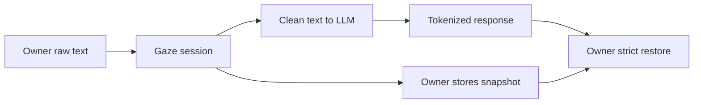

# Getting Started with Gaze

Clean a document, keep its restore key private, send safe text to an LLM, then
restore the response. Allow about ten minutes.



## Prerequisites

- Rust toolchain at MSRV `1.89` or newer (matches the workspace `rust-version`).
- For the CLI: `cargo install gaze-cli` or build from source.

## 1. Add dependencies

```sh
cargo add gaze-pii gaze-assembly
```

The crate is published as `gaze-pii`. Import path remains `use gaze::...`.

`CorePipelineConfig` builds bundled defaults: emails, names, locations,
organizations, and optional locale-aware recognizers.

## 2. Clean a document

```rust
use gaze::{CleanDocument, RawDocument, Scope, Session};
use gaze_assembly::CorePipelineConfig;

fn main() -> Result<(), Box<dyn std::error::Error>> {
    // Build once; share across requests in long-running apps.
    let core = CorePipelineConfig::new().build()?;
    let pipeline = core.pipeline();

    // One Session per conversation -- it owns the token map.
    // Share a Session only within the same logical isolation boundary.
    let session = Session::new(Scope::Conversation("conv-abc".into()))?;

    let cleaned = pipeline.redact(
        &session,
        RawDocument::Text(format!(
            "Hi, {}{}{} called about ORD-789012.",
            "alice", "@", "example.invalid"
        )),
    )?;

    // CleanDocument is an enum: Text(String) or Structured(...). Destructure.
    let CleanDocument::Text(clean_text) = cleaned else {
        unreachable!("Text input produces Text output");
    };
    println!("{}", clean_text);
    // "Hi, <hex:Email_N> called about ORD-789012."
    // ORD-789012 needs a custom recognizer or context JSON -- see Step 5.

    Ok(())
}
```

`<hex:Email_N>` is display notation. Use the exact token returned by `redact`;
its session prefix and numeric ordinal change on each run.

Share sessions only within one logical boundary. See the
[session contract](../explanation/core/session-contract.md).

## 3. Export the restore key before calling the LLM

Add this after cleaning in step 2, using that same `session`:

```rust,ignore
let blob = session.export()?.into_bytes();
// Store blob encrypted at rest, bound to this conversation/user.
// Send only clean_text to the LLM; never send blob to models, analytics, or logs.
```

A new session's snapshot cannot restore tokens from the cleaning session.

## 4. Restore after the LLM responds

Load the encrypted snapshot from storage, then restore the complete response
on the owner side:

```rust,ignore
use gaze::{SensitiveSnapshot, Session};

let session = Session::import(SensitiveSnapshot::from(blob))?;
let restored = session.restore_strict_text(&llm_response)?;
```

Use the actual response tokens; `<hex:Email_N>` is display notation.
`Session::restore` looks up one exact token and returns `Option<String>`
(`None` when unknown). Use `restore_strict_text` when unresolved tokens must
fail the whole response.

## 5. Add a policy for tenant-specific PII

```toml
# policy.toml
[session]
scope = "conversation"

[policy.rulepacks]
bundled = []

[[policy.custom_recognizers]]
kind = "regex"
name = "order-id"
class = "custom:order_id"        # lowercase; no Custom(...) syntax
pattern = '\bORD-\d{6,}\b'

[[rule]]
kind = "class"
class = "custom:order_id"
action = "tokenize"
```

```rust
use std::collections::HashMap;
use std::path::Path;

use gaze::{Context, LocaleChain, Policy};

let policy = Policy::load(Path::new("policy.toml"))?;
let context = Context {
    dictionaries: HashMap::new(),
    class_map: HashMap::new(),
    fields: Default::default(),
    record_match_kinds: Default::default(),
    record_value_rejections: Default::default(),
};
let rulepacks = Vec::new();
let active_locales = LocaleChain::merge_policy_and_cli(None, None);

let pipeline = gaze_assembly::build_pipeline(
    &policy,
    &context,
    &rulepacks,
    &active_locales,
    None,
)?;
```

Use policy regex for stable shapes. For per-request tenant values, pass a
context dictionary:

```json
{
  "dictionaries": {
    "order_ids": { "terms": ["ORD-789012"], "case_sensitive": true }
  },
  "class_map": { "order_ids": "custom:order_id" },
  "fields": { "tenant": "demo" }
}
```

Pass `gaze clean --context-json context.json`. Its call-scoped dictionary
tokenizes `ORD-789012` as `Custom:order_id`. See the
[context schema and `terms_from_context`](../reference/policy.md#policycustom_recognizers).

## Troubleshooting common errors

| Error | Cause | Fix |
|-------|-------|-----|
| `PolicyError` (unknown field) | Typo in `policy.toml` | Check [docs/reference/policy.md](../reference/policy.md) |
| `Error::BlobExpired { .. }` | Snapshot TTL elapsed | Increase `ttl` (a `Duration`) or refresh before expiry |
| Export errors on `Ephemeral` | Cannot restore from ephemeral sessions | Use `Scope::Conversation` |
| `RulepackError::UnsupportedValidator` | Unknown validator name | See valid names in [docs/reference/policy.md](../reference/policy.md#built-in-validators) |
| Tokens not restored | Wrong session blob | The blob must come from the exact session that produced the clean output |

## Next steps

- [Policy reference](../reference/policy.md)
- [CLI adapter contract](../../crates/gaze-cli/README.md)
- [Security review](../reference/security-review.md)
- [Exit codes](../../crates/gaze-cli/README.md#exit-codes)
- `cargo doc --open -p gaze-pii`
